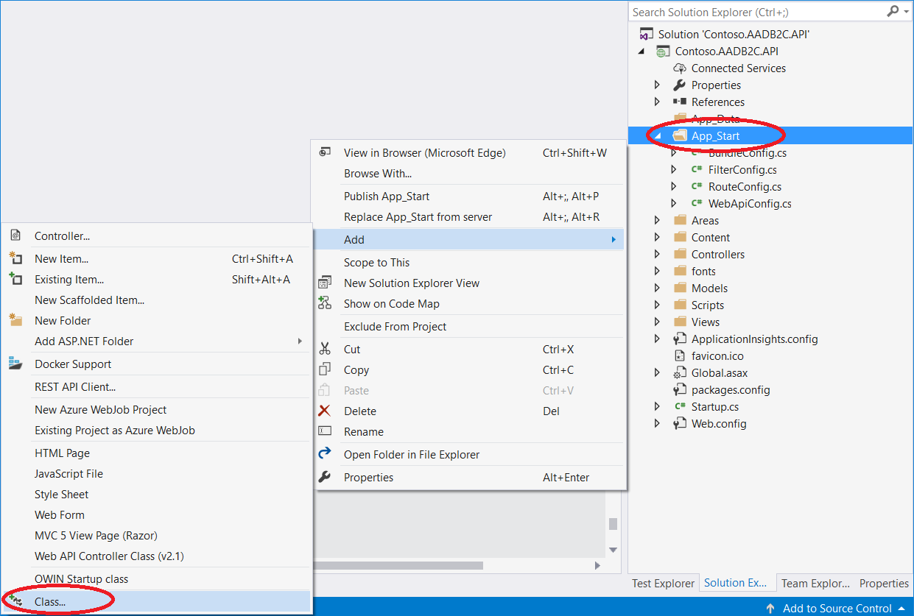
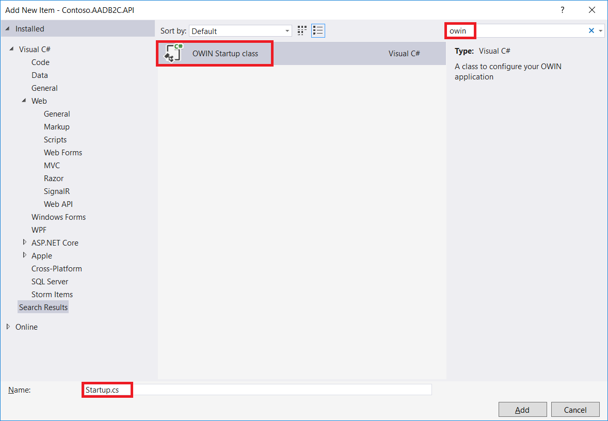
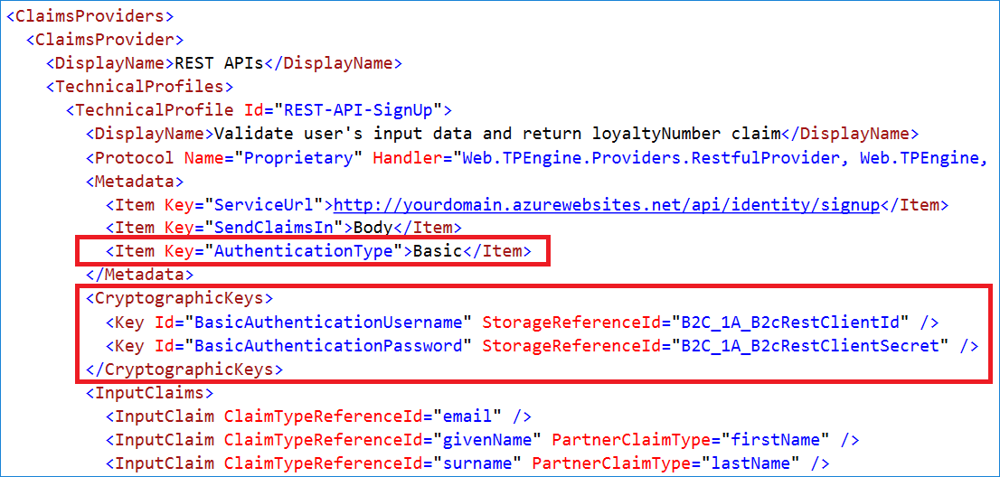
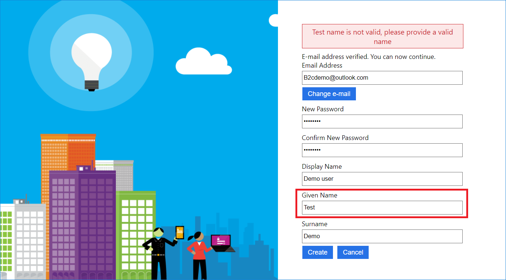

# Secure your RESTful services by using HTTP basic authentication

[!INCLUDE [active-directory-b2c-advanced-audience-warning](../../includes/active-directory-b2c-advanced-audience-warning.md)]

In a [related Azure AD B2C article](active-directory-b2c-custom-rest-api-netfw.md), you create a RESTful service (web API) that integrates with Azure Active Directory B2C (Azure AD B2C) user journeys without authentication.

In this article, you add HTTP basic authentication to your RESTful service so that only verified users, including B2C, can access your API. With HTTP basic authentication, you set the user credentials (app ID and app secret) in your custom policy.

For more information, see [Basic authentication in ASP.NET web API](https://docs.microsoft.com/aspnet/web-api/overview/security/basic-authentication).

## Prerequisites

Complete the steps in the [Integrate REST API claims exchanges in your Azure AD B2C user journey](active-directory-b2c-custom-rest-api-netfw.md) article.

## Step 1: Add authentication support

### Step 1.1: Add application settings to your project's web.config file

1. Open the Visual Studio project that you created earlier.

2. Add the following application settings to the web.config file under the `appSettings` element:

    ```XML
    <add key="WebApp:ClientId" value="B2CServiceUserAccount" />
    <add key="WebApp:ClientSecret" value="your secret" />
    ```

3. Create a password, and then set the `WebApp:ClientSecret` value.

    To generate a complex password, run the following PowerShell code. You can use any arbitrary value.

    ```powershell
    $bytes = New-Object Byte[] 32
    $rand = [System.Security.Cryptography.RandomNumberGenerator]::Create()
    $rand.GetBytes($bytes)
    $rand.Dispose()
    [System.Convert]::ToBase64String($bytes)
    ```

### Step 1.2: Install OWIN libraries

To begin, add the OWIN middleware NuGet packages to the project by using the Visual Studio Package Manager Console:

```powershell
PM> Install-Package Microsoft.Owin
PM> Install-Package Owin
PM> Install-Package Microsoft.Owin.Host.SystemWeb
```

### Step 1.3: Add an authentication middleware class

Add the `ClientAuthMiddleware.cs` class under the *App_Start* folder. To do so:

1. Right-click the *App_Start* folder, select **Add**, and then select **Class**.

   

2. In the **Name** box, type **ClientAuthMiddleware.cs**.

   

3. Open the *App_Start\ClientAuthMiddleware.cs* file, and replace the file content with following code:

    ```csharp

    using Microsoft.Owin;
    using System;
    using System.Collections.Generic;
    using System.Configuration;
    using System.Linq;
    using System.Security.Principal;
    using System.Text;
    using System.Threading.Tasks;
    using System.Web;

    namespace Contoso.AADB2C.API
    {
        /// <summary>
        /// Class to create a custom owin middleware to check for client authentication
        /// </summary>
        public class ClientAuthMiddleware
        {
            private static readonly string ClientID = ConfigurationManager.AppSettings["WebApp:ClientId"];
            private static readonly string ClientSecret = ConfigurationManager.AppSettings["WebApp:ClientSecret"];

            /// <summary>
            /// Gets or sets the next owin middleware
            /// </summary>
            private Func<IDictionary<string, object>, Task> Next { get; set; }

            /// <summary>
            /// Initializes a new instance of the <see cref="ClientAuthMiddleware"/> class.
            /// </summary>
            /// <param name="next"></param>
            public ClientAuthMiddleware(Func<IDictionary<string, object>, Task> next)
            {
                this.Next = next;
            }

            /// <summary>
            /// Invoke client authentication middleware during each request.
            /// </summary>
            /// <param name="environment">Owin environment</param>
            /// <returns></returns>
            public Task Invoke(IDictionary<string, object> environment)
            {
                // Get wrapper class for the environment
                var context = new OwinContext(environment);

                // Check whether the authorization header is available. This contains the credentials.
                var authzValue = context.Request.Headers.Get("Authorization");
                if (string.IsNullOrEmpty(authzValue) || !authzValue.StartsWith("Basic ", StringComparison.OrdinalIgnoreCase))
                {
                    // Process next middleware
                    return Next(environment);
                }

                // Get credentials
                var creds = authzValue.Substring("Basic ".Length).Trim();
                string clientId;
                string clientSecret;

                if (RetrieveCreds(creds, out clientId, out clientSecret))
                {
                    // Set transaction authenticated as client
                    context.Request.User = new GenericPrincipal(new GenericIdentity(clientId, "client"), new string[] { "client" });
                }

                return Next(environment);
            }

            /// <summary>
            /// Retrieve credentials from header
            /// </summary>
            /// <param name="credentials">Authorization header</param>
            /// <param name="clientId">Client identifier</param>
            /// <param name="clientSecret">Client secret</param>
            /// <returns>True if valid credentials were presented</returns>
            private bool RetrieveCreds(string credentials, out string clientId, out string clientSecret)
            {
                string pair;
                clientId = clientSecret = string.Empty;

                try
                {
                    pair = Encoding.UTF8.GetString(Convert.FromBase64String(credentials));
                }
                catch (FormatException)
                {
                    return false;
                }
                catch (ArgumentException)
                {
                    return false;
                }

                var ix = pair.IndexOf(':');
                if (ix == -1)
                {
                    return false;
                }

                clientId = pair.Substring(0, ix);
                clientSecret = pair.Substring(ix + 1);

                // Return whether credentials are valid
                return (string.Compare(clientId, ClientAuthMiddleware.ClientID) == 0 &&
                    string.Compare(clientSecret, ClientAuthMiddleware.ClientSecret) == 0);
            }
        }
    }
    ```

### Step 1.4: Add an OWIN startup class

Add an OWIN startup class named `Startup.cs` to the API. To do so:
1. Right-click the project, select **Add** > **New Item**, and then search for **OWIN**.

   

2. Open the *Startup.cs* file, and replace the file content with following code:

    ```csharp
    using Microsoft.Owin;
    using Owin;

    [assembly: OwinStartup(typeof(Contoso.AADB2C.API.Startup))]
    namespace Contoso.AADB2C.API
    {
        public class Startup
        {
            public void Configuration(IAppBuilder app)
            {
                app.Use<ClientAuthMiddleware>();
            }
        }
    }
    ```

### Step 1.5: Protect the Identity API class

Open Controllers\IdentityController.cs, and add the `[Authorize]` tag to the controller class. This tag restricts access to the controller to users who meet the authorization requirement.


## Step 2: Publish to Azure

To publish your project, in Solution Explorer, right-click the **Contoso.AADB2C.API** project, and then select **Publish**.

## Step 3: Add the RESTful services app ID and app secret to Azure AD B2C

After your RESTful service is protected by the client ID (username) and secret, you must store the credentials in your Azure AD B2C tenant. Your custom policy provides the credentials when it invokes your RESTful services.

### Step 3.1: Add a RESTful services client ID

1. In your Azure AD B2C tenant, select **B2C Settings** > **Identity Experience Framework**.


2. Select **Policy Keys** to view the keys that are available in your tenant.

3. Select **Add**.

4. For **Options**, select **Manual**.

5. For **Name**, type **B2cRestClientId**.
    The prefix *B2C_1A_* might be added automatically.

6. In the **Secret** box, enter the app ID that you defined earlier.

7. For **Key usage**, select **Signature**.

8. Select **Create**.

9. Confirm that you've created the `B2C_1A_B2cRestClientId` key.

### Step 3.2: Add a RESTful services client secret

1. In your Azure AD B2C tenant, select **B2C Settings** > **Identity Experience Framework**.

2. Select **Policy Keys** to view the keys available in your tenant.

3. Select **Add**.

4. For **Options**, select **Manual**.

5. For **Name**, type **B2cRestClientSecret**.
    The prefix *B2C_1A_* might be added automatically.

6. In the **Secret** box, enter the app secret that you defined earlier.

7. For **Key usage**, select **Signature**.

8. Select **Create**.

9. Confirm that you've created the `B2C_1A_B2cRestClientSecret` key.

## Step 4: Change the technical profile to support basic authentication in your extension policy

1. In your working directory, open the extension policy file (TrustFrameworkExtensions.xml).

2. Search for the `<TechnicalProfile>` node that includes `Id="REST-API-SignUp"`.

3. Locate the `<Metadata>` element.

4. Change the *AuthenticationType* to *Basic*, as follows:

    ```xml
    <Item Key="AuthenticationType">Basic</Item>
    ```

5. Immediately after the closing `<Metadata>` element, add the following XML snippet:

    ```xml
    <CryptographicKeys>
        <Key Id="BasicAuthenticationUsername" StorageReferenceId="B2C_1A_B2cRestClientId" />
        <Key Id="BasicAuthenticationPassword" StorageReferenceId="B2C_1A_B2cRestClientSecret" />
    </CryptographicKeys>
    ```

    After you add the snippet, your technical profile should look like the following XML code:

    

## Step 5: Upload the policy to your tenant

1. In the [Azure portal](https://portal.azure.com), select the **Directory + Subscription** icon in the portal toolbar, and then select the directory that contains your Azure AD B2C tenant.

1. In the Azure portal, search for and select **Azure AD B2C**.

1. Select **Identity Experience Framework**.

1. Open **All Policies**.

1. Select **Upload Policy**.

1. Select the **Overwrite the policy if it exists** check box.

1. Upload the *TrustFrameworkExtensions.xml* file, and then ensure that it passes validation.

## Step 6: Test the custom policy by using Run Now

1. Open **Azure AD B2C Settings**, and then select **Identity Experience Framework**.

    >[!NOTE]
    >Run Now requires at least one application to be preregistered on the tenant. To learn how to register applications, see the Azure AD B2C [Get started](tutorial-create-tenant.md) article or the [Application registration](tutorial-register-applications.md) article.

2. Open **B2C_1A_signup_signin**, the relying party (RP) custom policy that you uploaded, and then select **Run now**.

3. Test the process by typing **Test** in the **Given Name** box.
    Azure AD B2C displays an error message at the top of the window.

    

4. In the **Given Name** box, type a name (other than "Test").
    Azure AD B2C signs up the user and then sends a loyalty number to your application. Note the number in this example:

    ```
    {
      "typ": "JWT",
      "alg": "RS256",
      "kid": "X5eXk4xyojNFum1kl2Ytv8dlNP4-c57dO6QGTVBwaNk"
    }.{
      "exp": 1507125903,
      "nbf": 1507122303,
      "ver": "1.0",
      "iss": "https://contoso.b2clogin.com/f06c2fe8-709f-4030-85dc-38a4bfd9e82d/v2.0/",
      "aud": "e1d2612f-c2bc-4599-8e7b-d874eaca1ee1",
      "acr": "b2c_1a_signup_signin",
      "nonce": "defaultNonce",
      "iat": 1507122303,
      "auth_time": 1507122303,
      "loyaltyNumber": "290",
      "given_name": "Emily",
      "emails": ["B2cdemo@outlook.com"]
    }
    ```

## (Optional) Download the complete policy files and code

* After you complete the [Get started with custom policies](custom-policy-get-started.md) walkthrough, we recommend that you build your scenario by using your own custom policy files. For your reference, we have provided [Sample policy files](https://github.com/Azure-Samples/active-directory-b2c-custom-policy-starterpack/tree/master/scenarios/aadb2c-ief-rest-api-netfw-secure-basic).
* You can download the complete code from [Sample Visual Studio solution for reference](https://github.com/Azure-Samples/active-directory-b2c-custom-policy-starterpack/tree/master/scenarios/aadb2c-ief-rest-api-netfw-secure-basic).

## Next steps

* [Use client certificates to secure your RESTful API](active-directory-b2c-custom-rest-api-netfw-secure-cert.md)
