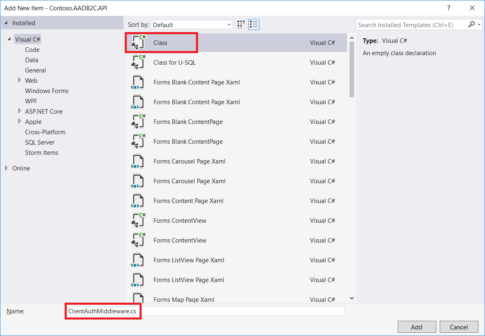

---
title: 'Azure Active Directory B2C: Secure your Restful services using HTTP basic authentication'
description: Sample how to secure your custom REST API claims exchanges in your Azure AD B2C using HTTP basic authentication
services: active-directory-b2c
documentationcenter: ''
author: yoelhor
manager: joroja
editor: 

ms.assetid:
ms.service: active-directory-b2c
ms.workload: identity
ms.tgt_pltfrm: na
ms.topic: article
ms.devlang: na
ms.date: 08/04/2017
ms.author: yoelh
---

# Azure Active Directory B2C: Secure your Restful services using HTTP basic authentication
In the [previous step](active-directory-b2c-custom-rest-api-netfw.md), we created a Restful service (Web API) that integrates into Azure AD B2C user journey. The Web API in that example was not secured.  This article shows how to add HTTP basic authentication to your Restful service.  You will learn how to set the user credentials (app ID & app secret) in your Azure AD B2C custom policy for secure access to the API. 

> [!NOTE]
>
>Follow this link for more details about [Basic Authentication in ASP.NET Web API](https://docs.microsoft.com/en-us/aspnet/web-api/overview/security/basic-authentication)

## Prerequisites
Completed the [Integrate REST API claims exchanges in your Azure AD B2C user journey as validation on user input](active-directory-b2c-custom-rest-api-netfw.md) walk-through

## Step 1 Add authentication support

### Add application settings to project's web.config file
1. Open your visual studio project you created earlier 
2. Add following application settings to web.config file under `appSettings` element:
```XML
<add key="WebApp:ClientId" value="B2CServiceUserAccount" />
<add key="WebApp:ClientSecret" value="your secret" />
```
3. Create a password and set the `WebApp:ClientSecret` value

> [!NOTE]
>
>To generate coplex password, you can run following PowerShell
>```
>$bytes = New-Object Byte[] 32
>$rand = [System.Security.Cryptography.RandomNumberGenerator]::Create()
>$rand.GetBytes($bytes)
>$rand.Dispose()
>[System.Convert]::ToBase64String($bytes)
>```

### Install OWIN
To begin, add the OWIN middleware NuGet packages to the project by using the Visual Studio Package Manager Console:

```
PM> Install-Package Microsoft.Owin
PM> Install-Package Owin
PM> Install-Package Microsoft.Owin.Host.SystemWeb
```

### Add authentication middleware class
Add `ClientAuthMiddleware.cs` class under `App_Start` folder. Right-click on `App_Start` folder, select **Add** then select **class**


Type `ClientAuthMiddleware.cs` for the class name



Open the file `App_Start\ClientAuthMiddleware.cs` and replace the file content with following code:
```C
using Microsoft.Owin;
using System;
using System.Collections.Generic;
using System.Configuration;
using System.Linq;
using System.Security.Principal;
using System.Text;
using System.Threading.Tasks;
using System.Web;

namespace Contoso.AADB2C.API
{
    /// <summary>
    /// Class to create a custom owin middleware to check for client authentication
    /// </summary>
    public class ClientAuthMiddleware
    {
        private static readonly string ClientID = ConfigurationManager.AppSettings["WebApp:ClientId"];
        private static readonly string ClientSecret = ConfigurationManager.AppSettings["WebApp:ClientSecret"];

        /// <summary>
        /// Gets or sets the next owin middleware
        /// </summary>
        private Func<IDictionary<string, object>, Task> Next { get; set; }

        /// <summary>
        /// Initializes a new instance of the <see cref="ClientAuthMiddleware"/> class.
        /// </summary>
        /// <param name="next"></param>
        public ClientAuthMiddleware(Func<IDictionary<string, object>, Task> next)
        {
            this.Next = next;
        }

        /// <summary>
        /// Invoke client authentication middleware during each request.
        /// </summary>
        /// <param name="environment">Owin environment</param>
        /// <returns></returns>
        public Task Invoke(IDictionary<string, object> environment)
        {
            // Get wrapper class for the environment
            var context = new OwinContext(environment);

            // Check whether the authorization header is available. This contains the credentials.
            var authzValue = context.Request.Headers.Get("Authorization");
            if (string.IsNullOrEmpty(authzValue) || !authzValue.StartsWith("Basic ", StringComparison.OrdinalIgnoreCase))
            {
                // Process next middleware
                return Next(environment);
            }

            // Get credentials
            var creds = authzValue.Substring("Basic ".Length).Trim();
            string clientId;
            string clientSecret;

            if (RetrieveCreds(creds, out clientId, out clientSecret))
            {
                // Set transaction authenticated as client
                context.Request.User = new GenericPrincipal(new GenericIdentity(clientId, "client"), new string[] { "client" });
            }

            return Next(environment);
        }

        /// <summary>
        /// Retrieve credentials from header
        /// </summary>
        /// <param name="credentials">Authorization header</param>
        /// <param name="clientId">Client identifier</param>
        /// <param name="clientSecret">Client secret</param>
        /// <returns>True if valid credentials were presented</returns>
        private bool RetrieveCreds(string credentials, out string clientId, out string clientSecret)
        {
            string pair;
            clientId = clientSecret = string.Empty;

            try
            {
                pair = Encoding.UTF8.GetString(Convert.FromBase64String(credentials));
            }
            catch (FormatException)
            {
                return false;
            }
            catch (ArgumentException)
            {
                return false;
            }

            var ix = pair.IndexOf(':');
            if (ix == -1)
            {
                return false;
            }

            clientId = pair.Substring(0, ix);
            clientSecret = pair.Substring(ix + 1);

            // Return whether credentials are valid
            return (string.Compare(clientId, ClientAuthMiddleware.ClientID) == 0 &&
                string.Compare(clientSecret, ClientAuthMiddleware.ClientSecret) == 0);
        }
    }
}
```

### Add an OWIN startup class
Add an OWIN startup class to the API called `Startup.cs`. Right-click on the project, select **Add** and **New Item**, and then search for OWIN.


Open the file `Startup.cs` and replace the file content with following code:
```C
using Microsoft.Owin;
using Owin;

[assembly: OwinStartup(typeof(Contoso.AADB2C.API.Startup))]
namespace Contoso.AADB2C.API
{
    public class Startup
    {
        public void Configuration(IAppBuilder app)
        {
                app.Use<ClientAuthMiddleware>();
        }
    }
}
```

### Protect Identity API class
Open Controllers\IdentityController.cs and add the `[Authorize]` tag to the controller class. `[Authorize]` tag restricts access to the controller to users who meet the authorization requirement.

![add the [Authorize] tag to the controller](media/aadb2c-ief-rest-api-netfw-secure-basic/rest-api-netfw-secure-basic-authorize.png)

## Step 2 Publish to Azure
In the **Solution Explorer**, right-click the **Contoso.AADB2C.API** project and select **Publish**.

## Step 3 Add the Restful services app ID & app secret to Azure AD B2C
After your Restful service is protected by client ID (username) and client secrete, you need to store the credentials in your Azure AD B2C tenant. Your custom policy  provides the credentials while invoking your Restful services.  

### Add Restful services client ID
1.  Go to your Azure AD B2C tenant, and select **B2C Settings** > **Identity Experience Framework**
2.  Select **Policy Keys** to view the keys available in your tenant.
3.  Click **+Add**.
4.  For **Options**, use **Manual**.
5.  For **Name**, use `B2cRestClientId`.  
    The prefix `B2C_1A_` might be added automatically.
6.  In the **Secret** box, enter your app ID you defined earlier
7.  For **Key usage**, use **Secret**.
8.  Click **Create**
9.  Confirm that you've created the key `B2C_1A_B2cRestClientId`.

### Add Restful services client secret
1.  Go to your Azure AD B2C tenant, and select **B2C Settings** > **Identity Experience Framework**
2.  Select **Policy Keys** to view the keys available in your tenant.
3.  Click **+Add**.
4.  For **Options**, use **Manual**.
5.  For **Name**, use `B2cRestClientSecret`.  
    The prefix `B2C_1A_` might be added automatically.
6.  In the **Secret** box, enter your app secret you defined earlier
7.  For **Key usage**, use **Secret**.
8.  Click **Create**
9.  Confirm that you've created the key `B2C_1A_B2cRestClientSecret`.

## Step 4: Change the `TechnicalProfile` to support basic authentication in your extension policy
1.  Open the extension policy file (TrustFrameworkExtensions.xml) from your working directory.
2.  Find the `<TechnicalProfile>` node that includes with `Id="REST-API-SignUp"`
3.  Locate the `<Metadata>` element
4.  Change the `AuthenticationType` to `Basic`
```xml
<Item Key="AuthenticationType">Basic</Item>
```
5.  Add following XML snippet immediately after the closing of the `<Metadata>` element:  
```xml
<CryptographicKeys>
    <Key Id="BasicAuthenticationUsername" StorageReferenceId="B2C_1A_B2cRestClientId" />
    <Key Id="BasicAuthenticationPassword" StorageReferenceId="B2C_1A_B2cRestClientSecret" />
</CryptographicKeys>
```
After adding the XML snippets, your `TechnicalProfile` should look like:


## Step 5: Upload the policy to your tenant

1.  In the [Azure portal](https://portal.azure.com), switch into the [context of your Azure AD B2C tenant](active-directory-b2c-navigate-to-b2c-context.md), and open **Azure AD B2C**.
2.  Select **Identity Experience Framework**
3.  Select **All Policies** 
4.  Select **Upload Policy**
5.  Check **Overwrite the policy if it exists** box
6.  **Upload** TrustFrameworkExtensions.xml and ensure that it does not fail the validation

## Step 6: Test the custom policy by using Run Now
1.  Open **Azure AD B2C Settings** and go to **Identity Experience Framework**.

>[!NOTE]
>
>    **Run now** requires at least one application to be preregistered on the tenant. 
>    To learn how to register applications, see the Azure AD B2C [Get started](active-directory-b2c-get-started.md) article or the [Application registration](active-directory-b2c-app-registration.md) article.

2.  Open **B2C_1A_signup_signin**, the relying party (RP) custom policy that you uploaded. Select **Run now**.
3.  Try to enter "Test" in the **Given Name** field, B2C displays error message at the top of the page

    

4.  Try to enter a name (other than "test") in the **Given Name** field. B2C signs up the user and send a loyaltyNumber to your application in a JWT.

## Read more:
* [Secure your Restful API with client certificate](active-directory-b2c-custom-rest-api-netfw-secure-cert.md)

## [Optional] Download the complete policy files and code
* We recommend you build your scenario using your own Custom policy files after completing the Getting Started with Custom Policies walk through instead of using these sample files.  [Sample policy files for reference](https://github.com/Azure-Samples/active-directory-b2c-custom-policy-starterpack/tree/master/scenarios/active-directory-b2c-custom-setup-amzn-app)
* You can download the complete code  here [Sample visual studio solution for reference](https://github.com/Azure-Samples/active-directory-b2c-custom-policy-starterpack/tree/master/scenarios/active-directory-b2c-custom-setup-amzn-app)