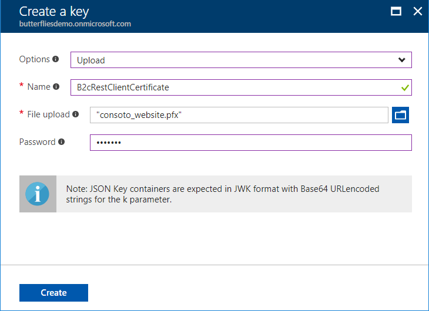
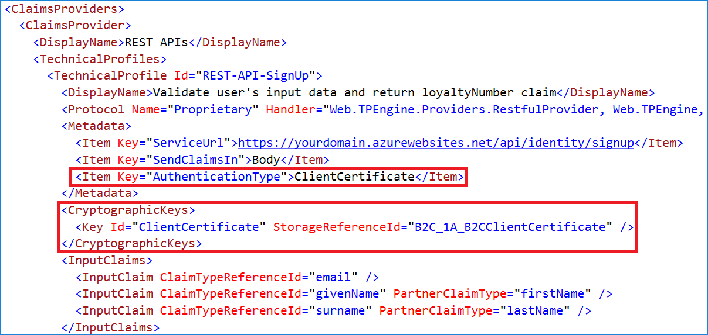
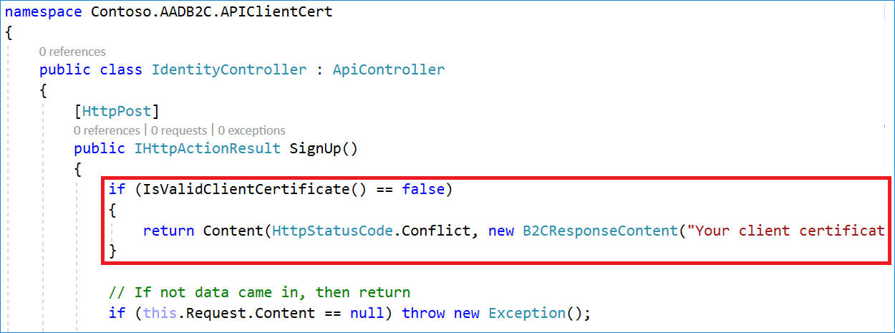

---
title: 'Azure Active Directory B2C: Secure your Restful services using Client Certificate'
description: Sample how to secure your custom REST API claims exchanges in your Azure AD B2C using Client Certificate
services: active-directory-b2c
documentationcenter: ''
author: yoelhor
manager: joroja
editor: 

ms.assetid:
ms.service: active-directory-b2c
ms.workload: identity
ms.tgt_pltfrm: na
ms.topic: article
ms.devlang: na
ms.date: 08/04/2017
ms.author: yoelh
---

# Azure Active Directory B2C: Secure your RESTful services using Client Certificate
In the [previous step](active-directory-b2c-custom-rest-api-netfw.md), we created a Restful service (Web API) that integrates into an Azure AD B2C user journey. The Web API in that example was not secured.  This article shows how to add **client certificate authentication** to your Restful service.  You will configure your Azure AD B2C custom policy for secure access to the API  using a client certificate. 

> [!NOTE]
>
>Also you can secure your RESTful service [using HTTP basic authentication](active-directory-b2c-custom-rest-api-netfw-secure-basic.md). However you should know that HTTP Basic Authentication is considered less secure over client certificate. Our recommendation is to secure the RESTful service using client certificate authentication as described in this article.

This article details how to:
1. Set up your web app to use client certificate authentication
1. Upload the certificate to Azure AD B2C Policy Keys
1. Configure your custom policy to use the client certificate

## Prerequisites
* Complete [Integrate REST API claims exchanges in your Azure AD B2C user journey as validation on user input](active-directory-b2c-custom-rest-api-netfw.md)
* You should have a valid certificate (.pfx file with private key)

## Step 1 Configure Web App for Client Certificate Authentication
Setting up **Azure App Service** to require client certificates, needs to set the web app `clientCertEnabled` site setting to `true`. This setting is not currently available through the management experience in Azure portal, and the REST API needs to be used to accomplish this change.

> [!NOTE]
>
>Make sure your Azure App Service plan is Standard or above. For more information, see [Azure App Service plans in-depth overview](https://docs.microsoft.com/en-us/azure/app-service/azure-web-sites-web-hosting-plans-in-depth-overview)


You can use the [ARMClient](https://github.com/projectkudu/ARMClient) tool to make it easy to craft the REST API call. Alternatively you can use [Azure Resource Explorer (Preview)](https://resources.azure.com) to flip the clientCertEnabled property to true. Following screenshot demonstrates how to set the clientCertEnabled value via Azure Resource Explorer 
 

> [!NOTE]
>
>For more information how to set clientCertEnabled attribute, see: [How To Configure TLS Mutual Authentication for Web App](https://docs.microsoft.com/en-us/azure/app-service-web/app-service-web-configure-tls-mutual-auth)

## Step 2 Upload your certificate to Azure AD B2C policy keys
After you set `clientCertEnabled` to `true`, the communication  with your Restful API now requires a client certificate. In order to do that, you need to upload and store the client certificate in your Azure AD B2C tenant.   
1.  Go to your Azure AD B2C tenant, and select **B2C Settings** > **Identity Experience Framework**
2.  Select **Policy Keys** to view the keys available in your tenant.
3.  Click **+Add**.
4.  For **Options**, use **Upload**.
5.  For **Name**, use `B2cRestClientCertificate`.  
    The prefix `B2C_1A_` might be added automatically.
6.  In the **File upload**, select your certificate .pfx file with private key. 

    

7.  Click **Create**
8.  Confirm that you've created the key `B2C_1A_B2cRestClientCertificate`.

## Step 3 Change the `TechnicalProfile` to support client certificate authentication in your extension policy
1.  Open the extension policy file (TrustFrameworkExtensions.xml) from your working directory.
2.  Find the `<TechnicalProfile>` node that includes with `Id="REST-API-SignUp"`
3.  Locate the `<Metadata>` element
4.  Change the `AuthenticationType` to `ClientCertificate`
```xml
<Item Key="AuthenticationType">ClientCertificate</Item>
```
5.  Add following XML snippet immediately after the closing of the `<Metadata>` element:  
```xml
<CryptographicKeys>
    <Key Id="ClientCertificate" StorageReferenceId="B2C_1A_B2cRestClientCertificate" />
</CryptographicKeys>
```
After adding the XML snippets, your `TechnicalProfile` should look like:



## Step 5: Upload the policy to your tenant

1.  In the [Azure Portal](https://portal.azure.com), switch into the [context of your Azure AD B2C tenant](active-directory-b2c-navigate-to-b2c-context.md), and open **Azure AD B2C** 
2.  Select **Identity Experience Framework**
3.  Open the **All Policies** 
4.  Select **Upload Policy**
5.  Check **Overwrite the policy if it exists** box
6.  **Upload** TrustFrameworkExtensions.xml and ensure that it does not fail the validation

## Step 6: Test the custom policy by using Run Now
1.  Open **Azure AD B2C Settings** and go to **Identity Experience Framework**.
>[!NOTE]
>
>    **Run now** requires at least one application to be preregistered on the tenant. 
>    To learn how to register applications, see the Azure AD B2C [Get started](active-directory-b2c-get-started.md) article or the [Application registration](active-directory-b2c-app-registration.md) article.

2.  Open **B2C_1A_signup_signin**, the relying party (RP) custom policy that you uploaded. Select **Run now**.
3.  Try to enter "Test" in the **Given Name** field, B2C displays error message at the top of the page __"Test name is not valid, provide a valid name"__

> [!NOTE]
>
>If you get above error message, it means Azure AD B2C successfully called your RESTful service while presenting the client certificate. The next step is to validate the certificate.

## Step 7: Adding Certificate Validation
The client certificate that Azure AD B2C sends to your RESTful service does not go through any validation by the Azure Web Apps platform (Except for checking that the certificate exists). Validating the certificate is the responsibility of the web app. Here is sample ASP.NET code that validates certificate properties for authentication purposes.

> [!NOTE]
>
>For more information how to configure Azure Service App for Client Certificate Authentication, see: [How To Configure TLS Mutual Authentication for Web App](https://docs.microsoft.com/en-us/azure/app-service-web/app-service-web-configure-tls-mutual-auth)

### 7.1 Add application settings to project's web.config file
Open your visual studio project you created earlier and add following application settings to web.config file under `appSettings` element
```XML
    <add key="ClientCertificate:Subject" value="CN=Subject name" />
    <add key="ClientCertificate:Issuer" value="CN=Issuer name" />
    <add key="ClientCertificate:Thumbprint" value="Certificate thumbprint" />
```

Replace the values of certificate's:
* Subject name
* Issuer name
* Certificate thumbprint

### 7.2 Add IsValidClientCertificate function
Open Controllers\IdentityController.cs and add following function to the `Identity` controller class. 
```C
        private bool IsValidClientCertificate()
        {
            string ClientCertificateSubject = ConfigurationManager.AppSettings["ClientCertificate:Subject"];
            string ClientCertificateIssuer = ConfigurationManager.AppSettings["ClientCertificate:Issuer"];
            string ClientCertificateThumbprint = ConfigurationManager.AppSettings["ClientCertificate:Thumbprint"];

            X509Certificate2 clientCertInRequest = RequestContext.ClientCertificate;
            if (clientCertInRequest == null)
            {
                Trace.WriteLine("Certificate is NULL");
                return false;
            }

            // Basic verification
            if (clientCertInRequest.Verify() == false)
            {
                Trace.TraceError("Basic verification failed");
                return false;
            }

            // 1. Check time validity of certificate
            if (DateTime.Compare(DateTime.Now, clientCertInRequest.NotBefore) < 0 ||
                DateTime.Compare(DateTime.Now, clientCertInRequest.NotAfter) > 0)
            {
                Trace.TraceError($"NotBefore '{clientCertInRequest.NotBefore}' or NotAfter '{clientCertInRequest.NotAfter}' not valid");
                return false;
            }

            // 2. Check subject name of certificate
            bool foundSubject = false;
            string[] certSubjectData = clientCertInRequest.Subject.Split(new char[] { ',' }, StringSplitOptions.RemoveEmptyEntries);
            foreach (string s in certSubjectData)
            {
                if (String.Compare(s.Trim(), ClientCertificateSubject) == 0)
                {
                    foundSubject = true;
                    break;
                }
            }

            if (!foundSubject)
            {
                Trace.TraceError($"Subject name '{clientCertInRequest.Subject}' is not valid");
                return false;
            }
            
            // 3. Check issuer name of certificate
            bool foundIssuerCN = false;
            string[] certIssuerData = clientCertInRequest.Issuer.Split(new char[] { ',' }, StringSplitOptions.RemoveEmptyEntries);
            foreach (string s in certIssuerData)
            {
                if (String.Compare(s.Trim(), ClientCertificateIssuer) == 0)
                {
                    foundIssuerCN = true;
                    break;
                }
            }

            if (!foundIssuerCN)
            {
                Trace.TraceError($"Issuer '{clientCertInRequest.Issuer}' is not valid");
                return false;
            }

            // 4. Check thumprint of certificate
            if (String.Compare(clientCertInRequest.Thumbprint.Trim().ToUpper(), ClientCertificateThumbprint) != 0)
            {
                Trace.TraceError($"Thumbprint '{clientCertInRequest.Thumbprint.Trim().ToUpper()}' is not valid");
                return false;
            }

            // 5. If you also want to test if the certificate chains to a Trusted Root Authority you can uncomment the code below
            //
            //X509Chain certChain = new X509Chain();
            //certChain.Build(certificate);
            //bool isValidCertChain = true;
            //foreach (X509ChainElement chElement in certChain.ChainElements)
            //{
            //    if (!chElement.Certificate.Verify())
            //    {
            //        isValidCertChain = false;
            //        break;
            //    }
            //}
            //if (!isValidCertChain) return false;
            return true;
        }
```

> [!NOTE]
>
>In the preceding **example**, we only accept the certificate as a valid if all the conditions are met:
>1. The certificate is not expired and is active for the current time on server.
>2. The `Subject` name of the certificate has the common name is equal to `ClientCertificate:Subject` application setting value
>3. The `Issuer` name of the certificate has the common name is equal to `ClientCertificate:Issuer` application setting value
>4. The `thumbprint` of the certificate  is equal to `ClientCertificate:Thumbprint` application setting value
>
>We strongly recommend you to add more validations. For example: Testing if the certificate chains to a Trusted Root Authority, Issuer organization name validation and so on.

### 7.3 Add IsValidClientCertificate function
Open Controllers\IdentityController.cs at the beginning of `SignUp()` function add following lines of code. 
```C
if (IsValidClientCertificate() == false)
{
    return Content(HttpStatusCode.Conflict, new B2CResponseContent("Your client certificate is not valid", HttpStatusCode.Conflict));
}
```

After adding the code snippets, your `Identity` controller should look like:



## Step 8 Publish to Azure and test
1. In the **Solution Explorer**, right-click the **Contoso.AADB2C.API** project and select **Publish**.
2. Repeat step 6 and test your custom policy (again) with the certificate validation
3. Troubleshoot by [collecting logs using Application Insights](active-directory-b2c-troubleshoot-custom.md).

## [Optional] Download the complete policy files and code
* We recommend you build your scenario using your own Custom policy files after completing the Getting Started with Custom Policies walk through instead of using these sample files.  [Sample policy files for reference](https://github.com/Azure-Samples/active-directory-b2c-custom-policy-starterpack/tree/master/scenarios/aadb2c-ief-rest-api-netfw-secure-cert)
* You can download the complete code  here [Sample visual studio solution for reference](https://github.com/Azure-Samples/active-directory-b2c-custom-policy-starterpack/tree/master/scenarios/aadb2c-ief-rest-api-netfw/Contoso.AADB2C.API)