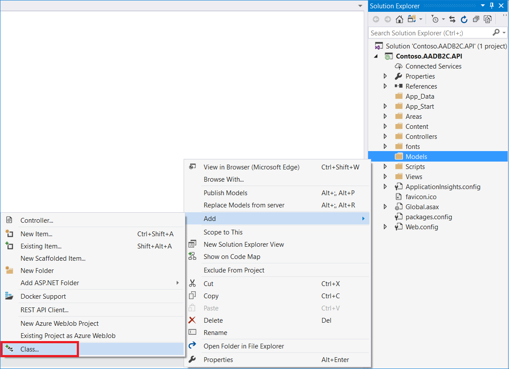
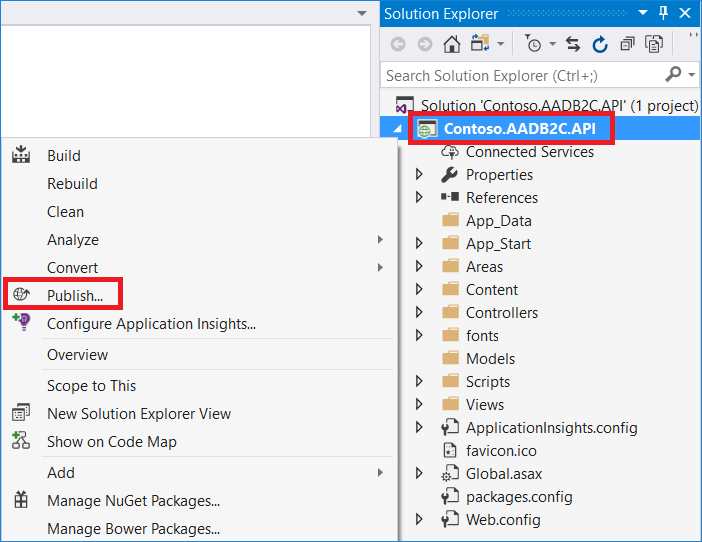
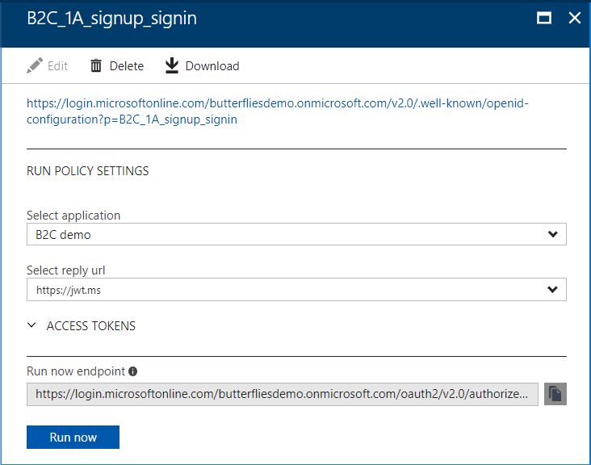

---
title: 'Azure Active Directory B2C: Integrate REST API claims exchanges in your Azure AD B2C user journey as validation on user input'
description: Sample how to integrate REST API claims exchanges in your Azure AD B2C user journey as validation on user input
services: active-directory-b2c
documentationcenter: ''
author: yoelhor
manager: joroja
editor: 

ms.assetid:
ms.service: active-directory-b2c
ms.workload: identity
ms.tgt_pltfrm: na
ms.topic: article
ms.devlang: na
ms.date: 09/30/2017
ms.author: yoelh
---

# Azure Active Directory B2C: Integrate REST API claims exchanges in your Azure AD B2C user journey as validation on user input
The Identity Experience Framework (IEF) that underlies Azure Active Directory B2C (Azure AD B2C) enables you to integrate with a RESTful API in a user journey. In this walkthrough, we are going to show you how B2C interacts with .NET framework RESTful services (Web API).

## Introduction
Azure AD B2C allows you to add your own business logic into a user journey by calling your own Restful service. The Identity Experience Framework sends data to Restful service in **Input claims** collection and receives data back from Restful in **Output claims** collection. With Restful service integration, you can:

* Validate user input data, preventing malformed data from persisting into Azure AD. If the value from the user is not valid, your Restful service returns error message that instructs the user to provide a entry. For example, you may verify that the email address provided by the user exits in your customers database.
* Overwrite input claims. For instance, if user enters the first name in lower case or upper case, you can format the name and capitalize only the first letter
* Enrich user data by further integrating with corporate line-of-business application. Your RESTful service may receive the user email address, query customers database, and return user's loyalty number back to B2C. The return claims may be stored in the user AAD account, evaluated in  the next **Orchestration Steps**, or included in the access token.
* Run custom business logic: send push notifications, update corporate's databases, run user migration process, permission management, auditing, and more.

The integration with the Restful services can be designed as a claims exchange or as a Validation technical profile:

* **Validation technical profile** The call to the Restful service happens inside ValidationTechnicalProfile of a given TechnicalProfile. The validation technical profile validates the user provided data before user journey moves forward. With validation technical profile you can:
  * Send input claims
  * Validate the input claims and throw custom error messages
  * Send back output claims

* **Claims exchange** - Similar to the previous one, but happens inside an orchestration step. This definition is limited to:
   * Send input claims
   * Send back output claims

## Restful demo
In this demo, you develop a .NET framework web API that validates the user input and provide user loyalty number. For example, your application can grant access to "platinum benefits"based on the loyalty number.

The demo involves:
*   Developing the Restful service (.NET framework Web API)
*   Using the Restful service in the user journey
*   Sending input claims and read them in your code
*   Validating the user first name
*   Sending back loyalty number 
*   Adding the loyalty number to the JSON web token (JWT)

## Prerequisites
Complete the steps in the [Getting started with custom policies](active-directory-b2c-get-started-custom.md) article.

## Step 1: Create an ASP.NET web API
1.  In Visual Studio, create a project by selecting **File > New > Project**.
2.  In the **New Project** dialog, select **Visual C > Web > ASP.NET Web Application (.NET Framework)**.
3.  Name the application, for example, Contoso.AADB2C.API, and then select **OK**.

    

4.  Select **Web API** or **Azure API app** template
5.  Make sure authentication is set to **No Authentication**

    

6.  Click **OK** to create the project

## Step 2: Prepare the REST API endpoint

### Step 2.1 Add data models
The models represent the input claims and output claims data in your RESTful service. Your code reads the input data by deserializing the input claims model from JSON string to C# object (your model). ASP.NET Web API automatically deserializes the output claims model back to JSON and then write the serialized data into the body of the HTTP response message. Let's start by creating a model that represents input claims.

1.  If Solution Explorer is not already visible, click the **View** menu and select **Solution Explorer**. In Solution Explorer, right-click the Models folder. From the context menu, select **Add** then select **Class**.

    

2.  Name the class `InputClaimsModel` and add the following properties to the `InputClaimsModel` class
```C
namespace Contoso.AADB2C.API.Models
{
    public class InputClaimsModel
    {
        public string email { get; set; }
        public string firstName { get; set; }
        public string lastName { get; set; }
    }
}
```
3.  Create new model `OutputClaimsModel` and add the following properties to the `OutputClaimsModel` class
```C
namespace Contoso.AADB2C.API.Models
{
    public class OutputClaimsModel
    {
        public string loyaltyNumber { get; set; }
    }
}
```
4.  Create one more model `B2CResponseContent`. This model uses to throw input validation error messages. Add the following properties to the `B2CResponseContent` class, provide the missing references, and save the file. 
```C
namespace Contoso.AADB2C.API.Models
{
    public class B2CResponseContent
    {
        public string version { get; set; }
        public int status { get; set; }
        public string userMessage { get; set; }

        public B2CResponseContent(string message, HttpStatusCode status)
        {
            this.userMessage = message;
            this.status = (int)status;
            this.version = Assembly.GetExecutingAssembly().GetName().Version.ToString();
        }    
    }
}
```
### Step 2.2: Add a Controller
In Web API, a _controller_ is an object that handles HTTP requests. We add a controller that returns output claims, or, if the first name is not valid, throws Conflict HTTP error message.

1.  In **Solution Explorer**, right-click the Controllers folder. Select **Add** and then select **Controller**.

    

2.  In the **Add Scaffold** dialog, select **Web API Controller - Empty**. Click **Add**.

    !

3.  In the **Add Controller** dialog, name the controller `IdentityController`, then click **Add**.

    

    The scaffolding creates a file named IdentityController.cs in the Controllers folder.

4.  If this file is not open already, double-click the file to open it. Replace the code in this file with the following lines of code:
```C
using Contoso.AADB2C.API.Models;
using Newtonsoft.Json;
using System;
using System.NET;
using System.Web.Http;

namespace Contoso.AADB2C.API.Controllers
{
    public class IdentityController: ApiController
    {
        [HttpPost]
        public IHttpActionResult SignUp()
        {
            // If not data came in, then return
            if (this.Request.Content == null) throw new Exception();

            // Read the input claims from the request body
            string input = Request.Content.ReadAsStringAsync().Result;

            // Check input content value
            if (string.IsNullOrEmpty(input))
            {
                return Content(HttpStatusCode.Conflict, new B2CResponseContent("Request content is empty", HttpStatusCode.Conflict));
            }

            // Convert the input string into InputClaimsModel object
            InputClaimsModel inputClaims = JsonConvert.DeserializeObject(input, typeof(InputClaimsModel)) as InputClaimsModel;

            if (inputClaims == null)
            {
                return Content(HttpStatusCode.Conflict, new B2CResponseContent("Can not deserialize input claims", HttpStatusCode.Conflict));
            }

            // Run input validation
            if (inputClaims.firstName.ToLower() == "test")
            {
                return Content(HttpStatusCode.Conflict, new B2CResponseContent("Test name is not valid, please provide a valid name", HttpStatusCode.Conflict));
            }

            // Create output claims object and set the loyalty number with random value
            OutputClaimsModel outputClaims = new OutputClaimsModel();
            outputClaims.loyaltyNumber = new Random().Next(100, 1000).ToString();

            // Return the output claim(s)
            return Ok(outputClaims);
        }
    }
}
```
## Step 3: Publish to Azure
1.  In the **Solution Explorer**, right-click the **Contoso.AADB2C.API** project and select **Publish**.

    

2.  Make sure that **Microsoft Azure App Service** is selected and select **Publish**.

    

    This opens the **Create App Service** dialog, which helps you create all the necessary Azure resources to run the ASP.NET web app in Azure.

> [!NOTE]
>
>For more information how to publish, see: [Create an ASP.NET web app in Azure](https://docs.microsoft.com/en-us/azure/app-service-web/app-service-web-get-started-dotnet#publish-to-azure)

3.  In **Web App Name**, type a unique app name (valid characters are `a-z`, `0-9`, and `-`). The URL of the web app is `http://<app_name>.azurewebsites.NET`, where `<app_name>` is your web app name. You can accept the automatically generated name, which is unique.

    Select **Create** to start creating the Azure resources.

    

4.  Once the wizard completes, it publishes the ASP.NET web app to Azure, and then launches the app in the default browser, copy the URL.

## Step 4: Add the new claim `loyaltyNumber` to the schema of your TrustFrameworkExtensions.xml file
The claim `loyaltyNumber` is not yet defined anywhere in our schema. So, add a definition inside the element `<BuildingBlocks>`. You can find this element at the beginning of the TrustFrameworkExtensions.xml file.
```xml
<BuildingBlocks>
    <ClaimsSchema>
        <ClaimType Id="loyaltyNumber">
            <DisplayName>loyaltyNumber</DisplayName>
            <DataType>string</DataType>
            <UserHelpText>Customer loyalty number</UserHelpText>
        </ClaimType>
    </ClaimsSchema>
</BuildingBlocks>
```
## Step 5: Adding claims provider 
Every claims provider must have one or more technical profiles which determines the endpoints and the protocols needed to communicate with that claims provider. 
A claims provider can have multiple technical profiles for various reasons. For example, multiple technical profiles may be defined because the considered claims provider supports multiple protocols, various endpoints with different capabilities, or releases different claims at different assurance levels. It may be acceptable to release sensitive claims in one user journey, but not in another one. 

Following XML snippet contains `ClaimsProvider` node with two `TechnicalProfile`:
* `<TechnicalProfile Id="REST-API-SignUp">` defines your Restful service. The `Proprietary` is described as protocol for a Restful based provider. The `InputClaims` element defines the claims that will be sent from the B2C to the REST service. In this example, the content of the claim `givenName` sends to the REST service as `firstName`, the content of the claim `surename` sends to the REST service as `lastName`, the `email` sends as is. The `OutputClaims` element defines the claims that retrieve back from Restful service back to B2C.

* `<TechnicalProfile Id="LocalAccountSignUpWithLogonEmail">`  adds validation technical profile to existing technical profile (defined in base policy). During sign up journey, the validation technical profile invokes the above technical profile. If Restful service returns HTTP error 409 (conflic), the error message presentes to the user. 

Locate the `<ClaimsProviders>` node and add following XML snippet under `<ClaimsProviders>` node:
```xml
<ClaimsProvider>
    <DisplayName>REST APIs</DisplayName>
    <TechnicalProfiles>
    
    <!-- Custom Restful service -->
    <TechnicalProfile Id="REST-API-SignUp">
        <DisplayName>Validate user's input data and return loyaltyNumber claim</DisplayName>
        <Protocol Name="Proprietary" Handler="Web.TPEngine.Providers.RestfulProvider, Web.TPEngine, Version=1.0.0.0, Culture=neutral, PublicKeyToken=null" />
        <Metadata>
        <Item Key="ServiceUrl">https://yourdomain.azurewebsites.NET/api/identity/signup</Item>
        <Item Key="AuthenticationType">None</Item>
        <Item Key="SendClaimsIn">Body</Item>
        </Metadata>
        <InputClaims>
        <InputClaim ClaimTypeReferenceId="email" />
        <InputClaim ClaimTypeReferenceId="givenName" PartnerClaimType="firstName" />
        <InputClaim ClaimTypeReferenceId="surname" PartnerClaimType="lastName" />
        </InputClaims>
        <OutputClaims>
        <OutputClaim ClaimTypeReferenceId="loyaltyNumber" PartnerClaimType="loyaltyNumber" />
        </OutputClaims>
        <UseTechnicalProfileForSessionManagement ReferenceId="SM-Noop" />
    </TechnicalProfile>

<!-- Change LocalAccountSignUpWithLogonEmail technical profile to support your validation technical profile -->
    <TechnicalProfile Id="LocalAccountSignUpWithLogonEmail">
        <OutputClaims>
        <OutputClaim ClaimTypeReferenceId="loyaltyNumber" PartnerClaimType="loyaltyNumber" />
        </OutputClaims>
        <ValidationTechnicalProfiles>
        <ValidationTechnicalProfile ReferenceId="REST-API-SignUp" />
        </ValidationTechnicalProfiles>
    </TechnicalProfile>

    </TechnicalProfiles>
</ClaimsProvider>
```
## Step 6: Add the claim `city` to your relying party policy file so the claim is sent to your application
Edit your SignUpOrSignIn.xml relying party (RP) file and modify the `<TechnicalProfile Id="PolicyProfile">` element to add the following: `<OutputClaim ClaimTypeReferenceId="loyaltyNumber" />`.

After you add the new claim, the `RelyingParty` looks like this:
```xml
<RelyingParty>
    <DefaultUserJourney ReferenceId="SignUpOrSignIn" />
    <TechnicalProfile Id="PolicyProfile">
        <DisplayName>PolicyProfile</DisplayName>
        <Protocol Name="OpenIdConnect" />
        <OutputClaims>
        <OutputClaim ClaimTypeReferenceId="displayName" />
        <OutputClaim ClaimTypeReferenceId="givenName" />
        <OutputClaim ClaimTypeReferenceId="surname" />
        <OutputClaim ClaimTypeReferenceId="email" />
        <OutputClaim ClaimTypeReferenceId="objectId" PartnerClaimType="sub"/>
        <OutputClaim ClaimTypeReferenceId="identityProvider" />
        <OutputClaim ClaimTypeReferenceId="loyaltyNumber" DefaultValue="" />
        </OutputClaims>
        <SubjectNamingInfo ClaimType="sub" />
    </TechnicalProfile>
    </RelyingParty>
</TrustFrameworkPolicy>
```
## Step 7: Upload the policy to your tenant
1.  In the [Azure portal](https://portal.azure.com), switch into the [context of your Azure AD B2C tenant](active-directory-b2c-navigate-to-b2c-context.md), and open the **Azure AD B2C**
2.  Select **Identity Experience Framework**
3.  Open **All Policies** 
4.  Select **Upload Policy**
5.  Check **Overwrite the policy if it exists** box.
6.  **Upload** TrustFrameworkExtensions.xml and ensure that it does not fail the validation
7.  Repeat last step and upload the SignUpOrSignIn.xml

## Step 8: Test the custom policy by using Run Now
1.  Open **Azure AD B2C Settings** and go to **Identity Experience Framework**.

> [!NOTE]
>
>**Run now** requires at least one application to be preregistered on the tenant. To learn how to register applications, see the Azure AD B2C [Get started](active-directory-b2c-get-started.md) article or the [Application registration](active-directory-b2c-app-registration.md) article.


2.  Open **B2C_1A_signup_signin**, the relying party (RP) custom policy that you uploaded. Select **Run now**.

    

3.  Try to enter "Test" in the **Given Name** field, B2C displays error message at the top of the page

    

4.  Try to enter a name (other than "test") in the **Given Name** field. B2C signs up the user and then send loyaltyNumber to your application. Note the number in this JWT.
```
{
  "typ": "JWT",
  "alg": "RS256",
  "kid": "X5eXk4xyojNFum1kl2Ytv8dlNP4-c57dO6QGTVBwaNk"
}.{
  "exp": 1507125903,
  "nbf": 1507122303,
  "ver": "1.0",
  "iss": "https://login.microsoftonline.com/f06c2fe8-709f-4030-85dc-38a4bfd9e82d/v2.0/",
  "aud": "e1d2612f-c2bc-4599-8e7b-d874eaca1ee1",
  "acr": "b2c_1a_signup_signin",
  "nonce": "defaultNonce",
  "iat": 1507122303,
  "auth_time": 1507122303,
  "loyaltyNumber": "290",
  "given_name": "Emily",
  "emails": ["B2cdemo@outlook.com"]
}
```

## [Optional] Download the complete policy files and code
* We recommend you build your scenario using your own Custom policy files after completing the Getting Started with Custom Policies walk through instead of using these sample files.  [Sample policy files for reference](https://github.com/Azure-Samples/active-directory-b2c-custom-policy-starterpack/tree/master/scenarios/active-directory-b2c-custom-setup-amzn-app)
* You can download the complete code  here [Sample visual studio solution for reference](https://github.com/Azure-Samples/active-directory-b2c-custom-policy-starterpack/tree/master/scenarios/active-directory-b2c-custom-setup-amzn-app)
	
## Next step
1.  [Secure your Restful API with basic authentication (username and password)](active-directory-b2c-custom-rest-api-netfw-secure-basic.md)
2.  [Secure your Restful API with client certificate](active-directory-b2c-custom-rest-api-netfw-secure-cert.md)