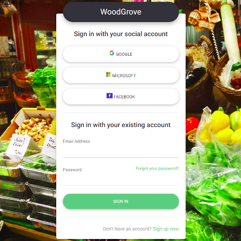
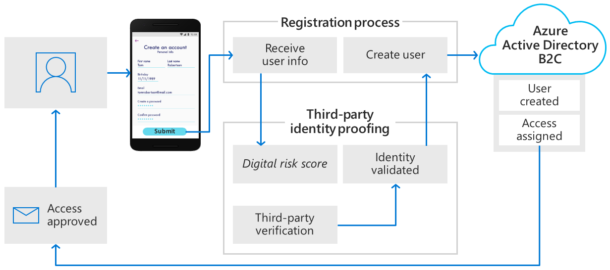

# What is Azure Active Directory B2C?

Azure Active Directory B2C provides business-to-customer identity as a service. Your customers use their preferred social, enterprise, or local account identities to get single sign-on access to your applications and APIs.

Azure Active Directory B2C (Azure AD B2C) is capable of supporting millions of users and billions of authentications per day. It takes care of the scaling and safety of the authentication platform, monitoring and automatically handling threats like denial-of-service, password spray, or brute force attacks.

## Custom-branded identity solution

Azure AD B2C is a white-label authentication solution. You can customize the entire user experience with your brand so that it blends seamlessly with your web and mobile applications.

Customize every page displayed by Azure AD B2C when your users sign up, sign in, and modify their profile information. Customize the HTML, CSS, and JavaScript in your user journeys so that the Azure AD B2C experience looks and feels like it's a native part of your application.

## Single sign-on access with a user-provided identity

Azure AD B2C uses standards-based authentication protocols including OpenID Connect, OAuth 2.0, and SAML. It integrates with most modern applications and commercial off-the-shelf software.

By serving as the central authentication authority for your web applications, mobile apps, and APIs, Azure AD B2C enables you to build a single sign-on (SSO) solution for them all. Centralize the collection of user profile and preference information, and capture detailed analytics about sign-in behavior and sign-up conversion.

## Integrate with external user stores

Use Azure AD B2C to integrate with an external system that stores user profile or personal data. Satisfy data residency requirements like regional or on-premises data storage policies.

Another external user store scenario is to have Azure AD B2C handle the authentication for your application, but delegate to an external customer relationship management (CRM) or customer loyalty database as the source of truth for customer data.

Azure AD B2C can facilitate collecting the information from the user during registration or profile editing, then hand that data off to the external system. Then, during future authentications, Azure AD B2C can retrieve the data from the external system and, if needed, include it as a part of the authentication token response it sends to your application.

## Progressive profiling

Other user journey options include progressive profiling. Progressive profiling allows your customers to quickly complete their first transaction by collecting a minimal amount of information. Then, gradually collect more profile data from the customer on future sign-ins.

## Third-party identity verification and proofing

Use Azure AD B2C to facilitate identity verification and proofing by collecting user data, then passing it to a third party system to perform validation, trust scoring, and approval for user account creation.

These are just some of the things you can do with Azure AD B2C as your business-to-customer identity platform. The following sections of this overview walk you through a demo application that uses Azure AD B2C. You're also welcome to move on directly to a more in-depth [technical overview of Azure AD B2C](technical-overview.md).

## Example: WoodGrove Groceries

[WoodGrove Groceries][woodgrove] is a live web application created by Microsoft to demonstrate several Azure AD B2C features. The next few sections review some of the authentication options provided by Azure AD B2C to the WoodGrove website.

### Business overview

WoodGrove is an online grocery store that sells groceries to both individual consumers and business customers. Their business customers buy groceries on behalf of their company, or businesses that they manage.

### Sign-in options

WoodGrove Groceries offers several sign-in options based on the relationship their customers have with the store:

* **Individual** customers can sign up or sign in with individual accounts, such as with a social identity provider or an email address and password.
* **Business** customers can sign up or sign in with their enterprise credentials.
* **Partners** and suppliers are individuals who supply the grocery store with products to sell. Partner identity is provided by [Azure Active Directory B2B](../active-directory/b2b/what-is-b2b.md).

### Authenticate individual customers

When a customer selects **Sign in with your personal account**, they're redirected to a customized sign-in page hosted by Azure AD B2C. You can see in the following image that we've customized the user interface (UI) to look and feel just like the WoodGrove Groceries website. Their customers should be unaware that the authentication experience is hosted and secured by Azure AD B2C.

WoodGrove allows their customers to sign up and sign in by using their Google, Facebook, or Microsoft accounts as their identity provider. Or, they can sign up by using their email address and a password to create what's called a *local account*.

When a customer selects **Sign up with your personal account** and then **Sign up now**, they are presented with a custom sign-up page.

After entering an email address and selecting **Send verification code**, Azure AD B2C sends them the code. Once they enter their code, select **Verify code**, and then enter the other information on the form, they must also agree to the terms of service.

Clicking the **Create** button causes Azure AD B2C to redirect the user back to the WoodGrove Groceries website. When it redirects, Azure AD B2C passes an OpenID Connect authentication token to the WoodGrove web application. The user is now signed-in and ready to go, their display name shown in the top-right corner to indicate they're signed in.

The following animation shows the sign-up user journey provided by WoodGrove and Azure AD B2C:

### Authenticate business customers

When a customer selects one of the options under **Business customers**, the WoodGrove Groceries website invokes a different Azure AD B2C policy than it does for individual customers.

This policy presents the user with an option to use their corporate credentials for sign-up and sign-in. In the WoodGrove example, users are prompted to sigh in with any Office 365 or Azure AD account. The policy used here uses a [multi-tenant Azure AD application](../active-directory/develop/howto-convert-app-to-be-multi-tenant.md) and the `/common` Azure AD endpoint to federate Azure AD B2C with every Office 365 customer in the world.

### Authenticate partners

The **Sign in with your supplier account** link uses Azure Active Directory B2B's collaboration functionality. Azure AD B2B is a separate Azure service that complements Azure Active Directory and Azure AD B2C.

Learn more about Azure AD B2B in [What is guest user access in Azure Active Directory B2B?](../active-directory/b2b/what-is-b2b.md).

### Sample code

If you'd like to jump right into the code to see how the WoodGrove Groceries application is built, you can find the repository on GitHub:

[Azure-Samples/active-directory-external-identities-woodgrove-demo][woodgrove-repo] (GitHub)

For examples of how to construct many other scenarios in Azure AD B2C, visit the community-maintained Azure AD B2C samples repository:

[azure-ad-b2c/samples][samples-repo] (GitHub)

## Next steps

Now that you have an idea of what Azure Active Directory B2C is about and the scenarios it can help with, dig a little deeper into its technical aspects.

> [!div class="nextstepaction"]
> [Azure AD B2C technical overview >](technical-overview.md)

<!-- LINKS - External -->
[woodgrove]: https://woodgrovegroceriesb2c.azurewebsites.net/
[woodgrove-repo]: https://github.com/Azure-Samples/active-directory-external-identities-woodgrove-demo
[samples-repo]: https://github.com/azure-ad-b2c/samples
