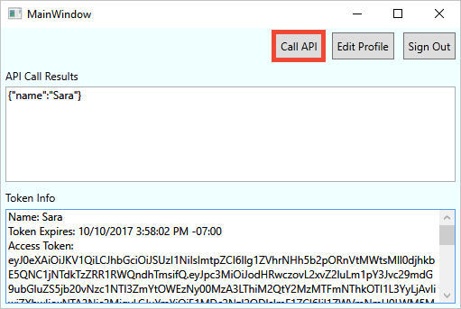

# Quickstart: Set up sign-in for a desktop app using Azure Active Directory B2C 

Azure Active Directory (Azure AD) B2C provides cloud identity management to keep your application, business, and customers protected. Azure AD B2C enables your apps to authenticate to social accounts, and enterprise accounts using open standard protocols.

In this quickstart, you use an Azure AD B2C enabled sample Windows Presentation Foundation (WPF) desktop app to sign in using a social identity provider and call an Azure AD B2C protected web API.

[!INCLUDE [quickstarts-free-trial-note](../../includes/quickstarts-free-trial-note.md)]

## Prerequisites

* [Visual Studio 2017](https://www.visualstudio.com/downloads/) with the **ASP.NET and web development** workload. 
* A social account from either Facebook, Google, Microsoft, or Twitter.

## Download the sample

[Download a zip file](https://github.com/Azure-Samples/active-directory-b2c-dotnet-desktop/archive/master.zip) or clone the sample web app from GitHub.

```
git clone https://github.com/Azure-Samples/active-directory-b2c-dotnet-desktop.git
```

## Run the app in Visual Studio

In the sample application project folder, open the `active-directory-b2c-wpf.sln` solution in Visual Studio.

Press **F5** to debug the application.

## Create an account

Click **Sign in** to start the **Sign Up or Sign In** workflow based on an Azure AD B2C policy.


The sample supports several sign-up options including using a social identity provider or creating a local account using an email address. For this quickstart, use a social identity provider account from either Facebook, Google, Microsoft, or Twitter. 

### Sign up using a social identity provider

Azure AD B2C presents a custom login page for a fictitious brand called Wingtip Toys for the sample web app. 

1. To sign up using a social identity provider, click the button of the identity provider you want to use. 

    

    You authenticate (sign-in) using your social account credentials and authorize the application to read information from your social account. By granting access, the application can retrieve profile information from the social account such as your name and city. 

2. Finish the sign-in process for the identity provider. For example, if you chose Twitter, enter your Twitter credentials and click **Sign in**.

    

    Your new account profile details are pre-populated with information from your social account. 

3. Modify the details if you wish and click **Continue**. The values you enter are used for your Azure AD B2C user account profile.

    

    You have successfully created a new Azure AD B2C user account that uses an identity provider. After sign-in, the access token is shown in the *Token info* text box. The access token is used when accessing the API resource.

## Edit your profile

Azure Active Directory B2C provides functionality to allow users to update their profiles.  The sample web app uses an Azure AD B2C edit profile policy for the workflow. 

1. Click **Edit profile** to edit the profile you created.

    

2. Choose the identity provider associated with the account you created. For example, if you used Twitter as the identity provider when you created your account, choose Twitter to modify the associated profile details.

3. Change your **Display name** or **City** and click **Continue**.

    A new access token is displayed in the *Token info* text box. If you want to verify the changes to your profile, copy and paste the access token into the token decoder https://jwt.ms.

## Access a protected web API resource

Click **Call API** to make a request to the Azure AD B2C protected resource. 



The application includes the Azure AD access token in the request to the protected web API resource. The web API sends back the display name contained in the access token.

You have successfully used your Azure AD B2C user account to make an authorized call an Azure AD B2C protected web API.

## Clean up resources

You can use your Azure AD B2C tenant if you plan to try other Azure AD B2C quickstarts or tutorials. When no longer needed, you can [delete your Azure AD B2C tenant](active-directory-b2c-faqs.md#how-do-i-delete-my-azure-ad-b2c-tenant).

## Next steps

The next step is to create your own Azure AD B2C tenant and configure the sample to run using your tenant. 

> [!div class="nextstepaction"]
> [Create an Azure Active Directory B2C tenant in the Azure portal](active-directory-b2c-get-started.md)
