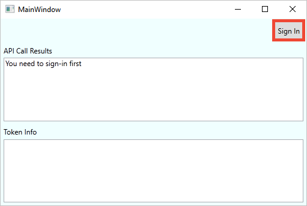

# Test drive a desktop application configured with Azure AD B2C

Azure Active Directory B2C provides cloud identity management to keep your application, business, and customers protected.  This quickstart uses a sample Windows Presentation Foundation (WPF) desktop app to demonstrate:

* Using the **Sign Up or Sign In** policy to create or sign in with a social identity provider or a local account using an email address. 
* **Calling an API** to retrieve your display name from an Azure AD B2C secured resource.

## Prerequisites

* Install [Visual Studio 2017](https://www.visualstudio.com/downloads/) with the following workloads:
    - **.NET desktop development**

* A social account from either Facebook, Google, Microsoft, or Twitter. If you don't have a social account, a valid email address is required.

[!INCLUDE [quickstarts-free-trial-note](../../includes/quickstarts-free-trial-note.md)]

## Download the sample

[Download a zip file](https://github.com/Azure-Samples/active-directory-b2c-dotnet-desktop/archive/master.zip) or clone the sample web app from GitHub.

```
git clone https://github.com/Azure-Samples/active-directory-b2c-dotnet-desktop.git
```

## Run the app in Visual Studio

In the sample application project folder, open the `active-directory-b2c-wpf.sln` solution in Visual Studio. 

Press **F5** to debug the application. 

## Create an account

Click **Sign in** to start the **Sign Up or Sign In** workflow. When creating an account, you can use an existing social identity provider account or an email account.



### Sign up using a social identity provider

To sign up using a social identity provider, click the button of the identity provider you want to use. If you prefer to use an email address, jump to the [Sign up using an email address](#sign-up-using-an-email-address) section.


You need to authenticate (sign-in) using your social account credentials and authorize the application to read information from your social account. By granting access, the application can retrieve profile information from the social account such as your name and city. 


Your new account profile details are pre-populated with information from your social account. Modify the details if you wish and click **Continue**.


You have successfully created a new Azure AD B2C user account that uses an identity provider. After sign-in, the access token is shown in the *Token info* text box. The access token is used when accessing the API resource.


Next step: [Jump to Edit your profile](#edit-your-profile) section.

### Sign up using an email address

If you choose to not use a social account to provide authentication, you can create an Azure AD B2C user account using a valid email address. An Azure AD B2C local user account uses Azure Active Directory as the identity provider. To use your email address, click the **Don't have an account? Sign up now** link.


Enter a valid email address and click **Send verification code**. A valid email address is required to receive the verification code from Azure AD B2C.

Enter the verification code you receive in email and click **Verify code**.

Add your profile information and click **Create**.


You have successfully created a new Azure AD B2C local user account. After sign-in, the access token is shown in the *Token info* text box. The access token is used when accessing the API resource.


## Edit your profile

Azure Active Directory B2C provides functionality to allow users to update their profiles. Click **Edit profile** to edit the profile you created.


Choose the identity provider associated with the account you created. For example, if you used Twitter as the identity provider when you created your account, choose Twitter to modify the associated profile details.


Change your **Display name** or **City**. 


A new access token is displayed in the *Token info* text box. If you want to verify the changes to your profile, copy and paste the access token into the token decoder https://jwt.ms.


## Access a resource

Click **Call API** to make a request to the Azure AD B2C secured resource https://fabrikamb2chello.azurewebsites.net/hello. 


The application includes the access token displayed in the *Token info* text box in the request. The API sends back the display name contained in the access token.

## Next steps

The next step is to create your own Azure AD B2C tenant and configure the sample to run using your tenant. 

> [!div class="nextstepaction"]
> [Create an Azure Active Directory B2C tenant in the Azure portal](active-directory-b2c-get-started.md)
