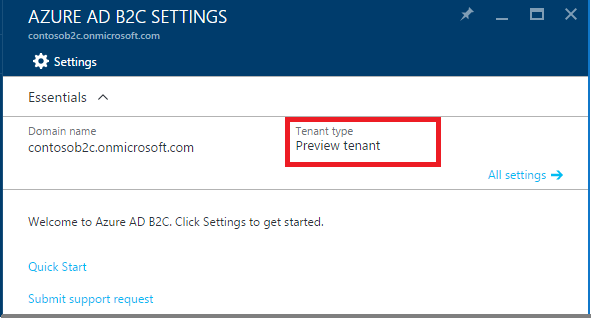

# Azure Active Directory B2C: Region availability & data residency

Region availability and data residency are two very different concepts that apply differently to Azure AD B2C from the rest of Azure. This article explains the differences between these two concepts, and compares how they apply to Azure versus Azure AD B2C.

Azure AD B2C is **generally available worldwide** with the option for **data residency** in the **United States, Europe, or Asia Pacific**.

[Region availability](#region-availability) refers to where a service is available for use.

[Data residency](#data-residency) refers to where user data is stored.

## Region availability

Azure AD B2C is available worldwide via the Azure public cloud.

This differs from the model followed by most other Azure services, which typically couple *availability* with *data residency*. You can see examples of this in both Azure's [Products Available By Region](https://azure.microsoft.com/regions/services/) page and the [Active Directory B2C pricing calculator](https://azure.microsoft.com/pricing/details/active-directory-b2c/).

## Data residency

Azure AD B2C stores user data in either United States, Europe, or the Asia Pacific region.

Data residency is determined by the country/region you select when you [create an Azure AD B2C tenant](active-directory-b2c-get-started.md):

Data resides in the **United States** for the following countries/regions:

> United States, Canada, Costa Rica, Dominican Republic, El Salvador, Guatemala, Mexico, Panama, Puerto Rico and Trinidad & Tobago

Data resides in **Europe** for the following countries/regions:

> Algeria, Austria, Azerbaijan, Bahrain, Belarus, Belgium, Bulgaria, Croatia, Cyprus, Czech Republic, Denmark, Egypt, Estonia, Finland, France, Germany, Greece, Hungary, Iceland, Ireland, Israel, Italy, Jordan, Kazakhstan, Kenya, Kuwait, Lativa, Lebanon, Liechtenstein, Lithuania, Luxembourg, North Macedonia, Malta, Montenegro, Morocco, Netherlands, Nigeria, Norway, Oman, Pakistan, Poland, Portugal, Qatar, Romania, Russia, Saudi Arabia, Serbia, Slovakia, Slovenia, South Africa, Spain, Sweden, Switzerland, Tunisia, Turkey, Ukraine, United Arab Emirates and United Kingdom.

Data resides in **Asia Pacific** for the following countries/regions:

> Afghanistan, Australia, Hong Kong SAR, India, Indonesia, Japan, Korea, Malaysia, New Zealand, Philippines, Singapore, Sri Lanka, Taiwan, and Thailand.

The following countries/regions are in the process of being added to the list.  For now, you can still use Azure AD B2C by picking any of the countries/regions above.

> Argentina, Brazil, Chile, Colombia, Ecuador, Iraq, Paraguay, Peru, Uruguay, and Venezuela.

## Preview tenant

If you had created a B2C tenant during Azure AD B2C's preview period, it's likely that your **Tenant type** says **Preview tenant**.

If this is the case, you must use your tenant ONLY for development and testing purposes. DO NOT use a preview tenant for production applications.

**There is no migration path** from a preview B2C tenant to a production-scale B2C tenant. You must create a new B2C tenant for your production applications.

There are known issues when you delete a preview B2C tenant and create a production-scale B2C tenant with the same domain name. *You must create a production-scale B2C tenant with a different domain name*.

