# Azure Active Directory B2C: Configure the UI with dynamic content using Custom policies
Azure AD B2C custom policies allow you to send through a parameter in a query string. That parameter passes on to your HTML endpoint and can dynamically change the page content. For example, you can change the B2C sign-up or sign in background image, based on a parameter you pass from your web/mobile application. 

## Prerequisites
This article focuses on how to customize the Azure AD B2C user interface with **dynamic content** using custom policies. To get started with custom policy UI customization, read [UI customization in a custom policy](active-directory-b2c-ui-customization-custom.md) article. 

>[!NOTE]
>
>  [Configure UI customization in a custom policy](active-directory-b2c-ui-customization-custom.md) article teaches the fundamentals of Azure AD B2C UI customization with custom policy:
> * The page user interface (UI) customization feature.
> * A tool that helps you test the page UI customization feature using our sample content.
> * The core UI elements in each type of page.
> * Best practices when exercising this feature.

## Adding a link to HTML5/CSS templates to your user journey

In a custom policy, a content definition defines the HTML5 page URI that is used for a given UI step. For example, the sign-in or sign-up pages. The base policy defines the default look and feel by pointing to a URI of HTML5 files (it refers its CSS). In the extension policy, you can modify the look and feel by overriding the LoadUri for that HTML5 file. As such, content definitions contain URLs to external content that is defined by crafting HTML5/CSS files as appropriate. 

`ContentDefinitions` section contains a series of `ContentDefinition` XML elements. The ID attribute of `ContentDefinition` element specifies the type of pages that relates to the content definition. Thus the context in which a custom HTML5/CSS template is going to be used. Following table describes the set of content definition IDs, recognized by the IEF engine, and the type of pages that relates to them.

| Content definition ID | Default HTML5 template| Description | 
|-----------------------|--------|-------------|
| *api.error* | [exception.cshtml](https://login.microsoftonline.com/static/tenant/default/exception.cshtml) | **Error page**. This page is displayed when an exception or an error is encountered. |
| *api.idpselections* | [idpSelector.cshtml](https://login.microsoftonline.com/static/tenant/default/idpSelector.cshtml) | **Identity provider selection page**. This page contains a list of identity providers that the user can choose from during sign-in. These options are typically enterprise identity providers, social identity providers such as Facebook and Google+, or local accounts. |
| *api.idpselections.signup* | [idpSelector.cshtml](https://login.microsoftonline.com/static/tenant/default/idpSelector.cshtml) | **Identity provider selection for sign-up**. This page contains a list of identity providers that the user can choose from during sign-up. These options are either enterprise identity providers, social identity providers such as Facebook and Google+, or local accounts. |
| *api.localaccountpasswordreset* | [selfasserted.html](https://login.microsoftonline.com/static/tenant/default/selfAsserted.cshtml) | **Forgot password page**. This page contains a form that the user must complete to initiate a password reset.  |
| *api.localaccountsignin* | [selfasserted.html](https://login.microsoftonline.com/static/tenant/default/selfAsserted.cshtml) | **Local account sign-in page**. This page contains a sign-in form for signing in with a local account that is based on an email address or a user name. The form can contain a text input box and password entry box. |
| *api.localaccountsignup* | [selfasserted.html](https://login.microsoftonline.com/static/tenant/default/selfAsserted.cshtml) | **Local account sign up page**. This page contains a sign-up form for signing up for a local account that is based on an email address or a user name. The form can contain various input controls, such as: a text input box, a password entry box, a radio button, single-select drop-down boxes, and multi-select check boxes. |
| *api.phonefactor* | [multifactor-1.0.0.cshtml](https://login.microsoftonline.com/static/tenant/default/multifactor-1.0.0.cshtml) | **Multi-factor authentication page**. On this page, users can verify their phone numbers (by using text or voice) during sign-up or sign-in. |
| *api.selfasserted* | [selfasserted.html](https://login.microsoftonline.com/static/tenant/default/selfAsserted.cshtml) | **Social account sign-up page**. This page contains a sign-up form, users must complete when they sign up by using an existing account from a social identity provider. This page is similar to the preceding social account sign up page, except for the password entry fields. |
| *api.selfasserted.profileupdate* | [updateprofile.html](https://login.microsoftonline.com/static/tenant/default/updateProfile.cshtml) | **Profile update page**. This page contains a form that users can use to update their profile. This page is similar to the social account sign up page, except for the password entry fields. |
| *api.signuporsignin* | [unified.html](https://login.microsoftonline.com/static/tenant/default/unified.cshtml) | **Unified sign-up or sign-in page**. This page handles both the sign-up and sign-in of users. the users can use enterprise identity providers, social identity providers such as Facebook or Google+, or local accounts.  |

## Serving dynamic content
In the previous article [Configure UI customization in a custom policy](active-directory-b2c-ui-customization-custom.md), you upload the HTML5 files to Azure Blob Storage. Those HTML5 files are static and render the same HTML content for each request. In this article, we use ASP.Net web app, which can accept query string parameters and respond accordingly. 
In this walkthrough, you:
* Create an ASP.NET Core web application that hosts your HTML5 template 
* Add custom HTML5 template _unified.cshtml_ 
* Publish your web app to Azure Service App 
* Set CORS for your web app
* Override the `LoadUri` elements to point to your HTML5 file

## Step 1: Create an ASP.NET web app

1.  In Visual Studio, create a project by selecting **File > New > Project**.
2.  In the **New Project** dialog, select **Visual C# > Web > ASP.NET Core Web Application (.NET Core)**.
3.  Name the application, for example, Contoso.AADB2C.UI, and then select **OK**.

    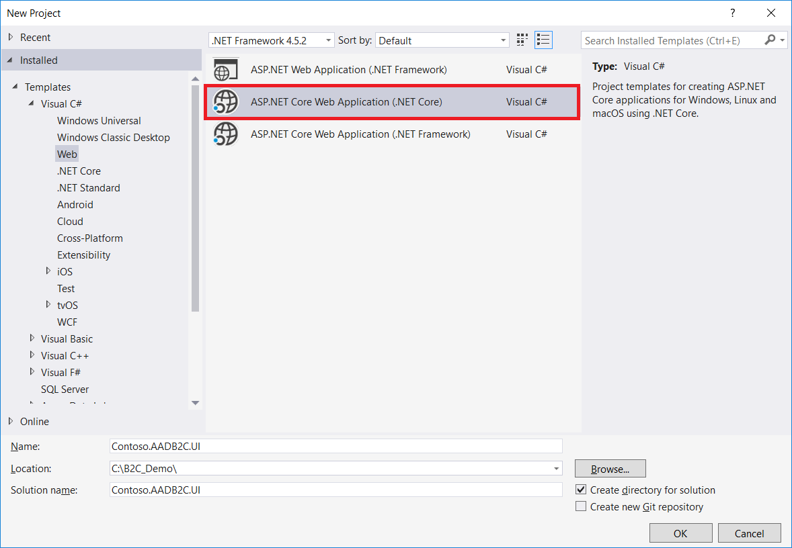

4.  Select **Web Application** template
5.  Make sure authentication is set to **No Authentication**

    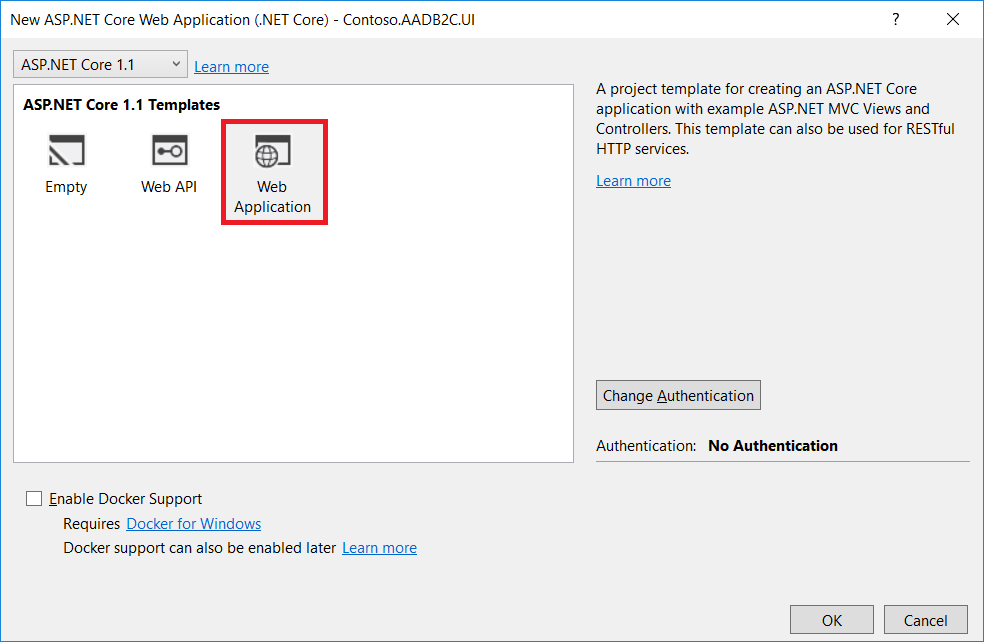

6.  Click **OK** to create the project

## Step 2: Create MVC view
### Step 2.1 Download B2C built in HTML5 template
Your custom HTML5 templated is based on B2C built in HTML5 template. You can download the [unified.html](https://login.microsoftonline.com/static/tenant/default/unified.cshtml), or download from [starter pack](https://github.com/AzureADQuickStarts/B2C-AzureBlobStorage-Client/tree/master/sample_templates/wingtip). You use this HTML5 file for a unified sign-up or sign-in page.

### Step 2.2 Add MVC view
1. Right click on the Views/Home folder, and then **Add > New Item**.
 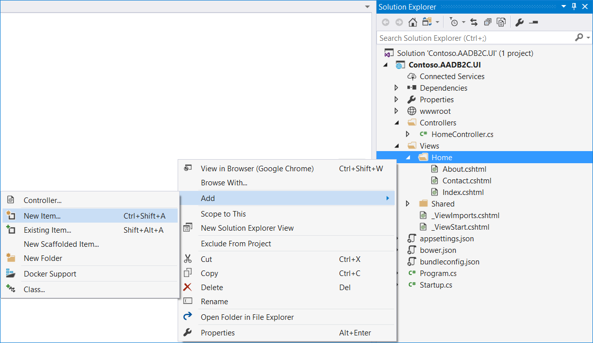
2. In the **Add New Item - Contoso.AADB2C.UI** dialog, select **Web > ASP>NET**
3. Tap **MVC View Page**
4. In the **Name** box, change the name to _unified.cshtml_.
5. Click **Add**
 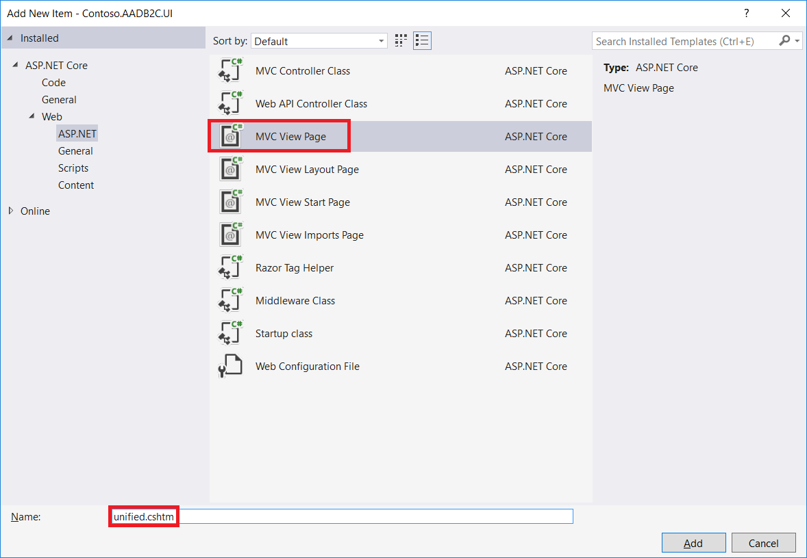
6.  If this file is not open already, double-click the file to open it. Clear the content of your _unified.cshtml_.
7. For demo purpose, we remove the reference to layout-page. Add following code snippet to _unified.cshtml_

    ```C#
    @{
        Layout = null;
    }
    ```

8. Open the _unified.cshtml_ file you downloaded from AAD B2C built in HTML5 template.
9. Find the `@` signs, and replace with `@@`
10. Copy the content of the file and past it below the Layout definition. Your code should look like:
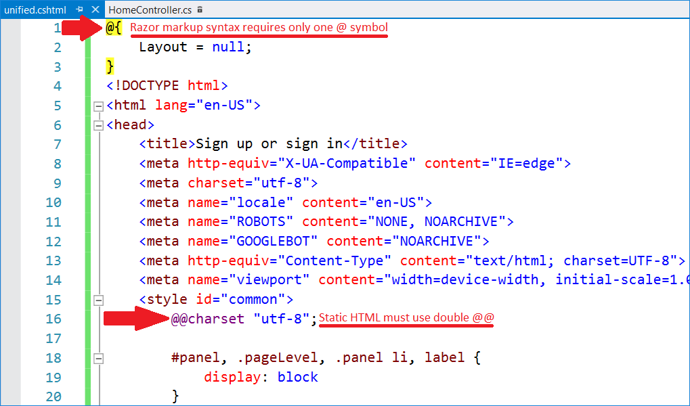
## Step 2.3 change the background image
10. Locate the `` element with ID `background_background_image` and replace the `src` to _https://kbdevstorage1.blob.core.windows.net/asset-blobs/19889_en_1_, or any other background image you like.
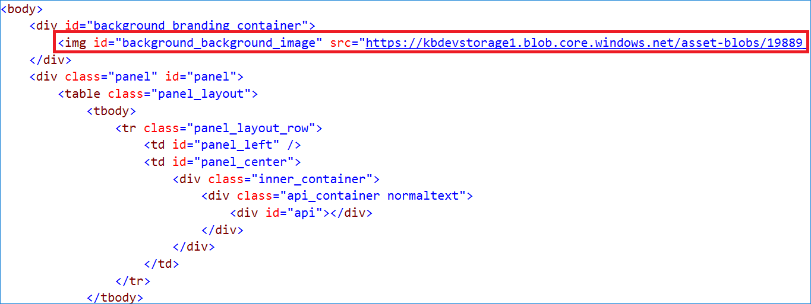
## Step 2.4 add you view to MVC controller
Open **Controllers\HomeController.cs** and add following method. 
```C
public IActionResult unified()
{
    return View();
}
```
This code specified that the method should use a view template file to render a response to the browser. Because we don't explicitly specify the name of the view template file, MVC defaulted to using the _unified.cshtml_ view file in the /Views/Home folder.

After adding the _unified_ method, your code should look like:
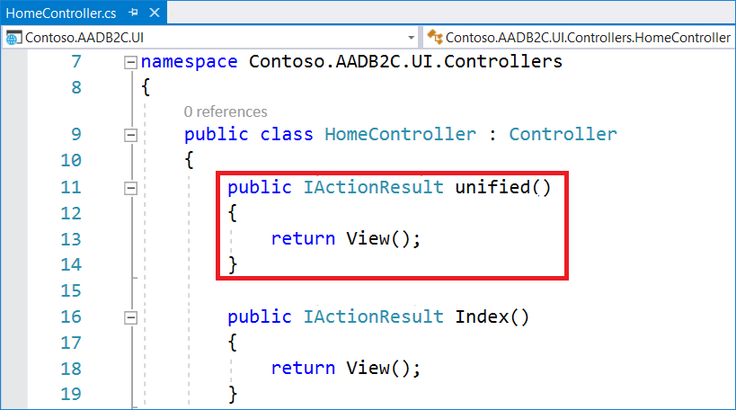

Debug your web app, and make sure _unified_ page is accessible. For example, `http://localhost:<Port number>/Home/unified`

## Step 2.5 Publish to Azure
1.  In the **Solution Explorer**, right-click the **Contoso.AADB2C.UI** project and select **Publish**.

    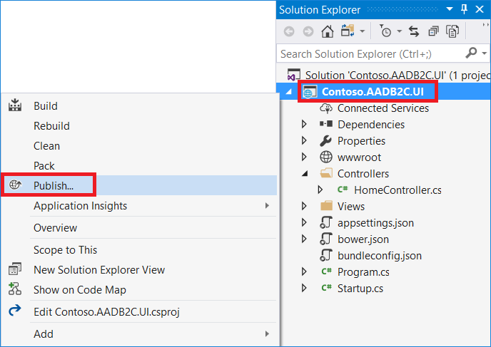

2.  Make sure that **Microsoft Azure App Service** is selected and select **Publish**.

    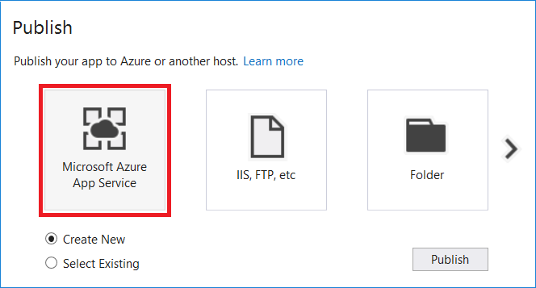

    The **Create App Service** dialog, helps you create all the necessary Azure resources to run the ASP.NET web app in Azure.

> [!NOTE]
>
>For more information how to publish, see: [Create an ASP.NET web app in Azure](https://docs.microsoft.com/en-us/azure/app-service-web/app-service-web-get-started-dotnet#publish-to-azure)

3.  In **Web App Name**, type a unique app name (valid characters are `a-z`, `0-9`, and `-`). The URL of the web app is `http://<app_name>.azurewebsites.NET`, where `<app_name>` is your web app name. You can accept the automatically generated name, which is unique.

    Select **Create** to start creating the Azure resources.

    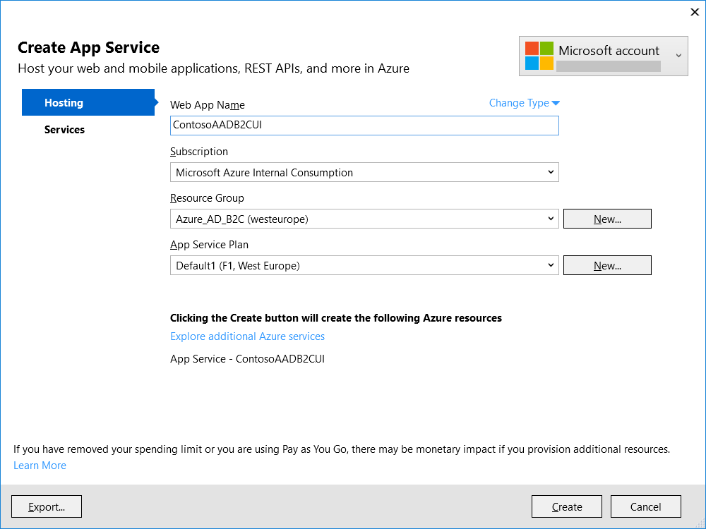

4.  Once the wizard completes, it publishes the ASP.NET web app to Azure, and then launches the app in the default browser, copy the URL of the _unified_ page. for example, _https://<app_name>.azurewebsites.net/home/unified_

## Step 3: Configure CORS in Azure App Service
1. In a browser, navigate to the [Azure portal](https://portal.azure.com/)

2. Click **App Services**, and then click the name of your API app.

    

3. In the **Settings** section, scroll down and find the **API** section, and then click **CORS**.

    

4. In the text box, enter the URL or URLs that you want to allow JavaScript calls to come from.
Or enter an asterisk (*) to specify that all origin domains are accepted.

5. Click **Save**.

    

After you click Save, the API app will accept JavaScript calls from the specified URLs. 

## Step 4: HTML5 template validation
You HTML5 templated is ready to use.  However, it is not available in any of the `ContentDefinition`. Before we add the `ContentDefinition` to your custom policy, you must:
* Ensure your content is HTML5 compliant and accessible
* Ensure your content server is enabled for CORS.

>[!NOTE]
>
>To verify that the site you are hosting your content on has CORS enabled and test CORS requests, you can use the site http://test-cors.org/. 

* Served content is secure over **HTTPS**.
* Use **absolute URLS** such as https://yourdomain/content for all links and CSS content and images.

## Step 5: Configure your content definition
To configure the `ContentDefinition`
1.  Open the base file of your policy (for example, TrustFrameworkBase.xml).
2.  Find the `<ContentDefinitions>` element and copy the entire content of `<ContentDefinitions>` node.
3.  Open the extension file (for example, TrustFrameworkExtensions.xml) and find the `<BuildingBlocks>` element. If the element doesn't exist, add one.
4.  Paste the entire content of `<ContentDefinitions>` node that you copied as a child of the `<BuildingBlocks>` element. 
5.  Find the `<ContentDefinition>` node that includes `Id="api.signuporsignin"` in the XML that you copied.
6.  Change the value of `LoadUri` from _~/tenant/default/unified_ to _https://app_name.azurewebsites.net/home/unified_
Your custom policy should look like:


## Step 6: Upload the policy to your tenant
1.  In the [Azure portal](https://portal.azure.com), switch into the [context of your Azure AD B2C tenant](active-directory-b2c-navigate-to-b2c-context.md), and open the **Azure AD B2C**
2.  Select **Identity Experience Framework**.
3.  Open the **All Policies**.
4.  Select **Upload Policy**.
5.  Check **Overwrite the policy if it exists** box.
6.  **Upload** TrustFrameworkExtensions.xml and ensure that it does not fail the validation

## Step 7: Test the custom policy by using Run Now
1.  Open **Azure AD B2C Settings** and go to **Identity Experience Framework**.

    >[!NOTE]
    >
    >    **Run now** requires at least one application to be preregistered on the tenant. 
    >    To learn how to register applications, see the Azure AD B2C [Get started](active-directory-b2c-get-started.md) article or the [Application registration](active-directory-b2c-app-registration.md) article.
    >

2.  Open **B2C_1A_signup_signin**, the relying party (RP) custom policy that you uploaded. Select **Run now**.
3.  You should be able to see your custom HTML5 with the background you created earlier


## Step 8: Adding dynamic content
In this section, we change the background based on query string parameter named _campaignId_. Your relying party application (web/mobile apps) sends the parameter to AAD B2C. Your policy reads the parameter and sends its value to your HTML5 template 


### Step 8.1 Adding content definition parameter

To add the `ContentDefinitionParameters` element:
1.  Open the SignUpOrSignin file of your policy (for example, SignUpOrSignin.xml).
2.  Find the `<UserJourneyBehaviors>` node 
4.  Add following XML snippet inside the `<UserJourneyBehaviors>` 

    ```XML
    <ContentDefinitionParameters>
        <Parameter Name="campaignId">{OAUTH-KV:campaignId}</Parameter>
    </ContentDefinitionParameters>
    ```

### Step 8.2 Change your code to accept query string parameter and replace the background image accordingly
In this section, we modify the HomeController _unified_ method to accept campaignId parameter. Then the method checks its value and sets the `ViewData["background"]` variable accordingly.

1. Open **Controllers\HomeController.cs** and change the `unified` method with following code snippet:

    ```C#
    public IActionResult unified(string campaignId)
    {
        // If campaign ID is Hawaii, show Hawaii background
        if (campaignId != null && campaignId.ToLower() == "hawaii")
        {
            ViewData["background"] = "https://kbdevstorage1.blob.core.windows.net/asset-blobs/19889_en_1";
        }
        // If campaign ID is Tokyo, show Tokyo background
        else if (campaignId != null && campaignId.ToLower() == "tokyo")
        {
            ViewData["background"] = "https://kbdevstorage1.blob.core.windows.net/asset-blobs/19666_en_1";
        }
        // Default background
        else
        {
            ViewData["background"] = "https://kbdevstorage1.blob.core.windows.net/asset-blobs/18983_en_1";
        }

        return View();
    }

    ```

2. Locate the `` element with ID `background_background_image` and replace the `src` to `@ViewData["background"]`.

    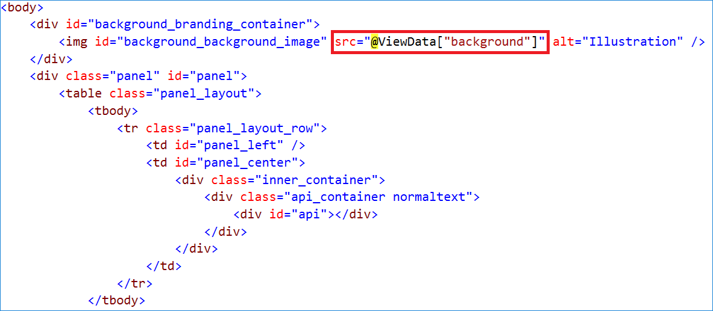

### 8.3 Upload the changes and publish your policy
1. Publish your Visual studio project to Azure Service app
2. Upload the SignUpOrSignin.xml policy to AAD B2C
3.  Open **B2C_1A_signup_signin**, the relying party (RP) custom policy that you uploaded. Select **Run now**. You should see the same background image as before.
4. Copy the URL from the browser's address bar
5. Add _campaignId_ query string parameter to the URI. For example, add `&campaignId=hawaii`, as shown in following picture

6. Press **Enter** and your page presents the Hawaii background
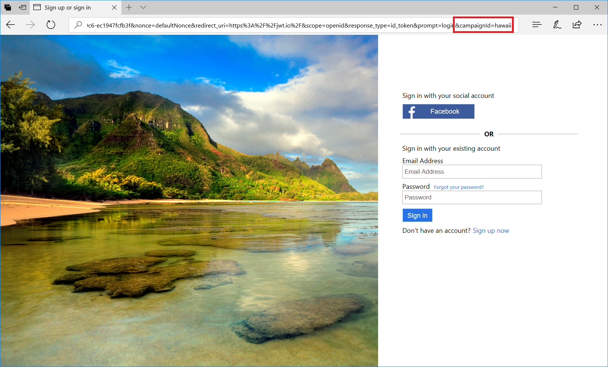
7. Now, change the value to *Tokyo*  and press **Enter**. The page presents the Tokyo background


## Step 9: Change the rest of the user journey
If you navigate to sign in page, and click on **Sign-up now** link, you see the default background, not the one you defined. This behavior is because you only changed the sign-up or sign-in page, however you need to change also the rest of the  Self-Assert content definitions. To do so, go through steps:
* In Step #2:
    * Download the **selfasserted** file.
    * Copy the file content.
    * Create new view **selfasserted**.
    * Add **selfasserted** to **Home** controller.
* In step #4 
    * In your extension policy, find the `<ContentDefinition>` node that includes `Id="api.selfasserted"`, `Id="api.localaccountsignup"`, and `Id="api.localaccountpasswordreset"`
    *  Set the `LoadUri` attribute to your selfasserted Uri.
* In step #8.2 Change your code to accept query string parameters 
* Upload the TrustFrameworkExtensions.xml policy, and ensure that it does not fail the validation.
* Run the policy test and click on **Sign-up now** to see the result

## [Optional] Download the complete policy files and code
* We recommend you build your scenario using your own Custom policy files after completing the Getting Started with Custom Policies walk through instead of using these sample files.  [Sample policy files for reference](https://github.com/Azure-Samples/active-directory-b2c-custom-policy-starterpack/tree/master/scenarios/aadb2c-ief-ui-customization)
* You can download the complete code  here [Sample visual studio solution for reference](https://github.com/Azure-Samples/active-directory-b2c-custom-policy-starterpack/tree/master/scenarios/aadb2c-ief-ui-customization)


