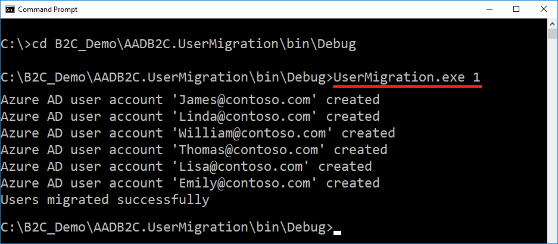
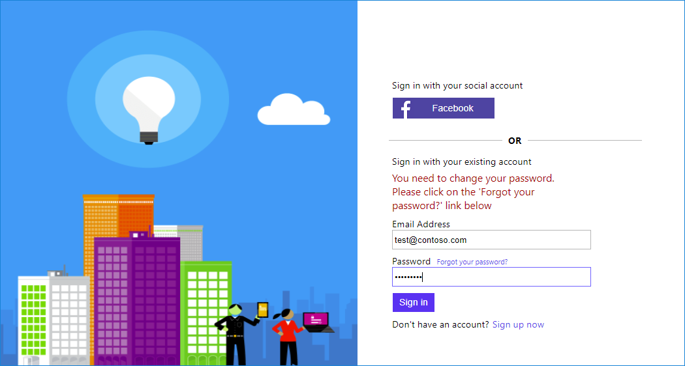
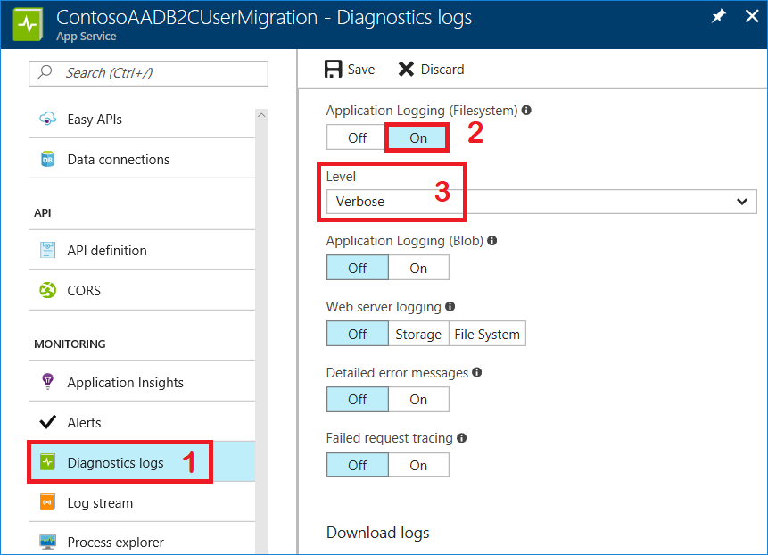

---
title: 'Azure Active Directory B2C: User migration approaches'
description: Discuss core and advanced concepts on user migration using Graph API and optionally using Azure AD B2C custom policies.
services: active-directory-b2c
documentationcenter: ''
author: yoelhor
manager: joroja
editor: 

ms.assetid:
ms.service: active-directory-b2c
ms.workload: identity
ms.tgt_pltfrm: na
ms.topic: article
ms.devlang: na
ms.date: 10/04/2017
ms.author: yoelh
---

# Azure Active Directory B2C: User migration
When you plan to migrate your identity provider to Azure AD B2C, you may also need to migrate the users account as well. This article explains how to migrate existing user accounts, from any identity provider to Azure AD B2C. This article is not meant to be prescriptive, but rather describes two of several different approaches.  The developer is responsible for suitability.

## User migration flows
Azure AD B2C allows you to migrate users through [Graph API](https://docs.microsoft.com/en-us/azure/active-directory-b2c/active-directory-b2c-devquickstarts-graph-dotnet). User migration process falls into two flows:

* **Pre-migration** - This flow fits when you have access to user credentials (user name and password) in a clear text. Or the credentials are encrypted, but you are able to decrypt them. The process involves: reading the users from old identity provider and create new accounts in Azure AD B2C directory.

* **Pre-migration and password reset** - This flow fits when the user's password is not accessible. For example:
    * Passwords are stored in HASH format
    * Passwords are stored in an identity provider, which you don't have access. Your old identity provider validates user credential by calling a web service

In both flows, you first you run the __pre-migration__ process, read the users from your old identity provider, create new accounts in Azure AD B2C directory. If you do not have the password, you create the account with random password you generate. You ask the users to change their password. Or when user sign in for the first time, B2C asks the user to reset the password.

## Password policy
The Azure AD B2C password policy 
(for local accounts) is based on Azure AD policy. Azure AD B2C's sign-up or sign-in and password reset policies uses the "strong" password strength and doesn't expire any passwords. Read the [Azure AD password policy](https://msdn.microsoft.com/library/azure/jj943764.aspx) for more details.

If the accounts that you want to migrate uses lower password strength than the [strong password strength enforced by Azure AD B2C](https://msdn.microsoft.com/library/azure/jj943764.aspx), you can disable the strong password requirement. To change the default password policy, set the `passwordPolicies` property to `DisableStrongPassword`. For instance, you can modify the create user request as follows: 

```JSON
"passwordPolicies": "DisablePasswordExpiration, DisableStrongPassword"
```

## Step 1. Using Graph API to migrate users
You create the Azure AD B2C user account via Graph API (with the password or with random password). This section describes the process how to create user accounts in Azure AD B2C directory, using Graph API.

### Step 1.1 Register your application in your tenant
To communicate with the Graph API, you first need to have service account with administrative privileges. In Azure AD, you register an application and authenticating to Azure AD. The application credentials are: **Application ID** and **Application Secret**. The application acts as itself, not as a user, to call the Graph API.

First, register your migration application in Azure AD. Then, create application key (Application secret) and set the application with right privileges.

1. Sign in to the [Azure portal](https://portal.azure.com/).
2. Choose your Azure AD **B2C** tenant, by selecting your account in the top right corner of the page.
3. From left panel, click on **Azure Active Directory** (not the Azure AD B2C). You might need to select **More Services** to find it.
4. Select **App registrations**.
5. Click on **New application registration**.

    
6. Follow the prompts and create a new application
    * For **Name**, use **B2CUserMigratioin**, or any other name you like.
    * For **Application type**, use **Web app/API**.
    * For **Sign-on URL**, use https://localhost (as it's not relevant for this application).
    * Click **Create**.
7. Once the application is created, from the list of applications, select the newly created application **B2CUserMigratioin**.
Select **Properties**, copy the **Application ID**, and save it for later.

### Step 1.2 Create application secret
8. Continuing in the Azure portal's Registered App. Click on **Keys** and add a new key (also known as client secret). Also, copy the key for later.

    

### Step 1.3 Grant administrative permission to your application
9. Continuing in the Azure portal's **Registered App**
10. Click on **Required permissions**.
11. Click on **Windows Azure Active Directory**.
12. In the **Enable Access**, under **Application Permissions**, select the **Read and write directory data permission** and click **Save**.
13. Finally, back in the **Required permissions**, click on the **Grant Permissions** button.

    

Now you have an application that has permission to create, read, and update users from your B2C tenant.

### Step 1.4 [Optional] Environment cleanup
Read and write directory data permission does NOT include the ability to delete users. If you want to give your application the ability to delete users (to clean up your environment), you need to do extra step. The step involves running PowerShell to set __User Account Administrator__ permissions, otherwise, you can skip to the next section.


> [!IMPORTANT]
> You need to use a B2C tenant administrator account that is **local** to the B2C tenant. These accounts look like: admin@contosob2c.onmicrosoft.com.

>[!NOTE]
> Following PowerShell script requires [Azure Active Directory PowerShell **Version 2**](https://docs.microsoft.com/en-us/powershell/azure/active-directory/install-adv2?view=azureadps-2.0).

In the following PowerShell script:
* Connect to your online service. To do so, run the cmdlet `Connect-AzureAD` at the Windows PowerShell command prompt and provide your credentials. 
* Use the **Application ID** to assign the application the user account administrator role. These roles have well-known identifiers, so all you need to do is input your **Application ID** in the script.

```PowerShell
Connect-AzureAD

$AppId = "<Your application ID>"

# Fetch Azure AD application to assign to role
$roleMember = Get-AzureADServicePrincipal -Filter "AppId eq '$AppId'"

# Fetch User Account Administrator role instance
$role = Get-AzureADDirectoryRole | Where-Object {$_.displayName -eq 'User Account Administrator'}

# If role instance does not exist, instantiate it based on the role template
if ($role -eq $null) {
    # Instantiate an instance of the role template
    $roleTemplate = Get-AzureADDirectoryRoleTemplate | Where-Object {$_.displayName -eq 'User Account Administrator'}
    Enable-AzureADDirectoryRole -RoleTemplateId $roleTemplate.ObjectId

    # Fetch User Account Administrator role instance again
    $role = Get-AzureADDirectoryRole | Where-Object {$_.displayName -eq 'User Account Administrator'}
}

# Add application to role
Add-AzureADDirectoryRoleMember -ObjectId $role.ObjectId -RefObjectId $roleMember.ObjectId

# Fetch role membership for role to confirm
Get-AzureADDirectoryRoleMember -ObjectId $role.ObjectId
```

Change the `$AppId` value with your Azure AD **Application ID**

## Step 2. Pre-migration application sample
Download the sample code and get it running. You can [download the sample code as a .zip](http://www.github.com) file.

### Step 2.1 Edit the migration data file
The sample app use JSON file that contains dummy users data. After you successfully run the sample, change the code to consume the data from your own database. Or export the users profile to a JSON file, and set the app to use that file.
To edit the JSON file, open the `AADB2C.UserMigration.sln` Visual Studio solution. In the `AADB2C.UserMigration` project, open the  `UsersData.json` file.


As you can see, the file contains list of user entities. Each user entity has:
* email
* displayName
* firstName
* lastName
* password (can be empty)

> [!NOTE]
> On compile time, Visual Studio copies the file to `bin` directory.

### Step 2.2 Configure the application settings
Under `AADB2C.UserMigration` project, open the  App.config file. Replace the following app settings with your own values:

```XML
<appSettings>
    <add key="b2c:Tenant" value="{Your Tenant Name}" />
    <add key="b2c:ClientId" value="{The ApplicationID from above}" />
    <add key="b2c:ClientSecret" value="{The Key from above}" />
    <add key="MigrationFile" value="{Name of a JSON file containing the users data e.g. UsersData.json}" />
    <add key="BlobStorageConnectionString" value="{Your connection Azure Table string}" />
    
</appSettings>
```

> [!NOTE]
> * The use of Azure Table connection string is described later in the next sections
> * Your B2C tenant's name is the domain that you entered during tenant creation, and is displayed in the Azure portal. It usually ends with the suffix `.onmicrosoft.com`, for instance, `contosob2c.onmicrosoft.com`.
>

### Step 2.3 Run the pre-migration process
Right-click on the `AADB2C.UserMigration` solution and rebuild the sample. If you are successful, you should now have a `UserMigration.exe` executable file located in `AADB2C.UserMigration\bin\Debug`. To run the migration process, use one of the following command-line parameters:

* To **migrate users with password**, use `UserMigration.exe 1` command.

* To **migrate users with random password**, use `UserMigration.exe 2` command. This operation also creates Azure Table entity. Later you configure the policy to call REST API service. The service uses Azure Table to track and manage the migration process.



### Step 2.4 Check the pre-migration process
To check the result, from Azure portal, open **Azure AD B2C**, and click on **Users and Groups**. In the search box, type the one of the users' display name, and see the user profile. Alternatively you can use this sample application to retrieve user by **sign-in email address**. To search a user by sign-in email address, run follwing command

```Console
UserMigration.exe 3 {email address}
```

You can also save the output to JSON file, as follows:
```Console
UserMigration.exe 3 {email address} >> UserProfile.json
```


Open the UserProfile.json file with your desire JSON editor. With Visual Studio Code, you can format JSON document using `Shift+Alt+F` or Format Document from the context menu.


You can also retrieve user by **display name**, by using `UserMigration.exe 4 <Display name>` command

### Step 2.5 [Optional] Environment cleanup
If you want to clean up your Azure AD tenant and remove the users from Azure AD directory, run `UserMigration.exe 5` command

> [!NOTE]
> * To cleanup your tenant, configure __User Account Administrator__ permissions for your application
> * The sample migration app, cleans up all users listed in the JSON file

### Step 2.6 Sing in with migrated users (with password)
After you run the pre-migration process with users' password, the accounts are ready to use, and users able to sign in to your application, using Azure AD B2C. If you don't have access to users' password, continue to the next section.

## Step 3. Password reset
In case you migrate users with random password, users need to reset their password. To reset the password:
* Send a welcome email with link to reset password
* [Optional] Change your policy to handle the case when user doesn't reset the password and try to sign in. On sign-in, your policy checks the migration status. If user did not change the password, throw friendly error message, asking the user to click on "Forgot your password?"

    > [!NOTE]
    > To check and change the user migration status, you must use custom policy. Complete the steps in the [Getting started with custom policies](active-directory-b2c-get-started-custom.md) article.
    >

### Step 3.1 Send a welcome email with link to reset password
To get the link to your password reset policy:

1.  Open **Azure AD B2C Settings** and go to open your **Reset password** policy properties.

2. Select your application
    >[!NOTE]
    >
    >**Run now** requires at least one application to be preregistered on the tenant. To learn how to register applications, see the Azure AD B2C [Get started](active-directory-b2c-get-started.md) article or the [Application registration](active-directory-b2c-app-registration.md) article.  

2.  Select **Run now** and check the policy
3.  **Copy** the url and send it to your users

    

## Step 4. [Optional] Change your policy to check and set user migration status

When users try to sign-in without resetting the password first, your policy should return friendly error message. For example: Your password expired, to reset your password, click on reset password link.  This optional step requires the use of Azure AD B2C using custom policies as described in the [Getting started with custom policies](active-directory-b2c-get-started-custom.md) article.

In this section, you change the policy to check the migration status on sign-in. If user didn't change the password, return HTTP 409 error message, asking the user to click on "Forgot your password?" link. To track the password change, you use Azure Table. Running the pre-migration process with command-line parameter `2`, creates user entity in Azure Table. Your service:

* On sign-in, Azure AD B2C policy invokes your migration Restful service, sending email as input claim. The service search the email address in the Azure Table. If  exists, throw "You must change password" error message.

* On password reset, after user successfully changes the password, remove the entity from Azure Table.


> [!NOTE]
>We use Azure Table to simplify the sample. You can store the migration status in any database or as a custom property in Azure AD B2C account.

### 4.1 Application Settings
To test the demo Restful API. Open the `AADB2C.UserMigration.sln` Visual Studio solution in Visual Studio. In the `AADB2C.UserMigration.API` project, open the file App.config. Replace the three app settings with your own values:

```XML
<appSettings>
    <add key="BlobStorageConnectionString" value="{The Azure Blob storage connection string"} />
</appSettings>
```

### Step 4.2 Deploy your web application to Azure App Services
Publish your API service to Azure App Services. For more information, see: [Deploy your app to Azure App Service](https://docs.microsoft.com/en-us/azure/app-service-web/web-sites-deploy)

### Step 4.3 Add technical profile and technical profile validation to your policy 
1.  Open the extension policy file (TrustFrameworkExtensions.xml) from your working directory. 
2. Find the `<ClaimsProviders>` section
3. Add following XML snippet under the `ClaimsProviders` element
4. Change the value of `ServiceUrl` to point to your endpoint URL 
```XML
<ClaimsProvider>
    <DisplayName>REST APIs</DisplayName>
    <TechnicalProfiles>

    <TechnicalProfile Id="LocalAccountSignIn">
        <DisplayName>Local account just in time migration</DisplayName>
        <Protocol Name="Proprietary" Handler="Web.TPEngine.Providers.RestfulProvider, Web.TPEngine, Version=1.0.0.0, Culture=neutral, PublicKeyToken=null" />
        <Metadata>
        <Item Key="ServiceUrl">http://{your-app}.azurewebsites.net/api/PrePasswordReset/LoalAccountSignIn</Item>
        <Item Key="AuthenticationType">None</Item>
        <Item Key="SendClaimsIn">Body</Item>
        </Metadata>
        <InputClaims>
        <InputClaim ClaimTypeReferenceId="signInName" PartnerClaimType="email" />
        </InputClaims>
        <UseTechnicalProfileForSessionManagement ReferenceId="SM-Noop" />
    </TechnicalProfile>

    <TechnicalProfile Id="LocalAccountPasswordReset">
        <DisplayName>Local account just in time migration</DisplayName>
        <Protocol Name="Proprietary" Handler="Web.TPEngine.Providers.RestfulProvider, Web.TPEngine, Version=1.0.0.0, Culture=neutral, PublicKeyToken=null" />
        <Metadata>
        <Item Key="ServiceUrl">http://{your-app}.azurewebsites.net/api/PrePasswordReset/PasswordUpdated</Item>
        <Item Key="AuthenticationType">None</Item>
        <Item Key="SendClaimsIn">Body</Item>
        </Metadata>
        <InputClaims>
        <InputClaim ClaimTypeReferenceId="email" PartnerClaimType="email" />
        </InputClaims>
        <UseTechnicalProfileForSessionManagement ReferenceId="SM-Noop" />
    </TechnicalProfile>
    </TechnicalProfiles>
</ClaimsProvider>

<ClaimsProvider>
    <DisplayName>Local Account</DisplayName>
    <TechnicalProfiles>

    <!-- This technical profile uses a validation technical profile to authenticate the user. -->
    <TechnicalProfile Id="SelfAsserted-LocalAccountSignin-Email">
        <ValidationTechnicalProfiles>
        <ValidationTechnicalProfile ReferenceId="LocalAccountSignIn" />
        </ValidationTechnicalProfiles>
    </TechnicalProfile>

    <TechnicalProfile Id="LocalAccountWritePasswordUsingObjectId">
        <ValidationTechnicalProfiles>
        <ValidationTechnicalProfile ReferenceId="LocalAccountPasswordReset" />
        </ValidationTechnicalProfiles>
    </TechnicalProfile>

    </TechnicalProfiles>
</ClaimsProvider>
```
The technical profile defines one input claim: `signInName` (send as email). On sign-in, the claim sends to your Restful endpoint.

After you define the technical profile for your Restful API, tell your Azure AD B2C policy to call that technical profile. The XML snippet overrides the `SelfAsserted-LocalAccountSignin-Email`, which is defined in the base policy. The XML snippet also adds `ValidationTechnicalProfile` with ReferenceId pointing to your technical profile `LocalAccountUserMigration`. 

### Step 4.4 Upload the policy to your tenant
1.  In the [Azure portal](https://portal.azure.com), switch into the [context of your Azure AD B2C tenant](active-directory-b2c-navigate-to-b2c-context), and click on  **Azure AD B2C**.
2.  Select **Identity Experience Framework**.
3.  Click on **All Policies**.
4.  Select **Upload Policy**
5.  Check **Overwrite the policy if it exists** box.
6.  **Upload** TrustFrameworkExtensions.xml and ensure that it does not fail the validation
7.  Repeat last step and upload the SignUpOrSignIn.xml

### Step 4.5 Test the custom policy by using Run Now
1.  Open **Azure AD B2C Settings** and go to **Identity Experience Framework**.
2.  Open **B2C_1A_signup_signin**, the relying party (RP) custom policy that you uploaded. Select **Run now**.
3. Try to sign-in with one of the migrated users and click on **sign-in**. You should see following error message coming from your Rest API.

    

### Step 4.6 [Optional] Troubleshooting your REST API
You can monitor and see logging information in near-real time.

1. From your Restful application's settings menu, scroll down to the  **Monitoring** section and click on **Diagnostic Logs**. 
2. Enable Application Logging (Filesystem) 
3. Seth the **Level** to **Verbose** level
4. Click **Save**

    

5. From the settings menu, click on **Log stream**
6. Check the output of the Restful API.

For more information, see: [Streaming Logs and the Console](https://docs.microsoft.com/en-us/azure/app-service-web/web-sites-streaming-logs-and-console)

> [!IMPORTANT]
> You can use __diagnostics logs__ only in NONE production environment. The Restful API output contains confidential information, NEVER print out user any private data!
>

## Download the complete policy files
Optional: We recommend you build your scenario using your own Custom policy files after completing the Getting Started with Custom Policies walk through instead of using these sample files.  [Sample policy files for reference](https://github.com/Azure-Samples/active-directory-b2c-custom-policy-starterpack/tree/master/scenarios/aad-b2c-migration-custom)