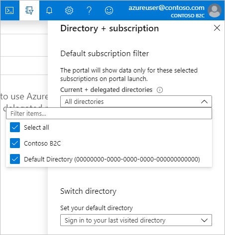
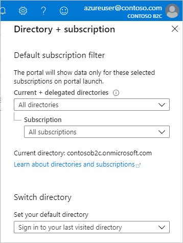
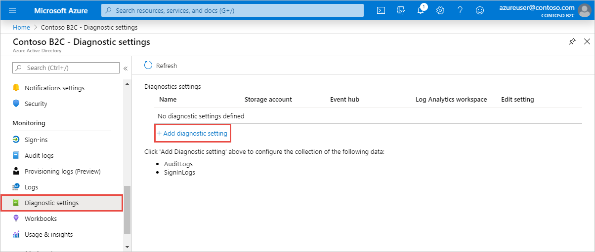

# Monitor Azure AD B2C with Azure Monitor

Use Azure Monitor to route Azure Active Directory B2C (Azure AD B2C) usage activity events to different monitoring solutions. You can retain the logs for long-term use or integrate with third-party security information and event management (SIEM) tools to gain insights into your environment.

For example, you can route logs to:

- An Azure storage account.
- An Azure event hub (and integrate with your Splunk and Sumo Logic instances).
- An Azure Log Analytics workspace (to analyze data, create dashboards, and alert on specific events).


## Prerequisites

To complete the steps in this article, you deploy an Azure Resource Manager template by using the Azure PowerShell module.

* [Azure PowerShell module](https://docs.microsoft.com/powershell/azure/install-az-ps) version 6.13.1 or higher

You can also use the [Azure Cloud Shell](https://shell.azure.com), which includes the latest version of the Azure PowerShell module.

## Delegated resource management

Azure AD B2C leverages [Azure Active Directory monitoring](../active-directory/reports-monitoring/overview-monitoring.md). To enable *Diagnostic settings* in Azure Active Directory within your Azure AD B2C tenant, you use [delegated resource management](../lighthouse/concepts/azure-delegated-resource-management.md).

You authorize a user in your Azure AD B2C directory (the **Service Provider**) to configure the Azure Monitor instance within the tenant that contains your Azure subscription (the **Customer**). To create the authorization, you deploy an [Azure Resource Manager](../azure-resource-manager/index.yml) template to your Azure AD tenant containing the subscription. The following sections walk you through the process.

## Create a resource group

In the Azure Active Directory (Azure AD) tenant that contains your Azure subscription (*not* the directory that contains your Azure AD B2C tenant), [create a resource group](../azure-resource-manager/management/manage-resource-groups-portal.md#create-resource-groups). Use the following values:

- **Subscription**: Select your Azure subscription.
- **Resource group**: Enter name for the resource group. For example, *azure-ad-b2c-monitor*.
- **Region**: Select an Azure location. For example, *Central US*.

## Delegate resource management

Next, gather the following information:

**Directory ID** of your Azure AD B2C directory (also known as the tenant ID).

1. Sign in to the [Azure portal](https://portal.azure.com/) as a user with the *User administrator* role (or higher).
1. Select the **Directory + Subscription** icon in the portal toolbar, and then select the directory that contains your Azure AD B2C tenant.
1. Select **Azure Active Directory**, select **Properties**.
1. Record the **Directory ID**.

**Object ID** of the Azure AD B2C user you want to give contributor permission to the resource group you created earlier in the directory containing your subscription.

1. With **Azure Active Directory** still selected in the Azure portal, select **Users**, and then select a user.
1. Record the user's **Object ID**.

### Create an Azure Resource Manager template

To onboard your Azure AD tenant (the **Customer**), create an [Azure Resource Manager template](../lighthouse/how-to/onboard-customer.md) for your offer with the following information. The `mspOfferName` and `mspOfferDescription` values are visible when you view offer details in the [Service providers page](../lighthouse/how-to/view-manage-service-providers.md) of the Azure portal.

| Field   | Definition |
|---------|------------|
| `mspOfferName`                     | A name describing this definition. For example, *Azure AD B2C Managed Services*. This value is displayed to the customer as the title of the offer. |
| `mspOfferDescription`              | A brief description of your offer. For example, *Enables Azure Monitor in Azure AD B2C*.|
| `rgName`                           | The name of the resource group you create earlier in your Azure AD tenant. For example, *azure-ad-b2c-monitor*. |
| `managedByTenantId`                | The **Directory ID** of your Azure AD B2C tenant (also known as the tenant ID). |
| `authorizations.value.principalId` | The **Object ID** of the B2C user you recorded earlier that will have access to resources in this Azure subscription. |

Download the Azure Resource Manager template and parameter files:

- [rgDelegatedResourceManagement.json](https://raw.githubusercontent.com/Azure/Azure-Lighthouse-samples/master/Azure-Delegated-Resource-Management/templates/rg-delegated-resource-management/rgDelegatedResourceManagement.json)
- [rgDelegatedResourceManagement.parameters.json](https://raw.githubusercontent.com/Azure/Azure-Lighthouse-samples/master/Azure-Delegated-Resource-Management/templates/rg-delegated-resource-management/rgDelegatedResourceManagement.parameters.json)

Next, update the parameters file with the values you recorded earlier. The following JSON snippet shows an example of an Azure Resource Manager template parameters file. For `authorizations.value.roleDefinitionId`, use the [built-in role](../role-based-access-control/built-in-roles.md) value for the *Contributor role*, `b24988ac-6180-42a0-ab88-20f7382dd24c`.

```JSON
{
    "$schema": "https://schema.management.azure.com/schemas/2015-01-01/deploymentParameters.json#",
    "contentVersion": "1.0.0.0",
    "parameters": {
        "mspOfferName": {
            "value": "Azure AD B2C Managed Services"
        },
        "mspOfferDescription": {
            "value": "Enables Azure Monitor in Azure AD B2C"
        },
        "rgName": {
            "value": "azure-ad-b2c-monitor"
        },
        "managedByTenantId": {
            "value": "<Replace with DIRECTORY ID of Azure AD B2C tenant (tenant ID)>"
        },
        "authorizations": {
            "value": [
                {
                    "principalId": "<Replace with user's OBJECT ID>",
                    "principalIdDisplayName": "Azure AD B2C tenant administrator",
                    "roleDefinitionId": "b24988ac-6180-42a0-ab88-20f7382dd24c"
                }
            ]
        }
    }
}
```

### Deploy the Azure Resource Manager templates

Once you've updated your parameters file, deploy the Azure Resource Manager template into the Azure tenant as a subscription-level deployment. Because this is a subscription-level deployment, it cannot be initiated in the Azure portal. You can deploy by using the Azure PowerShell module or the Azure CLI. The Azure PowerShell method is shown below.

Sign in to the directory containing your subscription by using [Connect-AzAccount](/powershell/azure/authenticate-azureps). Use the `-tenant` flag to force authentication to the correct directory.

```PowerShell
Connect-AzAccount -tenant contoso.onmicrosoft.com
```

Use the [Get-AzSubscription](/powershell/module/az.accounts/get-azsubscription) cmdlet to list the subscriptions that the current account can access under the Azure AD tenant. Record the ID of the subscription you want to project into your Azure AD B2C tenant.

```PowerShell
Get-AzSubscription
```

Next, switch to the subscription you want to project into the Azure AD B2C tenant:

``` PowerShell
Select-AzSubscription <subscription ID>
```

Finally, deploy the Azure Resource Manager template and parameter files you downloaded and updated earlier. Replace the `Location`, `TemplateFile`, and `TemplateParameterFile` values accordingly.

```PowerShell
New-AzDeployment -Name "AzureADB2C" `
                 -Location "centralus" `
                 -TemplateFile "C:\Users\azureuser\Documents\rgDelegatedResourceManagement.json" `
                 -TemplateParameterFile "C:\Users\azureuser\Documents\rgDelegatedResourceManagement.parameters.json" `
                 -Verbose
```

Successful deployment of the template produces output similar to the following (output truncated for brevity):

```Console
PS /usr/csuser/clouddrive> New-AzDeployment -Name "AzureADB2C" `
>>                  -Location "centralus" `
>>                  -TemplateFile "rgDelegatedResourceManagement.json" `
>>                  -TemplateParameterFile "rgDelegatedResourceManagement.parameters.json" `
>>                  -Verbose
WARNING: Breaking changes in the cmdlet 'New-AzDeployment' :
WARNING:  - The cmdlet 'New-AzSubscriptionDeployment' is replacing this cmdlet.


WARNING: NOTE : Go to https://aka.ms/azps-changewarnings for steps to suppress this breaking change warning, and other information on breaking changes in Azure PowerShell.
VERBOSE: 7:25:14 PM - Template is valid.
VERBOSE: 7:25:15 PM - Create template deployment 'AzureADB2C'
VERBOSE: 7:25:15 PM - Checking deployment status in 5 seconds
VERBOSE: 7:25:42 PM - Resource Microsoft.ManagedServices/registrationDefinitions '44444444-4444-4444-4444-444444444444' provisioning status is succeeded
VERBOSE: 7:25:48 PM - Checking deployment status in 5 seconds
VERBOSE: 7:25:53 PM - Resource Microsoft.Resources/deployments 'rgAssignment' provisioning status is running
VERBOSE: 7:25:53 PM - Checking deployment status in 5 seconds
VERBOSE: 7:25:59 PM - Resource Microsoft.ManagedServices/registrationAssignments '11111111-1111-1111-1111-111111111111' provisioning status is running
VERBOSE: 7:26:17 PM - Checking deployment status in 5 seconds
VERBOSE: 7:26:23 PM - Resource Microsoft.ManagedServices/registrationAssignments '11111111-1111-1111-1111-111111111111' provisioning status is succeeded
VERBOSE: 7:26:23 PM - Checking deployment status in 5 seconds
VERBOSE: 7:26:29 PM - Resource Microsoft.Resources/deployments 'rgAssignment' provisioning status is succeeded

DeploymentName          : AzureADB2C
Location                : centralus
ProvisioningState       : Succeeded
Timestamp               : 1/31/20 7:26:24 PM
Mode                    : Incremental
TemplateLink            :
Parameters              :
                          Name                   Type                       Value
                          =====================  =========================  ==========
                          mspOfferName           String                     Azure AD B2C Managed Services
                          mspOfferDescription    String                     Enables Azure Monitor in Azure AD B2C
...
```

## Select your subscription

To associate an existing subscription to your Azure AD B2C directory, follow these steps:

1. Sign in to the Azure portal with your Azure AD B2C administrative account.
1. Select the **Directory + Subscription** icon in the portal toolbar.
1. Select the directory that contains your subscription.

    
1. Verify that you've selected the correct directory and subscription. In this example, all directories and subscriptions are selected.

    
1. **Sign out** of the Azure portal and then **sign in** again to refresh your credentials.

## Configure diagnostic settings

After you delegate permissions to your Azure AD B2C user or group, you can [Create diagnostic settings in Azure portal](../active-directory/reports-monitoring/overview-monitoring.md).

To configure monitoring settings for Azure AD B2C activity logs:

1. Sign in to the [Azure portal](https://portal.azure.com/).
1. Select the **Directory + Subscription** icon in the portal toolbar, and then select the directory that contains your Azure AD B2C tenant.
1. Select **Azure Active Directory**
1. Under **Monitoring**, select **Diagnostic settings**.
1. Select **+ Add diagnostic setting**.

    

## Next steps

For more information about adding and configuring diagnostic settings in Azure Monitor, see this tutorial in the Azure Monitor documentation:

[Tutorial: Collect and analyze resource logs from an Azure resource](/azure-monitor/learn/tutorial-resource-logs.md)
