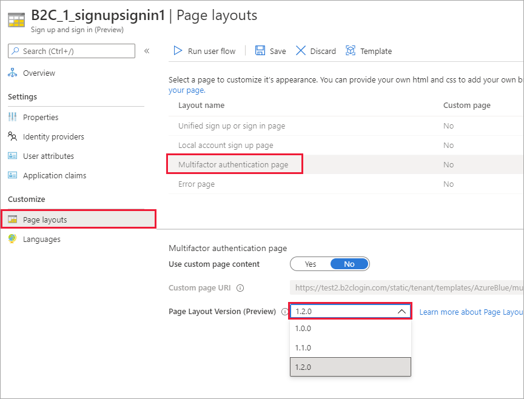

# Add branding to your organization's Azure Active Directory B2C pages

[!INCLUDE [active-directory-b2c-choose-user-flow-or-custom-policy](../../includes/active-directory-b2c-choose-user-flow-or-custom-policy.md)]

You can customize your user flow pages with a banner logo, background image, and background color by using Azure Active Directory [Company branding](../active-directory/fundamentals/customize-branding.md). The company branding includes signing up, signing in, profile editing, and password resetting. 

## Prerequisites

[!INCLUDE [active-directory-b2c-customization-prerequisites](../../includes/active-directory-b2c-customization-prerequisites.md)]


To customize your user flow pages, you first configure company branding in Azure Active Directory, then you enable it in the page layouts of your user flows in Azure AD B2C.

### Configure company branding

Start by setting the banner logo, background image, and background color within **Company branding**.

1. Sign in to the [Azure portal](https://portal.azure.com).
1. Select the **Directory + subscription** filter in the top menu, and then select the directory that contains your Azure AD B2C tenant.
1. In the Azure portal, search for and select **Azure AD B2C**.
1. Under **Manage**, select **Company branding**.
1. Follow the steps in [Add branding to your organization's Azure Active Directory sign-in page](../active-directory/fundamentals/customize-branding.md).

Keep these things in mind when you configure company branding in Azure AD B2C:

* Company branding in Azure AD B2C is currently limited to **background image**, **banner logo**, and **background color** customization. The other properties in the company branding pane, for example those in **Advanced settings**, are *not supported*.
* In your user flow pages, the background color is shown before the background image is loaded. We recommended you choose a background color that closely matches the colors in your background image for a smoother loading experience.
* The banner logo appears in the verification emails sent to your users when they initiate a sign-up user flow.

::: zone pivot="b2c-user-flow"

### Enable branding in user flow pages

Once you've configured company branding, enable it in your user flows.

1. In the left menu of the Azure portal, select **Azure AD B2C**.
1. Under **Policies**, select **User flows (policies)**.
1. Select the user flow for which you'd like to enable company branding. Company branding is **not supported** for the standard *Sign in* and standard *Profile editing* user flow types.
1. Under **Customize**, select **Page layouts**, and then select the layout you'd like to brand. For example, select **Unified sign up or sign in page**.
1. For the **Page Layout Version (Preview)**, choose version **1.2.0** or above.
1. Select **Save**.

If you'd like to brand all pages in the user flow, set the page layout version for each page layout in the user flow.



::: zone-end

::: zone pivot="b2c-custom-policy"

Select a [page layout](contentdefinitions.md#select-a-page-layout) for the user interface elements of your application.

To enable company branding, you need to [define a page layout version](contentdefinitions.md#migrating-to-page-layout) with page `contract` version for *all* of the content definitions in your custom policy. The format of the value must contain the word `contract`: _urn:com:microsoft:aad:b2c:elements:**contract**:page-name:version_. To specify a page layout in your custom policies that use an old **DataUri** value.

Learn how to [Migrating to page layout](contentdefinitions.md#migrating-to-page-layout) with page version.

The following example shows the content definition identifiers and the corresponding **DataUri** with page contract: 

```xml
<ContentDefinitions>
  <ContentDefinition Id="api.error">
    <DataUri>urn:com:microsoft:aad:b2c:elements:contract:globalexception:1.2.0</DataUri>
  </ContentDefinition>
  <ContentDefinition Id="api.idpselections">
    <DataUri>urn:com:microsoft:aad:b2c:elements:contract:providerselection:1.2.0</DataUri>
  </ContentDefinition>
  <ContentDefinition Id="api.idpselections.signup">
    <DataUri>urn:com:microsoft:aad:b2c:elements:contract:providerselection:1.2.0</DataUri>
  </ContentDefinition>
  <ContentDefinition Id="api.signuporsignin">
    <DataUri>urn:com:microsoft:aad:b2c:elements:contract:unifiedssp:1.2.0</DataUri>
  </ContentDefinition>
  <ContentDefinition Id="api.selfasserted">
    <DataUri>urn:com:microsoft:aad:b2c:elements:contract:selfasserted:1.2.0</DataUri>
  </ContentDefinition>
  <ContentDefinition Id="api.selfasserted.profileupdate">
    <DataUri>urn:com:microsoft:aad:b2c:elements:contract:selfasserted:1.2.0</DataUri>
  </ContentDefinition>
  <ContentDefinition Id="api.localaccountsignup">
    <DataUri>urn:com:microsoft:aad:b2c:elements:contract:selfasserted:1.2.0</DataUri>
  </ContentDefinition>
  <ContentDefinition Id="api.localaccountpasswordreset">
    <DataUri>urn:com:microsoft:aad:b2c:elements:contract:selfasserted:1.2.0</DataUri>
  </ContentDefinition>
  <ContentDefinition Id="api.phonefactor">
    <DataUri>urn:com:microsoft:aad:b2c:elements:contract:multifactor:1.2.0</DataUri>
  </ContentDefinition>
</ContentDefinitions>
```

::: zone-end

The following example shows a custom banner logo and background image on a *Sign up and sign in* user flow page that uses the Ocean Blue template:


### Use company branding assets in custom HTML

To use your company branding assets in [custom HTML](customize-ui-with-html.md), add the following tags outside the `<div id="api">` tag:

```HTML


```

The image source is replaced with that of the background image and banner logo.
