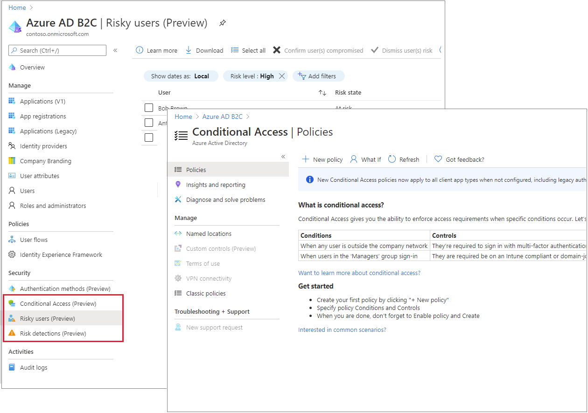

# Identity Protection and Conditional Access for Azure AD B2C

[!INCLUDE [b2c-public-preview-feature](../../includes/active-directory-b2c-public-preview.md)]

Enhance the security of Azure Active Directory B2C (Azure AD B2C) with Azure AD Identity Protection and Conditional Access. The Identity Protection risk-detection features, including risky users and risky sign-ins, are automatically detected an displayed in your Azure AD B2C tenant. You can create Conditional Access policies that use these risk detections to determine actions and enforce organizational policies. Together, these capabilities give Azure AD B2C application owners significantly greater control over risky authentications and access policies.
  
If you're already familiar with [Identity Protection](../active-directory/identity-protection/overview-identity-protection.md) and [Conditional Access](../active-directory/conditional-access/overview.md) in Azure AD, using these capabilities with Azure AD B2C will be a familiar experience, with the minor differences discussed in this article.

> [!NOTE]
> To use sign-in and user risk-based Conditional access, Azure AD Premium P2 is required.

## Benefits of Identity Protection and Conditional Access for Azure AD B2C  

By pairing Conditional Access policies with Identity Protection risk detection, you can respond to risky authentications with the appropriate policy action.

- **Gain a new level of visibility into the authentication risks for your apps and your customer base**. With signal from billions of monthly authentications across Azure AD and Microsoft Account, the risk detections algorithms will now flag authentications as low, medium or high risk for your local consumer/citizen authentications.
- **Automatically address risks by configuring your own adaptive authentication**. When active, a specific set of users, using specified applications, will be required to provide a second factor (MFA) or may be blocked from access depending on the risk level detected. The resulting end user experiences can be 100% customized, like the rest of B2C, to present your organization’s voice, style, brand, and to present mitigation alternatives if access is lost. 
- **Additional controls based on location, groups, and apps**.  Conditional access can also be used to control non-risk based situations such as a need to MFA customers accessing one app, but not the other, or blocking access from specified geographies.
- **Integrated with Azure AD B2C userflows and Identity Experience Framework custom policies**. Leverage all you existing work on customizing experiences and just add additional controls to interface with Conditional Access. Advanced cases are possible such as implementing your own grants (e.g. knowledge based access, or your own preferred MFA provider) to grant access.

## Feature differences and limitations

Identity Protection and Conditional Access in Azure AD B2C generally work the same as in Azure AD, with the following differences and limitations:

- The Security Center is not available in Azure AD B2C.

- Identity Protection and Conditional Access are not supported in ROPC server-to-server flows in Azure AD B2C tenants.

- In Azure AD B2C tenants, Identity Protection risk detections are available for local B2C accounts only, and not for social identities (Google, Facebook, etc). 

- In Azure AD B2C tenants, a subset of the Identity Protection risk detections are available; see [Set up Identity Protection](conditional-access-identity-protection-setup.md#set-up-identity-protection).

- The Conditional Access device compliance feature is not available for Azure AD B2C tenants.

## Integrate Conditional Access with user flows and custom policies

In Azure AD B2C, you can trigger Conditional Access conditions from built-in user flows, or you can incorporate Conditional Access into custom policies. As with other aspects of the B2C user flow, end user experience messaging can be customized according to the organization’s voice, brand, and mitigation alternatives. See [Define a Conditional Access technical profile](conditional-access-technical-profile.md).

## Microsoft Graph API

You can also manage Conditional Access policies in Azure AD B2C with Microsoft Graph API. For details, see the [Conditional Access documentation](../active-directory/conditional-access.md/) and the [Microsoft Graph reference](https://docs.microsoft.com/graph/api/resources/conditionalaccesspolicy?view=graph-rest-beta.md).

## Next steps

- [Set up Identity Protection and Conditional Access for Azure AD B2C](conditional-access-identity-protection-setup.md)
- [Learn about Identity Protection in Azure AD](../active-directory/identity-protection/overview-identity-protection.md)
- [Learn about Conditional Access](https://docs.microsoft.com/azure/active-directory/conditional-access/overview)
