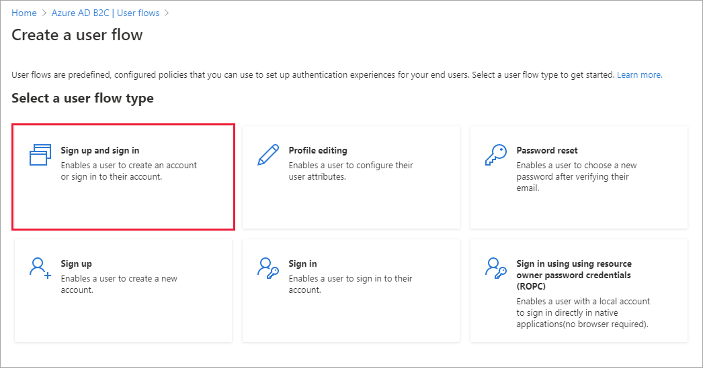
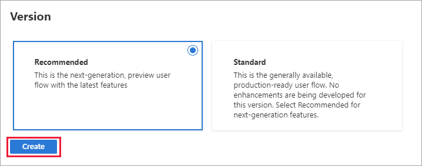
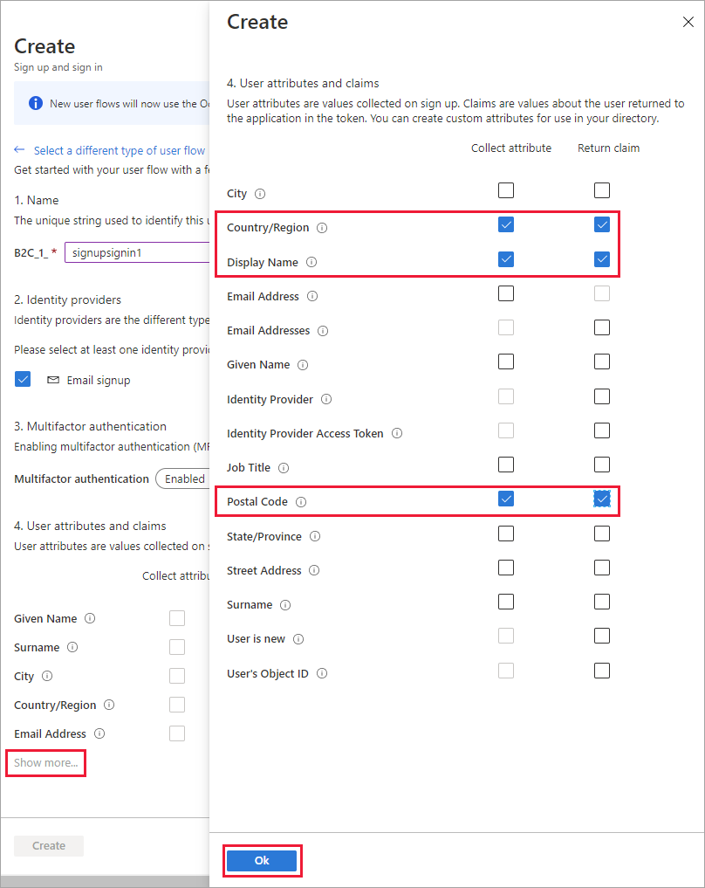

# Create a user flow in Azure Active Directory B2C

You can create [user flows](user-flow-overview.md) of different types in your Azure Active Directory B2C (Azure AD B2C) tenant and use them in your applications as needed. User flows can be reused across applications.

- **Sign-up and sign-in** user flows handle both sign-up and sign-in experiences with a single configuration.
- **Profile editing user flows** enable users to edit their profile in your application.
- **Password reset user flows** enable users of your application to reset their password.

> [!IMPORTANT]
> We've changed the way we reference user flow versions. Previously, we offered V1 (production-ready) versions, and V1.1 and V2 (preview) versions. Now, we've consolidated user flows into **Recommended** (next-generation preview) and **Standard** (generally available) versions. All V1.1 and V2 legacy preview user flows are on a path to deprecation by **August 1, 2021**. For details, see [User flow versions in Azure AD B2C](user-flow-versions.md).

## Prerequisites

- [Register the application](tutorial-register-applications.md) you want to test with the new user flow.
- [Add identity providers](tutorial-add-identity-providers.md) to enable user sign-in with providers like Azure AD, Amazon, Facebook, GitHub, LinkedIn, Microsoft, or Twitter.
- [Configure the local account identity provider](#to-configure-the-local-account-identity-provider) to specify which types of identity types your local account will support tenant-wide. A consumer account is the local account created in your Azure AD B2C directory when someone signs up for your application using an email (default), username, or phone number (preview). 

### To configure the local account identity provider

Then you can specify one of these supported types when you set up an individual user flow. When a user completes the user flow, your Azure AD B2C Local account identity provider authenticates their information.

1. Sign in to the [Azure portal](https://portal.azure.com/).
2. Make sure you're using the directory that contains your Azure AD tenant by selecting the **Directory + subscription** filter in the top menu and choosing the directory that contains your Azure AD tenant.
3. Choose **All services** in the top-left corner of the Azure portal, and then search for and select **Azure AD B2C**.
4. Under **Manage**, select **Identity providers**.
5. In the identity provider list, select **Local account**.
6. In the **Configure local IDP** page, select the allowable identity types consumers can use to create their local accounts in your Azure AD B2C tenant:

   - **Phone** (Preview): Users will be prompted for a phone number, which will be verified at sign-up and become their user id.
   - **Email**: Users will be prompted for an email address, which will be verified at sign-up and become their user id.
   - **Username**: Users may create their own unique user id. An email address will be collected from the user and verified.

7. Select **Save**.

## Create a user flow

1. Sign in to the [Azure portal](https://portal.azure.com).
2. Select the **Directory + Subscription** icon in the portal toolbar, and then select the directory that contains your Azure AD B2C tenant.

    

3. In the Azure portal, search for and select **Azure AD B2C**.
4. Under **Policies**, select **User flows**, and then select **New user flow**.

    

5. On the **Create a user flow** page, select the **Sign up and sign in** user flow.

    

6. Under **Select a version**, select **Recommended**, and then select **Create**. ([Learn more](user-flow-versions.md) about user flow versions.)

    

7. Enter a **Name** for the user flow. For example, *signupsignin1*, *profileediting1*, *passwordreset1*, etc.
8. For **Identity providers**, choose one or more of the following:

   - **Local Account SignIn**
   - **Email signup**.
   - **Reset password using email address** 

9. For **User attributes and claims**, choose the claims and attributes that you want to collect and send from the user during sign-up. For example, select **Show more**, and then choose attributes and claims for **Country/Region**, **Display Name**, and **Postal Code**. Click **OK**.

    

10. Click **Create** to add the user flow. A prefix of *B2C_1* is automatically prepended to the name.

### Test the user flow

1. Select **Policies** > **User flows**, and then select the user flow you created. On the user flow overview page, select **Run user flow**.
1. For **Application**, select the web application you registered in step 1. The **Reply URL** should show `https://jwt.ms`.
1. Click **Run user flow**.
2. Depending on the type of user flow you're testing, either sign up using a valid email address and follow the sign-up flow, or sign in using an account that you previously created.

    

1. Follow the user flow prompts. When you complete the user flow, the token is returned to `https://jwt.ms` and should be displayed to you.

> [!NOTE]
> The "Run user flow" experience is not currently compatible with the SPA reply URL type using authorization code flow. To use the "Run user flow" experience with these kinds of apps, register a reply URL of type "Web" and enable the implicit flow as described [here](tutorial-register-spa.md).

## Next steps

Next, learn about adding identity providers to your applications to enable user sign-in with providers like Azure AD, Amazon, Facebook, GitHub, LinkedIn, Microsoft, or Twitter.

> [!div class="nextstepaction"]
> [Add identity providers to your applications >](tutorial-add-identity-providers.md)
