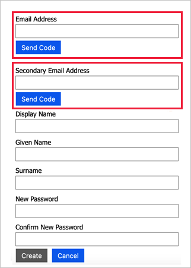

# Display Controls

[!INCLUDE [active-directory-b2c-advanced-audience-warning](../../includes/active-directory-b2c-advanced-audience-warning.md)]

A **Display Control** is a user interface element that has special functionality and interacts with the Azure Active Directory B2C (Azure AD B2C) back-end service. It allows the user to perform actions on the page that invokes a [validation technical profile](validation-technical-profile.md) at the back end. Display Controls are displayed on the page and are referenced by a [self-asserted technical profile](self-asserted-technical-profile.md).

The following image illustrates a self-asserted sign-up page with two display controls that validate a primary and secondary email address.



[!INCLUDE [b2c-public-preview-feature](../../includes/active-directory-b2c-public-preview.md)]

## Prerequisites

 In the [Metadata](self-asserted-technical-profile.md#metadata) section of a [self-asserted technical profile](self-asserted-technical-profile.md), the referenced [ContentDefinition](contentdefinitions.md) needs to have `DataUri` set to page contract version 2.0.0 or higher. For example:

```XML
<ContentDefinition Id="api.selfasserted">
  <LoadUri>~/tenant/default/selfAsserted.cshtml</LoadUri>
  <RecoveryUri>~/common/default_page_error.html</RecoveryUri>
  <DataUri>urn:com:microsoft:aad:b2c:elements:selfasserted:2.0.0</DataUri>
  ...
```

## Defining Display Controls

The **DisplayControl** element contains the following attributes:

| Attribute | Required | Description |
| --------- | -------- | ----------- |
| Id | Yes | An identifier that's used for the display control. It can be [referenced](#referencing-display-controls). |
| UserInterfaceControlType | Yes | The type of the display control. Currently supported is [VerificationControl](display-control-verification.md) |

The **DisplayControl** element contains the following elements:

| Element | Occurrences | Description |
| ------- | ----------- | ----------- |
| InputClaims | 0:1 | **InputClaims** are used to prepopulate the value of the claims to be collected from the user. |
| DisplayClaims | 0:1 | **DisplayClaims** are used to represent claims to be collected from the user. |
| OutputClaims | 0:1 | **OutputClaims** are used to represent claims to be saved temporarily for this **Display Control**. |
| Actions | 0:1 | **Actions** are used to list the validation technical profiles to invoke for user actions happening at the front-end. |

### Input claims

In a display control, you can use **InputClaims** elements to prepopulate the value of claims to collect from the user on the page. Any **InputClaimsTransformations** can be defined in the self-asserted technical profile which references this display control.

The following example prepopulates the email address to be verified with the address already present.

```XML
<DisplayControl Id="emailControl" UserInterfaceControlType="VerificationControl">
  <InputClaims>
    <InputClaim ClaimTypeReferenceId="emailAddress" />
  </InputClaims>
  ...
```

### Display claims

Each type of display control requires a different set of display claims, [output claims](#output-claims), and [actions](#display-control-actions) to be performed.

Similar to the **display claims** defined in a [self-asserted technical profile](self-asserted-technical-profile.md#display-claims), the display claims represent the claims to be collected from the user within the display control. The **ClaimType** element referenced needs to specify the **UserInputType** element for a user input type supported by Azure AD B2C, such as `TextBox` or `DropdownSingleSelect`. If a display claim value is required by an **Action**, set the **Required** attribute to `true` to force the user to provide a value for that specific display claim.

Certain display claims are required for certain types of display control. For example, **VerificationCode** is required for the display control of type **VerificationControl**. Use the attribute **ControlClaimType** to specify which DisplayClaim is designated for that required claim. For example:

```XML
<DisplayClaim ClaimTypeReferenceId="otpCode" ControlClaimType="VerificationCode" Required="true" />
```

### Output claims

The **output claims** of a display control are not sent to the next orchestration step. They are saved temporarily only for the current display control session. These temporary claims can be shared between the different actions of the same display control.

To bubble up the output the claims to the next orchestration step, use the **OutputClaims** of the actual self-asserted technical profile which references this display control.

### Display control Actions

The **Actions** of a display control are procedures that occur in the Azure AD B2C back end when a user performs a certain action on the client side (the browser). For example, the validations to perform when the user selects a button on the page.

An action defines a list of **validation technical profiles**. They are used for validating some or all of the display claims of the display control. The validation technical profile validates the user input and may return an error to the user. You can use **ContinueOnError**, **ContinueOnSuccess**, and **Preconditions** in the display control Action similar to the way they're used in [validation technical profiles](validation-technical-profile.md) in a self asserted technical profile.

The following example sends a code either in email or SMS based on the user's selection of the **mfaType** claim.

```XML
<Action Id="SendCode">
  <ValidationClaimsExchange>
    <ValidationClaimsExchangeTechnicalProfile TechnicalProfileReferenceId="AzureMfa-SendSms">
      <Preconditions>
        <Precondition Type="ClaimEquals" ExecuteActionsIf="true">
          <Value>mfaType</Value>
          <Value>email</Value>
          <Action>SkipThisValidationTechnicalProfile</Action>
        </Precondition>
      </Preconditions>
    </ValidationClaimsExchangeTechnicalProfile>
    <ValidationClaimsExchangeTechnicalProfile TechnicalProfileReferenceId="AadSspr-SendEmail">
      <Preconditions>
        <Precondition Type="ClaimEquals" ExecuteActionsIf="true">
          <Value>mfaType</Value>
          <Value>phone</Value>
          <Action>SkipThisValidationTechnicalProfile</Action>
        </Precondition>
      </Preconditions>
    </ValidationClaimsExchangeTechnicalProfile>
  </ValidationClaimsExchange>
</Action>
```

## Referencing display controls

Display controls are referenced in the [display claims](self-asserted-technical-profile.md#display-claims) of the [self-asserted technical profile](self-asserted-technical-profile.md).

For example:

```XML
<TechnicalProfile Id="SelfAsserted-ProfileUpdate">
  ...
  <DisplayClaims>
    <DisplayClaim DisplayControlReferenceId="emailVerificationControl" />
    <DisplayClaim DisplayControlReferenceId="PhoneVerificationControl" />
    <DisplayClaim ClaimTypeReferenceId="displayName" Required="true" />
    <DisplayClaim ClaimTypeReferenceId="givenName" Required="true" />
    <DisplayClaim ClaimTypeReferenceId="surName" Required="true" />
```
