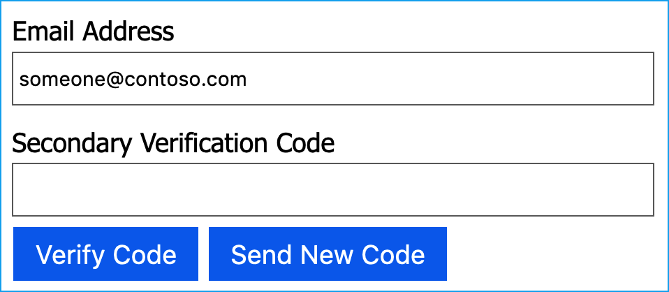

# Verification Display Widget

A verification widget is used to verify a claim, such as email or phone number, with a verification code send to the user. The verification display widget is consisted of two steps (actions):

1. Asks the user for the address where to send the verification code to (such as email address or phone number). The user clicks on **Send code** button, which execute the **SendCode Action** of the verification display widget. The **SendCode Action** generates a code, construct the content to be sent, and send it to the user. Note: the value of the address can be pre-populate and serve as a second factor authentication.

    

1. After the code has been sent, user reads the message, types the verification code in the display widget, and clicks **Verify code**. By clicking on the Verify code, the **VerifyCode Action** is executed to verify the code associated with the address. If user clicks on the **Send New Code**, the first action is executed again.

    

[!INCLUDE [b2c-public-preview-feature](../../includes/active-directory-b2c-public-preview.md)]

## VerificationWidget required elements

The **VerificationWidget** must contain following elements:

- The type of the [DisplayWidget](display-widgets.md) is `VerificationWidget`
- Display claims.
  - **Send to**, one or more claims specifying where to send the verification code to. For example *email*, or *country code* and *phone number*.
  - **Verification code**, the verification code claim, user provide after the code has been sent. This claim must set as required and the `ControlClaimType`  must set to `VerificationCode`.
- Output claim (optional), to be return to the self-asserted page, after user completes verification process. For example *email*, or *country code* and *phone number*. The self-asserted technical profile uses the claims to persist the data or bubble up the output the claims to the next orchestration step.
- Two Actions with following names:
  - **SendCode**, sends a code to the user. This action usually contains two validation technical profile, to generate a code and to send it.
  - **VerifyCode**, verifies the code. This actinon usually contains a single validation technical profile.


In the example below, a **email** textbox is shown on the page where the user can click **SendCode** button which will trigger **SendCode** action in the backend.

Then the user enter **verificationCode** and click **VerifyCode** button to trigger **VerifyCode** action in the backend. If all validations pass, the **VerificationWidget** is considered complete and the user can continue to the next step.

```XML
<DisplayWidget Id="emailVerificationWidget" UserInterfaceWidgetType="VerificationWidget">
  <DisplayClaims>
    <DisplayClaim ClaimTypeReferenceId="email"  Required="true" />
    <DisplayClaim ClaimTypeReferenceId="verificationCode" ControlClaimType="VerificationCode" Required="true" />
  </DisplayClaims>
  <OutputClaims>
    <OutputClaim ClaimTypeReferenceId="email" />
  </OutputClaims>
  <Actions>
    <Action Id="SendCode">
      <ValidationClaimsExchange>
        <ValidationClaimsExchangeTechnicalProfile TechnicalProfileReferenceId="GenerateOtp" />
        <ValidationClaimsExchangeTechnicalProfile TechnicalProfileReferenceId="SendGrid" />
      </ValidationClaimsExchange>
    </Action>
    <Action Id="VerifyCode">
      <ValidationClaimsExchange>
        <ValidationClaimsExchangeTechnicalProfile TechnicalProfileReferenceId="VerifyOtp" />
      </ValidationClaimsExchange>
    </Action>
  </Actions>
</DisplayWidget>
```
