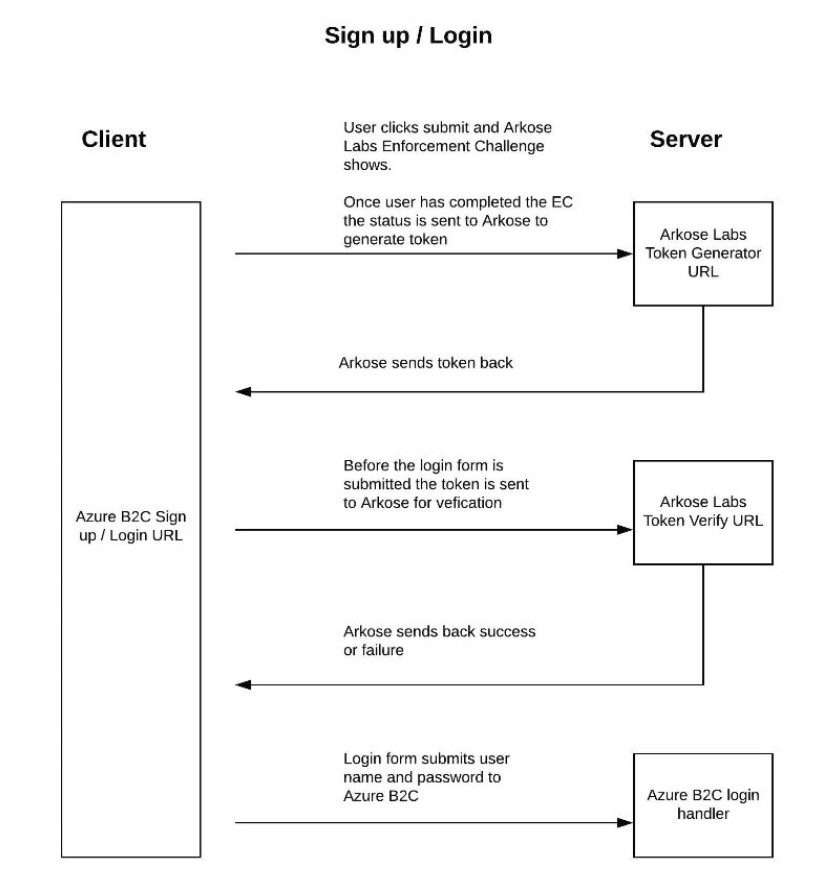
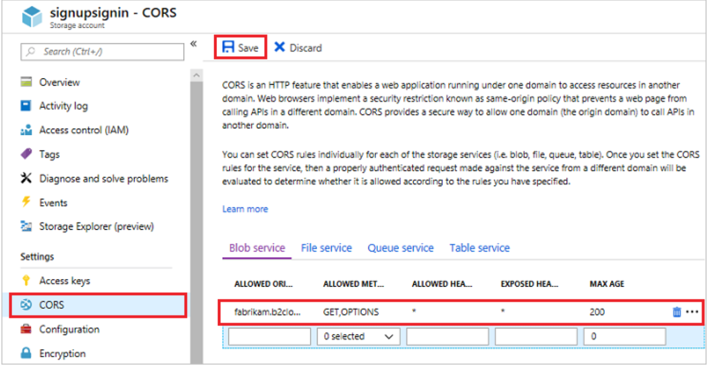
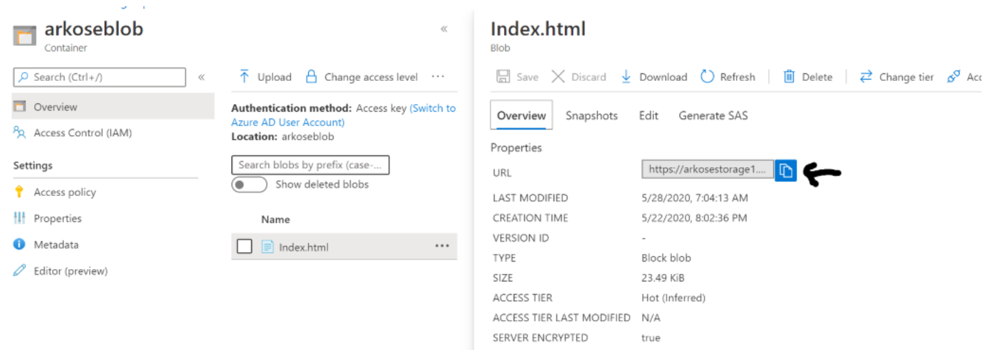

# Tutorial for configuring Arkose Labs with Azure Active Directory B2C

In this tutorial, learn how to integrate Azure AD B2C authentication with Arkose Labs. Arkose Labs help organizations against bot attacks, account takeover attacks, and fraudulent account openings.  

## Prerequisites

To get started, you'll need:

* An Azure AD subscription. If you don't have a subscription, you can get a [free account](https://azure.microsoft.com/free/).
* [An Azure AD B2C tenant](tutorial-create-tenant.md) that is linked to your Azure subscription.

## Scenario description

Arkose Labs architecture diagram

## Onboard with Arkose Labs

1. Start by contacting [Arkose Labs](https://www.arkoselabs.com/book-a-demo/) and creating an account.

2. Once your account is created, navigate to https://dashboard.arkoselabs.com/login  

3. Within the dashboard, navigate to site settings to find your public key and private key. This will be needed later to configure Azure AD B2C

## Integrate Arkose Labs with Azure AD B2C

### Part 1 – Create blob storage to store the custom HTML

To create a storage, follow these steps:  

1. Sign in to the Azure portal.

2. Make sure to use the directory that contains your Azure subscription. Select the **Directory and subscription filter** in the top menu and choose the directory that contains your subscription. This directory is different than the one that contains your Azure B2C tenant.

3. Choose All services in the top-left corner of the Azure portal, search for and select  **Storage accounts**.

4. Select **Add**.

5. Under **Resource group**, select **Create new**, enter a name for the new resource group, and then select  **Ok**.

6. Enter a name for the storage account. The name you choose must be unique across Azure, must be between 3 and 24 characters in length, and may contain numbers and lowercase letters only.

7. Select the location of the storage account or accept the default location.

8. Accept all other default values, select  **Review & create** > **Create**.

9. After the storage account is created, select  **Go to resource**.

#### Create a container

1. On the overview page of the storage account, select  **Blobs**.

2. Select  **Container**, enter a name for the container, choose  **Blob** (anonymous read access for blobs only), and then select **Ok**.

#### Enable Cross-origin resource sharing (CORS)

Azure AD B2C code in a browser uses a modern and standard approach to load custom content from a URL that you specify in a user flow. CORS allows restricted resources on a web page to be requested from other domains.

1. In the menu, select  **CORS**.

2. For  **Allowed origins**, enter https://your-tenant-name.b2clogin.com. Replace your-tenant-name with the name of your Azure AD B2C tenant. For example, https://fabrikam.b2clogin.com. You need to use all lowercase letters when entering your tenant name.

3. For  **Allowed Methods**, select **GET**, **PUT**, and **OPTIONS**.

4. For  **Allowed Headers**, enter an asterisk (*).

5. For  **Exposed Headers**, enter an asterisk (*).

6. For  **Max age**, enter 200.

   

7. Select **Save**

### Part 2 – Set up a back-end server

#### Prerequisites

Download Git Bash and follow the steps below:

1. Follow instructions mentioned [here](https://docs.microsoft.com/azure/app-service/app-service-web-get-started-php) to create a web-app up until the message “Congratulations! You've deployed your first PHP app to App Service” is displayed.

2. Open your local folder and rename index.php file into verify-token.php

3. Open the newly renamed file verify-token.php and

   a. Replace the content with the content from verify-token.php found in [Github repository](https://github.com/ArkoseLabs/Azure-AD-B2C)

   b. Replace <private_key> on line 3 with your private key obtained from Arkose Labs dashboard  

4. In the local terminal window, commit your changes in Git, and then push the code changes to Azure by typing the following in Git bash

   ``git commit -am "updated output"``

   ``git push azure master``  

### Part 3 –  Final setup

#### Store the custom HTML

1. Open the index.html file stored in the [Github repository](https://github.com/ArkoseLabs/Azure-AD-B2C)

2. Replace all instances of <tenantname> with your b2C tenant name (i.e., tenantname.b2clogin.com). There should be 4 instances 

3. Replace <*appname*> with the app name that you created in Part 2 – step 1.

   

4. Replace *<public_key*> on line 64 with the public key you obtained from Arkose Labs dashboard.

5. Upload the index.html file into the blob storage created above.

6. Go to **Storage** > **Container** > **Upload**

#### Set up Azure AD B2C

> [!NOTE]
> If you don't have one already, [create an Azure AD B2C tenant](tutorial-create-tenant.md) that is linked to your Azure subscription.

1. Enable Javascript in your [user flow](https://docs.microsoft.com/azure/active-directory-b2c/user-flow-javascript-overview)

2. In the same user flow page, enable custom page URL
**User flow** > **page layout** > **use custom page content** = **yes** > **insert custom page URL**.
This custom page URL is obtained from the location of the index.html file inside the blob storage  

   

## Test the user flow

1. Open the B2C tenant and choose under policies **User flows**.

2. Select your previously created User Flow.

3. Select **Run user flow**.

   a. Application: select the registered app (sample is JWT)

   b. Reply URL: select the redirect URL

   c. Select **Run user flow**.

4. Go through sign-up flow and create an account

5. Log-out

6. Go through sign-in flow  

7. Arkose Labs puzzle will pop up after you enter **continue**.

## Next steps

For additional information, review the following articles:

- [Custom policies in Azure AD B2C](https://docs.microsoft.com/azure/active-directory-b2c/custom-policy-overview)

- [Get started with custom policies in Azure AD B2C](https://docs.microsoft.com/azure/active-directory-b2c/custom-policy-get-started?tabs=applications)
