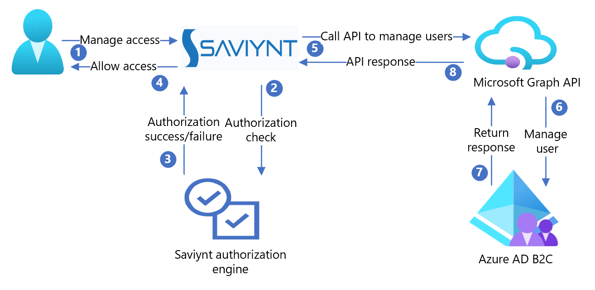

# Tutorial for configuring Saviynt with Azure Active Directory B2C

In this sample tutorial, we provide guidance on how to integrate Azure Active Directory (AD) B2C with [Saviynt](https://saviynt.com/). Saviynt’s Security Manager platform provides the visibility, security, and governance today’s businesses need, in a single unified platform. Saviynt incorporates application risk and governance, infrastructure management, privileged account management, and customer risk analysis.

In this sample tutorial, you'll set up Saviynt to provide fine grained access control based delegated administration for Azure AD B2C users. Saviynt does the following checks to determine if a user is authorized to manage Azure AD B2C users.

- Feature level security to determine if a user can perform a specific operation. For example, Create user, Update user, Reset user password, and so on.

- Field level security to determine if a user can read/write a specific attribute of another user during user management operations. For example, help desk agent can only update phone number and all other attributes are read-only.

- Data level security to determine if a user can perform a certain operation on a specific user. For example, help desk administrator for UK region can manage UK users only.

## Prerequisites

To get started, you'll need:

- An Azure AD subscription. If you don't have a subscription, you can get a [free account](https://azure.microsoft.com/free/).

- An [Azure AD B2C tenant](https://docs.microsoft.com/azure/active-directory-b2c/tutorial-create-tenant). Tenant is linked to your Azure subscription.

- A Saviynt [subscription](https://saviynt.com/contact-us/)

## Scenario description

The Saviynt integration includes the following components:

- [Azure AD B2C](https://azure.microsoft.com/services/active-directory/external-identities/b2c/) – The business-to-customer identity as a service that enables custom control of how your customers sign up, sign in, and manage their profiles.

- [Saviynt](https://saviynt.com/) – The identity governance platform that provides fine grained delegated administration for user life-cycle management and access governance of Azure AD B2C users.  

- [Microsoft Graph API](https://docs.microsoft.com/graph/use-the-api) – This API provides the interfaces for Saviynt to manage the Azure AD B2C users and their access in Azure AD B2C.

The following architecture diagram shows the implementation.



|Step | Description |
|:-----| :-----------|
| 1. | A delegated administrator starts a manage Azure AD B2C user operation through Saviynt.
| 2. | Saviynt verifies with its authorization engine if the delegated administrator can do the specific operation.
| 3. | Saviynt’s authorization engine sends an authorization success/failure response.
| 4. | Saviynt allows the delegated administrator to do the required operation.
| 5. | Saviynt invokes Microsoft Graph API along with user attributes to manage the user in Azure AD B2C
| 6. | Microsoft Graph API will in turn create/update/delete the user in Azure AD B2C.
| 7. | Azure AD B2C will send a success/failure response.
| 8. | Microsoft Graph API will then return the response to Saviynt.

## Onboard with Saviynt

1. To create a Saviynt account, contact [Saviynt](https://saviynt.com/contact-us/)

2. Create delegated administration policies and assign users as [delegated administrators](https://docs.microsoft.com/azure/active-directory/users-groups-roles/roles-concept-delegation) with various roles.

## Configure Azure AD B2C with Saviynt

### Creating an Azure AD Application for Saviynt

1. Sign in to the [Azure portal](https://portal.azure.com/#home).

2. Select the **Directory + Subscription** icon in the portal toolbar, and then select the directory that contains your Azure AD B2C tenant.

3. In the Azure portal, search and select **Azure AD B2C**.

4. Select **App registrations** > **New registration**.

5. Enter a Name for the application. For example, Saviynt and select **Create**.

6. Go to **API Permissions** and select **+ Add a permission.**

7. The Request API permissions page appears. Select **Microsoft APIs** tab and select **Microsoft Graph** as commonly used Microsoft APIs.

8. Go to the next page, and select **Application permissions**.

9. Select **Directory**, and select **Directory.Read.All** and **Directory.ReadWrite.All** checkboxes.

10. Select **Add Permissions**. Review the permissions added.

11. Select **Grant admin consent for Default Directory** > **Save**.

12. Go to **Certificates and Secrets** and select **+ Add Client Secret**. Enter the client secret description, select the expiry option, and select **Add**.

13. The Secret key is generated and displayed in the Client secret section.

>[!NOTE]
> You'll need the client secret later.

14. Go to **Overview** and get the **Client ID** and **Tenant ID**.

15. Tenant ID, client ID, and client secret will be needed to  complete the setup in Saviynt.

### Enabling Saviynt to Delete users

The below steps explain how to enable Saviynt to perform user delete operations in Azure AD B2C.

>[!NOTE]
>[Evaluate the risk before granting admin roles access to a service principal.](https://docs.microsoft.com/azure/active-directory/develop/app-objects-and-service-principals)

1. Install the latest version of [MSOnline PowerShell Module](&preserve-view=truehttps://docs.microsoft.com/powershell/azure/active-directory/overview?view=azureadps-1.0) on a Windows workstation/server.

2. [Connect to AzureAD PowerShell module](&preserve-view=truehttps://docs.microsoft.com/powershell/azure/active-directory/overview?view=azureadps-1.0#connect-to-azure-ad) and execute the following commands:

```powershell
Connect-msolservice #Enter Admin credentials of the Azure portal
$webApp = Get-MsolServicePrincipal –AppPrincipalId “<ClientId of Azure AD Application>”
Add-MsolRoleMember -RoleName "Company Administrator" -RoleMemberType ServicePrincipal -RoleMemberObjectId $webApp.ObjectId
```

## Test the solution

Browse to your Saviynt application tenant and test user life-cycle management and access governance use case.

## Next steps

For additional information, review the following articles:

- [Custom policies in Azure AD B2C](https://docs.microsoft.com/azure/active-directory-b2c/custom-policy-overview)

- [Get started with custom policies in Azure AD B2C](https://docs.microsoft.com/azure/active-directory-b2c/custom-policy-get-started?tabs=applications)

- [Create a web API application](https://docs.microsoft.com/azure/active-directory-b2c/add-web-api-application)
