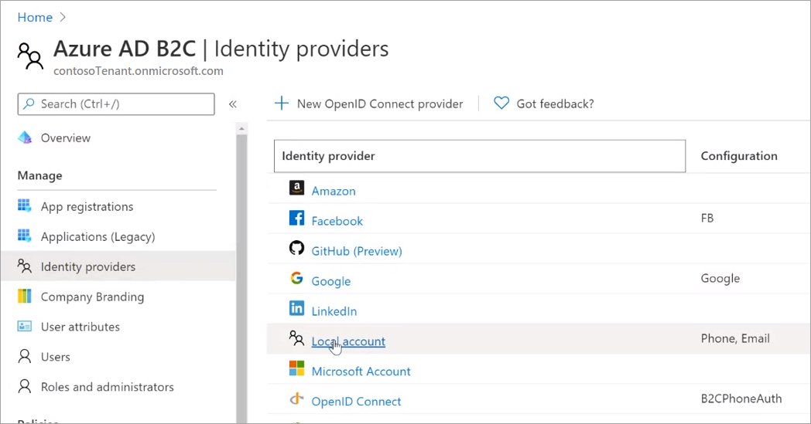
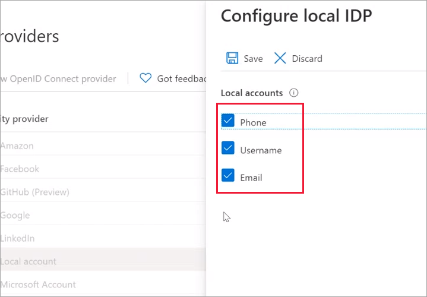
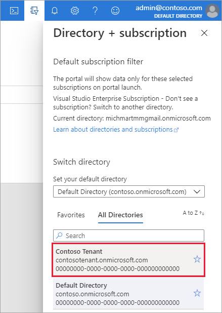
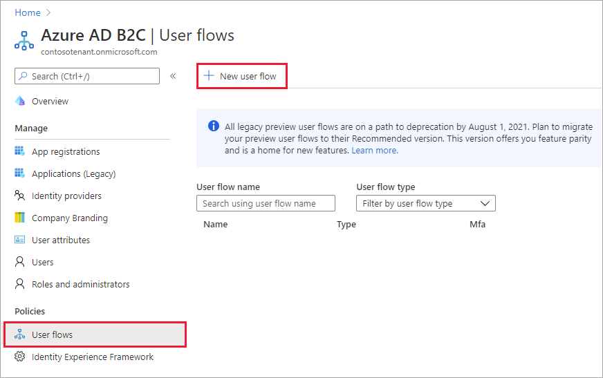

# Set up phone authentication for user flows (preview)

> [!NOTE]
> Phone authentication and recovery email features for user flows are in public preview.

In addition to email and username, you can enable phone number as a sign-up option tenant-wide by adding phone authentication to your local account identity provider. After you enable phone authentication for local accounts, you can add phone sign-up to your user flows.

Setting up phone authentication in a user flow involves the following steps:

- [Configure phone authentication tenant-wide](#configure-phone-authentication-tenant-wide) in your local account identity provider to accept a phone number as a user's identity. 

- [Add phone sign-up to your user flow](#add-phone-sign-up-to-a-user-flow) to enable users to sign up for your application using their phone number.

- [Enable the recovery email prompt (preview)](#enable-the-recovery-email-prompt-preview) to let users specify an email that can be used to recover their account when they don't have their phone.

Multi-factor authentication (MFA) is disabled by default when you configure a user flow with phone sign-up. You can enable MFA in user flows with phone sign-up, but because a phone number is used as the primary identifier, email one-time passcode is the only option available for the second authentication factor.

## Configure phone authentication tenant-wide

Email sign-up is enabled by default in your local account identity provider settings. You can change the identity types you'll support in your tenant by selecting or deselecting email sign-up, username, or phone number.

1. Sign in to the [Azure portal](https://portal.azure.com).

2. Make sure you're using the directory that contains your Azure AD B2C tenant by selecting the **Directory + subscription** filter in the top menu and choosing the directory that contains your Azure AD tenant.

3. Choose **All services** in the top-left corner of the Azure portal, and then search for and select **Azure AD B2C**.

4. Under **Manage**, select **Identity providers**.

5. In the identity provider list, select **Local account**.

   

1. In the **Configure local IDP** page, make sure **Phone** is selected as one of the the allowable identity types consumers can use to create their local accounts in your Azure AD B2C tenant.

   

1. Select **Save**.

## Add phone sign-up to a user flow

After you've added phone sign-up as an identity option for local accounts, you can add it to user flows as long as they're the latest **Recommended** user flow versions. The following is an example showing how to add phone sign-up to new user flows. But you can also add phone sign-up to existing Recommended-version user flows (select **User Flows** > *user flow name* > **Identity providers** > **Local Account Phone signup**). 

Here's an example showing how to add phone sign-up to a new user flow.

1. Sign in to the [Azure portal](https://portal.azure.com).
2. Select the **Directory + Subscription** icon in the portal toolbar, and then select the directory that contains your Azure AD B2C tenant.

    

3. In the Azure portal, search for and select **Azure AD B2C**.
4. Under **Policies**, select **User flows**, and then select **New user flow**.

    

5. On the **Create a user flow** page, select the **Sign up and sign in** user flow.

    

6. Under **Select a version**, select **Recommended**, and then select **Create**. ([Learn more](user-flow-versions.md) about user flow versions.)

    

7. Enter a **Name** for the user flow. For example, *signupsignin1*.
8. In the **Identity providers** section, under **Local accounts**, select **Phone signup**.

   

9. Under **Social identity providers**, select any other identity providers you want to allow for this user flow.

   > [!NOTE]
   > Multi-factor authentication (MFA) is disabled by default. You can enable MFA for a phone sign-up user flow, but because a phone number is used as the primary identifier, email one-time passcode is the only option available for the second authentication factor.

1. In the **User attributes and token claims** section, choose the claims and attributes that you want to collect and send from the user during sign-up. For example, select **Show more**, and then choose attributes and claims for **Country/Region**, **Display Name**, and **Postal Code**. Click **OK**.

1. Click **Create** to add the user flow. A prefix of *B2C_1* is automatically prepended to the name.

## Enable the recovery email prompt (preview)

When you enable phone authentication for your user flows, it's also a good idea to enable the recovery email feature. With this feature, a user can provide an email address that can be used to recover their account when they don't have their phone. This email address is used for account recovery only. It can't be used for signing in.

- When the recovery email prompt is **On**, a user signing up for the first time is asked to verify a backup email. A user who hasn't provided a recovery email before is asked to verify a backup email during next sign in.

- When recovery email is **Off**, a user signing up or signing in is not shown the recovery email prompt.
 
You can enable the recovery email prompt in the user flow properties.

> [!NOTE]
> Before you begin, make sure you have [added phone sign-up to your user flow](#add-phone-sign-up-to-a-user-flow) as described above.

### To enable the recovery email prompt

1. Sign in to the [Azure portal](https://portal.azure.com).
2. Select the **Directory + Subscription** icon in the portal toolbar, and then select the directory that contains your Azure AD B2C tenant.
3. In the Azure portal, search for and select **Azure AD B2C**.
4. In Azure AD B2C, under **Policies**, select **User flows**.
5. Select the user flow from the list.
6. Under **Settings**, select **Properties**.
7. Next to **Enable recovery email prompt for phone number sign up and sign in (preview)**, select:

   - **On** to show the recovery email prompt during both sign up and sign in.
   - **Off** to hide the recovery email prompt.

    

8. Select **Save**.

### To test the recovery email prompt

After you've enabled phone authentication and the recovery email prompt in your user flow, you can use **Run user flow** to test the user experience.

1. Select **Policies** > **User flows**, and then select the user flow you created. On the user flow overview page, select **Run user flow**.

2. For **Application**, select the web application you registered in step 1. The **Reply URL** should show `https://jwt.ms`.

3. Click **Run user flow** and verify the following behavior:

   - A user who signs up for the first time is asked to provide a recovery email. 
   - A user who has already signed up but hasn't provided a recovery email is asked to provide one upon signing in.

4. Enter an email address and then select **Send verification code**. Verify that a code is sent to the email inbox you provided. Retrieve the code and enter it in the **Verification code** box. Then select **Verify code**.

## Next steps

- [Add external identity providers](tutorial-add-identity-providers.md)
- [Create a user flow](tutorial-create-user-flows.md)