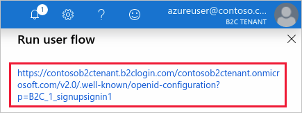

# Secure an Azure API Management API with Azure AD B2C tokens

In this article, you learn how to secure an API in Azure API Management using Azure AD B2C-generated tokens, including support for multiple issuing domains.

## Prerequisites

You need the following resources in place before continuing with the steps in this article:

* [Azure AD B2C tenant](tutorial-create-tenant.md)
* [Application registered](tutorial-register-applications.md) in your tenant
* [User flows created](tutorial-create-user-flows.md) in your tenant
* [Published API](../api-management/import-and-publish.md) in Azure API Management

## Get token issuer endpoint

You first need to get the token issuer endpoint URI for the issuer you want to support in Azure API Management. To get the *b2clogin.com* endpoint supported by your Azure AD B2C tenant, use the following procedure.

1. Navigate to your Azure AD B2C tenant in the [Azure portal](https://portal.azure.com)
1. Under **Policies**, select **User flows (policies)**
1. Select an existing policy, for example *B2C_1_signupsignin1*, then select **Run user flow**
1. Under the **Run user flow** heading near the top of the page, select the hyperlink to navigate to the OpenID Connect discovery endpoint for that user flow.

    

1. In the page that opens in your browser, record the `issuer` value, for example:

    `https://your-b2c-tenant.b2clogin.com/xxxxxxxx-xxxx-xxxx-xxxx-xxxxxxxxxxxx/v2.0/`

You use this value in the next section when you configure your API in Azure API Management.

## Configure validation in Azure API Management

1. Navigate to your Azure API Management instance in the [Azure portal](https://portal.azure.com)
1. Select **APIs**
1. Select the API that you want to secure with Azure AD B2C
1. Select the **Design** tab
1. Under **Inbound processing**, select **\</\>** to open the policy code editor
1. Place the following `<validate-jwt>` tag inside the `<inbound>` policy.

    Update the `url` value in `<openid-config>` tag with your policy's `.well-known` configuration URL. Update the `aud` value with Application ID of the application you created previously in your B2C tenant (for example, *webapp1*).

    ```xml
    <policies>
        <inbound>
            <validate-jwt header-name="Authorization" failed-validation-httpcode="401" failed-validation-error-message="Unauthorized. Access token is missing or invalid.">
                <openid-config url="https://yourb2ctenant.b2clogin.com/yourb2ctenant.onmicrosoft.com/v2.0/.well-known/openid-configuration?p=B2C_1_signupsignin1" />
                <required-claims>
                    <claim name="aud">
                        <value>40000000-0000-0000-0000-000000000000</value>
                    </claim>
                    <claim name="iss">
                        <value>https://yourb2ctenant.b2clogin.com/80000000-0000-0000-0000-000000000000/v2.0/</value>
                    </claim>
                </required-claims>
            </validate-jwt>
            <base />
        </inbound>
        <backend> <base /> </backend>
        <outbound> <base /> </outbound>
        <on-error> <base /> </on-error>
    </policies>
    ```

## Validate Azure API Management configuration

You can validate the API using a tool like Postman. Get the B2C-generated token, then add it to Authorization header when calling the Azure API.

For example, in Postman:


## Enable multiple JWT validation in Azure API Management

You can add multiple JWT validations in Azure API Management. This is useful when you generate tokens using multiple issuer URLs for B2C (for example, `logn.microsoftonline.com` and `b2clogin.com`) to validate against a single API in Azure API Management.

## Migrate an existing API to b2clogin.com

**[TODO: This might go in its own doc that talks about migrating APIM-fronted APIs protected by B2C to b2clogin.com]**

If you previously protected an API in Azure API Management with Azure AD B2C using the `login.microsoftonline.com` issuer endpoint, you should migrate the API to support tokens issued by [b2clogin.com](b2clogin.md). During the migration, you might wish to support both endpoints to continue supporting clients with tokens issued by the legacy `login.microsoftonline.com` endpoint.

To enable support for multiple token issuer domains, use the `<choose>` in your API Management policy tag to enable a branching flow within the policy. To inform the API which condition to validate, modify the `Authorization` header.

For example, this policy enables support for

```xml
<policies>
    <inbound>
        <choose>
            <when condition="@(context.Request.Headers.GetValueOrDefault("Domain", "") == "b2clogin.com")">
                <validate-jwt header-name="Authorization" failed-validation-httpcode="401" failed-validation-error-message="Unauthorized. Access token is missing or invalid.">
                    <openid-config url="https://testapimanagement.b2clogin.com/testapimanagement.onmicrosoft.com/v2.0/.well-known/openid-configuration?p=B2C_1A_signup_signin" />
                    <required-claims>
                        <claim name="aud">
                            <value>40000000-0000-0000-0000-000000000000</value>
                        </claim>
                        <claim name="iss">
                            <value>https://testapimanagement.b2clogin.com/80000000-0000-0000-0000-000000000000/v2.0/</value>
                        </claim>
                    </required-claims>
                </validate-jwt>
            </when>
            <when condition="@(context.Request.Headers.GetValueOrDefault("Domain", "") == "microsoftonline.com")">
                <validate-jwt header-name="Authorization" failed-validation-httpcode="401" failed-validation-error-message="Unauthorized. Access token is missing or invalid.">
                    <openid-config url="https://login.microsoftonline.com/testapimanagement.onmicrosoft.com/v2.0/.well-known/openid-configuration?p=B2C_1A_signup_signin" />
                    <required-claims>
                        <claim name="aud">
                            <value>40000000-0000-0000-0000-000000000000</value>
                        </claim>
                        <claim name="iss">
                            <value>https://login.microsoftonline.com/80000000-0000-0000-0000-000000000000/v2.0/</value>
                        </claim>
                    </required-claims>
                </validate-jwt>
            </when>
            <otherwise>
                <validate-jwt header-name="Authorization" failed-validation-httpcode="401" failed-validation-error-message="Unauthorized. Access token is missing or invalid.">
                    <openid-config url="https://login.microsoftonline.com/tfp/testapimanagement.onmicrosoft.com/B2C_1A_signup_signin/v2.0/.well-known/openid-configuration" />
                    <required-claims>
                        <claim name="aud">
                            <value>40000000-0000-0000-0000-000000000000</value>
                        </claim>
                    </required-claims>
                </validate-jwt>
            </otherwise>
        </choose>
        <base />
    </inbound>
    <backend> <base /> </backend>
    <outbound> <base /> </outbound>
    <on-error> <base /> </on-error>
</policies>
```

## Validate Azure API Management in multiple config URLs case

**[TODO: EXPLANATION HERE]**

Example request:


