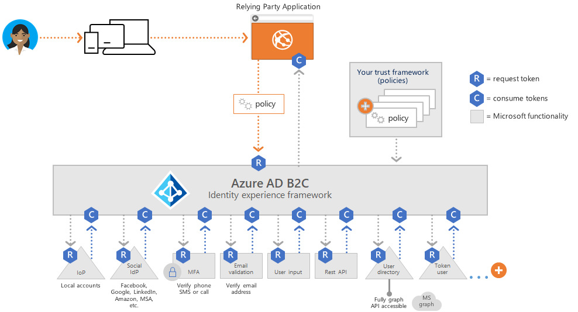
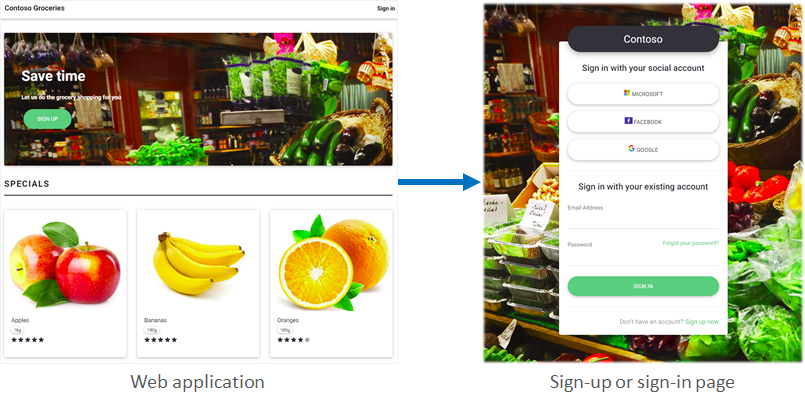
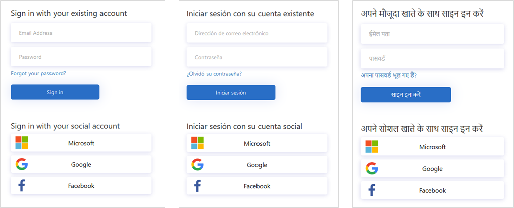
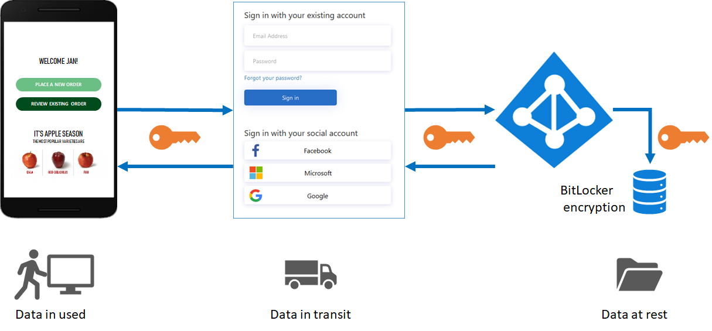

# Technical overview of Azure Active Directory B2C

A companion to [About Azure Active Directory B2C](active-directory-b2c-overview.md), this article provides a more in-depth introduction to the service. Discussed here are the primary resources you work with in the service, its features, and how these enable you to provide a fully custom identity experience for your customers in your applications.

## Azure AD B2C tenant

In Azure Active Directory B2C (Azure AD B2C), a *tenant* represents your organization and is a directory of users. Each Azure AD B2C tenant is distinct and separate from other Azure AD B2C tenants. An Azure AD B2C tenant is different than an Azure Active Directory tenant, which you may already have.

The primary resources you work with in an Azure AD B2C tenant are:

* **Directory** - The *directory* is where Azure AD B2C stores your users’ credentials and their profile data.
* **Applications** - You register your web, mobile, and native applications with Azure AD B2C to enable identity management. Also, any APIs you want to protect with Azure AD B2C.
* **User flows** and **custom policies** - These provide the built-in (user flows) and fully customizable (custom policies) identity user journeys for your applications.
  * Use *user flows* for quick configuration and enablement of common identity tasks like sign up, sign in, and profile editing.
  * Use *custom policies* to enable user experiences not only for the common identity tasks, but also for crafting support for complex identity workflows unique to your organization, customers, employees, partners, and citizens.
* **Identity providers** - These are the federation settings for:
  * The *social* identity providers like Facebook, LinkedIn, or Twitter that you want to support in your applications.
  * Any *external* identity providers that support standard identity protocols like OAuth 2.0, OpenID Connect, and more.
  * *Local* accounts that enable users to sign up and sign in with a username (or email address or other ID) and password.
* **Keys** - Add and manage encryption keys for signing and validating tokens.

An Azure AD B2C tenant is the first resource you need to create to get started with Azure AD B2C. Learn how in [Tutorial: Create an Azure Active Directory B2C tenant](tutorial-create-tenant.md).

## Accounts in Azure AD B2C

Azure AD B2C defines several types of user accounts. Azure Active Directory, Azure Active Directory B2B, and Azure Active Directory B2C share these account types.

* **Work account** - Users with work accounts can manage resources in a tenant, and with an administrator role, can also manage tenants. Users with work accounts can create new consumer accounts, reset passwords, block/unblock accounts, and set permissions or assign an account to a security group.
* **Guest account** - External users you invite to your tenant as guests. A typical scenario for inviting a guest user to your Azure AD B2C tenant is to share administration responsibilities.
* **Consumer account** - Consumer accounts are the accounts created in your Azure AD B2C directory when users complete the sign-up user journey in an application you've registered in your tenant.

 *Figure: User directory within an Azure AD B2C tenant in the Azure portal*

### Consumer accounts

With a *consumer* account, users can sign in to the applications that you've secured with Azure AD B2C. Users with consumer accounts can't, however, access Azure resources, for example the Azure portal.

A consumer account can be associated with these identity types:

* **Local** identity, with the username and password stored locally in the Azure AD B2C directory. We often refer to these as as "local accounts."
* **Social** or **enterprise** identities, where the identity of the user is managed by a federated identity provider like Facebook, Microsoft, Twitter, or Google.

A user with a consumer account can sign in with multiple identities, for example username, email, employee ID, government ID, and others. A single account can have multiple identities, both local and social.

 *Figure: A single consumer account with multiple identities in Azure AD B2C*

Azure AD B2C lets you manage common attributes of consumer account profiles like display name, surname, given name, city, and others. You can also extend the Azure AD schema to store additional information about your users. For example, their country or residency, preferred language, and preferences like whether they want to subscribe to a newsletter or enable multi-factor authentication.

Learn more about the user account types in Azure AD B2C in [Overview of user accounts in Azure Active Directory B2C](user-overview.md).

## External identity providers

You can configure Azure AD B2C to allow users to sign in to your application with credentials from external social or enterprise identity providers (IdP). Azure AD B2C supports external identity providers like Facebook, Microsoft account, Google, Twitter, and any identity provider that supports OAuth 1.0, OAuth 2.0, OpenID Connect, SAML, or WS-Federation protocols.

With external identity provider federation, you can offer your consumers the ability to sign in with their existing social or enterprise accounts, without having to create a new account just for your application.

On the sign-up or sign-in page, Azure AD B2C presents a list of external identity providers the user can choose for sign-in. Once they select one of the external identity providers, they're taken (redirected) to the selected provider's website to complete the sign in process. After the user successfully signs in, they're returned back to Azure AD B2C for authentication of the account in your application.

To see how to add identity providers in Azure AD B2C, see [Tutorial: Add identity providers to your applications in Azure Active Directory B2C](tutorial-add-identity-providers.md).

## Identity experiences: user flows or custom policies

The extensible policy framework of Azure AD B2C is its core strength. Policies describe your users' identity experiences such as sign up, sign in, and profile editing.

In Azure AD B2C, there are two primary paths you can take to provide these identity experiences: user flows and custom policies.

* **User flows** are predefined, built-in, and configurable policies that we provide so you can create sign up, sign in, and policy editing experiences in minutes.

* **Custom policies** enable you create your own user journeys for more complex scenarios not.

Both user flows and custom policies are powered by the *Identity Experience Framework*, Azure AD B2C's policy orchestration engine.

### User flow

To help you quickly set up the most common identity tasks, the Azure portal includes several predefined and configurable policies called *user flows*.

You can configure user flow settings like these to control identity experience behaviors in your applications:

* Account types used for sign-in, such as social accounts like a Facebook or local accounts
* Attributes to be collected from the consumer, such as first name, postal code, or country of residency
* Azure Multi-Factor Authentication (MFA)
* Customization of the user interface
* Set of claims in a token that your application receives after the user completes the user flow.
* Session management
* ...and more.

### Custom policy

Custom policies unlock access to the full power of the Identity Experience Framework (IEF) orchestration engine. With custom policies, you can leverage IEF to build almost any authentication, user registration, or profile editing experience that you can imagine.

The Identity Experience Framework gives you the ability to construct user journeys with any combination of steps. For example:

* Federate with other identity providers
* First- third-party multi-factor authentication (MFA) challenges
* Collect any user input
* Integrate with external systems using REST API communication

Each such user journey is defined by a policy, and you can build as many or as few policies as you need to enable the best user experience for your business.

A custom policy is defined by several XML files that refer to each other in a hierarchical chain. The XML elements define the claims schema, claims transformations, content definitions, claims providers, technical profiles, and user journey orchestration steps, among other elements.

While powerful, custom policies are most appropriate for complex identity scenarios. Developers configuring custom policies must define the trusted relationships in careful detail to include metadata endpoints, exact claims exchange definitions, and configure secrets, keys, and certificates as needed by each identity provider.

## Protocols and tokens

Azure AD B2C supports the [OpenID Connect and OAuth 2.0 protocols](active-directory-b2c-reference-protocols.md) for user journeys. In the Azure AD B2C implementation of OpenID Connect, your application starts the user journey by issuing authentication requests to Azure AD B2C.

The result of a request to Azure AD B2C is a security token, such as an [ID token or access token](active-directory-b2c-reference-tokens.md). This security token defines the user's identity. Tokens are received from Azure AD B2C endpoints, such as a `/token` or `/authorize` endpoint. From these tokens, you can access claims that can be used to validate an identity and allow access to secure resources.

For external identity providers, Azure AD B2C supports federated with OAuth1, OAuth2, OpenID Connect, SAML and WS-Fed.

The diagram demonstrates how Azure AD B2C can communicate with verity of protocols in the same authentication flow context. The relying party application initiates an authorization request to Azure AD B2C, over OpenID connect. When a user clicks on one of the "Contoso employee" external identity providers, Azure AD B2C switches protocols to SAML, to communicate with the external identity provider, using the protocol supported by the selected external identify provider. After user complete the sign-in on the external identity provider, Azure AD B2C returns the token back to the relying party application using OpenID Connect.

## Application integration

When a user wants to sign-in to your application, regardless if it is a web, mobile, desktop, or single page application, the app initiates an authorization request to one of the user-flows or custom policy. The user flow and custom policy control exactly what the experience should be for the user. After a user complete the user flow, for example, after user sign-up or sign-in, Azure AD B2C generates a token and takes the user back to the application.

Multiple applications can use the same user flow. A single application can use multiple policies. For example, to sign-in to an application, the app uses the sign-up or sing-in user flow. After user is signed-in, a user may want to edit her/his profile, so the app may initiate another authorization request, this time to the profile edit user flow.

## Seamless User Experiences

User experience is paramount in a customer facing application. Grow your customer base by crafting user experiences with the look and feel of your brand. With Azure AD B2C, you get nearly full control of the HTML CSS content that's presented to users. Maintain brand and visual consistency between your application and Azure AD B2C.

## Localization

Language customization in Azure AD B2C allows you to accommodate different languages to suit your customer needs. Microsoft provides the translations for 36 languages, but you can also provide your own translations for any language. Even if your experience is provided for only a single language, you can customize any text on the pages.

## Add your own business logic

With Azure B2C custom policy, you can integrate with a RESTful API in a user journey. By integrating with RESTful services, you can add your own business logic to a user journey. Azure AD B2C can send receive data from RESTful, or display a user friendly error message to the user.

With RESTful services integration you can validate user input data to prevent malformed data from persisting into Azure AD. Overwrite data entered by the user, such as the first name in all lowercase or all uppercase letters, you can format the name with only the first letter capitalized. Enrich user data by further integrating with corporate line-of-business applications. Your RESTful service can receive the user's email address, query the customer's database, and return the user's loyalty number to Azure AD B2C. The return data can be stored in the user's Azure AD account, evaluated in the next steps in the policy, or included in the access token. Using RESTful call you can also send push notifications, update corporate databases, run a user migration process, manage permissions, audit databases, and perform other actions.

You can add a REST API call at any step in the user journey. For example, you can call a REST API, during sing-in just before Azure AD B2C validates the credentials, or immediately after. Before B2C creates a new account in the directory or after, or just before Azure AD B2C issues the access token.

## Protect customer identities

Azure AD B2C complies with the security, privacy, and other commitments described in the [Microsoft Azure Trust Center](https://www.microsoft.com/en-us/trustcenter/cloudservices/azure). Sessions are modeled as encrypted data where the decryption key is only known to Azure AD B2C Security Token Service. A strong encryption algorithm is used (AES192). All communication paths are protected with TLS for confidentiality and integrity. Our Security Token Service uses an Extended Validation (EV) certificate for TLS. In general, the Security Token Service mitigates XSS attacks by not rendering untrusted input.

### Access to user data

Azure AD B2C tenants share many characteristics with Azure Active Directory tenants used for employees and partners including the mechanisms to view roles, assign roles and audit activities. For more information, see [Administrator role permissions in Azure Active Directory](https://docs.microsoft.com/en-us/azure/active-directory/users-groups-roles/directory-assign-admin-roles). There are set of roles that are relevant to Azure AD B2C, such as:

- Who can create and manage all aspects of user flows.
- Who can create and manage the attribute schema available to all user flows.
- Who can configure identity providers for use in direct federation.
- Who can create and manage trust framework policies in the Identity Experience Framework (IEF, a.k.a. custom policy).
Who can manage secrets for federation and encryption in the Identity Experience Framework (IEF)

### Multi factor authentication

Azure AD B2C Multi-Factor Authentication (MFA) helps safeguard access to data and applications while maintaining simplicity for users. It provides additional security by requiring a second form of authentication and delivers strong authentication via a range of easy to use authentication methods. Users may or may not be challenged for MFA based on configuration decisions that an administrator makes.

### Account smart lockout

To prevent brute force attempts, Azure AD B2C uses a sophisticated strategy used to lock accounts based on the IP of the request and the passwords entered and some other factors. Duration of lockout increased based on risk and number of tries.

Lockout occurs generally after 10 suspicious unsuccessful attempts, a lockout occurs. The next unsuccessful attempt after the account unlocks triggers another lockout, and so forth. The first ten lockout periods are between 1-5 minutes long, the next 10 are slightly longer, and so forth, with the periods increasing in duration after every 10 lockout periods.

### Password complexity

During sign-up or password reset, an end user must supply a password that meets the complexity rules. By default, Azure AD B2C uses Strong passwords rules. Azure AD B2C also supports configuration options to control the complexity of passwords that customers can use.

## Auditing and logs

Azure AD B2C emits audit logs containing activity information about B2C resources, issued tokens, and administrator access. Use the audit logs to understand platform activity and  diagnose issues. You can read the auditing logs entities a couple of minutes after the activity. In the auditing log you can find information such as:
- Activities concerning the authorization of a user to access B2C resources (for example, an administrator accessing a list of B2C policies)
-
- Activities related to directory attributes retrieved when an administrator signs in using the Azure Portal
- CRUD operations on B2C applications
- CRUD operations on keys stored in B2C key container
- CRUD operations on B2C resources (for example, policies and identity providers)
- Validation of user credentials and token issuance

The audit log is available at your Azure AD B2C tenant, or for a particular user.

### Usage insights

Azure AD B2C allows you to find out when people sign-up or sign-in to your web app, where your users are located, and what browsers and operating systems they use. By integrating Azure Application Insights into Azure AD B2C, you gain powerful insights into how people sign-up, sign-in, reset their password or edit the profile. With this knowledge, you can make data driven decisions about your next development cycles.

## Next steps

Now that you have deeper view into the features and technical aspects Azure Active Directory B2C, get started with the service by creating a B2C tenant:

> [!div class="nextstepaction"]
> [Tutorial: Create an Azure Active Directory B2C tenant >](tutorial-create-tenant.md)