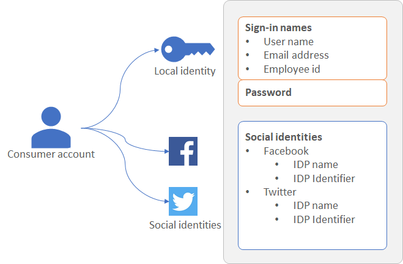
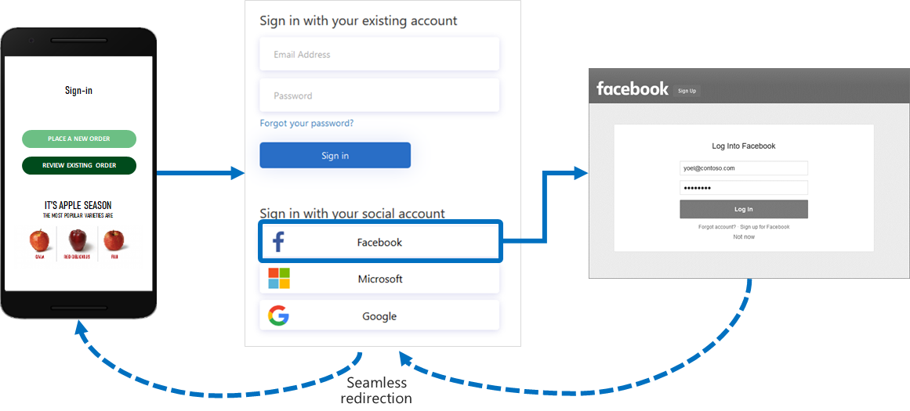
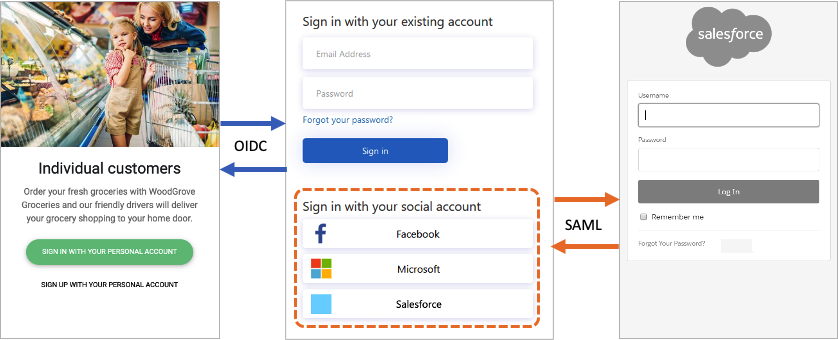
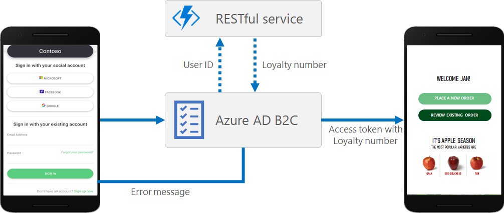
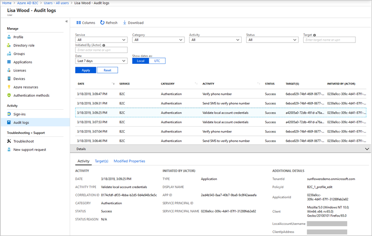

# Technical overview of Azure Active Directory B2C

## Azure AD B2C Tenant

In Azure AD B2C, a tenant represents your organization and is a directory of users. Each Azure AD B2C tenant is distinct and separate from other Azure AD B2C tenants. You may already have an Azure Active Directory tenant, the Azure AD B2C tenant is a different tenant.

An Azure AD B2C tenant contains the **Directory**, where Azure AD B2C stores the users’ credential and profiles. **Applications** registrations. **User flows** and **custom policies**, a redefined user flows for the most common identity tasks, such as sign-up, sign-in, and profile editing, are available in the Azure portal. **External identity providers** federation settings, **Keys** to sign and validate tokens, and more.

## Azure AD B2C accounts

In Azure Active Directory (Azure AD) B2C, you can use different types of accounts. Azure Active Directory, Azure Active Directory B2B, and Azure Active Directory B2C share in the types of user accounts that can be used.

- **Work account** - Access resources in a tenant, and with an administrator role, can manage tenants.
- **Guest account** - You can invite external users to your tenant as a guest user. A typical scenario for inviting a guest user to your Azure AD B2C tenant is to share administration responsibilities.
- **Consumer account** - A consumer account is created by going through a sign-up user flow in an Azure AD B2C application, and is used by users of the applications that are registered with Azure AD B2C.

Work and guest accounts are intended to manage your Azure AD B2C tenant. From Azure Portal, you create new account, reset password, block/unblock an account, set permissions or assign an account to a security group.

With Azure AD B2C consumer account, users can sign in to your applications that are secured by Azure AD B2C. Consumer accounts cannot access Azure resources such as the Azure portal. The consumer account can have:

- **Local identity** with username and password stored localy in Azure AD B2C directory .
- **social** or **enterprise identities**, the identity of the user is managed by a federated identity provider, such as Facebook, Microsoft, Twitter, or Google.

An account can sign-in with multiple identities, such as username, email, employee id, social security number and more. A single account can have multiple identities, local and social identities.

Azure AD B2C lets you manager your consumer accounts profile including common attributes, such as: display name, surname, given name, city, and more. You can extend the Azure AD schema to store more information about your users, such as country or residency, preferred language, user preferences such as subscribe to a newsletter, of ever apply multi-factor authentication.

## External identity providers

You can configure Azure AD B2C to allow users to sign-in to your application with credentials from external social or enterprise identity providers, such as Facebook, Microsoft account, Google, Twitter, or any identity provider that supports OAuth1, OAuth2, OpenID Connect, SAML, and Ws-Fed protocols.

With external identity providers federation, you can offer your consumers the ability to sign-in with an existing social or enterprise accounts, without the need to create a new account only for your application.

On the sign-up or sign-in page, Azure AD B2C presents a list of external identity providers user can choose to sign-in. Once the user clicks on one of the external identity providers, the user is taken (redirect) to the selected identity to complete the sign-in. After the user has successfully signed-in, the user is return back to Azure AD B2C that authenticate the account into your application.

## Built-in or fully custom user journeys

Flexibility is a key part of Azure Active Directory B2C. You can choose from two configuration options to suit your needs. Use user flow to create a login experience in minutes. For more complex scenarios, you can use Identity Experience Framework custom policies to create your own user journeys. Both "user flow" and "custom policy" are served by Azure AD B2C Identity Experience Framework.

The custom policy is a fully configurable, policy-driven that orchestrates trust between entities in standard protocol formats such as OpenID Connect, OAuth, SAML, WS-Fed, and a few non-standard ones, for example REST API-based system-to-system claims exchanges

## User Flow

The extensible policy framework of Azure Active Directory (Azure AD) B2C is the core strength of the service. Policies fully describe identity experiences such as sign-up, sign-in, or profile editing. To help you set up the most common identity tasks, the Azure AD B2C portal includes predefined, configurable policies called **user flows**.

A user flow enables you to control behaviors in your applications by configuring the following settings: Account types used for sign-in, such as social accounts like a Facebook or local accounts. Attributes to be collected from the consumer, such as first name, postal code, or country of residency.
Azure Multi-Factor Authentication. Customization of the user interface.
Set of claims in a token that application receives after user complete the user flow. Session management, and more.

## Custom policy

The power of Azure AD B2C lies in the Identity Experience Framework (IEF). This framework is an extremely powerful orchestration engine which can be used to build almost any authentication, user registration, or profile editing experience that you can imagine. The Identity Experience Framework gives you the ability to construct user journeys out of any combination of steps such as: federation with other identity providers, first party and 3rd party MFA challenges, collecting user input, and integration with external systems using REST API communication.

Each of these user journeys is defined by a policy, and you can build as many or as few policies as you need to enable the best user experience for your business.

A custom policy is represented as one or several XML-formatted files that refer to each other in a hierarchical chain. The XML elements define the claims schema, claims transformations, content definitions, claims providers, technical profiles, and user journey orchestration steps, among other elements. Developers configuring custom policies must define the trusted relationships in careful detail to include metadata endpoints, exact claims exchange definitions, and configure secrets, keys, and certificates as needed by each identity provider.

## Protocols and tokens

Azure AD B2C supports the [OpenID Connect and OAuth 2.0 protocols](active-directory-b2c-reference-protocols.md) for user journeys. In the Azure AD B2C implementation of OpenID Connect, your application starts the user journey by issuing authentication requests to Azure AD B2C.

The result of a request to Azure AD B2C is a security token, such as an [ID token or access token](active-directory-b2c-reference-tokens.md). This security token defines the user's identity. Tokens are received from Azure AD B2C endpoints, such as a `/token` or `/authorize` endpoint. From these tokens, you can access claims that can be used to validate an identity and allow access to secure resources.

For external identity providers, Azure AD B2C supports federated with OAuth1, OAuth2, OpenID Connect, SAML and WS-Fed.

The diagram demonstrates how Azure AD B2C can communicate with verity of protocols in the same authentication flow context. The relying party application initiates an authorization request to Azure AD B2C, over OpenID connect. When a user clicks on one of the "Contoso employee" external identity providers, Azure AD B2C switches protocols to SAML, to communicate with the external identity provider, using the protocol supported by the selected external identify provider. After user complete the sign-in on the external identity provider, Azure AD B2C returns the token back to the relying party application using OpenID Connect.

## Application integration

When a user wants to sign-in to your application, regardless if it is a web, mobile, desktop, or single page application, the app initiates an authorization request to one of the user-flows or custom policy. The user flow and custom policy control exactly what the experience should be for the user. After a user complete the user flow, for example, after user sign-up or sign-in, Azure AD B2C generates a token and takes the user back to the application.

Multiple applications can use the same user flow. A single application can use multiple policies. For example, to sign-in to an application, the app uses the sign-up or sing-in user flow. After user is signed-in, a user may want to edit her/his profile, so the app may initiate another authorization request, this time to the profile edit user flow.

## Seamless User Experiences

User experience is paramount in a customer facing application. Grow your customer base by crafting user experiences with the look and feel of your brand. With Azure AD B2C, you get nearly full control of the HTML CSS content that's presented to users. Maintain brand and visual consistency between your application and Azure AD B2C.

## Localization

Language customization in Azure AD B2C allows you to accommodate different languages to suit your customer needs. Microsoft provides the translations for 36 languages, but you can also provide your own translations for any language. Even if your experience is provided for only a single language, you can customize any text on the pages.

## Add your own business logic

With Azure B2C custom policy, you can integrate with a RESTful API in a user journey. By integrating with RESTful services, you can add your own business logic to a user journey. Azure AD B2C can send receive data from RESTful, or display a user friendly error message to the user.

With RESTful services integration you can validate user input data to prevent malformed data from persisting into Azure AD. Overwrite data entered by the user, such as the first name in all lowercase or all uppercase letters, you can format the name with only the first letter capitalized. Enrich user data by further integrating with corporate line-of-business applications. Your RESTful service can receive the user's email address, query the customer's database, and return the user's loyalty number to Azure AD B2C. The return data can be stored in the user's Azure AD account, evaluated in the next steps in the policy, or included in the access token. Using RESTful call you can also send push notifications, update corporate databases, run a user migration process, manage permissions, audit databases, and perform other actions.

You can add a REST API call at any step in the user journey. For example, you can call a REST API, during sing-in just before Azure AD B2C validates the credentials, or immediately after. Before B2C creates a new account in the directory or after, or just before Azure AD B2C issues the access token.

## Protect customer identities

Azure AD B2C complies with the security, privacy, and other commitments described in the [Microsoft Azure Trust Center](https://www.microsoft.com/en-us/trustcenter/cloudservices/azure). Sessions are modeled as encrypted data where the decryption key is only known to Azure AD B2C Security Token Service. A strong encryption algorithm is used (AES192). All communication paths are protected with TLS for confidentiality and integrity. Our Security Token Service uses an Extended Validation (EV) certificate for TLS. In general, the Security Token Service mitigates XSS attacks by not rendering untrusted input.

### Access to user data

Azure AD B2C tenants share many characteristics with Azure Active Directory tenants used for employees and partners including the mechanisms to view roles, assign roles and audit activities. For more information, see [Administrator role permissions in Azure Active Directory](https://docs.microsoft.com/en-us/azure/active-directory/users-groups-roles/directory-assign-admin-roles). There are set of roles that are relevant to Azure AD B2C, such as:

- Who can create and manage all aspects of user flows.
- Who can create and manage the attribute schema available to all user flows.
- Who can configure identity providers for use in direct federation.
- Who can create and manage trust framework policies in the Identity Experience Framework (IEF, a.k.a. custom policy).
Who can manage secrets for federation and encryption in the Identity Experience Framework (IEF)

### Multi factor authentication

Azure AD B2C Multi-Factor Authentication (MFA) helps safeguard access to data and applications while maintaining simplicity for users. It provides additional security by requiring a second form of authentication and delivers strong authentication via a range of easy to use authentication methods. Users may or may not be challenged for MFA based on configuration decisions that an administrator makes.

### Account smart lockout

To prevent brute force attempts, Azure AD B2C uses a sophisticated strategy used to lock accounts based on the IP of the request and the passwords entered and some other factors. Duration of lockout increased based on risk and number of tries.

Lockout occurs generally after 10 suspicious unsuccessful attempts, a lockout occurs. The next unsuccessful attempt after the account unlocks triggers another lockout, and so forth. The first ten lockout periods are between 1-5 minutes long, the next 10 are slightly longer, and so forth, with the periods increasing in duration after every 10 lockout periods.

### Password complexity

During sign-up or password reset, an end user must supply a password that meets the complexity rules. By default, Azure AD B2C uses Strong passwords rules. Azure AD B2C also supports configuration options to control the complexity of passwords that customers can use.

## Auditing and logs

Azure AD B2C emits audit logs containing activity information about B2C resources, issued tokens, and administrator access. Use the audit logs to understand platform activity and  diagnose issues. You can read the auditing logs entities a couple of minutes after the activity. In the auditing log you can find information such as:
- Activities concerning the authorization of a user to access B2C resources (for example, an administrator accessing a list of B2C policies)
-
- Activities related to directory attributes retrieved when an administrator signs in using the Azure Portal
- CRUD operations on B2C applications
- CRUD operations on keys stored in B2C key container
- CRUD operations on B2C resources (for example, policies and identity providers)
- Validation of user credentials and token issuance

The audit log is available at your Azure AD B2C tenant, or for a particular user.

### Usage insights

Azure AD B2C allows you to find out when people sign-up or sign-in to your web app, where your users are located, and what browsers and operating systems they use. By integrating Azure Application Insights into Azure AD B2C, you gain powerful insights into how people sign-up, sign-in, reset their password or edit the profile. With this knowledge, you can make data driven decisions about your next development cycles.

## Next steps

Now that you have deeper view into the features and technical aspects Azure Active Directory B2C, get started with the service by creating a B2C tenant:

> [!div class="nextstepaction"]
> [Tutorial: Create an Azure Active Directory B2C tenant >](tutorial-create-tenant.md)