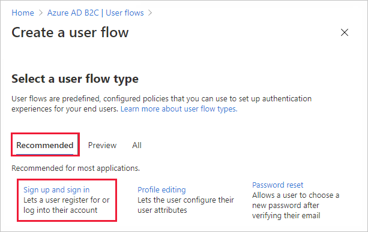
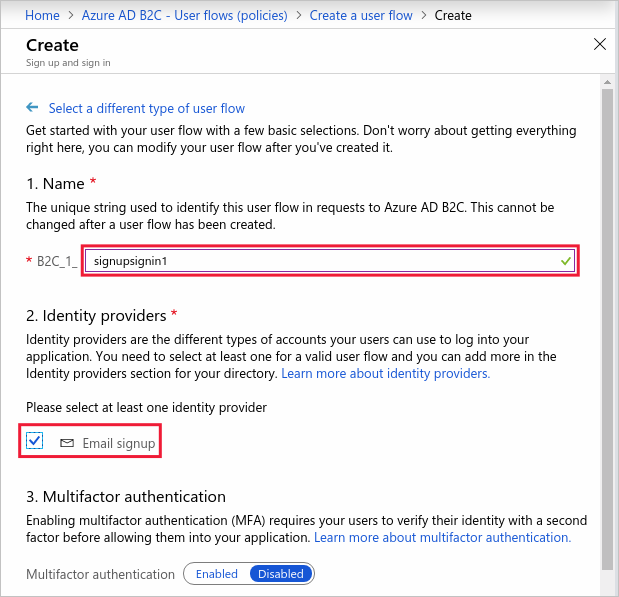

# Tutorial: Create user flows in Azure Active Directory B2C

In your applications, you may have [user flows](active-directory-b2c-reference-policies.md) that enable users to sign up, sign in, or manage their profile. You can create multiple user flows of different types in your Azure Active Directory (Azure AD) B2C tenant and use them in your applications as needed. User flows can be reused across applications.

In this article, you learn how to:

> [!div class="checklist"]
> * Create a sign-up and sign-in user flow
> * Create a profile editing user flow
> * Create a password reset user flow

This tutorial shows you how to create some recommended user flows by using the Azure portal. If you are looking for information about how to set up a resource owner password credentials (ROPC) flow in your application, see [Configure the resource owner password credentials flow in Azure AD B2C](configure-ropc.md).

If you don't have an Azure subscription, create a [free account](https://azure.microsoft.com/free/?WT.mc_id=A261C142F) before you begin.

## Prerequisites

[Register your applications](tutorial-register-applications.md) that are part of the user flows you want to create. 

## Create a sign-up and sign-in user flow

The sign-up and sign-in user flow handles both sign-up and sign-in experiences with a single configuration. Users of your application are led down the right path depending on the context.

1. Make sure you're using the directory that contains your Azure AD B2C tenant by clicking the **Directory and subscription filter** in the top menu and choosing the directory that contains your tenant.

    

2. Choose **All services** in the top-left corner of the Azure portal, and then search for and select **Azure AD B2C**.
3. In the left menu, select **User flows**, and then select **New user flow**.

    

4. Select the **Sign-up and sign-in** user flow on the Recommended tab.

    

5. Enter a **Name** for the user flow. For example, *signupsignin1*.
6. For **Identity providers**, select **Email signup**.

    

7. For **User attributes and claims**, choose the claims and attributes that you want to collect and send from the user during sign-up. For example, select **Show more**, and then choose **Country/Region**, **Display Name**, and **Postal Code**. Click **OK**.

    

8. Click **Create** to add the user flow. A prefix of *B2C_1* is automatically appended to the name.

### Test the user flow

1. On the Overview page of the user flow that you created, select **Run user flow**.
2. For **Application**, select the web application named *webapp1* that you previously registered. The **Reply URL** should show `https://jwt.ms`.
3. Click **Run user flow**, and then select **Sign up now**.

    

4. Enter a valid email address, click **Send verification code**, and then enter the verification code that you receive.
5. Enter a new password and confirm the password.
6. Enter the name that you want displayed, select your country and region, enter a postal code, and then click **Create**. The token is returned to `https://jwt.ms` and should be displayed to you.
7. You can now run the user flow again and you should be able to sign in with the account that you just created. The returned token includes the claims that you selected of name, country, and postal code.

## Create a profile editing user flow

If you want to enable users to edit their profile in your application, you use a profile editing user flow.

1. In the left menu, select **User flows**, and then select **New user flow**.
2. Select the **Profile editing** user flow on the Recommended tab.
3. Enter a **Name** for the user flow. For example, *profileediting1*.
4. For **Identity providers**, select **Local Account SignIn**.
5. For **User attributes**, choose the attributes that you want the customer to be able to edit in their profile. For example, select **Show more**, and then choose **Display Name** and **Job title**. Click **OK**.
6. Click **Create** to add the user flow. A prefix of *B2C_1* is automatically appended to the name.

### Test the user flow

1. On the Overview page of the user flow that you created, select **Run user flow**.
2. For **Application**, select the web application named *webapp1* that you previously registered. The **Reply URL** should show `https://jwt.ms`.
3. Click **Run user flow**, and then sign in with the account that you previously created.
4. You now have the opportunity to change the display name and job title for the user. Click **Continue**. The token is returned to `https://jwt.ms` and should be displayed to you.

## Create a password reset user flow

It's possible for you to enable the user of your application to reset their password if needed. To enable password reset, you use a password reset user flow.

1. In the left menu, select **User flows**, and then select **New user flow**.
2. Select the **Password reset** user flow on the Recommended tab.
3. Enter a **Name** for the user flow. For example, *passwordreset1*.
4. For **Identity providers**, enable **Reset password using email address**.
5. Under Application claims, click **Show more** and choose the claims that you want returned in the authorization tokens sent back to your application. For example, select **User's Object ID**.
6. Click **OK**.
7. Click **Create** to add the user flow. A prefix of *B2C_1* is automatically appended to the name.

### Test the user flow

1. On the Overview page of the user flow that you created, select **Run user flow**.
2. For **Application**, select the web application named *webapp1* that you previously registered. The **Reply URL** should show `https://jwt.ms`.
3. Click **Run user flow**, and then sign in with the account that you previously created.
4. You now have the opportunity to change the password for the user. Click **Continue**. The token is returned to `https://jwt.ms` and should be displayed to you.

## Next steps

In this article, you learned how to:

> [!div class="checklist"]
> * Create a sign-up and sign-in user flow
> * Create a profile editing user flow
> * Create a password reset user flow

> [!div class="nextstepaction"]
> [Customize the user interface of your applications in Azure Active Directory B2C](tutorial-customize-ui.md)