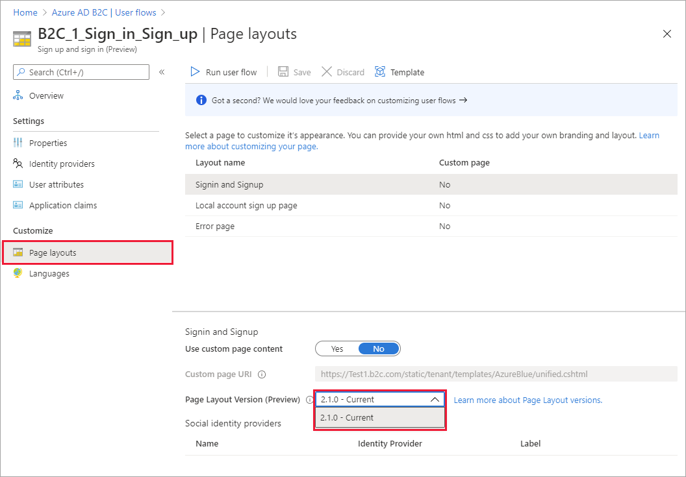

# JavaScript and page layout versions in Azure Active Directory B2C

[!INCLUDE [active-directory-b2c-public-preview](../../includes/active-directory-b2c-public-preview.md)]

Azure AD B2C provides a set of packaged content containing HTML, CSS, and JavaScript for the user interface elements in your user flows and custom policies. To enable JavaScript for your applications, you must add an element to your [custom policy](active-directory-b2c-overview-custom.md) or enable it in the portal for user flows, select a page layout, and use [b2clogin.com](b2clogin.md) in your requests.

If you intend to enable [JavaScript](javascript-samples.md) client-side code, you’ll want to be sure the elements you’re basing your JavaScript on are immutable. Otherwise, any changes could cause unexpected behavior on your user pages. To prevent these issues, you can enforce the use of a page layout and specify a page layout version. Doing this ensures that all the content definitions that you’ve based your JavaScript on are immutable. Even if you don’t intend to enable JavaScript, you can specify a page layout version for your pages.

## User flows

In the user flow properties, you can enable JavaScript, which also enforces the use of a page layout. Then you can set the page layout version for the user flow

### Select a page layout version

Whether or not you enable JavaScript in your user flow's properties, you can specify a page layout version for your user flow pages. Open the user flow and select **Page layouts**. Under **LAYOUT NAME**, select a user flow page and choose the **Page Layout Version**.

For information about the different page layout versions, see the [Version change log](page-layout.md#version-change-log).

## Custom policies

To enable JavaScript in custom policies, you add the **ScriptExecution** element to the **RelyingParty** element in your custom policy file. For more information, see [JavaScript samples for use in Azure Active Directory B2C](javascript-samples.md).

Whether or not you enable JavaScript in your custom policies, you can specify a page layout version for your pages. For more information about specifying a page layout, see [Select a page layout in Azure Active Directory B2C using custom policies](page-layout.md).

## Next steps

For information about the different page layout versions, see the **Version change log** section of [Select a page layout in Azure Active Directory B2C using custom policies](page-layout.md#version-change-log).

You can find examples of JavaScript usage in [JavaScript samples for use in Azure Active Directory B2C](javascript-samples.md).
