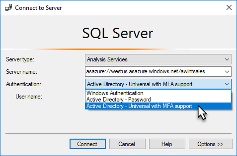

# Tutorial: Add a sample model to your server

In this tutorial, you add a sample Adventure Works model to your server. The sample model is a completed version of the Adventure Works Internet Sales (1200) sample data model. A sample model is useful for testing model management, connecting with tools and client applications, and querying model data. This tutorial uses the [Azure portal](https://portal.azure.com) and [SQL Server Management Studio](/sql/ssms/download-sql-server-management-studio-ssms.md) (SSMS) to: 

> [!div class="checklist"]
> * Add a completed sample tabular data model to a server 
> * Connect to the model with SSMS

If you don't have an Azure subscription, [create a free account](https://azure.microsoft.com/free/) before you begin.

## Before you begin

To complete this tutorial, you need:

- An Azure Analysis Services server. To learn more, see [Create a server - portal](analysis-services-create-server.md).
- Server administrator permissions
- [SQL Server Management Studio](https://docs.microsoft.com/sql/ssms/download-sql-server-management-studio-ssms)

## Sign in to the Azure portal

Sign in to the [Azure portal](https://portal.azure.com/).

## Create a sample model

1. In server **Overview**, click **New model**.

    

2. In **New model** > **Choose a datasource**,  verify **Sample data** is selected, and then click **Add**.

    

3. In **Overview**, verify the `adventureworks` sample is created.

    

## Connect with SSMS

1. Before you connect, you need to get the server name. In **Azure portal** > server > **Overview** > **Server name**, copy the server name.
   
    
2. In SSMS > **Object Explorer**, click **Connect** > **Analysis Services**.
3. In the **Connect to Server** dialog box, paste in the server name, then in **Authentication**, choose one of the following authentication types:
   
    **Windows Authentication** to use your Windows domain\username and password credentials.

    **Active Directory Password Authentication** to use an organizational account. For example, when connecting from a non-domain joined computer.

    **Active Directory Universal Authentication** to use [non-interactive or multi-factor authentication](../sql-database/sql-database-ssms-mfa-authentication.md). This is the preferred authentication type.
   
    

## Clean up resources

Your sample model is using cache memory resources. If you are not using your sample model for testing, you should remove it from your server.

> [!NOTE]
> These steps describe how to delete a model from a server by using SSMS. You can also delete a model by using the preview Web designer feature.

1. In SSMS > **Object Explorer**, click **Connect** > **Analysis Services**.

2. In **Connect to Server**, paste in the server name, then in **Authentication**, choose **Active Directory - Universal with MFA support**, enter your username, and then click **Connect**.

    

3. In **Object Explorer**, right-click the `adventureworks` sample database, and then click **Delete**.

    

## Next steps 

[Connect in Power BI Desktop](analysis-services-connect-pbi.md)   
[Manage database roles and users](analysis-services-database-users.md)

