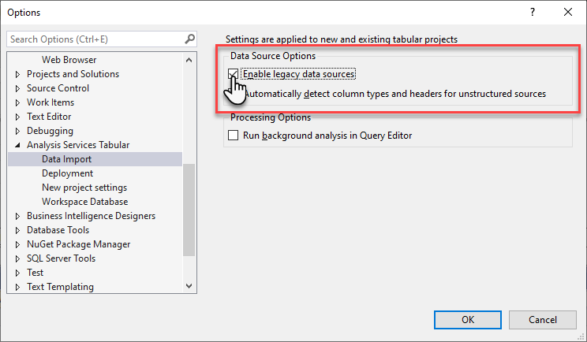
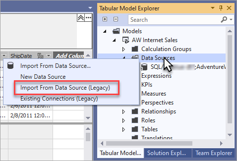
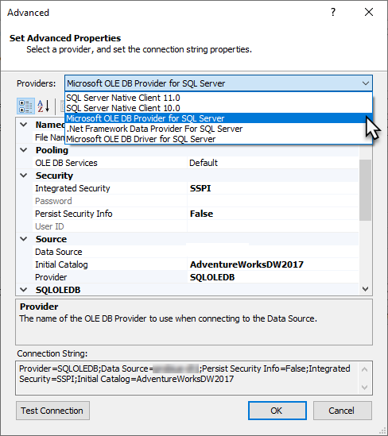

# Data sources supported in Azure Analysis Services

Data sources and connectors shown in Get Data or Table Import Wizard in Visual Studio with Analysis Services projects are shown for both Azure Analysis Services and SQL Server Analysis Services. However, not all data sources and connectors shown are supported in Azure Analysis Services. The types of data sources you can connect to depend on many factors such as model compatibility level, available data connectors, authentication type, and On-premises data gateway support. The following tables describe supported data sources for Azure Analysis Services.

## Azure data sources

|Data source  |In-memory  |DirectQuery  |Notes |
|---------|---------|---------|---------|
|Azure SQL Database      |   Yes      |    Yes      |[2](#azprovider), [3](#azsqlmanaged)|
|Azure SQL Data Warehouse      |   Yes      |   Yes       |[2](#azprovider)|
|Azure Blob Storage      |   Yes       |    No      | [1](#tab1400a) |
|Azure Table Storage     |   Yes       |    No      | [1](#tab1400a)|
|Azure Cosmos DB     |  Yes        |  No        |[1](#tab1400a) |
|Azure Data Lake Store Gen1      |   Yes       |    No      |[1](#tab1400a) |
|Azure Data Lake Store Gen2       |   Yes       |    No      |[1](#tab1400a), [5](#gen2)|
|Azure HDInsight HDFS    |     Yes     |   No       |[1](#tab1400a) |
|Azure HDInsight Spark     |   Yes       |   No       |[1](#tab1400a), [4](#databricks)|
||||

**Notes:**   
<a name="tab1400a">1</a> - Tabular 1400 and higher models only.  
<a name="azprovider">2</a> - When specified as a *provider* data source in tabular 1200 and higher models, both in-memory and DirectQuery models require Microsoft OLE DB Driver for SQL Server MSOLEDBSQL (recommended), SQL Server Native Client 11.0, or .NET Framework Data Provider for SQL Server.    
<a name="azsqlmanaged">3</a> - Azure SQL Database Managed Instance is supported. Because managed instance runs within Azure VNet with a private IP address, public endpoint must be enabled on the instance. If not enabled, an on-premises Data Gateway is required.    
<a name="databricks">4</a> - Azure Databricks using the Spark connector is currently not supported.   
<a name="gen2">5</a> - ADLS Gen2 connector is currently not supported, however, Azure Blob Storage connector can be used with an ADLS Gen2 data source.   

## Other data sources

|Data source | In-memory | DirectQuery |Notes   |
|  --- | --- | --- | --- |
|Access Database     |  Yes | No |  |
|Active Directory     |  Yes | No | [6](#tab1400b)  |
|Analysis Services     |  Yes | No |  |
|Analytics Platform System     |  Yes | No |  |
|CSV file  |Yes | No |  |
|Dynamics 365     |  Yes | No | [6](#tab1400b) |
|Excel workbook     |  Yes | No |  |
|Exchange      |  Yes | No | [6](#tab1400b) |
|Folder      |Yes | No | [6](#tab1400b) |
|IBM Informix  |Yes | No |  |
|JSON document      |  Yes | No | [6](#tab1400b) |
|Lines from binary      | Yes | No | [6](#tab1400b) |
|MySQL Database     | Yes | No |  |
|OData Feed      |  Yes | No | [6](#tab1400b) |
|ODBC query     | Yes | No |  |
|OLE DB     |   Yes | No |  |
|Oracle  | Yes  |Yes  | [9](#oracle) |
|PostgreSQL Database   | Yes | No | [6](#tab1400b) |
|Salesforce Objects|  Yes | No | [6](#tab1400b) |
|Salesforce Reports |Yes | No | [6](#tab1400b) |
|SAP HANA     |  Yes | No |  |
|SAP Business Warehouse    |  Yes | No | [6](#tab1400b) |
|SharePoint List      |   Yes | No | [6](#tab1400b), [11](#filesSP) |
|SQL Server |Yes   | Yes  | [7](#sqlim), [8](#instgw) | 
|SQL Server Data Warehouse |Yes   | Yes  | [7](#sqlim), [8](#instgw) |
|Sybase Database     |  Yes | No |  |
|Teradata | Yes  | Yes  | [10](#teradata) |
|TXT file  |Yes | No |  |
|XML table    |  Yes | No | [6](#tab1400b) |
| | | |

**Notes:**   
<a name="tab1400b">6</a> - Tabular 1400 and higher models only.  
<a name="sqlim">7</a> - When specified as a *provider* data source in tabular 1200 and higher models, specify Microsoft OLE DB Driver for SQL Server MSOLEDBSQL (recommended), SQL Server Native Client 11.0, or .NET Framework Data Provider for SQL Server.  
<a name="instgw">8</a> - If specifying MSOLEDBSQL as the data provider, it may be necessary to download and install the [Microsoft OLE DB Driver for SQL Server](https://docs.microsoft.com/sql/connect/oledb/oledb-driver-for-sql-server) on the same computer as the On-premises data gateway.  
<a name="oracle">9</a> - For tabular 1200 models, or as a *provider* data source in tabular 1400+ models, specify Oracle Data Provider for .NET.  
<a name="teradata">10</a> - For tabular 1200 models, or as a *provider* data source in tabular 1400+ models, specify Teradata Data Provider for .NET.   
<a name="filesSP">11</a> - Files in on-premises SharePoint are not supported.

Connecting to on-premises data sources from an Azure Analysis Services server require an [On-premises gateway](analysis-services-gateway.md). When using a gateway, 64-bit providers are required. 

## Understanding providers

When creating tabular 1400 and higher model projects in Visual Studio, by default you do not specify a data provider when connecting to a data source by using **Get Data**. Tabular 1400 and higher models use [Power Query](/power-query/power-query-what-is-power-query.md) connectors to manage connections, data queries, and mashups between the data source and Analysis Services. These are sometimes referred to as *structured* data source connections in that connection property settings are set for you. You can, however, enable legacy data sources. When enabled, you can use **Table Import Wizard** to connect to certain data sources traditionally supported in tabular 1200 and lower models as *legacy*, or *provider* data sources. When specified as a provider data source, you can specify a particular data provider and other advanced connection properties. For example, you can connect to an on-premises SQL Server Data Warehouse or even an Azure SQL Database as a legacy data source. You can then select the OLE DB Driver for SQL Server MSOLEDBSQL data provider. In this case, selecting an OLE DB data provider may provide improved performance over the Power Query connector. 

When using the Table Import Wizard in Visual Studio, connections to any data source require a data provider. A default data provider is selected for you. You can change the data provider if needed. The type of provider you choose can depend on performance, whether or not the model is using in-memory storage or DirectQuery, and which Analysis Services platform you deploy your model to.

### Specify provider data sources in tabular 1400 and higher model projects

To enable provider data sources, in Visual Studio, click **Tools** > **Options** > **Analysis Services Tabular** > **Data Import**, select **Enable legacy data sources**.

With legacy data sources enabled, in **Tabular Model Explorer**, right-click **Data Sources** > **Import From Data Source (Legacy)**.

Just like with tabular 1200 model projects, use **Table Import Wizard** to connect to a data source. On the connect page, click **Advanced**. Specify data provider and other connection settings in **Set Advanced Properties**.

## Impersonation
In some cases, it may be necessary to specify a different impersonation account. Impersonation account can be specified in Visual Studio or SSMS.

For on-premises data sources:

* If using SQL authentication, impersonation should be Service Account.
* If using Windows authentication, set Windows user/password. For SQL Server, Windows authentication with a specific impersonation account is supported only for in-memory data models.

For cloud data sources:

* If using SQL authentication, impersonation should be Service Account.

## OAuth credentials

For tabular models at the 1400 and higher compatibility level, Azure SQL Database, Azure SQL Data Warehouse, Dynamics 365, and SharePoint List support OAuth credentials. Azure Analysis Services manages token refresh for OAuth data sources to avoid timeouts for long-running refresh operations. To generate valid tokens, set credentials by using SSMS.

## Next steps
[On-premises gateway](analysis-services-gateway.md)   
[Manage your server](analysis-services-manage.md)   

