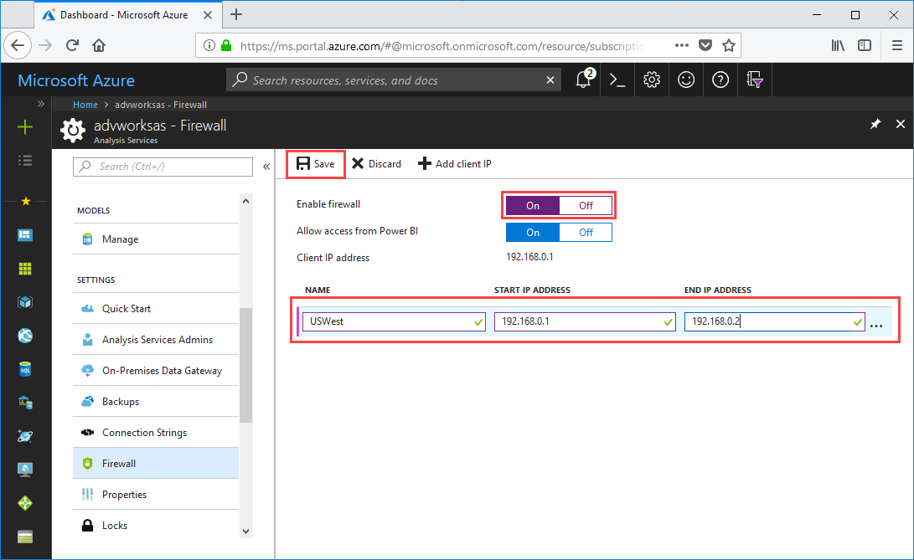

# Quickstart: Configure a firewall - Portal

This quickstart helps you configure a firewall for your Azure Analysis Services server. Enabling a firewall and configuring an IP address range for only those computers that should access your server are an important part of securing your server and data model.git

## Prerequisites

- An Analysis Services server. See [Quickstart: Create a server - Portal](analysis-services-create-server.md) or [Quickstart: Create a server - Portal](analysis-services-create-server.md)
- IP address range for client computers (if needed).

## Log in to the Azure portal 

[Log in to the portal](https://portal.azure.com)

## Configure a firewall

1. In the portal > server > **SETTINGS** > **Firewall** > **Enable firewall**, click **On**.
2. To allow DirectQuery access from Power BI service, in **Allow accesss from Power BI**, click **On**.  
3. (Optional) Specify an IP address range. Enter a name, starting, and ending IP address.
4. Click **Save**.

     

## Clean up resources

When no longer needed, delete IP address ranges, or disable the firewall.

## Next steps
In this quickstart, you learned how to configure a firewall for your server. Now that you have server, and secured it with a firewall, you can add a basic sample data model to it from the portal. Having a sample model is helpful to learn about configuring model database roles and testing client connections. To learn more, continue to the tutorial for adding a sample model.

> [!div class="nextstepaction"]
> [Tutorial: Add a sample model to your server](analysis-services-create-sample-model.md)
