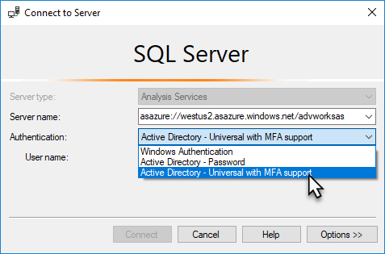

# 2 - Configure server administrator and roles

Connecting to your server in Azure is just like connecting to a server instance in your own organization. From SSMS, you can perform many of the same tasks such as process data or create a processing script, manage roles, and use PowerShell.
  
> [!div class="checklist"]
> * Get your server name from the portal
> * Connect to your server by using SSMS
> * Add a server administrator
> * Add a model database administrator
> * Add a role and group or user


## Prerequisites

- Have a server in your subscription. See [Create a server - portal](analysis-services-create-server.md).
- Be a [server administrator](analysis-services-server-admins.md).
- TInstall the latest version of [SQL Server Management Studio](https://docs.microsoft.com/sql/ssms/download-sql-server-management-studio-ssms) (SSMS).


## Log in to the Azure portal

Log in to the [portal](https://portal.azure.com/).

## Get server name
In order to connect to your Azure AS server by using SSMS, you need the server name. You can get the server name from the portal.

In **Azure portal** > server > **Overview** > **Server name**, copy the server name.
   
   

## Connect in SSMS

For the remaining tasks, you use SSMS to connect to and manage your server.

1. In SSMS > **Object Explorer**, click **Connect** > **Analysis Services**.

    

2. In the **Connect to Server** dialog box, in **Server name** paste in the server name you copied from the portal, then in **Authentication**, choose **Active Directory Universal with MFA Support**, enter your user account, and then press **Connect**.
   
    

    > [!TIP]
    > Choosing Active Directory Universal with MFA Support authentication type is recommended. This authentication type supports [non-interactive and multi-factor authentication](../sql-database/sql-database-ssms-mfa-authentication.md). 

3. In **Object Explorer**, verify the server name and expand to see server objects. Right click to see server properties.
   
    

## Add a user account to the server administrator role

In this task, you add a user or group account to the server administrator role.

1. In **Object Explorer**, right-click your server name, and then click **Properties**. 
2. In the **Analysis Server Properties** window, click **Security** > **Add**. You may be prompted to sign-in.
3. In the **Select a User or Group** window, search or manually enter a user or group account in your Azure AD, and then cick **Add**. 
   
     

4. Click **OK** to close **Analysis Server Properties**.

    > [!TIP]
    > You can also add server administrators by using **Analysis Services Admins** in the portal.

## Add a user to the model database administrator role

In this task, you add a user or group account to an Internet Sales Administrator role that already exists in the model. This role has Full control (Administrator) permissions for the adventureworks sample model database.

1. In **Object Explorer**, expand **Databases** > **adventureworks** > **Roles**. 
2. Right-click **Internet Sales Administrator**, then click **Script Role as** > **CREATE OR REPLACE To** > **New Query Editor Window**. You may be prompted to sign-in.

    

3. In the **XMLAQuery**, change **"memberName":** to a user or group account in your Azure AD. By default, the account you're signed in with will be included; however, you do not need to add your own account because you are already a server administrator.

    

4. Press **F5**, to execute the script.


## Add a new model database role and add a group

In this task, you use the [Create](https://docs.microsoft.com/sql/analysis-services/tabular-models-scripting-language-commands/create-command-tmsl?view=sql-analysis-services-2017) command in a TMSL script to create a new Internet Sales Global role, specify read permissions for the role, and add a user or group account from your Azure AD.

1. In **Object Explorer**, right-click **adventureworks**, and then click **New Query** > **XMLA**. You may be prompted to sign-in.
2. Enter the following TMSL script into the query editor:

    ```
    {
    "create": {
      "parentObject": {
        "database": "adventureworks",
       },
       "role": {
         "name": "Internet Sales Global",
         "description": "All users can query model data",
         "modelPermission": "read",
         "members": [
           {
             "memberName": "globalsales@adventureworks.com",
             "identityProvider": "AzureAD"
           }
         ]
       }
      }
    }
    ```

3. Change **"memberName": \"globalsales@adventureworks.com\"** object value to a user or group account in your Azure AD.
4. Press **F5**, to execute the script.

## Verify your changes

1. In **Object Explorer**, click your servername, and then click **Refresh** or press **F5**.
2. Expand **Databases** > **adventureworks** > **Roles**. Verify the user account and new role changes you added in the previous tasks appear.

## Clean up resources

When no longer needed, delete the user or group accounts and roles. To do so, use **Role Properties** > **Membership** to remove user accounts, or right-click a role and then click **Delete**.


## Next steps
In this tutorial, you learned how to connect to your Azure AS server and explore the adventureworks sample model databases and properties. You also learned how to use SSMS and TMSL scripts to add users or groups to existing or new roles.

> [!div class="checklist"]
> * Connect with Power BI Desktop
> 
