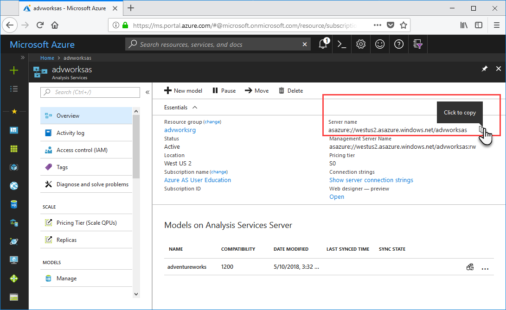
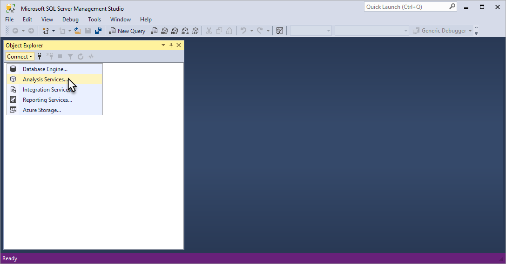
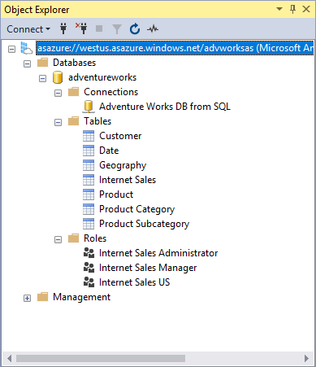
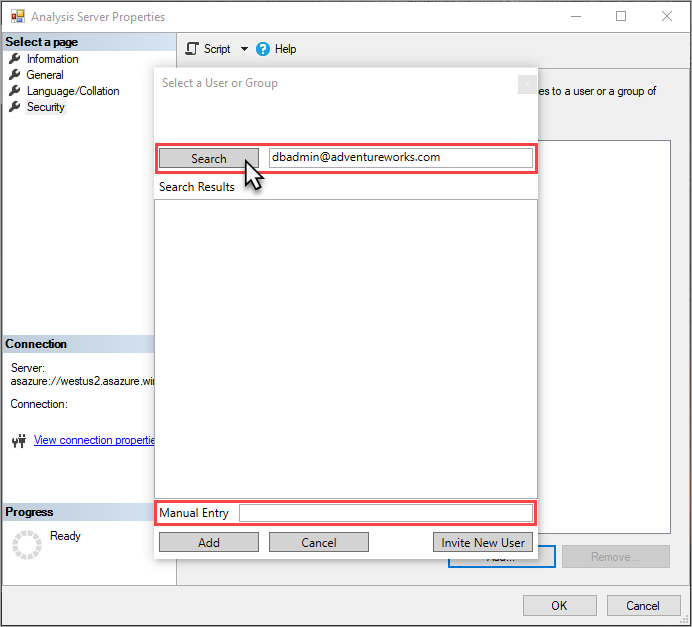
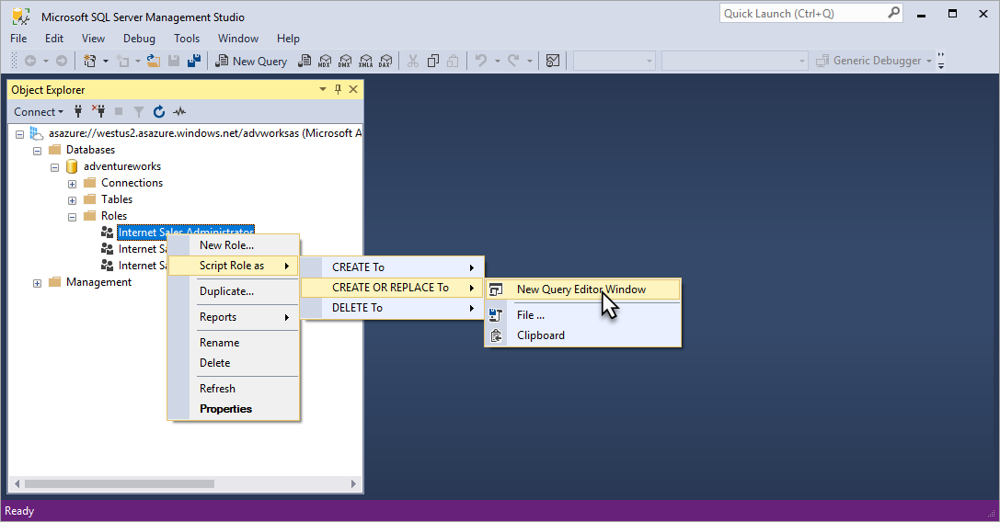
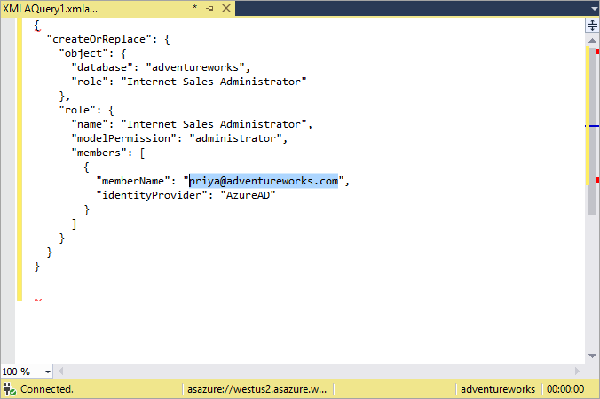
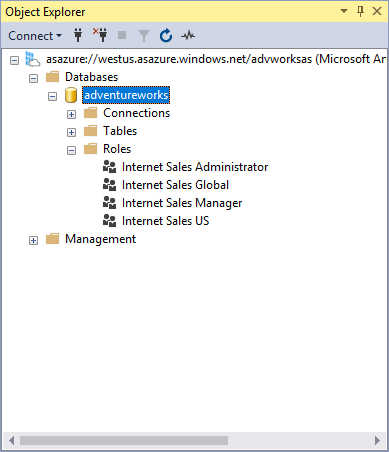

# Tutorial: Configure server administrator and user roles

 In this stutorial, you use SQL Server Management Studio (SSMS) to connect to your server in Azure to configure server administrator and model database roles. You're also introduced  to [Tabular Model Scripting Language (TMSL)](https://docs.microsoft.com/sql/analysis-services/tabular-model-programming-compatibility-level-1200/tabular-model-programming-for-compatibility-level-1200). TMSL is a JSON based scripting language for tabular models at the 1200 and higher compatibility levels. It can be used to automate many tabular modeling tasks. TMSL is often used with PowerShell, but in this tutorial, you use the XMLA query editor in SSMS. With this tutorial, you complete these tasks: 
  
> [!div class="checklist"]
> * Get your server name from the portal
> * Connect to your server by using SSMS
> * Add a user or group to the server administrator role 
> * Add a user or group to the model database administrator role
> * Add a new model database role and add a user or group

To learn more about user security in Azure Analysis Services, see [Authentication and user permissions](../analysis-services-manage-users.md). 

## Prerequisites

- An Azure Active Directory in your subscription.
- Created an [Azure Analysis Services server](../analysis-services-create-server.md) in your subscription.
- Have [server administrator](../analysis-services-server-admins.md) permissions.
- [Add the adventureworks sample model](../analysis-services-create-sample-model.md) to your server.
- [Install the latest version of SQL Server Management Studio](https://docs.microsoft.com/sql/ssms/download-sql-server-management-studio-ssms) (SSMS).

## Log in to the Azure portal

Log in to the [portal](https://portal.azure.com/).

## Get server name
In order to connect to your server from SSMS, you first need the server name. You can get the server name from the portal.

In **Azure portal** > server > **Overview** > **Server name**, copy the server name.
   
   

## Connect in SSMS

For the remaining tasks, you use SSMS to connect to and manage your server.

1. In SSMS > **Object Explorer**, click **Connect** > **Analysis Services**.

    

2. In the **Connect to Server** dialog box, in **Server name**, paste in the server name you copied from the portal. In **Authentication**, choose **Active Directory Universal with MFA Support**, then enter your user account, and then press **Connect**.
   
    

    > [!TIP]
    > Choosing Active Directory Universal with MFA Support is recommended. This type of authentication type supports [non-interactive and multi-factor authentication](../../sql-database/sql-database-ssms-mfa-authentication.md). 

3. In **Object Explorer**, expand to see server objects. Right-click to see server properties.
   
    

## Add a user account to the server administrator role

In this task, you add a user or group account from your Azure AD to the server administrator role.

1. In **Object Explorer**, right-click your server name, and then click **Properties**. 
2. In the **Analysis Server Properties** window, click **Security** > **Add**.
3. In the **Select a User or Group** window, search or manually enter a user or group account in your Azure AD, and then cick **Add**. 
   
     

4. Click **OK**, to close **Analysis Server Properties**.

    > [!TIP]
    > You can also add server administrators by using **Analysis Services Admins** in the portal. 

## Add a user to the model database administrator role

In this task, you add a user or group account to the Internet Sales Administrator role that already exists in the model. This role has Full control (Administrator) permissions for the adventureworks sample model database. This task uses the [CreateOrReplace](https://docs.microsoft.com/sql/analysis-services/tabular-models-scripting-language-commands/createorreplace-command-tmsl) TMSL command in a script created for you.

1. In **Object Explorer**, expand **Databases** > **adventureworks** > **Roles**. 
2. Right-click **Internet Sales Administrator**, then click **Script Role as** > **CREATE OR REPLACE To** > **New Query Editor Window**.

    

3. In the **XMLAQuery**, change the value for **"memberName":** to a user or group account in your Azure AD. By default, the account you're signed in with is included; however, you do not need to add your own account because you are already a server administrator.

    

4. Press **F5**, to execute the script.


## Add a new model database role and add a user or group

In this task, you use the [Create](https://docs.microsoft.com/sql/analysis-services/tabular-models-scripting-language-commands/create-command-tmsl?view=sql-analysis-services-2017) command in a TMSL script to create a new Internet Sales Global role, specify *read* permissions for the role, and add a user or group account from your Azure AD.

1. In **Object Explorer**, right-click **adventureworks**, and then click **New Query** > **XMLA**. 
2. Copy and paste the following TMSL script into the query editor:

    ```JSON
    {
    "create": {
      "parentObject": {
        "database": "adventureworks",
       },
       "role": {
         "name": "Internet Sales Global",
         "description": "All users can query model data",
         "modelPermission": "read",
         "members": [
           {
             "memberName": "globalsales@adventureworks.com",
             "identityProvider": "AzureAD"
           }
         ]
       }
      }
    }
    ```

3. Change **"memberName": \"globalsales@adventureworks.com\"** object value to a user or group account in your Azure AD.
4. Press **F5**, to execute the script.

## Verify your changes

1. In **Object Explorer**, click your servername, and then click **Refresh** or press **F5**.
2. Expand **Databases** > **adventureworks** > **Roles**. Verify the user account and new role changes you added in the previous tasks appear.   

    

## Clean up resources

When no longer needed, delete the user or group accounts and roles. To do so, use **Role Properties** > **Membership** to remove user accounts, or right-click a role and then click **Delete**.


## Next steps
In this tutorial, you learned how to connect to your Azure AS server and explore the adventureworks sample model databases and properties in SSMS. You also learned how to use SSMS and TMSL scripts to add users or groups to existing and new roles. Now that you have user permissions configured for your server and sample model database, you and other users can connect to it by using client applications like Power BI. To learn more, continue to the next tutorial. 

> [!div class="nextstepaction"]
> [Connect with Power BI Desktop](analysis-services-tutorial-pbid.md)

