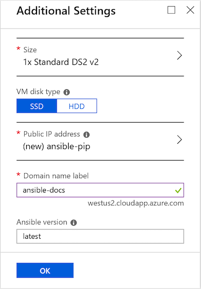
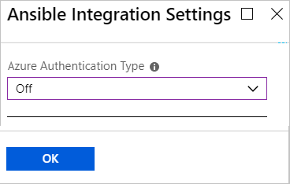
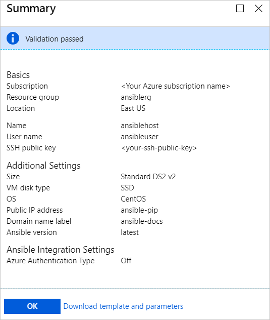
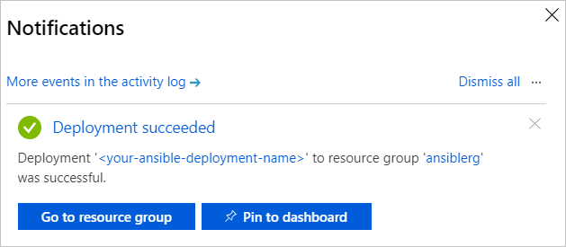

# Quickstart: Deploy the Ansible solution template for Azure to CentOS

The Ansible solution template for Azure is designed to configure an Ansible instance on a CentOS virtual machine along with Ansible and a suite of tools configured to work with Azure. The tools include:

- **Ansible modules for Azure** - The [Ansible modules for Azure](./ansible-matrix.md) are a suite of modules that enable you to create and manage your infrastructure on Azure. The latest version of these modules is deployed by default. However, during the solution-template deployment process, you can specify a version number that is appropriate for your environment.
- **Azure Command-Line Interface (CLI) 2.0** - The [Azure CLI 2.0](/cli/azure/?view=azure-cli-latest) is a cross-platform command-line experience for managing Azure resources. 
- **managed identities for Azure resources** - The [managed identities for Azure resources](/azure/active-directory/managed-identities-azure-resources/overview) feature addresses the issue of keeping cloud application credentials secure.

## Prerequisites

- [!INCLUDE [open-source-devops-prereqs-azure-sub.md](../../includes/open-source-devops-prereqs-azure-sub.md)]

## Deploy the Ansible solution template

1. Browse to the [Ansible solution template in the Azure Marketplace](https://azuremarketplace.microsoft.com/en-%20%20us/marketplace/apps/azure-oss.ansible?tab=Overview).

1. Select **GET IT NOW**.

1. A window appears that details the Terms of Use, Privacy Policy, and Use of Azure Marketplace Terms. Select **Continue**.

1. The Azure portal appears and displays the Ansible page that describes the solution template. Select **Create**.

1. In the **Create Ansible** page, you see several tabs. On the **Basics** tab, enter the required information:

   - **Name** - Specify the name your Ansible instance. For demo purposes, the name `ansiblehost` is used.
   - **User name:** - Specify the user name that will have access to the Ansible instance. For demo purposes, the name `ansibleuser` is used.
   - **Authentication type:** - Select either **Password** or **SSH public key**. For demo purposes, **SSH public key** is selected.
   - **Password** and **Confirm password** - If you select **Password** for **Authentication type**, enter your password for these values.
   - **SSH public key** - If you select **SSH public key** for **Authentication type**, enter your RSA public key in the single-line format - starting with `ssh-rsa`.
   - **Subscription** - Select your Azure subscription from the dropdown list.
   - **Resource group** - Select an existing resource group from the dropdown list, or select **Create new** and specify a name for a new resource group. For demo purposes, a new resource group named `ansiblerg` is used.
   - **Location** - Select the location from the dropdown list that is appropriate for your scenario.

     

1. Select **OK**.

1. In the **Additional Settings** tab, enter the required information:

   - **Size** - The Azure portal defaults to a standard size. To specify a different size that accommodates your specific scenario, select the arrow to display a list of different sizes.
   - **VM disk type** - Select either **SSD** (Premium Solid-State Drive) or **HDD** (Hard Disk Drive). For demo purposes, **SSD** is selected for its performance benefits. For more information on each these types of disk storage, see the following articles:
       - [High-performance Premium Storage and managed disks for VMs](/azure/virtual-machines/windows/premium-storage)
       - [Standard SSD Managed Disks for Azure Virtual machine workloads](/azure/virtual-machines/windows/disks-standard-ssd)
   - **Public IP Address** - Specify this setting if you want to communicate with the virtual machine from outside the virtual machine. The default is a new public IP address that has the name `ansible-pip`. To specify a different IP address, select the arrow specify the attributes - such as name, SKU, and Assignment, of that IP address. 
   - **Domain name label** - Enter the public-facing domain name of the virtual machine. The name must be unique and meet naming requirements. For more information about specifying a name for the virtual machine, see [Naming conventions for Azure resources](/azure/architecture/best-practices/naming-conventions).
   - **Ansible version** - Specify either a version number or the value `latest` to deploy the latest version. Select the information icon next to **Ansible version** to see more information about available versions.

     

1. Select **OK**.

1. In the **Ansible Integration Settings** tab, specify the authentication type. For more information about securing Azure resources, see [What is managed identities for Azure resources?](/azure/active-directory/managed-identities-azure-resources/overview).

    

1. Select **OK**.

1. The **Summary** page displays showing the validation process and listing the specified criteria for the Ansible deployment. A link at the bottom of the tab allows you to **Download the template and parameters** for use with supported Azure languages and platforms. 

     

1. Select **OK**.

1. When the **Create** tab appears, select **OK** to deploy Ansible.

1. Select the **Notifications** icon at the top of the portal page to track the Ansible deployment. Once the deployment is complete, select  **Go to resource group**. 

     

1. On the resource group page, get the IP address of your Ansible host and sign in to manage your Azure resources using Ansible.

## Next steps

> [!div class="nextstepaction"] 
> [Quickstart: Configure a Linux virtual machine in Azure using Ansible](/azure/virtual-machines/linux/ansible-create-vm)