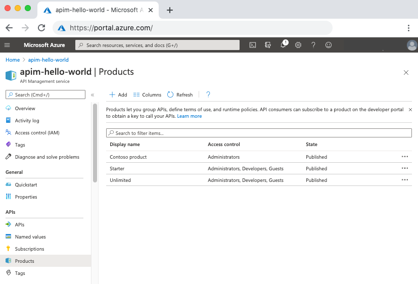

# Create and publish a product  

In Azure API Management, a product contains one or more APIs as well as a usage quota and the terms of use. Once a product is published, developers can subscribe to the product and begin to use the product's APIs. The topic provides a guide to creating a product, adding an API, and publishing it for developers.

In this tutorial, you learn how to:

> [!div class="checklist"]
> * Create a product
> * Publish the product

## Prerequisites

Please complete the following quickstart: [Create an Azure API Management instance](get-started-create-service-instance.md).
Also, complete the following tutorial: [Import and publish your first API](import-and-publish.md).

## Create a product

1. Sign in to the [Azure portal](https://portal.azure.com).
2. Browse to your APIM instance.
3. Click on **Products** in the menu on the left to display the **Products** page.
4. Click **+ Product**.

    

    When you add a product, you need to supply the following information. 

    |Name|Description|
    |---|---|
    |Display name|The name as you want it to be shown in the **Developer portal**.|
    |Name|A descriptive name of the product.|
    |Description|The **Description** field allows you to provide detailed information about the product such as its purpose, the APIs it provides access to, and other useful information.|
    |State|Press **Published** if you want to publish the product. Before the APIs in a product can be called, the product must be published. By default new products are unpublished, and are visible only to the  **Administrators** group.|
    |Requires approval|Check **Require subscription approval** if you want an administrator to review and accept or reject subscription attempts to this product. If the box is unchecked, subscription attempts are auto-approved. |
    |Subscription count limit|To limit the count of multiple simultaneous subscriptions, enter the subscription limit. |
    |Legal terms|You can include the terms of use for the product which subscribers must accept in order to use the product.|
    |APIs|During the product creation, you can add an existing API to it. Alternatively, you can add an existing APIs to an existing product. Products are associations of one or more APIs. You can include a number of APIs and offer them to developers through the developer portal. Developers must first subscribe to a product to get access to the API. When they subscribe, they get a subscription key that is good for any API in that product. If you created the APIM instance, you are an administrator already, so you are subscribed to every product by default.  You can add an API during the product creation. You can add an API to the product later, either from the Products **Settings** page or while creating an API.|

5. Click **Save** to create the new product.

## Add more configurations

You can continue configuring the product after saving it by choosing the **Settings** tab located under your product. 

View/add subscribers to the product from the **Subscriptions** tab.

Set a visibility of a product for developers or guest from the **Access control** tab.

## Next steps

> [!div class="nextstepaction"]
> [Create blank API and mock API responses](mock-api-responses.md)