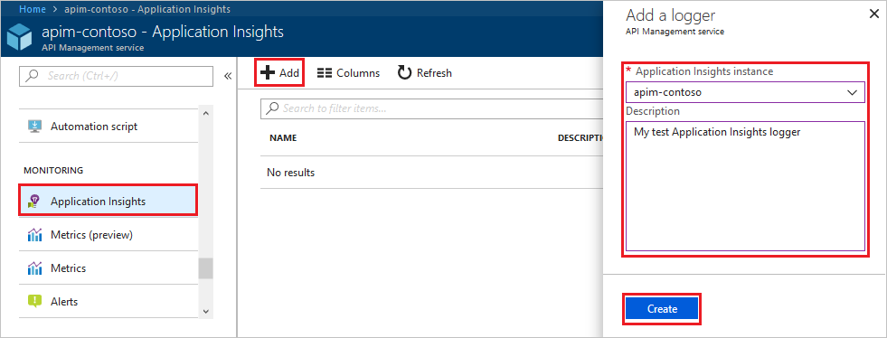
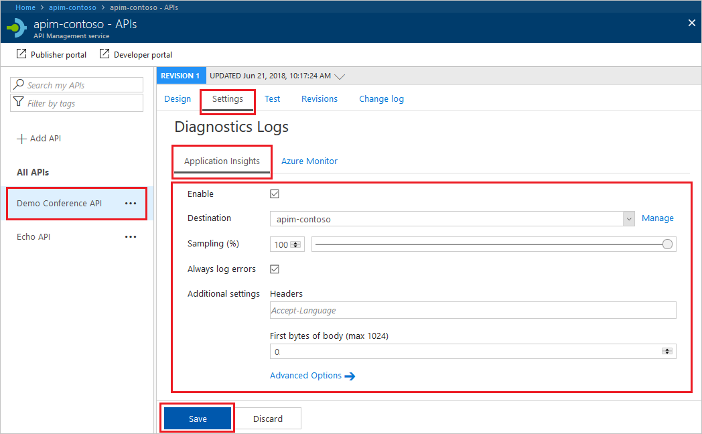

# How to integrate Azure API Management with Azure Application Insights

Azure Application Insights is an extensible service for web developers building and managing apps on multiple platforms. It is meant for statistical analysis of a service performance rather than audit operations.

Azure API Management allows for easy integration with Azure Application Insights.
This guide walks through every step of such integration and describes strategies for reducing performance impact on your API Management service instance.

## Prerequisites

To follow this guide, you need to have an Azure API Management instance. If you do not have one, complete the [tutorial](get-started-create-service-instance.md) first.

## Create an Azure Application Insights instance

Before you can utilize Azure Application Insights functionality, you first need to create an instance of this service.

1. Open the **Azure portal** and navigate to **Aplication Insights**.  
      
2. Click **+ Add**.  
      
3. Fill the form. Select **General** as the **Aplication Type**.
4. Click **Create**.

## Attach Azure Application Insights logger to Azure API Management service instance

1. Navigate to your **Azure API Management service instance** in the **Azure portal**.
2. Select **Application Insights (preview)** from the menu on the left.
3. Click **+ Add**.  
      
4. Select the previously created **Application Insights** instance and provide a short description.
5. Click **Create**.
6. The logger should appear in the list.  
      

## Enable Application Insights logging for your API

1. Navigate to your **Azure API Management service instance** in the **Azure portal**.
2. Select **APIs** from the menu on the left.
3. Click on your API, in this case **Demo Conference API**.
4. Go to the **Settings** tab from the top bar.
5. Scroll down to the **Diagnostics Logs** section.  
      
6. Check the **Enable** box.
7. Select your attached logger in the **Destination** dropdown.
8. Input **100** as **Sampling (%)** and tick the **Always log errors** checkbox. 0% sampling means zero logs sent to Application Insights. 100% sampling means all logs sent to Application Insights.
9. Input **1024** in the **First bytes of body** field.
10. Click **Save**.

> [!NOTE]
> You can specify loggers on different levels - single API logger or a logger for all APIs.
>  
> If you specify both:
> + if they are different loggers, then both of them will be used (multiplexing logs),
> + if they are the same loggers but have different settings, then the one for single API (more granular level) will override the one for all APIs.

## What data is added to Azure Application Insights

Azure Application Insights receives:

+ *Request* telemetry item, for every incoming request,
+ *Dependency* telemetry item, for every request forwarded to a backend service,
+ *Exception* telemetry item, for every failed request.

A failed request is a request, which:

+ failed due to a closed client connection, or
+ triggered an *on-error* section of the API policies, or
+ has a response HTTP status code matching 4xx or 5xx.

## Performance implications and log sampling

> [!WARNING]
> Logging all events may have serious performance implications, depending on incoming requests rate.

Based on our internal load tests, after enabling this feature, we observed a 40%-50% reduction in throughput when request rate exceeded 1,000 requests per second. Azure Application Insights is designed to use statistical analysis for assessing application performances. It is not intended to be an audit system and is not suited for logging each individual request for high-volume APIs.

You can manipulate the number of requests being logged by adjusting the **Sampling** setting (see the steps above). Value 100% means all requests are logged, while 0% reflects no logging at all.

## Next steps

+ Learn more about [Azure Application Insights](https://docs.microsoft.com/en-us/azure/application-insights/).
+ Consider [logging with Azure Event Hubs](api-management-howto-log-event-hubs.md).
