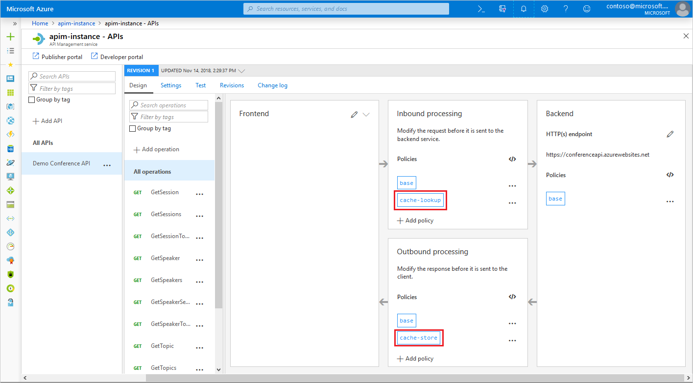
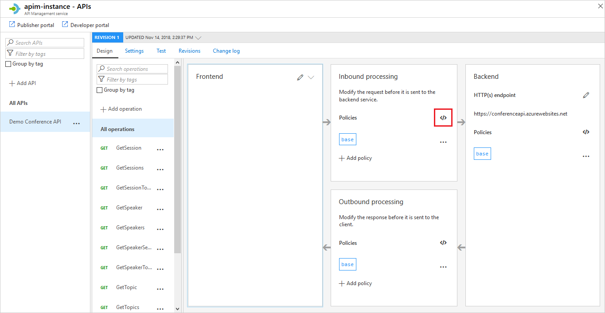

# Add caching to improve performance in Azure API Management

Operations in API Management can be configured for response caching. Response caching can significantly reduce API latency, bandwidth consumption, and web service load for data that does not change frequently.
 
For more detailed information about caching, see [API Management caching policies](api-management-caching-policies.md) and  [Custom caching in Azure API Management](api-management-sample-cache-by-key.md).

What you'll learn:

> [!div class="checklist"]
> * Add response caching for your API
> * Verify caching in action

## Availability

> [!NOTE]
> Internal cache is not available in the **Consumption** tier of Azure API Management. You can [use an external Redis cache](api-management-howto-byoc.md) instead.

## Prerequisites

To complete this tutorial:

+ [Create an Azure API Management instance](get-started-create-service-instance.md)
+ [Import and publish an API](import-and-publish.md)

## Add the caching policies

With caching policies shown in this example, the first request to the **GetSpeakers** operation returns a response from the backend service. This response is cached, keyed by the specified headers and query string parameters. Subsequent calls to the operation, with matching parameters, will have the cached response returned, until the cache duration interval has expired.

1. Sign in to the Azure portal at [https://portal.azure.com](https://portal.azure.com).
2. Browse to your APIM instance.
3. Select the **API** tab.
4. Click **Demo Conference API** from your API list.
5. Select **GetSpeakers**.
6. On the top of the screen, select **Design** tab.
7. In the **Inbound processing** section, click the **</>** icon.

     

8. In the **inbound** element, add the following policy:

        <cache-lookup vary-by-developer="false" vary-by-developer-groups="false">
            <vary-by-header>Accept</vary-by-header>
            <vary-by-header>Accept-Charset</vary-by-header>
            <vary-by-header>Authorization</vary-by-header>
        </cache-lookup>

9. In the **outbound** element, add the following policy:

        <cache-store caching-mode="cache-on" duration="20" />

    **Duration** specifies the expiration interval of the cached responses. In this example, the interval is **20** seconds.

> [!TIP]
> If you are using an external cache, as described in [Use an external Redis cache in Azure API Management](api-management-howto-byoc.md), you may want to specify the `cache-preference` attribute of the caching policies. See [API Management caching policies](api-management-caching-policies.md) for more details.

## Call an operation and test the caching
To see the caching in action, call the operation from the developer portal.

1. In the Azure portal, browse to your APIM instance.
2. Select the **APIs** tab.
3. Select the API to which you added caching policies.
4. Select the **GetSpeakers** operation.
5. Click the **Test** tab in the top right menu.
6. Press **Send**.

## Next steps
* For more information about caching policies, see [Caching policies][Caching policies] in the [API Management policy reference][API Management policy reference].
* For information on caching items by key using policy expressions, see [Custom caching in Azure API Management](api-management-sample-cache-by-key.md).
* For more information about using external Redis cache, see [Use an external Redis cache in Azure API Management](api-management-howto-byoc.md).

[api-management-management-console]: ./media/api-management-howto-cache/api-management-management-console.png
[api-management-echo-api]: ./media/api-management-howto-cache/api-management-echo-api.png
[api-management-echo-api-operations]: ./media/api-management-howto-cache/api-management-echo-api-operations.png
[api-management-caching-tab]: ./media/api-management-howto-cache/api-management-caching-tab.png
[api-management-operation-dropdown]: ./media/api-management-howto-cache/api-management-operation-dropdown.png
[api-management-policy-editor]: ./media/api-management-howto-cache/api-management-policy-editor.png
[api-management-developer-portal-menu]: ./media/api-management-howto-cache/api-management-developer-portal-menu.png
[api-management-apis-echo-api]: ./media/api-management-howto-cache/api-management-apis-echo-api.png
[api-management-open-console]: ./media/api-management-howto-cache/api-management-open-console.png
[api-management-console]: ./media/api-management-howto-cache/api-management-console.png

[How to add operations to an API]: api-management-howto-add-operations.md
[How to add and publish a product]: api-management-howto-add-products.md
[Monitoring and analytics]: api-management-monitoring.md
[Add APIs to a product]: api-management-howto-add-products.md#add-apis
[Publish a product]: api-management-howto-add-products.md#publish-product
[Get started with Azure API Management]: get-started-create-service-instance.md

[API Management policy reference]: https://msdn.microsoft.com/library/azure/dn894081.aspx
[Caching policies]: https://msdn.microsoft.com/library/azure/dn894086.aspx

[Create an API Management service instance]: get-started-create-service-instance.md

[Configure an operation for caching]: #configure-caching
[Review the caching policies]: #caching-policies
[Call an operation and test the caching]: #test-operation
[Next steps]: #next-steps
