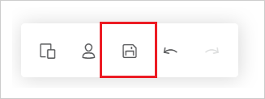
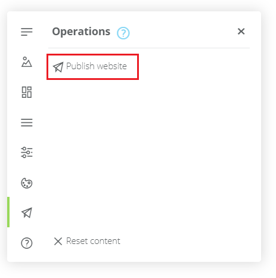

# Access and customize managed developer portal

Developer portal is an automatically generated, fully customizable website with the documentation of your APIs. It is where API consumers can discover your APIs, learn how to use them, request access, and try them out.

In this tutorial, you learn how to:

> [!div class="checklist"]
> * Access the managed version of the developer portal
> * Navigate its administrative interface
> * Customize the content
> * Publish the changes
> * View the published portal

If you're looking for more information on the developer portal, refer to the [Azure API Management developer portal overview](api-management-howto-developer-portal.md).

## Prerequisites

- Complete the following quickstart: [Create an Azure API Management instance](get-started-create-service-instance.md)
- Import and publish an Azure API Management instance. For more information, see [Import and publish](import-and-publish.md)

[!INCLUDE [premium-dev-standard-basic.md](../../includes/api-management-availability-premium-dev-standard-basic.md)]

## Step 1: access the portal as an administrator

Follow the steps below to access the managed version of the portal.

1. Go to your API Management service instance in the Azure portal.
1. Click on the **Developer portal** button in the top navigation bar. A new browser tab with an administrative version of the portal will open.

## Step 2: understand the portal's administrative interface

### Default content 

If you're accessing the portal for the first time, the default content will be automatically provisioned in the background. Default content has been designed to showcase portal's capabilities and minimize the amount of customizations you need to perform to personalize your portal. You can learn more about what is included in the portal content by reading the [Azure API Management developer portal overview](api-management-howto-developer-portal.md).

### Visual editor

You can customize the content of the portal with the visual editor. The menu sections on the left let you modify or create pages, media, layouts, menus, styles, or website settings. The menu items on the bottom let you switch between viewports (for example, mobile or desktop), view the elements of the portal visible to authenticated or anonymous users, or save or undo actions.

### Layouts and pages

Layouts define how pages are displayed. For example, in the default content, there are two layouts with top navigation bars and footers - one applies to the landing page, and the other to all other pages.

A layout gets applied to a page by matching its URL template to the page's URL. For example, layout with a URL template of `/wiki/*` will be applied to every page with the `/wiki/` segment: `/wiki/getting-started`, `/wiki/styles`, etc.

In the image above, content belonging to the layout is marked in blue, while the page is marked in red. The menu sections are marked respectively.

### Styling guide

Styling guide is a panel created with designers in mind. It allows for overseeing and styling all the visual elements in your portal. The styling is hierarchical - many elements inherit properties from other elements. For example, button elements use colors for text and background; if you'd like to change a button's color, you need to change the original color variant.

To edit a variant, click on it and select the pencil icon that appears on top of it. Once you make the changes in the pop-up window, close it.

### Save button

Whenever you make a change in the portal, you need to save it manually by pressing the **Save** button (floppy disk) in the menu on the bottom before you navigate to another page. When you save your changes, the modified content is automatically uploaded to your API Management service.

## Step 3: customize the default content

Before you make your portal available to the visitors, you should personalize the automatically generated content. The areas, which require the most changes are the landing page and the styling.

> [!NOTE]
> Due to integration considerations, the following pages can't be removed or moved under a different URL: `/404`, `/500`, `/captcha`, `/change-password`, `/config.json`, `/confirm/invitation`, `/confirm-v2/identities/basic/signup`, `/confirm-v2/password`, `/internal-status-0123456789abcdef`, `/publish`, `/signin`, `/signin-sso`, `/signup`.

### Home page

The default **Home** page contains a lot of dummy content. You can either remove the whole sections with the content or adjust the elements one by one - replace the generated text and images. 

### Layouts

You should replace the automatically generated logo in the navigation bar with your own image.

### Styling

Although you don't need to adjust any styles, you may consider adapting particular elements. For example, change the primary color to match your brand's color.

### Customization example

In the video below we demonstrate how to edit the content of the portal, customize the website's look, and publish the changes.

> [!VIDEO https://www.youtube.com/embed/5mMtUSmfUlw]

## Step 4: publish the portal

To make your portal and its latest changes available to visitors, you need to publish it. Click on **Publish website** in the **Operations** section of the menu. This operation may take a few minutes.

## Step 5: visit the portal

Once your portal is published, it is available under the same URL as the administrative panel, for example `https://contoso-api.portal.azure-api.net`. You can visit it in a new browser tab.

## Next steps

Learn more about the developer portal:

- [Azure API Management developer portal overview](api-management-howto-developer-portal.md)