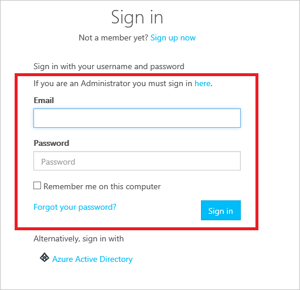
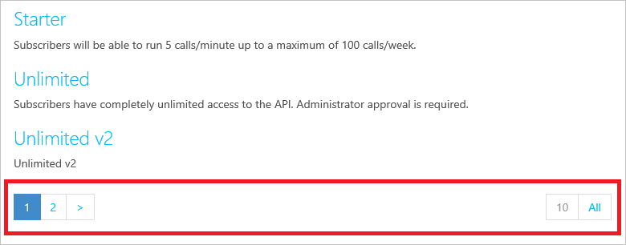
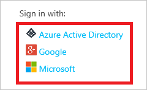
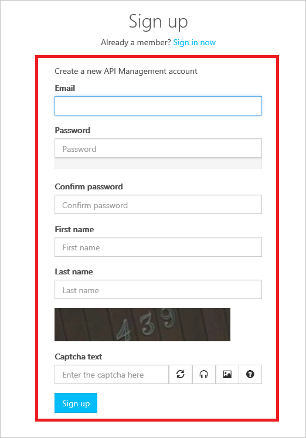
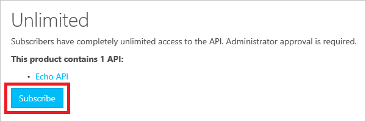

# Azure API Management page controls
Azure API Management provides the following controls for use in the developer portal templates.  
  
To use a control, place it in the desired location in the developer portal template. Some controls, such as the [app-actions](#app-actions) control, have parameters, as shown in the following example.  
  
```xml  
<app-actions params="{ appId: '{{app.id}}' }"></app-actions>  
```  
  
 The values for the parameters are passed in as part of the data model for the template. In most cases, you can simply paste in the provided example for each control for it to work correctly. For more information on the parameter values, you can see the data model section for each template in which a control may be used.  
  
 For more information about working with templates, see [How to customize the API Management developer portal using templates](https://azure.microsoft.com/documentation/articles/api-management-developer-portal-templates/).  
  
## Developer portal template page controls  
  
-   [app-actions](#app-actions)  
-   [basic-signin](#basic-signin)  
-   [paging-control](#paging-control)  
-   [providers](#providers)  
-   [search-control](#search-control)  
-   [sign-up](#sign-up)  
-   [subscribe-button](#subscribe-button)  
-   [subscription-cancel](#subscription-cancel)  
  
##  <a name="app-actions"></a> app-actions  
 The `app-actions` control provides a user interface for interacting with applications on the user profile page in the developer portal.  
  
   
  
### Usage  
  
```xml  
<app-actions params="{ appId: '{{app.id}}' }"></app-actions>  
```  
  
### Parameters  
  
|Parameter|Description|  
|---------------|-----------------|  
|appId|The id of the application.|  
  
### Developer portal templates  
 The `app-actions` control may be used in the following developer portal templates.  
  
-   [Applications](api-management-user-profile-templates.md#Applications)  
  
##  <a name="basic-signin"></a> basic-signin  
 The `basic-signin` control provides a control for collecting user sign in information in the sign in page in the developer portal.  
  
   
  
### Usage  
  
```xml  
<basic-SignIn></basic-SignIn>  
```  
  
### Parameters  
 None.  
  
### Developer portal templates  
 The `basic-signin` control may be used in the following developer portal templates.  
  
-   [Sign in](api-management-page-templates.md#SignIn)  
  
##  <a name="paging-control"></a> paging-control  
 The `paging-control` provides paging functionality on developer portal pages that display a list of items.  
  
   
  
### Usage  
  
```xml  
<paging-control></paging-control>  
```  
  
### Parameters  
 None.  
  
### Developer portal templates  
 The `paging-control` control may be used in the following developer portal templates.  
  
-   [API list](api-management-api-templates.md#APIList)  
  
-   [Issue list](api-management-issue-templates.md#IssueList)  
  
-   [Product list](api-management-product-templates.md#ProductList)  
  
##  <a name="providers"></a> providers  
 The `providers` control provides a control for selection of authentication providers in the sign in page in the developer portal.  
  
   
  
### Usage  
  
```xml  
<providers></providers>  
```  
  
### Parameters  
 None.  
  
### Developer portal templates  
 The `providers` control may be used in the following developer portal templates.  
  
-   [Sign in](api-management-page-templates.md#SignIn)  
  
##  <a name="search-control"></a> search-control  
 The `search-control` provides search functionality on developer portal pages that display a list of items.  
  
   
  
### Usage  
  
```xml  
<search-control></search-control>  
```  
  
### Parameters  
 None.  
  
### Developer portal templates  
 The `search-control` control may be used in the following developer portal templates.  
  
-   [API list](api-management-api-templates.md#APIList)  
  
-   [Product list](api-management-product-templates.md#ProductList)  
  
##  <a name="sign-up"></a> sign-up  
 The `sign-up` control provides a control for collecting user profile information in the sign up page in the developer portal.  
  
   
  
### Usage  
  
```xml  
<sign-up></sign-up>  
```  
  
### Parameters  
 None.  
  
### Developer portal templates  
 The `sign-up` control may be used in the following developer portal templates.  
  
-   [Sign up](api-management-page-templates.md#SignUp)  
  
##  <a name="subscribe-button"></a> subscribe-button  
 The `subscribe-button` provides a control for subscribing a user to a product.  
  
   
  
### Usage  
  
```xml  
<subscribe-button></subscribe-button>  
```  
  
### Parameters  
 None.  
  
### Developer portal templates  
 The `subscribe-button` control may be used in the following developer portal templates.  
  
-   [Product](api-management-product-templates.md#Product)  
  
##  <a name="subscription-cancel"></a> subscription-cancel  
 The `subscription-cancel` control provides a control for cancelling a subscription to a product in the user profile page in the developer portal.  
  
   
  
### Usage  
  
```xml  
<subscription-cancel params="{ subscriptionId: '{{subscription.id}}', cancelUrl: '{{subscription.cancelUrl}}' }">  
</subscription-cancel>  
  
```  
  
### Parameters  
  
|Parameter|Description|  
|---------------|-----------------|  
|subscriptionId|The id of the subscription to cancel.|  
|cancelUrl|The subscription cancel URL.|  
  
### Developer portal templates  
 The `subscription-cancel` control may be used in the following developer portal templates.  
  
-   [Product](api-management-product-templates.md#Product)

## Next steps
For more information about working with templates, see [How to customize the API Management developer portal using templates](api-management-developer-portal-templates.md).