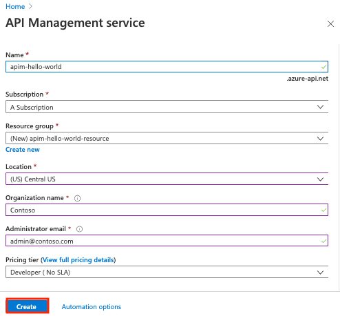

---
# Mandatory fields. See more on aka.ms/skyeye/meta.
title: Create an Azure API Management instance | Microsoft Docs
description: Follow the steps of this tutorial to create a new Azure API Management instance.
services: api-management
documentationcenter: ''
author: vladvino
manager: anneta
editor: ''

ms.service: api-management
ms.workload: integration
ms.topic: article
ms.date: 08/17/2017
ms.author: apimpm
---

# Create a new Azure API Management service instance

This tutorial describes the steps for creating a new API Management instance using the [Azure portal](https://portal.azure.com/).

## Prerequisites

+ An active Azure subscription.

    [!INCLUDE [quickstarts-free-trial-note](../../includes/quickstarts-free-trial-note.md)]

## Create a new service

1. In the [Azure portal](https://portal.azure.com/), select **New** > **Enterprise Integration** > **API management**.

    Alternatively, choose **New**, type `API management` in the search box, and press Enter. Click **Create**.

2. In the **API Management service** window, enter appropriate for your APIM service information:
 
    
    
    |Name|Description|
    |---|---|
    |Name|A unique **name** for your API Management service. This name can't be changed later. Service name is used to refer to the service and the corresponding Azure resource. **TIP:** Service name is used to generate a default domain name in the form of *{name}.azure-api.net.* If you would like to use a custom domain name, see [Configure a custom domain](configure-custom-domain.md). |
    |Subscription|Select a **subscription** from the list the different Azure subscriptions that you have access to. |
    |Resource group|Select the new or existing resource. A resource group is a collection of resources that share lifecycle, permissions, and policies. Learn more [here](../azure-resource-manager/resource-group-overview.md#resource-groups).|
    |Location|Select the geographic region where the API Management service is created. Only the available API Management service regions appear in the drop-down list box.|
    |Organization name|The **Organization name** is used in a number of places. For example, the title of the developer portal and sender of notification emails.|
    |Administrator email|Set email address to which all the notifications from **API Management** will be sent.|
    |Pricing tier|The **Developer** tier is set by default. The **Developer** tier is used to evaluate the service. This tier is not for production use. **NOTE:** The Developer tier is for development, testing, and pilot API programs where high availability is not a concern. In the **Standard** and **Premium** tiers, you can scale your reserved unit count to handle more traffic. The **Standard** and **Premium** tiers provide your API Management service with the most processing power and performance. For more information about scaling the API Management tiers, see [upgrade and scale](upgrade-and-scale.md). |
3. Check **Pin to dashboard** to see the deployment progress.
4. Choose **Create**.

    > [!TIP]
    > It usually takes between 20 and 30 minutes to create an API Management service. Selecting **Pin to dashboard** makes finding a newly created service easier.

## Next steps

[Create and publish your first API in Azure API Management](api-management-get-started.md)