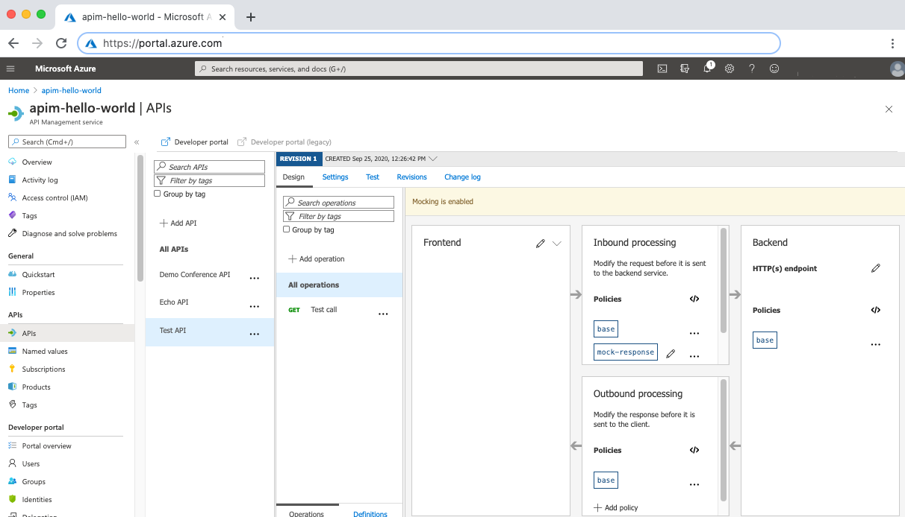

# Mock API responses

The steps in this tutorial show you how to use API Management (APIM) to set a policy on an API so it returns a mocked response. This method enables a developer to proceed with implementation and testing of the APIM instance in case the backend is not available to send real responses. Ability to mock up responses can be useful in a number of scenarios:

+ When the API façade is designed first and the backend implementation comes later. Or, the backend is being developed in parallel).
+ When the backend is temporarily not operational or not able to scale.

In this tutorial, you learn how to:

> [!div class="checklist"]
> * Create a test API and operation
> * Enable response mocking
> * Test the mocked API

You can view a video that talks about APIM mock up at the end of the article.

## Prerequisites

Please complete the following quickstart: [Create an Azure API Management instance](get-started-create-service-instance.md).

## Create a test API and an operation

The steps in this section show how to create a blank API with no backend. It also shows how to add an operation to the API. Calling the operation after completing steps in this section produces an error. You will get no errors after you complete steps in the "Enable response mocking" section.

### Create a test API 

1. Navigate to your APIM instance in the [Azure portal](https://portal.azure.com/).
2. Select **APIs** from under **API MANAGEMENT**.
3. From the left menu, select **+ Add API**.
4. Select **Blank API** from the list.
5. Enter "*Test API*" for **Display name**.
6. Enter "*Unlimited*" for **Products**.
7. Select **Create**.

### Add an operation

1. Select the API you created in the previous step.
2. Click **+ Add Operation**.
3. Enter "*/test*" for **URL**.
4. Enter "*Test call*" for **Display name**.
5. Select the **Response** tab, located under the URL, Display name, and Description fields.
6. Click **+ Add response**.
7. Select **200 OK** from the list.
8. Under the **Representations** heading on the right, select **+ Add representation**.
9. Enter "*application/json*" into the search box and select the **application/json** content type.
11. In the **Sample** text box, enter  "*{ 'sampleField' : 'test' }*".
12. Select **Save**.

	

## Enable response mocking

1. Select the API you created in the "Create a test API" step.
2. Select the test operation that you added.
2. In the window on the right, click the **Design** tab.
3. In the **Inbound processing** window, click the pencil icon.
4. In the **Mocking** tab, select **Static responses** for **Mocking behavior**.
5. In the **API Management returns the following response:** text box, type **200 OK, application/json**. This selection indicates that your API should return the response sample you defined in the previous section.
6. Select **Save**.

## Test the mocked API

1. Select the API you created in the "Create a test API" step.
2. Open the **Test** tab.
3. Ensure the **Test call** API is selected.

    > [!TIP]
    > A yellow bar with the text **Mocking is enabled** indicates that responses returned from the API Management, sends a mocking policy and not an actual backend response.

3. Select **Send** to make a test call.
4. The **HTTP response** displays the JSON provided as a sample in the first section of the tutorial.

## View video

> [!VIDEO https://www.youtube.com/embed/i9PjUAvw7DQ]
> 
> 

## Next steps

> [!div class="nextstepaction"]
> [Transform and protect a published API](transform-api.md)