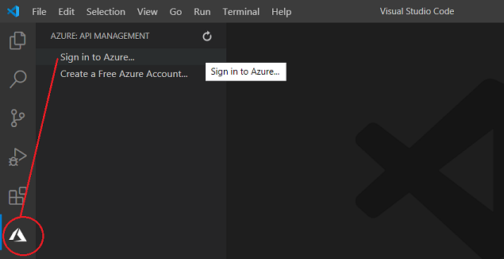
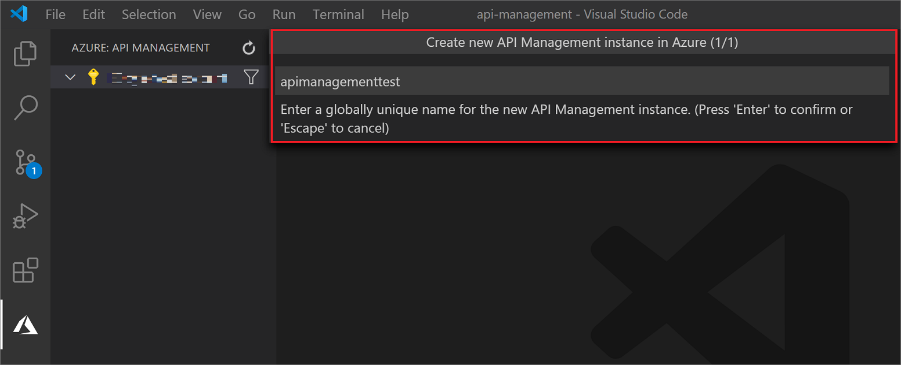
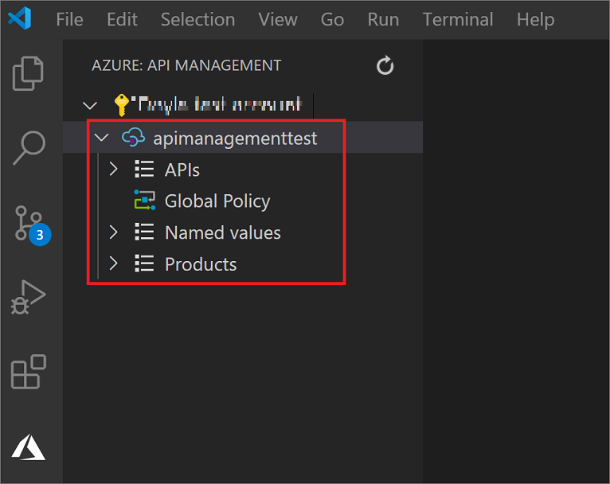

# Create a new Azure API Management service instance using Visual Studio Code

Azure API Management (APIM) helps organizations publish APIs to external, partner, and internal developers to unlock the potential of their data and services. API Management provides the core competencies to ensure a successful API program through developer engagement, business insights, analytics, security, and protection. APIM  enables you to create and manage modern API gateways for existing backend services hosted anywhere. For more information, see the [Overview](api-management-key-concepts.md) topic.

This quickstart describes the steps for creating a new API Management instance using the *Azure API Management Extension Preview* for Visual Studio Code. You can also use the extension to perform common management operations on your API Management instance.

## Prerequisites

[!INCLUDE [quickstarts-free-trial-note](../../includes/quickstarts-free-trial-note.md)]

Additionally, ensure you have installed the following:

- [Visual Studio Code](https://code.visualstudio.com/)

- [Azure API Management Extension for Visual Studio Code (Preview)](https://marketplace.visualstudio.com/items?itemName=ms-azuretools.vscode-apimanagement&ssr=false#overview)

## Sign in to Azure

Launch Visual Studio Code and open the Azure extension. (If you don't see the Azure icon on the Activity Bar, make sure the *Azure API Management* extension is enabled.)

Click on **Sign in to Azure...** to launch a browser window and sign in to your Microsoft account.

## Create an API Management service

Once you're signed in to your Microsoft account, the *Azure: API Management* explorer pane will list your Azure subscription(s).

Right-click on the subscription you'd like to use, and select **Create API Management in Azure**.

A pane will open to walk you through a series of configuration questions:

1. Enter a globally unique [**name**](../azure-resource-manager/management/resource-name-rules#microsoftapimanagement) for the API Management instance. (*1-50 alphanumeric characters and/or hyphens; must start with a letter and end with alphanumeric.*)
2. Select an [**API Management SKU**](https://azure.microsoft.com/pricing/details/api-management/) (*Consumption, Developer, Standard, Basic, Premium*).
3. Select an [**Azure region**](https://status.azure.com/en-us/status).
4. Select a [**resource group**](../azure-resource-manager/management/overview) (or create a new one) to contain the new API Management resource.

A new API Management instance will be created using the specified values.

> [!NOTE]
> It can take between 20 and 30 minutes to create and activate an API Management instance. Once ready, the new instance will appear in the API Management extension pane.

At this point, you're ready to import and publish your first API. You can do that and also perform common API Management operations within the extension for Visual Studio Code. See the [API Management Extension for Visual Studio Code](https://marketplace.visualstudio.com/items?itemName=ms-azuretools.vscode-apimanagement&ssr=false#overview) documentation for more.

## Clean up resources

When no longer needed, remove the API Management instance by right-clicking and selecting **Delete API Management**.

> [!IMPORTANT]
> This only deletes the API Management service, and not its parent resource group (or any other resources within it). To [delete the entire resource group](get-started-create-service-instance.md#clean-up-resources), open it in Azure portal and delete from there.

## Next steps

> [!div class="nextstepaction"]
> [Import and publish your first API](import-and-publish.md)
