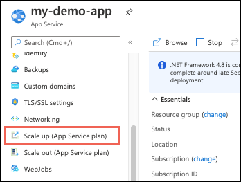
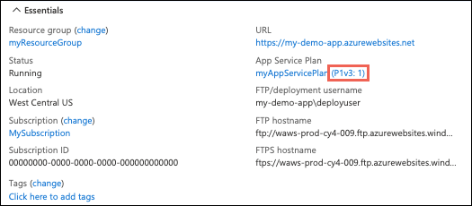

# Configure PremiumV3 tier for Azure App Service

The new **PremiumV3** pricing tier gives you faster processors, SSD storage, and quadruple the memory-to-core ratio of the existing pricing tiers (double the **PremiumV2** tier). With the performance advantage, you could save money by running your apps on fewer instances. In this article, you learn how to create an app in **PremiumV3** tier or scale up an app to **PremiumV3** tier.

## Prerequisites

To scale-up an app to **PremiumV3**, you need to have an Azure App Service app that runs in a pricing tier lower than **PremiumV3**, and the app must be running in an App Service deployment that supports PremiumV3.

<a name="availability"></a>

## PremiumV3 availability

The **PremiumV3** tier is available for App Service on both _Windows_ as well as _Linux_.

**PremiumV3** is available in some Azure regions and availability in additional regions is being added continually. To see if it's available in your region, run the following Azure CLI command in the [Azure Cloud Shell](../cloud-shell/overview.md):

```azurecli-interactive
az appservice list-locations --sku P1V3
```

<a name="create"></a>

## Create an app in PremiumV3 tier

The pricing tier of an App Service app is defined in the [App Service plan](overview-hosting-plans.md) that it runs on. You can create an App Service plan by itself or as part of app creation.

When configuring the App Service plan in the <a href="https://portal.azure.com" target="_blank">Azure portal</a>, select **Pricing tier**. 

Select **Production**, then select **P1V3**, **P2V3**, or **P3V3**, then click **Apply**.


> [!IMPORTANT] 
> If you don't see **P1V3**, **P2V3**, and **P3V3** as options, or if the options are greyed out, then **PremiumV3** likely isn't available in the underlying App Service deployment that contains the App Service plan. See [Scale up from an unsupported resource group and region combination](#unsupported) for more details.

## Scale up an existing app to PremiumV3 tier

Before scaling an existing app to **PremiumV3** tier, make sure that **PremiumV3** is available. For information, see [PremiumV3 availability](#availability). If it's not available, see [Scale up from an unsupported resource group and region combination](#unsupported).

Depending on your hosting environment, scaling up may require extra steps. 

In the <a href="https://portal.azure.com" target="_blank">Azure portal</a>, open your App Service app page.

In the left navigation of your App Service app page, select **Scale up (App Service plan)**.



Select **Production**, then select **P1V3**, **P2V3**, or **P3V3**, then click **Apply**.


If your operation finishes successfully, your app's overview page shows that it's now in a **PremiumV3** tier.



### If you get an error

Some App Service plans can't scale up to the PremiumV3 tier if the underlying App Service deployment doesn’t support PremiumV3. See [Scale up from an unsupported resource group and region combination](#unsupported) for more details.

<a name="unsupported"></a>

## Scale up from an unsupported resource group and region combination

If your app runs in an App Service deployment where **PremiumV3** isn't available, or if your app runs in a region that currently does not support **PremiumV3**, you need to re-deploy your app to take advantage of **PremiumV3**.  You have two options:

- Create an app in a new resource group and with a new App Service plan. When creating the App Service plan, select a **PremiumV3** tier. This step ensures that the App Service plan is deployed into a deployment unit that supports **PremiumV3**. Then, redeploy your application code into the newly created app. Even if you scale the App Service plan down to a lower tier to save costs, you can always scale back up to **PremiumV3** because the deployment unit supports it.
- If your app already runs in an existing **Premium** tier, then you can clone your app with all app settings, connection strings, and deployment configuration into a new app service plan that uses **PremiumV3**.

    

    In the **Clone app** page, you can create an App Service plan using **PremiumV3** in the region you want, and specify the app settings and configuration that you want to clone.

## Moving from Premium Container to Premium V3 SKU

If you have an app which is using the preview Premium Container SKU and you would like to move to the new Premium V3 SKU, you need to redeploy your app to take advantage of **PremiumV3**. To do this, see the first option in [Scale up from an unsupported resource group and region combination](#scale-up-from-an-unsupported-resource-group-and-region-combination)

## Automate with scripts

You can automate app creation in the **PremiumV3** tier with scripts, using the [Azure CLI](/cli/azure/install-azure-cli) or [Azure PowerShell](/powershell/azure/).

### Azure CLI

The following command creates an App Service plan in _P1V2_. You can run it in the Cloud Shell. The options for `--sku` are P1V3, _P2V3_, and _P3V3_.

```azurecli-interactive
az appservice plan create \
    --resource-group <resource_group_name> \
    --name <app_service_plan_name> \
    --sku P1V3
```

### Azure PowerShell

[!INCLUDE [updated-for-az](../../includes/updated-for-az.md)]

The following command creates an App Service plan in _P1V3_. The options for `-WorkerSize` are _Small_, _Medium_, and _Large_.

```powershell
New-AzAppServicePlan -ResourceGroupName <resource_group_name> `
    -Name <app_service_plan_name> `
    -Location <region_name> `
    -Tier "PremiumV3" `
    -WorkerSize "Small"
```

## More resources

[Scale up an app in Azure](manage-scale-up.md)
[Scale instance count manually or automatically](../azure-monitor/platform/autoscale-get-started.md)