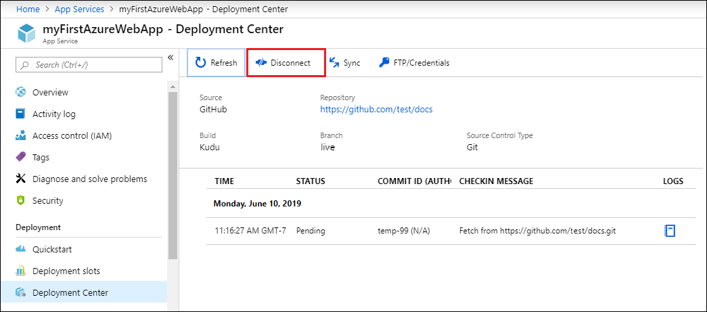

# Continuous deployment to Azure App Service
This article shows you how to configure continuous deployment for [Azure App Service](app-service-web-overview.md). App Service enables continuous deployment from BitBucket, GitHub, and [Azure DevOps](https://www.visualstudio.com/team-services/) by pulling in the most recent updates from your existing repository in one of these services.

To find out how to configure continuous deployment manually from a cloud repository not listed by the Azure portal (such as [GitLab](https://gitlab.com/)), see
[Setting up continuous deployment using manual steps](https://github.com/projectkudu/kudu/wiki/Continuous-deployment#setting-up-continuous-deployment-using-manual-steps).

[!INCLUDE [Prepare repository](../../includes/app-service-deploy-prepare-repo.md)]

Publish your prepared repository to one of the supported services. For more information on publishing your project to these services, see [Create a repo (GitHub)], [Create a repo (BitBucket)], and [Get started with Azure DevOps].

## Deploy continuously from GitHub

To enable continuous deployment with GitHub, navigate to your App Service app page in the [Azure portal](https://portal.azure.com).

In the left menu, click **Deployment Center** > **GitHub** > **Authorize**. Follow the authorization prompts. 

You only need to authorize with GitHub once. If you're already authorized, just click **Continue**. You can change the authorized GitHub account by clicking **Change account**.

In the **Build provider** page, choose the build provider and click > **Continue**.

### Option 1: use App Service Kudu build server

In the **Configure** page, select the organization, repository, and branch from which you want to deploy continuously. When finished, click **Continue**.

### Option 2: use Azure DevOps continuous delivery

> [!NOTE]
> For App Service to create the necessary build and release definitions in your Azure DevOps organization, your Azure account must have the role of **Owner** in your Azure subscription.
>

In the **Configure** page, in the **Code** section, select the organization, repository, and branch from which you want to deploy continuously. When finished, click **Continue**.

In the **Configure** page, in the **Build** section, configure a new Azure DevOps organization or specify an existing organization. When finished, click **Continue**.

> [!NOTE]
> If you want to use an existing Azure DevOps organization that is not listed, you need to [link the Azure DevOps organization to your Azure subscription](https://github.com/projectkudu/kudu/wiki/Setting-up-a-VSTS-account-so-it-can-deploy-to-a-Web-App).

In the **Test** page, choose whether to enable load tests, then click **Continue**.

Depending on the [pricing tier](https://azure.microsoft.com/pricing/details/app-service/plans/) of your App Service plan, you may also see a **Deploy to staging** page. Choose whether to [enable deployment slots](web-sites-staged-publishing.md), then click **Continue**.

### Finish configuration

In the **Summary** page, verify your options and click **Finish**.

When configuration completes, new commits in the selected repository are deployed continuously into your App Service app.

## Deploy continuously from BitBucket

To enable continuous deployment with BitBucket, navigate to your App Service app page in the [Azure portal](https://portal.azure.com).

In the left menu, click **Deployment Center** > **BitBucket** > **Authorize**. Follow the authorization prompts. 

You only need to authorize with BitBucket once. If you're already authorized, just click **Continue**. You can change the authorized BitBucket account by clicking **Change account**.

In the **Configure** page, select the repository and branch from which you want to deploy continuously. When finished, click **Continue**.

In the **Summary** page, verify your options and click **Finish**.

When configuration completes, new commits in the selected repository are deployed continuously into your App Service app.

## Deploy continuously from Azure DevOps

To enable continuous deployment with Azure DevOps, navigate to your App Service app page in the [Azure portal](https://portal.azure.com).

In the left menu, click **Deployment Center** > **Azure DevOps** > **Continue**. 

In the **Build provider** page, choose the build provider and click > **Continue**.

### Option 1: use App Service Kudu build server

In the **Configure** page, select the Azure DevOps organization, project, repository, and branch from which you want to deploy continuously. When finished, click **Continue**.

### Option 2: use Azure DevOps continuous delivery

> [!NOTE]
> For App Service to create the necessary build and release definitions in your Azure DevOps organization, your Azure account must have the role of **Owner** in your Azure subscription.
>

In the **Configure** page, in the **Code** section, select the Azure DevOps organization, project, repository, and branch from which you want to deploy continuously. When finished, click **Continue**.

> [!NOTE]
> If you want to use an existing Azure DevOps organization that is not listed, you need to [link the Azure DevOps organization to your Azure subscription](https://github.com/projectkudu/kudu/wiki/Setting-up-a-VSTS-account-so-it-can-deploy-to-a-Web-App).

In the **Configure** page, in the **Build** section, specify the language framework that Azure DevOps should use to run the build tasks for your selected repository. When finished, click **Continue**.

In the **Test** page, choose whether to enable load tests, then click **Continue**.

Depending on the [pricing tier](https://azure.microsoft.com/pricing/details/app-service/plans/) of your App Service plan, you may also see a **Deploy to staging** page. Choose whether to [enable deployment slots](web-sites-staged-publishing.md), then click **Continue**. 

### Finish configuration

In the **Summary** page, verify your options and click **Finish**.

When configuration completes, new commits in the selected repository are deployed continuously into your App Service app.

## Disable continuous deployment

To disable continuous deployment, navigate to your App Service app page in the [Azure portal](https://portal.azure.com).

In the left menu, click **Deployment Center** > **GitHub** or **Azure DevOps** or **BitBucket** > **Disconnect**.

[!INCLUDE [What happens to my app during deployment?](../../includes/app-service-deploy-atomicity.md)]

## Additional Resources

* [How to investigate common issues with continuous deployment](https://github.com/projectkudu/kudu/wiki/Investigating-continuous-deployment)
* [How to use PowerShell for Azure]
* [Git documentation]
* [Project Kudu](https://github.com/projectkudu/kudu/wiki)
* [Use Azure to automatically generate a CI/CD pipeline to deploy an ASP.NET 4 app](https://www.visualstudio.com/docs/build/get-started/aspnet-4-ci-cd-azure-automatic)

[Azure portal]: https://portal.azure.com
[VSTS Portal]: https://www.visualstudio.com/en-us/products/visual-studio-team-services-vs.aspx
[Installing Git]: http://git-scm.com/book/en/Getting-Started-Installing-Git
[How to use PowerShell for Azure]: /powershell/azureps-cmdlets-docs
[Git Documentation]: http://git-scm.com/documentation

[Create a repo (GitHub)]: https://help.github.com/articles/create-a-repo
[Create a repo (BitBucket)]: https://confluence.atlassian.com/display/BITBUCKET/Create+an+Account+and+a+Git+Repo
[Get started with Azure DevOps]: https://www.visualstudio.com/docs/vsts-tfs-overview
