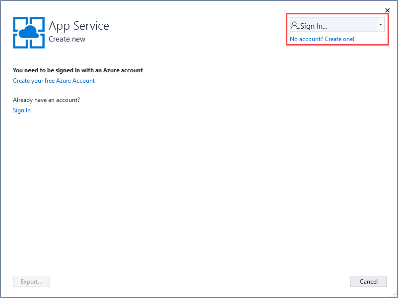
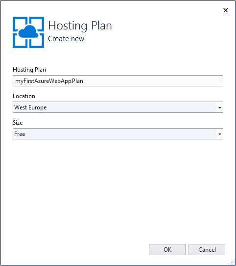
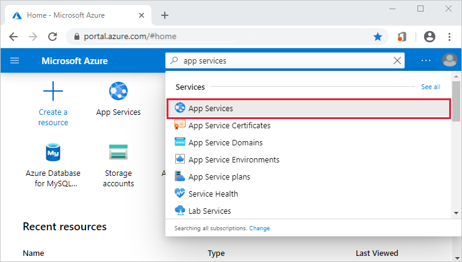

# Create an ASP.NET Core web app in Azure

> [!NOTE]
> This article deploys an app to App Service on Windows. To deploy to App Service on _Linux_, see [Create a .NET Core web app in App Service on Linux](./containers/quickstart-dotnetcore.md).
>

[Azure App Service](overview.md) provides a highly scalable, self-patching web hosting service.

In this quickstart, you'll create and deploy an ASP.NET Core web app to Azure App Service. When you're finished, you'll have a resource group that consists of an App Service plan and an App Service app with a deployed web application.

## Prerequisites

- An Azure account with an active subscription. [Create an account for free](https://azure.microsoft.com/free/?ref=microsoft.com&utm_source=microsoft.com&utm_medium=docs&utm_campaign=visualstudio).
- Install <a href="https://www.visualstudio.com/downloads/" target="_blank">Visual Studio 2019</a> with the **ASP.NET and web development** workload.

  If you've installed Visual Studio 2019 already:

  - Install the latest updates in Visual Studio by selecting **Help** > **Check for Updates**.
  - Add the workload by selecting **Tools** > **Get Tools and Features**.


## Create an ASP.NET Core web app

Create an ASP.NET Core web app by following these steps:

1. Open Visual Studio and then select **Create a new project**.

1. In **Create a new project**, find and choose **ASP.NET Core Web Application** for C#, then select **Next**.

1. In **Configure your new project**, name the application _myFirstAzureWebApp_, and then select **Create**.

   

1. For this quickstart, choose the **Web Application** template. Make sure authentication is set to **No Authentication** and no other option is selected. Select **Create**.

   

    You can deploy any type of ASP.NET Core web app to Azure.

1. From the Visual Studio menu, select **Debug** > **Start Without Debugging** to run the web app locally.

   

## Publish your web app

1. In **Solution Explorer**, right-click the **myFirstAzureWebApp** project and select **Publish**.

1. Choose **App Service** and then select **Publish**.

   

1. In **App Service Create new**, your options depend on whether you're signed in to Azure already and whether you have a Visual Studio account linked to an Azure account. Select either **Add an account** or **Sign in** to sign in to your Azure subscription. If you're already signed in, select the account you want.

   > [!NOTE]
   > If you're already signed in, don't select **Create** yet.
   >

   

   [!INCLUDE [resource group intro text](../../includes/resource-group.md)]

1. For **Resource group**, select **New**.

1. In **New resource group name**, enter *myResourceGroup* and select **OK**.

   [!INCLUDE [app-service-plan](../../includes/app-service-plan.md)]

1. For the **Hosting Plan**, select **New**.

1. In the **Configure Hosting Plan** dialog, enter the values from the following table, and then select **OK**.

   | Setting | Suggested Value | Description |
   |-|-|-|
   |App Service Plan| myAppServicePlan | Name of the App Service plan. |
   | Location | West Europe | The datacenter where the web app is hosted. |
   | Size | Free | [Pricing tier](https://azure.microsoft.com/pricing/details/app-service/?ref=microsoft.com&utm_source=microsoft.com&utm_medium=docs&utm_campaign=visualstudio) determines hosting features. |

   

1. In **Name**, enter a unique app name that includes only the valid characters are `a-z`, `A-Z`, `0-9`, and `-`. You can accept the automatically generated unique name. The URL of the web app is `http://<app_name>.azurewebsites.net`, where `<app_name>` is your app name.

   

1. Select **Create** to start creating the Azure resources.

Once the wizard completes, it publishes the ASP.NET Core web app to Azure, and then launches the app in the default browser.


The app name specified in the **App Service Create new** page is used as the URL prefix in the format `http://<app_name>.azurewebsites.net`.

**Congratulations!** Your ASP.NET Core web app is running live in Azure App Service.

## Update the app and redeploy

1. In **Solution Explorer**, under your project, open **Pages** > **Index.cshtml**.

1. Replace the two `<div>` tags with the following code:

   ```HTML
   <div class="jumbotron">
       <h1>ASP.NET in Azure!</h1>
       <p class="lead">This is a simple app that we’ve built that demonstrates how to deploy a .NET app to Azure App Service.</p>
   </div>
   ```

1. To redeploy to Azure, right-click the **myFirstAzureWebApp** project in **Solution Explorer** and select **Publish**.

1. In the **Publish** summary page, select **Publish**.

   

When publishing completes, Visual Studio launches a browser to the URL of the web app.


## Manage the Azure app

To manage the web app, go to the [Azure portal](https://portal.azure.com), and search for and select **App Services**.



On the **App Services** page, select the name of your web app.


You see your web app's Overview page. Here, you can do basic management like browse, stop, start, restart, and delete.


The left menu provides different pages for configuring your app.

[!INCLUDE [Clean-up section](../../includes/clean-up-section-portal.md)]

## Next steps

> [!div class="nextstepaction"]
> [ASP.NET Core with SQL Database](app-service-web-tutorial-dotnetcore-sqldb.md)
