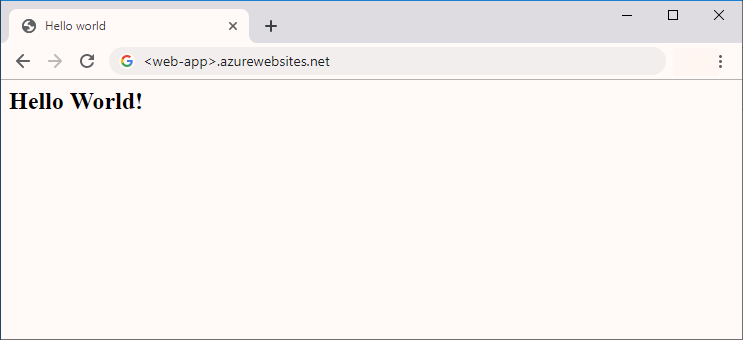

# Quickstart: Create a Java app on Azure App Service on Windows

> [!NOTE]
> This article deploys an app to App Service on Windows. To deploy to App Service on _Linux_, see [Create Java web app on Linux](./containers/quickstart-java.md).
>

[Azure App Service](overview.md) provides a highly scalable, self-patching web hosting service.  This quickstart shows how to use the [Azure CLI](https://docs.microsoft.com/cli/azure/get-started-with-azure-cli) with the [Maven Plugin for Azure App Service](https://github.com/Microsoft/azure-maven-plugins/tree/develop/azure-webapp-maven-plugin) to deploy a Java web archive (WAR) file.

> [!NOTE]
> The same thing can also be done using popular IDEs like IntelliJ and Eclipse. Check out our similar documents at [Azure Toolkit for IntelliJ Quickstart](/java/azure/intellij/azure-toolkit-for-intellij-create-hello-world-web-app) or [Azure Toolkit for Eclipse Quickstart](/java/azure/eclipse/azure-toolkit-for-eclipse-create-hello-world-web-app).
>


[!INCLUDE [quickstarts-free-trial-note](../../includes/quickstarts-free-trial-note.md)]

[!INCLUDE [cloud-shell-try-it.md](../../includes/cloud-shell-try-it.md)]

## Create a Java app

Execute the following Maven command in the Cloud Shell prompt to create a new app named `helloworld`:

```bash
mvn archetype:generate -DgroupId=example.demo -DartifactId=helloworld -DarchetypeArtifactId=maven-archetype-webapp
```

## Configure the Maven plugin

To deploy from Maven, use the code editor in the Cloud Shell to open up the project `pom.xml` file in the `helloworld` directory. 

```bash
code pom.xml
```

Then add the following plugin definition inside the `<build>` element of the `pom.xml` file.

```xml
<plugins>
    <!--*************************************************-->
    <!-- Deploy to Tomcat in App Service Windows         -->
    <!--*************************************************-->
    <plugin>
        <groupId>com.microsoft.azure</groupId>
        <artifactId>azure-webapp-maven-plugin</artifactId>
        <version>1.7.0</version>
        <configuration>
            <!-- Specify v2 schema -->
            <schemaVersion>v2</schemaVersion>
            <!-- App information -->
            <subscriptionId>SUBSCRIPTION_ID</subscriptionId>
            <resourceGroup>RESOURCEGROUP_NAME</resourceGroup>
            <appName>WEBAPP_NAME</appName>
            <region>REGION</region>
            <!-- Java Runtime Stack for App Service on Windows-->
            <runtime>
                <os>windows</os>
                <javaVersion>1.8</javaVersion>
                <webContainer>tomcat 9.0</webContainer>
            </runtime>
            <deployment>
                <resources>
                    <resource>
                        <directory>${project.basedir}/target</directory>
                        <includes>
                            <include>*.war</include>
                        </includes>
                    </resource>
                </resources>
            </deployment>
        </configuration>
    </plugin>
</plugins>
```

> [!NOTE]
> In this article we are only working with Java apps packaged in WAR files. The plugin also supports JAR web applications, visit [Deploy a Java SE JAR file to App Service on Linux](https://docs.microsoft.com/java/azure/spring-framework/deploy-spring-boot-java-app-with-maven-plugin?toc=%2fazure%2fapp-service%2fcontainers%2ftoc.json) to try it out.


Update the following placeholders in the plugin configuration:

| Placeholder | Description |
| ----------- | ----------- |
| `SUBSCRIPTION_ID` | The unique ID of the subscription you want to deploy your app to. Default subscription's ID can be found from the Cloud Shell or CLI using the `az account show` command. For all the available subscriptions, use the `az account list` command.|
| `RESOURCEGROUP_NAME` | Name for the new resource group in which to create your app. By putting all the resources for an app in a group, you can manage them together. For example, deleting the resource group would delete all resources associated with the app. Update this value with a unique new resource group name, for example, *myResourceGroup*. You will use this resource group name to clean up all Azure resources in a later section. |
| `WEBAPP_NAME` | The app name will be part of the host name for the app when deployed to Azure (WEBAPP_NAME.azurewebsites.net). Update this value with a unique name for the new App Service app, which will host your Java app, for example *contoso*. |
| `REGION` | An Azure region where the app is hosted, for example *westus2*. You can get a list of regions from the Cloud Shell or CLI using the `az account list-locations` command. |

## Deploy the app

Deploy your Java app to Azure using the following command:

```bash
mvn package azure-webapp:deploy
```

Once deployment has completed, browse to the deployed application using the following URL in your web browser, for example `http://<webapp>.azurewebsites.net/`.


**Congratulations!** You've deployed your first Java app to App Service on Windows.

[!INCLUDE [cli-samples-clean-up](../../includes/cli-samples-clean-up.md)]

## Next steps

> [!div class="nextstepaction"]
> [Azure for Java Developers Resources](/java/azure/)

> [!div class="nextstepaction"]
> [Map custom domain](app-service-web-tutorial-custom-domain.md)
