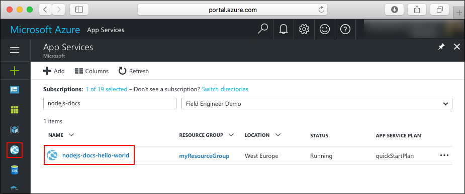

# Create a Node.js web app in Azure

> [!NOTE]
> This article deploys an app to App Service on Windows. To deploy to App Service on _Linux_, see [Create a Node.js web app in Azure App Service on Linux](./containers/quickstart-nodejs.md).
>

[Azure Web Apps](app-service-web-overview.md) provides a highly scalable, self-patching web hosting service.  This quickstart shows how to deploy a Node.js app to Azure Web Apps. You create the web app using the [Azure CLI](https://docs.microsoft.com/cli/azure/get-started-with-azure-cli), and you use ZipDeploy to deploy the sample Node.js code to the web app.


You can follow the steps here using a Mac, Windows, or Linux machine. Once the prerequisites are installed, it takes about five minutes to complete the steps.   

[!INCLUDE [quickstarts-free-trial-note](../../includes/quickstarts-free-trial-note.md)]

## Prerequisites

To complete this quickstart:

* <a href="https://nodejs.org/" target="_blank">Install Node.js and NPM</a>

## Download the sample

Download the sample Node.js project from [https://github.com/Azure-Samples/nodejs-docs-hello-world/archive/master.zip](https://github.com/Azure-Samples/nodejs-docs-hello-world/archive/master.zip) and extract the ZIP archive.

In a terminal window, navigate to the root directory of the sample Node.js project (the one that contains _index.js_).

## Run the app locally

Run the application locally so that you see how it should look when you deploy it to Azure. Open a terminal window and use the `npm start` script to launch the built in Node.js HTTP server.

```bash
npm start
```

Open a web browser, and navigate to the sample app at `http://localhost:1337`.

You see the **Hello World** message from the sample app displayed in the page.


In your terminal window, press **Ctrl+C** to exit the web server.

> [!NOTE]
> In Azure App Service, the app is run in IIS using [iisnode](https://github.com/tjanczuk/iisnode). To enable the app to run with iisnode, the root app directory contains a web.config file. The file is readable by IIS, and the iisnode-related settings are documented in [the iisnode GitHub repository](https://github.com/tjanczuk/iisnode/blob/master/src/samples/configuration/web.config).

[!INCLUDE [Create ZIP file](../../includes/app-service-web-create-zip.md)]

[!INCLUDE [cloud-shell-try-it.md](../../includes/cloud-shell-try-it.md)]

[!INCLUDE [Create resource group](../../includes/app-service-web-create-resource-group-scus.md)] 

[!INCLUDE [Create app service plan](../../includes/app-service-web-create-app-service-plan-scus.md)] 

## Create a web app

In the Cloud Shell, create a web app in the `myAppServicePlan` App Service plan with the [`az webapp create`](/cli/azure/webapp?view=azure-cli-latest#az-webapp-create) command. 

In the following example, replace `<app_name>` with a globally unique app name (valid characters are `a-z`, `0-9`, and `-`).

```azurecli-interactive
# Bash and Powershell
az webapp create --resource-group myResourceGroup --plan myAppServicePlan --name <app_name>
```

When the web app has been created, the Azure CLI shows output similar to the following example:

```json
{
  "availabilityState": "Normal",
  "clientAffinityEnabled": true,
  "clientCertEnabled": false,
  "cloningInfo": null,
  "containerSize": 0,
  "dailyMemoryTimeQuota": 0,
  "defaultHostName": "<app_name>.azurewebsites.net",
  "enabled": true,
  < JSON data removed for brevity. >
}
```

### Set Node.js runtime

Set the Node runtime to 8.11.1. <!-- To see all supported runtimes, run [`az webapp list-runtimes`](/cli/azure/webapp?view=azure-cli-latest#az-webapp-list-runtimes). -->

```azurecli-interactive
# Bash and Powershell
az webapp config appsettings set --resource-group myResourceGroup --name <app_name> --settings WEBSITE_NODE_DEFAULT_VERSION=8.11.1
```

Browse to your newly created web app. Replace _&lt;app name>_ with a unique app name.

```bash
http://<app name>.azurewebsites.net
```

Here is what your new web app should look like:


[!INCLUDE [Deploy ZIP file](../../includes/app-service-web-deploy-zip.md)]

## Browse to the app

Browse to the deployed application using your web browser.

```
http://<app_name>.azurewebsites.net
```

The Node.js sample code is running in an Azure App Service web app.


**Congratulations!** You've deployed your first Node.js app to App Service.

## Update and redeploy the code

Using a text editor, open the `index.js` file in the Node.js app, and make a small change to the text in the call to `response.end`:

```nodejs
response.end("Hello Azure!");
```

In the local terminal window, navigate to your application's root directory, create a new ZIP file for your updated project.

```
# Bash
zip -r myUpdatedAppFiles.zip .

# PowerShell
Compress-Archive -Path * -DestinationPath myUpdatedAppFiles.zip
``` 

Deploy this new ZIP file to App Service, using the same steps in [Deploy ZIP file](#deploy-zip-file).

Switch back to the browser window that opened in the **Browse to the app** step, and refresh the page.


## Manage your new Azure web app

Go to the <a href="https://portal.azure.com" target="_blank">Azure portal</a> to manage the web app you created.

From the left menu, click **App Services**, and then click the name of your Azure web app.



You see your web app's Overview page. Here, you can perform basic management tasks like browse, stop, start, restart, and delete. 


The left menu provides different pages for configuring your app. 

## Video

Watch the video to see this quickstart in action and then follow the steps yourself to publish your first Node.js app on Azure.

> [!VIDEO https://channel9.msdn.com/Shows/Azure-for-Node-Developers/Create-a-Nodejs-app-in-Azure-Quickstart/player]   

[!INCLUDE [cli-samples-clean-up](../../includes/cli-samples-clean-up.md)]

## Next steps

> [!div class="nextstepaction"]
> [Node.js with MongoDB](app-service-web-tutorial-nodejs-mongodb-app.md)
