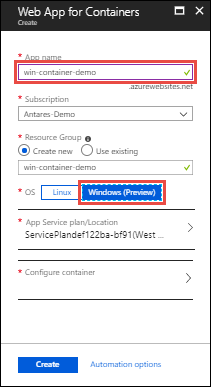
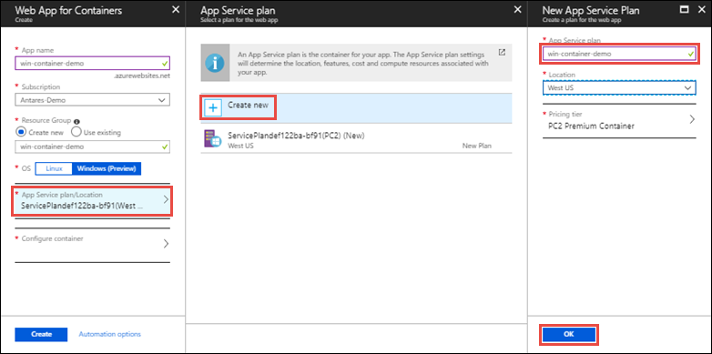

# Run a custom Windows container in Azure (Preview)

[Azure App Service](app-service-web-overview.md) provides pre-defined application stacks on Windows like ASP.NET or Node.js, running on IIS. The preconfigured Windows environment locks down the operating system from administrative access, software installations, changes to the global assembly cache, and so on (see [Operating system functionality on Azure App Service](web-sites-available-operating-system-functionality.md)). If your application requires more access than the preconfigured environment allows, you can deploy a custom Windows container instead. This quickstart shows how to deploy a custom IIS image to Azure App Service from [Docker Hub](https://hub.docker.com/).

## Sign in to Azure

Sign in to the Azure portal at https://portal.azure.com.

## Create a Windows container app

1. Choose **Create a resource** in the upper left-hand corner of the Azure portal.

2. In the search box above the list of Azure Marketplace resources, search for and select **Web App for Containers**.

3. Provide an app name, such as *mywebapp*, accept the defaults to create a new resource group, and click **Windows (Preview)** in the **OS** box.

    

4. Create an App Service plan by clicking **App Service plan/Location** > **Create new**. Give the new plan a name, accept the defaults, and click **OK**.

    

5. Click **Configure container**, type _microsoft/iis:latest_ in **Image and optional tag**, and click **OK**.

    

    In this article, you use the public [microsoft/iis:latest](https://hub.docker.com/r/microsoft/iis/) Docker Hub image. If you have a custom image elsewhere for your web application, such as in [Azure Container Registry](/azure/container-registry/) or in any other private repository, you can configure it here.

6. Click **Create** and wait for Azure to create the required resources.

## Browse to the container app

When the Azure operation is complete, a notification box is displayed.


1. Click **Go to resource**.

2. In the app page, click the link under **URL**.

A new browser page is opened to the following page:


Wait a few minutes and try again, until you get the IIS welcome page:


**Congratulations!** You're running your first custom Windows container in Azure App Service.

## See container start-up logs

It may take some time for the Windows container to load. To see the progress, navigate to the following URL by replacing *\<app_name>* with the name of your app.
```
https://<app_name>.scm.azurewebsites.net/api/logstream
```

The streamed logs looks like this:

```
2018-07-27T12:03:11  Welcome, you are now connected to log-streaming service.
27/07/2018 12:04:10.978 INFO - Site: win-container-demo - Start container succeeded. Container: facbf6cb214de86e58557a6d073396f640bbe2fdec88f8368695c8d1331fc94b
27/07/2018 12:04:16.767 INFO - Site: win-container-demo - Container start complete
27/07/2018 12:05:05.017 INFO - Site: win-container-demo - Container start complete
27/07/2018 12:05:05.020 INFO - Site: win-container-demo - Container started successfully
```