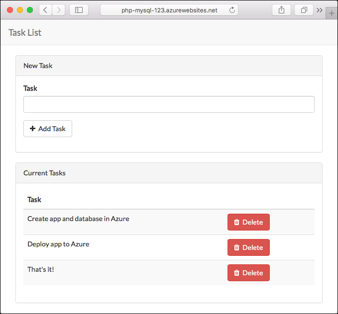
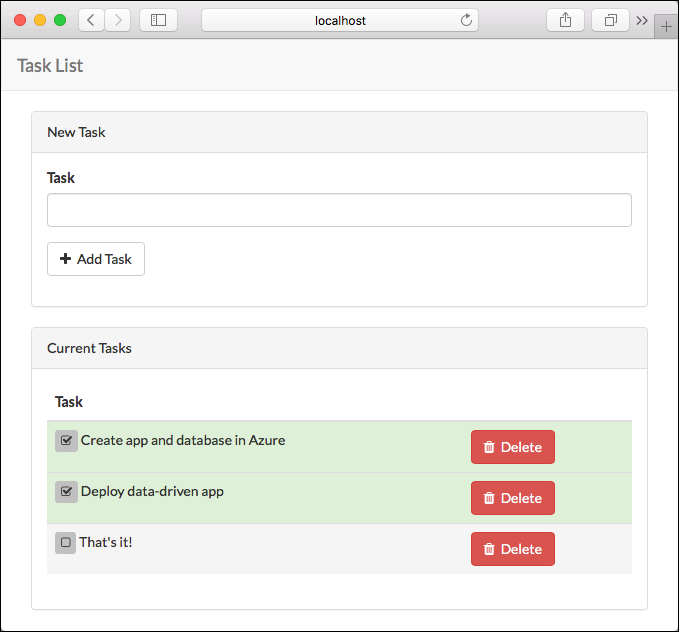
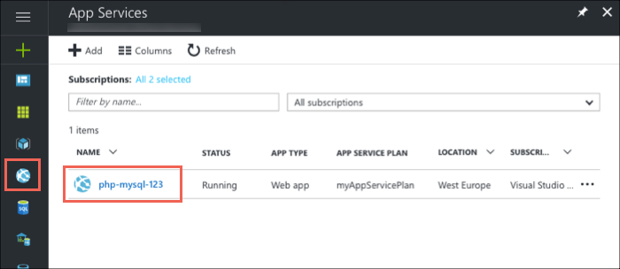
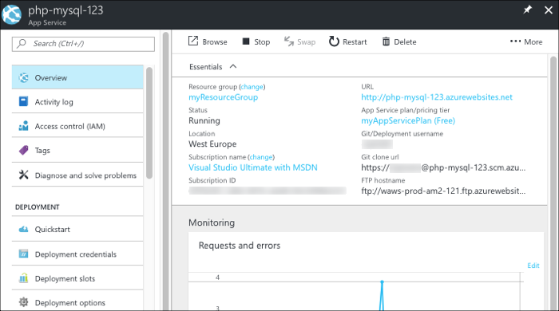

# Tutorial: Build a PHP and MySQL web app in Azure

> [!NOTE]
> This article deploys an app to App Service on Windows. To deploy to App Service on _Linux_, see [Build a PHP and MySQL web app in Azure App Service on Linux](./containers/tutorial-php-mysql-app.md).
>

[Azure Web Apps](app-service-web-overview.md) provides a highly scalable, self-patching web hosting service. This tutorial shows how to create a PHP web app in Azure and connect it to a MySQL database. When you're finished, you'll have a [Laravel](https://laravel.com/) app running on Azure App Service Web Apps.


In this tutorial, you learn how to:

> [!div class="checklist"]
> * Create a MySQL database in Azure
> * Connect a PHP app to MySQL
> * Deploy the app to Azure
> * Update the data model and redeploy the app
> * Stream diagnostic logs from Azure
> * Manage the app in the Azure portal

[!INCLUDE [quickstarts-free-trial-note](../../includes/quickstarts-free-trial-note.md)]

## Prerequisites

To complete this tutorial:

* [Install Git](https://git-scm.com/)
* [Install PHP 5.6.4 or above](https://php.net/downloads.php)
* [Install Composer](https://getcomposer.org/doc/00-intro.md)
* Enable the following PHP extensions Laravel needs: OpenSSL, PDO-MySQL, Mbstring, Tokenizer, XML
* [Install and start MySQL](https://dev.mysql.com/doc/refman/5.7/en/installing.html) 

## Prepare local MySQL

In this step, you create a database in your local MySQL server for your use in this tutorial.

### Connect to local MySQL server

In a terminal window, connect to your local MySQL server. You can use this terminal window to run all the commands in this tutorial.

```bash
mysql -u root -p
```

If you're prompted for a password, enter the password for the `root` account. If you don't remember your root account password, see [MySQL: How to Reset the Root Password](https://dev.mysql.com/doc/refman/5.7/en/resetting-permissions.html).

If your command runs successfully, then your MySQL server is running. If not, make sure that your local MySQL server is started by following the [MySQL post-installation steps](https://dev.mysql.com/doc/refman/5.7/en/postinstallation.html).

### Create a database locally

At the `mysql` prompt, create a database.

```sql 
CREATE DATABASE sampledb;
```

Exit your server connection by typing `quit`.

```sql
quit
```

<a name="step2"></a>

## Create a PHP app locally
In this step, you get a Laravel sample application, configure its database connection, and run it locally. 

### Clone the sample

In the terminal window, `cd` to a working directory.

Run the following command to clone the sample repository.

```bash
git clone https://github.com/Azure-Samples/laravel-tasks
```

`cd` to your cloned directory.
Install the required packages.

```bash
cd laravel-tasks
composer install
```

### Configure MySQL connection

In the repository root, create a text file named *.env*. Copy the following variables into the *.env* file. Replace the _&lt;root_password>_ placeholder with the MySQL root user's password.

```
APP_ENV=local
APP_DEBUG=true
APP_KEY=

DB_CONNECTION=mysql
DB_HOST=127.0.0.1
DB_DATABASE=sampledb
DB_USERNAME=root
DB_PASSWORD=<root_password>
```

For information on how Laravel uses the _.env_ file, see [Laravel Environment Configuration](https://laravel.com/docs/5.4/configuration#environment-configuration).

### Run the sample locally

Run [Laravel database migrations](https://laravel.com/docs/5.4/migrations) to create the tables the application needs. To see which tables are created in the migrations, look in the _database/migrations_ directory in the Git repository.

```bash
php artisan migrate
```

Generate a new Laravel application key.

```bash
php artisan key:generate
```

Run the application.

```bash
php artisan serve
```

Navigate to `http://localhost:8000` in a browser. Add a few tasks in the page.


To stop the PHP server, type `Ctrl + C` in the terminal.

[!INCLUDE [cloud-shell-try-it.md](../../includes/cloud-shell-try-it.md)]

## Create MySQL in Azure

In this step, you create a MySQL database in [Azure Database for MySQL](/azure/mysql). Later, you configure the PHP application to connect to this database.

### Create a resource group

[!INCLUDE [Create resource group](../../includes/app-service-web-create-resource-group-no-h.md)] 

### Create a MySQL server

In the Cloud Shell, create a server in Azure Database for MySQL with the [`az mysql server create`](/cli/azure/mysql/server?view=azure-cli-latest#az-mysql-server-create) command.

In the following command, substitute a unique server name for the *\<mysql_server_name>* placeholder, a user name for the *\<admin_user>*, and a password for the *\<admin_password>*  placeholder. The server name is used as part of your MySQL endpoint (`https://<mysql_server_name>.mysql.database.azure.com`), so the name needs to be unique across all servers in Azure.

```azurecli-interactive
az mysql server create --resource-group myResourceGroup --name <mysql_server_name> --location "West Europe" --admin-user <admin_user> --admin-password <admin_password> --sku-name B_Gen5_1
```

> [!NOTE]
> Since there are several credentials to think about in this tutorial, to avoid confusion, `--admin-user` and `--admin-password` are set to dummy values. In a production environment, follow security best practices when choosing a good username and password for your MySQL server in Azure.
>
>

When the MySQL server is created, the Azure CLI shows information similar to the following example:

```json
{
  "location": "westeurope",
  "name": "<mysql_server_name>",
  "resourceGroup": "myResourceGroup",
  "sku": {
    "additionalProperties": {},
    "capacity": 1,
    "family": "Gen5",
    "name": "B_Gen5_1",
    "size": null,
    "tier": "GeneralPurpose"
  },
  "sslEnforcement": "Enabled",
  ...	+  
  -  < Output has been truncated for readability >
}
```

### Configure server firewall

In the Cloud Shell, create a firewall rule for your MySQL server to allow client connections by using the [`az mysql server firewall-rule create`](/cli/azure/mysql/server/firewall-rule?view=azure-cli-latest#az-mysql-server-firewall-rule-create) command. When both starting IP and end IP are set to 0.0.0.0, the firewall is only opened for other Azure resources. 

```azurecli-interactive
az mysql server firewall-rule create --name allAzureIPs --server <mysql_server_name> --resource-group myResourceGroup --start-ip-address 0.0.0.0 --end-ip-address 0.0.0.0
```

> [!TIP] 
> You can be even more restrictive in your firewall rule by [using only the outbound IP addresses your app uses](app-service-ip-addresses.md#find-outbound-ips).
>

In the Cloud Shell, run the command again to allow access from your local computer by replacing *\<your_ip_address>* with [your local IPv4 IP address](https://www.whatsmyip.org/).

```azurecli-interactive
az mysql server firewall-rule create --name AllowLocalClient --server <mysql_server_name> --resource-group myResourceGroup --start-ip-address=<your_ip_address> --end-ip-address=<your_ip_address>
```

### Connect to production MySQL server locally

In the local terminal window, connect to the MySQL server in Azure. Use the value you specified previously for _&lt;mysql_server_name>_. When prompted for a password, use the password you specified when you created the database in Azure.

```bash
mysql -u <admin_user>@<mysql_server_name> -h <mysql_server_name>.mysql.database.azure.com -P 3306 -p
```

### Create a production database

At the `mysql` prompt, create a database.

```sql
CREATE DATABASE sampledb;
```

### Create a user with permissions

Create a database user called _phpappuser_ and give it all privileges in the `sampledb` database. Again, for simplicity of the tutorial, use _MySQLAzure2017_ as the password.

```sql
CREATE USER 'phpappuser' IDENTIFIED BY 'MySQLAzure2017'; 
GRANT ALL PRIVILEGES ON sampledb.* TO 'phpappuser';
```

Exit the server connection by typing `quit`.

```sql
quit
```

## Connect app to Azure MySQL

In this step, you connect the PHP application to the MySQL database you created in Azure Database for MySQL.

<a name="devconfig"></a>

### Configure the database connection

In the repository root, create an _.env.production_ file and copy the following variables into it. Replace the placeholder _&lt;mysql_server_name>_ in both *DB_HOST* and *DB_USERNAME*.

```
APP_ENV=production
APP_DEBUG=true
APP_KEY=

DB_CONNECTION=mysql
DB_HOST=<mysql_server_name>.mysql.database.azure.com
DB_DATABASE=sampledb
DB_USERNAME=phpappuser@<mysql_server_name>
DB_PASSWORD=MySQLAzure2017
MYSQL_SSL=true
```

Save the changes.

> [!TIP]
> To secure your MySQL connection information, this file is already excluded from the Git repository (See _.gitignore_ in the repository root). Later, you learn how to configure environment variables in App Service to connect to your database in Azure Database for MySQL. With environment variables, you don't need the *.env* file in App Service.
>

### Configure SSL certificate

By default, Azure Database for MySQL enforces SSL connections from clients. To connect to your MySQL database in Azure, you must use the [_.pem_ certificate supplied by Azure Database for MySQL](../mysql/howto-configure-ssl.md).

Open _config/database.php_ and add the `sslmode` and `options` parameters to `connections.mysql`, as shown in the following code.

```php
'mysql' => [
    ...
    'sslmode' => env('DB_SSLMODE', 'prefer'),
    'options' => (env('MYSQL_SSL')) ? [
        PDO::MYSQL_ATTR_SSL_KEY    => '/ssl/BaltimoreCyberTrustRoot.crt.pem', 
    ] : []
],
```

The certificate `BaltimoreCyberTrustRoot.crt.pem` is provided in the repository for convenience in this tutorial. 

### Test the application locally

Run Laravel database migrations with _.env.production_ as the environment file to create the tables in your MySQL database in Azure Database for MySQL. Remember that _.env.production_ has the connection information to your MySQL database in Azure.

```bash
php artisan migrate --env=production --force
```

_.env.production_ doesn't have a valid application key yet. Generate a new one for it in the terminal.

```bash
php artisan key:generate --env=production --force
```

Run the sample application with _.env.production_ as the environment file.

```bash
php artisan serve --env=production
```

Navigate to `http://localhost:8000`. If the page loads without errors, the PHP application is connecting to the MySQL database in Azure.

Add a few tasks in the page.


To stop PHP, type `Ctrl + C` in the terminal.

### Commit your changes

Run the following Git commands to commit your changes:

```bash
git add .
git commit -m "database.php updates"
```

Your app is ready to be deployed.

## Deploy to Azure

In this step, you deploy the MySQL-connected PHP application to Azure App Service.

### Configure a deployment user

[!INCLUDE [Configure deployment user](../../includes/configure-deployment-user-no-h.md)]

### Create an App Service plan

[!INCLUDE [Create app service plan no h](../../includes/app-service-web-create-app-service-plan-no-h.md)]

<a name="create"></a>
### Create a web app

[!INCLUDE [Create web app no h](../../includes/app-service-web-create-web-app-php-no-h.md)] 

### Configure database settings

As pointed out previously, you can connect to your Azure MySQL database using environment variables in App Service.

In the Cloud Shell, you set environment variables as _app settings_ by using the [`az webapp config appsettings set`](/cli/azure/webapp/config/appsettings?view=azure-cli-latest#az-webapp-config-appsettings-set) command.

The following command configures the app settings `DB_HOST`, `DB_DATABASE`, `DB_USERNAME`, and `DB_PASSWORD`. Replace the placeholders _&lt;appname>_ and _&lt;mysql_server_name>_.

```azurecli-interactive
az webapp config appsettings set --name <app_name> --resource-group myResourceGroup --settings DB_HOST="<mysql_server_name>.mysql.database.azure.com" DB_DATABASE="sampledb" DB_USERNAME="phpappuser@<mysql_server_name>" DB_PASSWORD="MySQLAzure2017" MYSQL_SSL="true"
```

You can use the PHP [getenv](http://www.php.net/manual/function.getenv.php) method to access the settings. the Laravel code uses an [env](https://laravel.com/docs/5.4/helpers#method-env) wrapper over the PHP `getenv`. For example, the MySQL configuration in _config/database.php_ looks like the following code:

```php
'mysql' => [
    'driver'    => 'mysql',
    'host'      => env('DB_HOST', 'localhost'),
    'database'  => env('DB_DATABASE', 'forge'),
    'username'  => env('DB_USERNAME', 'forge'),
    'password'  => env('DB_PASSWORD', ''),
    ...
],
```

### Configure Laravel environment variables

Laravel needs an application key in App Service. You can configure it with app settings.

In the local terminal window, use `php artisan` to generate a new application key without saving it to _.env_.

```bash
php artisan key:generate --show
```

In the Cloud Shell, set the application key in the App Service web app by using the [`az webapp config appsettings set`](/cli/azure/webapp/config/appsettings?view=azure-cli-latest#az-webapp-config-appsettings-set) command. Replace the placeholders _&lt;appname>_ and _&lt;outputofphpartisankey:generate>_.

```azurecli-interactive
az webapp config appsettings set --name <app_name> --resource-group myResourceGroup --settings APP_KEY="<output_of_php_artisan_key:generate>" APP_DEBUG="true"
```

`APP_DEBUG="true"` tells Laravel to return debugging information when the deployed web app encounters errors. When running a production application, set it to `false`, which is more secure.

### Set the virtual application path

Set the virtual application path for the web app. This step is required because the [Laravel application lifecycle](https://laravel.com/docs/5.4/lifecycle) begins in the _public_ directory instead of the application's root directory. Other PHP frameworks whose lifecycle start in the root directory can work without manual configuration of the virtual application path.

In the Cloud Shell, set the virtual application path by using the [`az resource update`](/cli/azure/resource#az-resource-update) command. Replace the _&lt;appname>_ placeholder.

```azurecli-interactive
az resource update --name web --resource-group myResourceGroup --namespace Microsoft.Web --resource-type config --parent sites/<app_name> --set properties.virtualApplications[0].physicalPath="site\wwwroot\public" --api-version 2015-06-01
```

By default, Azure App Service points the root virtual application path (_/_) to the root directory of the deployed application files (_sites\wwwroot_).

### Push to Azure from Git

[!INCLUDE [app-service-plan-no-h](../../includes/app-service-web-git-push-to-azure-no-h.md)]

```bash
Counting objects: 3, done.
Delta compression using up to 8 threads.
Compressing objects: 100% (3/3), done.
Writing objects: 100% (3/3), 291 bytes | 0 bytes/s, done.
Total 3 (delta 2), reused 0 (delta 0)
remote: Updating branch 'master'.
remote: Updating submodules.
remote: Preparing deployment for commit id 'a5e076db9c'.
remote: Running custom deployment command...
remote: Running deployment command...
...
< Output has been truncated for readability >
```

> [!NOTE]
> You may notice that the deployment process installs [Composer](https://getcomposer.org/) packages at the end. App Service does not run these automations during default deployment, so this sample repository has three additional files in its root directory to enable it:
>
> - `.deployment` - This file tells App Service to run `bash deploy.sh` as the custom deployment script.
> - `deploy.sh` - The custom deployment script. If you review the file, you will see that it runs `php composer.phar install` after `npm install`.
> - `composer.phar` - The Composer package manager.
>
> You can use this approach to add any step to your Git-based deployment to App Service. For more information, see [Custom Deployment Script](https://github.com/projectkudu/kudu/wiki/Custom-Deployment-Script).
>

### Browse to the Azure web app

Browse to `http://<app_name>.azurewebsites.net` and add a few tasks to the list.



Congratulations, you're running a data-driven PHP app in Azure App Service.

## Update model locally and redeploy

In this step, you make a simple change to the `task` data model and the webapp, and then publish the update to Azure.

For the tasks scenario, you modify the application so that you can mark a task as complete.

### Add a column

In the local terminal window, navigate to the root of the Git repository.

Generate a new database migration for the `tasks` table:

```bash
php artisan make:migration add_complete_column --table=tasks
```

This command shows you the name of the migration file that's generated. Find this file in _database/migrations_ and open it.

Replace the `up` method with the following code:

```php
public function up()
{
    Schema::table('tasks', function (Blueprint $table) {
        $table->boolean('complete')->default(False);
    });
}
```

The preceding code adds a boolean column in the `tasks` table called `complete`.

Replace the `down` method with the following code for the rollback action:

```php
public function down()
{
    Schema::table('tasks', function (Blueprint $table) {
        $table->dropColumn('complete');
    });
}
```

In the local terminal window, run Laravel database migrations to make the change in the local database.

```bash
php artisan migrate
```

Based on the [Laravel naming convention](https://laravel.com/docs/5.4/eloquent#defining-models), the model `Task` (see _app/Task.php_) maps to the `tasks` table by default.

### Update application logic

Open the *routes/web.php* file. The application defines its routes and business logic here.

At the end of the file, add a route with the following code:

```php
/**
 * Toggle Task completeness
 */
Route::post('/task/{id}', function ($id) {
    error_log('INFO: post /task/'.$id);
    $task = Task::findOrFail($id);

    $task->complete = !$task->complete;
    $task->save();

    return redirect('/');
});
```

The preceding code makes a simple update to the data model by toggling the value of `complete`.

### Update the view

Open the *resources/views/tasks.blade.php* file. Search for the `<tr>` opening tag and replace it with:

```html
<tr class="{{ $task->complete ? 'success' : 'active' }}" >
```

The preceding code changes the row color depending on whether the task is complete.

In the next line, you have the following code:

```html
<td class="table-text"><div>{{ $task->name }}</div></td>
```

Replace the entire line with the following code:

```html
<td>
    <form action="{{ url('task/'.$task->id) }}" method="POST">
        {{ csrf_field() }}

        <button type="submit" class="btn btn-xs">
            <i class="fa {{$task->complete ? 'fa-check-square-o' : 'fa-square-o'}}"></i>
        </button>
        {{ $task->name }}
    </form>
</td>
```

The preceding code adds the submit button that references the route that you defined earlier.

### Test the changes locally

In the local terminal window, run the development server from the root directory of the Git repository.

```bash
php artisan serve
```

To see the task status change, navigate to `http://localhost:8000` and select the checkbox.



To stop PHP, type `Ctrl + C` in the terminal.

### Publish changes to Azure

In the local terminal window, run Laravel database migrations with the production connection string to make the change in the Azure database.

```bash
php artisan migrate --env=production --force
```

Commit all the changes in Git, and then push the code changes to Azure.

```bash
git add .
git commit -m "added complete checkbox"
git push azure master
```

Once the `git push` is complete, navigate to the Azure web app and test the new functionality.


If you added any tasks, they are retained in the database. Updates to the data schema leave existing data intact.

## Stream diagnostic logs

While the PHP application runs in Azure App Service, you can get the console logs piped to your terminal. That way, you can get the same diagnostic messages to help you debug application errors.

To start log streaming, use the [`az webapp log tail`](/cli/azure/webapp/log?view=azure-cli-latest#az-webapp-log-tail) command in the Cloud Shell.

```azurecli-interactive
az webapp log tail --name <app_name> --resource-group myResourceGroup
```

Once log streaming has started, refresh the Azure web app in the browser to get some web traffic. You can now see console logs piped to the terminal. If you don't see console logs immediately, check again in 30 seconds.

To stop log streaming at anytime, type `Ctrl`+`C`.

> [!TIP]
> A PHP application can use the standard [error_log()](https://php.net/manual/function.error-log.php) to output to the console. The sample application uses this approach in _app/Http/routes.php_.
>
> As a web framework, [Laravel uses Monolog](https://laravel.com/docs/5.4/errors) as the logging provider. To see how to get Monolog to output messages to the console, see [PHP: How to use monolog to log to console (php://out)](https://stackoverflow.com/questions/25787258/php-how-to-use-monolog-to-log-to-console-php-out).
>
>

## Manage the Azure web app

Go to the [Azure portal](https://portal.azure.com) to manage the web app you created.

From the left menu, click **App Services**, and then click the name of your Azure web app.



You see your web app's Overview page. Here, you can perform basic management tasks like  stop, start, restart, browse, and delete.

The left menu provides pages for configuring your app.



[!INCLUDE [cli-samples-clean-up](../../includes/cli-samples-clean-up.md)]

<a name="next"></a>

## Next steps

In this tutorial, you learned how to:

> [!div class="checklist"]
> * Create a MySQL database in Azure
> * Connect a PHP app to MySQL
> * Deploy the app to Azure
> * Update the data model and redeploy the app
> * Stream diagnostic logs from Azure
> * Manage the app in the Azure portal

Advance to the next tutorial to learn how to map a custom DNS name to a web app.

> [!div class="nextstepaction"]
> [Map an existing custom DNS name to Azure Web Apps](app-service-web-tutorial-custom-domain.md)
