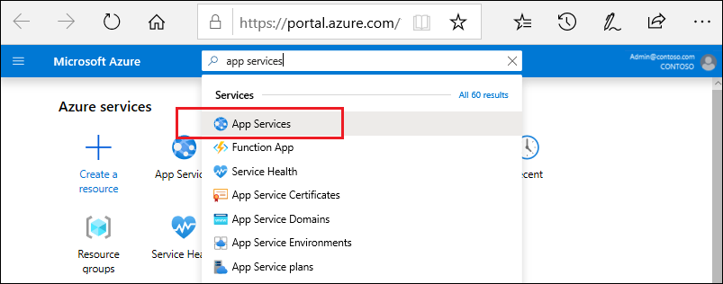
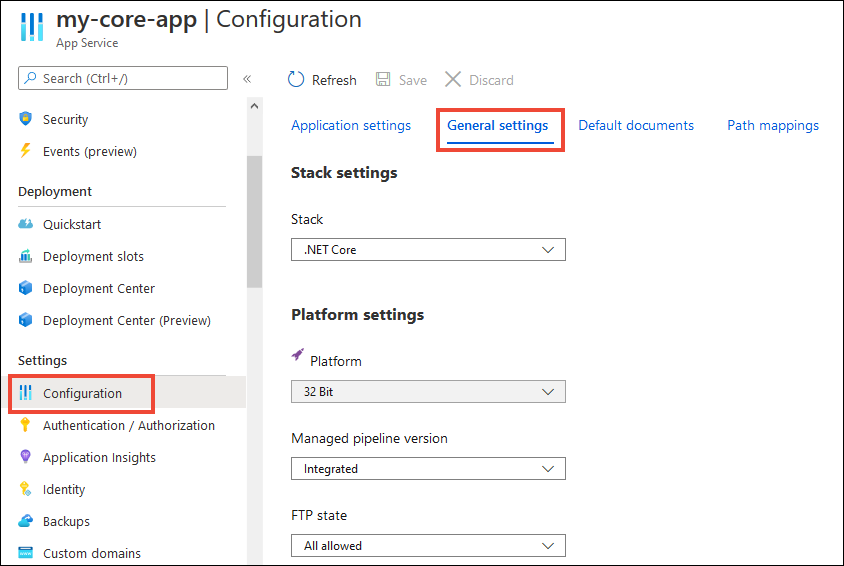
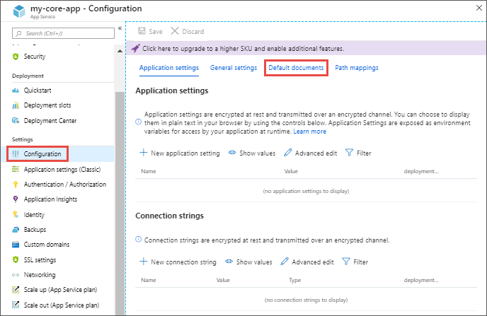
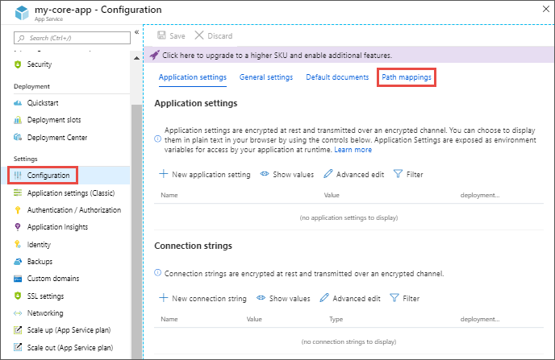

# Configure an App Service app in the Azure portal

This topic explains how to configure common settings for web apps, mobile back end, or API app using the [Azure portal].

## Configure app settings

In App Service, app settings are variables passed as environment variables to the application code. For Linux apps and custom containers, App Service passes app settings to the container using the `--env` flag to set the environment variable in the container.

In the [Azure portal], search for and select **App Services**, and then select your app. 



In the app's left menu, select **Configuration** > **Application settings**.


For ASP.NET and ASP.NET Core developers, setting app settings in App Service are like setting them in `<appSettings>` in *Web.config* or *appsettings.json*, but the values in App Service override the ones in *Web.config* or *appsettings.json*. You can keep development settings (for example, local MySQL password) in *Web.config* or *appsettings.json*, but production secrets (for example, Azure MySQL database password) safe in App Service. The same code uses your development settings when you debug locally, and it uses your production secrets when deployed to Azure.

Other language stacks, likewise, get the app settings as environment variables at runtime. For language-stack specific steps, see:

- [ASP.NET Core](containers/configure-language-dotnetcore.md#access-environment-variables)
- [Node.js](containers/configure-language-nodejs.md#access-environment-variables)
- [PHP](containers/configure-language-php.md#access-environment-variables)
- [Python](containers/how-to-configure-python.md#access-environment-variables)
- [Java](containers/configure-language-java.md#data-sources)
- [Ruby](configure-language-ruby.md#access-environment-variables)
- [Custom containers](containers/configure-custom-container.md#configure-environment-variables)

App settings are always encrypted when stored (encrypted-at-rest).

> [!NOTE]
> App settings can also be resolved from [Key Vault](/azure/key-vault/) using [Key Vault references](app-service-key-vault-references.md).

### Show hidden values

By default, values for app settings are hidden in the portal for security. To see a hidden value of an app setting, click the **Value** field of that setting. To see the values of all app settings, click the **Show value** button.

### Add or edit

To add a new app setting, click **New application setting**. In the dialog, you can [stick the setting to the current slot](deploy-staging-slots.md#which-settings-are-swapped).

To edit a setting, click the **Edit** button on the right side.

When finished, click **Update**. Don't forget to click **Save** back in the **Configuration** page.

> [!NOTE]
> In a default Linux container or a custom Linux container, any nested JSON key structure in the app setting name like `ApplicationInsights:InstrumentationKey` needs to be configured in App Service as `ApplicationInsights__InstrumentationKey` for the key name. In other words, any `:` should be replaced by `__` (double underscore).
>

### Edit in bulk

To add or edit app settings in bulk, click the **Advanced edit** button. When finished, click **Update**. Don't forget to click **Save** back in the **Configuration** page.

App settings have the following JSON formatting:

```json
[
  {
    "name": "<key-1>",
    "value": "<value-1>",
    "slotSetting": false
  },
  {
    "name": "<key-2>",
    "value": "<value-2>",
    "slotSetting": false
  },
  ...
]
```

## Configure connection strings

In the [Azure portal], search for and select **App Services**, and then select your app. In the app's left menu, select **Configuration** > **Application settings**.


For ASP.NET and ASP.NET Core developers, setting connection strings in App Service are like setting them in `<connectionStrings>` in *Web.config*, but the values you set in App Service override the ones in *Web.config*. You can keep development settings (for example, a database file) in *Web.config* and production secrets (for example, SQL Database credentials) safely in App Service. The same code uses your development settings when you debug locally, and it uses your production secrets when deployed to Azure.

For other language stacks, it's better to use [app settings](#configure-app-settings) instead, because connection strings require special formatting in the variable keys in order to access the values. Here's one exception, however: certain Azure database types are backed up along with the app if you configure their connection strings in your app. For more information, see [What gets backed up](manage-backup.md#what-gets-backed-up). If you don't need this automated backup, then use app settings.

At runtime, connection strings are available as environment variables, prefixed with the following connection types:

* SQLServer: `SQLCONNSTR_`  
* MySQL: `MYSQLCONNSTR_` 
* SQLAzure: `SQLAZURECONNSTR_` 
* Custom: `CUSTOMCONNSTR_`
* PostgreSQL: `POSTGRESQLCONNSTR_`  

For example, a MySql connection string named *connectionstring1* can be accessed as the environment variable `MYSQLCONNSTR_connectionString1`. For language-stack specific steps, see:

- [ASP.NET Core](containers/configure-language-dotnetcore.md#access-environment-variables)
- [Node.js](containers/configure-language-nodejs.md#access-environment-variables)
- [PHP](containers/configure-language-php.md#access-environment-variables)
- [Python](containers/how-to-configure-python.md#access-environment-variables)
- [Java](containers/configure-language-java.md#data-sources)
- [Ruby](configure-language-ruby.md#access-environment-variables)
- [Custom containers](containers/configure-custom-container.md#configure-environment-variables)

Connection strings are always encrypted when stored (encrypted-at-rest).

> [!NOTE]
> Connection strings can also be resolved from [Key Vault](/azure/key-vault/) using [Key Vault references](app-service-key-vault-references.md).

### Show hidden values

By default, values for connection strings are hidden in the portal for security. To see a hidden value of a connection string, just click the **Value** field of that string. To see the values of all connection strings, click the **Show value** button.

### Add or edit

To add a new connection string, click **New connection string**. In the dialog, you can [stick the connection string to the current slot](deploy-staging-slots.md#which-settings-are-swapped).

To edit a setting, click the **Edit** button on the right side.

When finished, click **Update**. Don't forget to click **Save** back in the **Configuration** page.

### Edit in bulk

To add or edit connection strings in bulk, click the **Advanced edit** button. When finished, click **Update**. Don't forget to click **Save** back in the **Configuration** page.

Connection strings have the following JSON formatting:

```json
[
  {
    "name": "name-1",
    "value": "conn-string-1",
    "type": "SQLServer",
    "slotSetting": false
  },
  {
    "name": "name-2",
    "value": "conn-string-2",
    "type": "PostgreSQL",
    "slotSetting": false
  },
  ...
]
```

<a name="platform"></a>
<a name="alwayson"></a>

## Configure general settings

In the [Azure portal], search for and select **App Services**, and then select your app. In the app's left menu, select **Configuration** > **General settings**.



Here, you can configure some common settings for the app. Some settings require you to [scale up to higher pricing tiers](manage-scale-up.md).

- **Stack settings**: The software stack to run the app, including the language and SDK versions. For Linux apps and custom container apps, you can also set an optional start-up command or file.
- **Platform settings**: Lets you configure settings for the hosting platform, including:
    - **Bitness**: 32-bit or 64-bit.
    - **WebSocket protocol**: For [ASP.NET SignalR] or [socket.io](https://socket.io/), for example.
    - **Always On**: Keeps the app loaded even when there's no traffic. It's required for continuous WebJobs or for WebJobs that are triggered using a CRON expression.
      > [!NOTE]
      > With the Always On feature, the front end load balancer sends a request to the application root. This application endpoint of the App Service can't be configured.
    - **Managed pipeline version**: The IIS [pipeline mode]. Set it to **Classic** if you have a legacy app that requires an older version of IIS.
    - **HTTP version**: Set to **2.0** to enable support for [HTTPS/2](https://wikipedia.org/wiki/HTTP/2) protocol.
    > [!NOTE]
    > Most modern browsers support HTTP/2 protocol over TLS only, while non-encrypted traffic continues to use HTTP/1.1. To ensure that client browsers connect to your app with HTTP/2, secure your custom DNS name. For more information, see [Secure a custom DNS name with a TLS/SSL binding in Azure App Service](configure-ssl-bindings.md).
    - **ARR affinity**: In a multi-instance deployment, ensure that the client is routed to the same instance for the life of the session. You can set this option to **Off** for stateless applications.
- **Debugging**: Enable remote debugging for [ASP.NET](troubleshoot-dotnet-visual-studio.md#remotedebug), [ASP.NET Core](/visualstudio/debugger/remote-debugging-azure), or [Node.js](containers/configure-language-nodejs.md#debug-remotely) apps. This option turns off automatically after 48 hours.
- **Incoming client certificates**: require client certificates in [mutual authentication](app-service-web-configure-tls-mutual-auth.md).

## Configure default documents

This setting is only for Windows apps.

In the [Azure portal], search for and select **App Services**, and then select your app. In the app's left menu, select **Configuration** > **Default documents**.



The default document is the web page that's displayed at the root URL for a website. The first matching file in the list is used. To add a new default document, click **New document**. Don't forget to click **Save**.

If the app uses modules that route based on URL instead of serving static content, there is no need for default documents.

## Configure path mappings

In the [Azure portal], search for and select **App Services**, and then select your app. In the app's left menu, select **Configuration** > **Path mappings**.



The **Path mappings** page shows you different things based on the OS type.

### Windows apps (uncontainerized)

For Windows apps, you can customize the IIS handler mappings and virtual applications and directories.

Handler mappings let you add custom script processors to handle requests for specific file extensions. To add a custom handler, click **New handler**. Configure the handler as follows:

- **Extension**. The file extension you want to handle, such as *\*.php* or *handler.fcgi*.
- **Script processor**. The absolute path of the script processor to you. Requests to files that match the file extension are processed by the script processor. Use the path `D:\home\site\wwwroot` to refer to your app's root directory.
- **Arguments**. Optional command-line arguments for the script processor.

Each app has the default root path (`/`) mapped to `D:\home\site\wwwroot`, where your code is deployed by default. If your app root is in a different folder, or if your repository has more than one application, you can edit or add virtual applications and directories here. Click **New virtual application or directory**.

To configure virtual applications and directories, specify each virtual directory and its corresponding physical path relative to the website root (`D:\home`). Optionally, you can select the **Application** checkbox to mark a virtual directory as an application.

### Containerized apps

You can [add custom storage for your containerized app](containers/how-to-serve-content-from-azure-storage.md). Containerized apps include all Linux apps and also the Windows and Linux custom containers running on App Service. Click **New Azure Storage Mount** and configure your custom storage as follows:

- **Name**: The display name.
- **Configuration options**: **Basic** or **Advanced**.
- **Storage accounts**: The storage account with the container you want.
- **Storage type**: **Azure Blobs** or **Azure Files**.
  > [!NOTE]
  > Windows container apps only support Azure Files.
- **Storage container**: For basic configuration, the container you want.
- **Share name**: For advanced configuration, the file share name.
- **Access key**: For advanced configuration, the access key.
- **Mount path**: The absolute path in your container to mount the custom storage.

For more information, see [Serve content from Azure Storage in App Service on Linux](containers/how-to-serve-content-from-azure-storage.md).

## Configure language stack settings

For Linux apps, see:

- [ASP.NET Core](containers/configure-language-dotnetcore.md)
- [Node.js](containers/configure-language-nodejs.md)
- [PHP](containers/configure-language-php.md)
- [Python](containers/how-to-configure-python.md)
- [Java](containers/configure-language-java.md)
- [Ruby](configure-language-ruby.md)

## Configure custom containers

See [Configure a custom Linux container for Azure App Service](containers/configure-custom-container.md)

## Next steps

- [Configure a custom domain name in Azure App Service]
- [Set up staging environments in Azure App Service]
- [Secure a custom DNS name with a TLS/SSL binding in Azure App Service](configure-ssl-bindings.md)
- [Enable diagnostic logs](troubleshoot-diagnostic-logs.md)
- [Scale an app in Azure App Service]
- [Monitoring basics in Azure App Service]
- [Change applicationHost.config settings with applicationHost.xdt](https://github.com/projectkudu/kudu/wiki/Xdt-transform-samples)

<!-- URL List -->

[ASP.NET SignalR]: https://www.asp.net/signalr
[Azure Portal]: https://portal.azure.com/
[Configure a custom domain name in Azure App Service]: ./app-service-web-tutorial-custom-domain.md
[Set up staging environments in Azure App Service]: ./deploy-staging-slots.md
[How to: Monitor web endpoint status]: https://go.microsoft.com/fwLink/?LinkID=279906
[Monitoring basics in Azure App Service]: ./web-sites-monitor.md
[pipeline mode]: https://www.iis.net/learn/get-started/introduction-to-iis/introduction-to-iis-architecture#Application
[Scale an app in Azure App Service]: ./manage-scale-up.md
