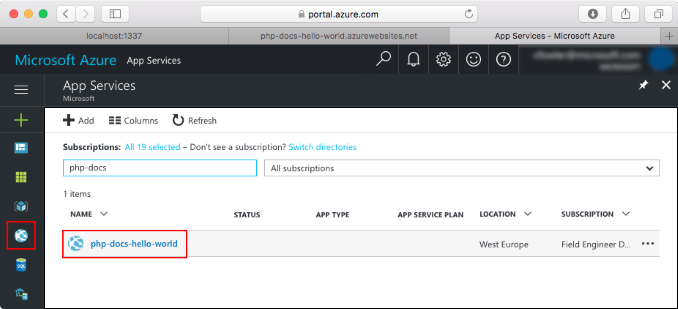

# Deploy a Python web app in Web App for Containers

[App Service on Linux](app-service-linux-intro.md) provides a highly scalable, self-patching web hosting service using the Linux operating system. This quickstart shows how to create a web app and deploy a simple Flask app to it using a custom Docker Hub image. You create the web app using the [Azure CLI](https://docs.microsoft.com/cli/azure/get-started-with-azure-cli).


[!INCLUDE [quickstarts-free-trial-note](../../../includes/quickstarts-free-trial-note.md)]

## Prerequisites

To complete this tutorial:

* <a href="https://git-scm.com/" target="_blank">Install Git</a>
* <a href="https://www.docker.com/community-edition" target="_blank">Install Docker Community Edition</a>
* <a href="https://hub.docker.com/" target="_blank">Sign up for a Docker Hub account</a>

## Download the sample

In a terminal window, run the following commands to clone the sample application to your local machine, and navigate to the directory containing the sample code.

```bash
git clone https://github.com/Azure-Samples/python-docs-hello-world
cd python-docs-hello-world
```

This repository contains a simple Flask application in the _/app_ folder, and a _Dockerfile_ that specifies three things:

- Use the [tiangolo/uwsgi-nginx-flask:python3.6-alpine3.7](https://hub.docker.com/r/tiangolo/uwsgi-nginx-flask/) base image.
- Container should listen on port 8000.
- Copy the `/app` directory to the container's `/app` directory.

The configuration follows the [instructions for the base image](https://hub.docker.com/r/tiangolo/uwsgi-nginx-flask/).

## Run the app locally

Run the app in a Docker container.

```bash
docker build --rm -t flask-quickstart .
docker run --rm -it -p 8000:8000 flask-quickstart
```

Open a web browser, and navigate to the sample app at `http://localhost:8000`.

You can see the **Hello World** message from the sample app displayed in the page.


In your terminal window, press **Ctrl+C** to stop the container.

## Deploy image to Docker Hub

Sign in to your Docker Hub account. Follow the prompt to enter your Docker Hub credentials.

```bash
docker login
```

Tag your image and push it to your Docker Hub account. Replace *\<dockerhub_id>* with your Docker Hub ID.

```bash
docker tag flask-quickstart <dockerhub_id>/flask-quickstart
docker push <dockerhub_id>/flask-quickstart
```

> [!NOTE]
> `docker push` by default creates a new public repository if the specified repository is not found. This quickstart assumes you're using a public repository in Docker Hub. If you prefer to push to a private repository, you need to configure your Docker Hub credentials in Azure App Service later. See [Use a private image](#use-a-private-image).

Once the image push is complete, you're ready to use it in your Azure web app.

[!INCLUDE [cloud-shell-try-it.md](../../../includes/cloud-shell-try-it.md)]

[!INCLUDE [Create resource group](../../../includes/app-service-web-create-resource-group-linux.md)]

[!INCLUDE [Create app service plan](../../../includes/app-service-web-create-app-service-plan-linux.md)]

## Create a web app

Create a [web app](../app-service-web-overview.md) in the `myAppServicePlan` App Service plan with the [az webapp create](/cli/azure/webapp?view=azure-cli-latest#az_webapp_create) command. Replace *\<app name>* with a globally unique app name, and replace *\<dockerhub_id>* with your Docker Hub ID.

```azurecli-interactive
az webapp create --resource-group myResourceGroup --plan myAppServicePlan --name <app name> --deployment-container-image-name <dockerhub_id>/flask-quickstart
```

When the web app has been created, the Azure CLI shows output similar to the following example:

```json
{
  "availabilityState": "Normal",
  "clientAffinityEnabled": true,
  "clientCertEnabled": false,
  "cloningInfo": null,
  "containerSize": 0,
  "dailyMemoryTimeQuota": 0,
  "defaultHostName": "<app name>.azurewebsites.net",
  "deploymentLocalGitUrl": "https://<username>@<app name>.scm.azurewebsites.net/<app name>.git",
  "enabled": true,
  < JSON data removed for brevity. >
}
```

If you uploaded to a private repository earlier, you also need to configure the Docker Hub credentials in App Service. For more information, see [Use a private image from Docker Hub](tutorial-custom-docker-image.md#use-a-private-image-from-docker-hub-optional).

### Specify container port

As specified in the _Dockerfile_, your container listens on port 8000. For App Service to route your request to the right port you need to set the *WEBSITES_PORT* app setting.

In the Cloud Shell, run the [`az webapp config appsettings set`](/cli/azure/webapp/config/appsettings?view=azure-cli-latest#az_webapp_config_appsettings_set) command.


```azurecli-interactive
az webapp config appsettings set --name <app_name> --resource-group myResourceGroup --settings WEBSITES_PORT=8000
```

## Browse to the app

```bash
http://<app_name>.azurewebsites.net/
```


> [!NOTE]
> The web app takes some time to start because the container has to be downloaded and run when the app is requested the first time. If at first you see an error after a long time, just refresh the page.

**Congratulations!** You've deployed a custom Docker image running a Python app to Web App for Containers.

## Update locally and redeploy the code

Using a local text editor, open the `app/main.py` file in the Python app, and make a small change to the text next to the `return` statement:

```python
return 'Hello, Azure!'
```

Rebuild the image and push it to Docker Hub again.

```bash
docker build --rm -t flask-quickstart .
docker tag flask-quickstart <dockerhub_id>/flask-quickstart
docker push <dockerhub_id>/flask-quickstart
```

In the Cloud Shell, restart the app. Restarting the app ensures that all settings are applied and the latest container is pulled from the registry.

```azurecli-interactive
az webapp restart --resource-group myResourceGroup --name <app_name>
```

Switch back to the browser window that opened in the **Browse to the app** step, and refresh the page.


## Manage your Azure web app

Go to the [Azure portal](https://portal.azure.com) to see the web app you created.

From the left menu, click **App Services**, then click the name of your Azure web app.



By default, the portal shows your web app's **Overview** page. This page gives you a view of how your app is doing. Here, you can also perform basic management tasks like browse, stop, start, restart, and delete. The tabs on the left side of the page show the different configuration pages you can open.


[!INCLUDE [Clean-up section](../../../includes/cli-script-clean-up.md)]

## Next steps

> [!div class="nextstepaction"]
> [Python with PostgreSQL](tutorial-docker-python-postgresql-app.md)

> [!div class="nextstepaction"]
> [Use custom images](tutorial-custom-docker-image.md)