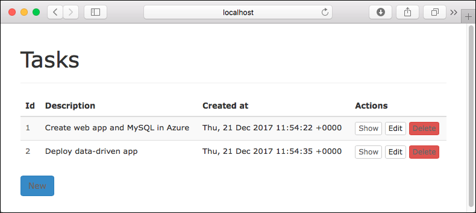
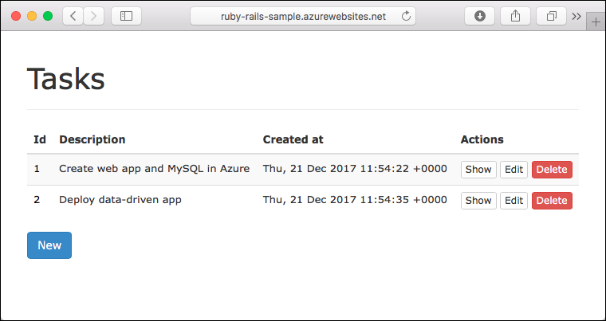
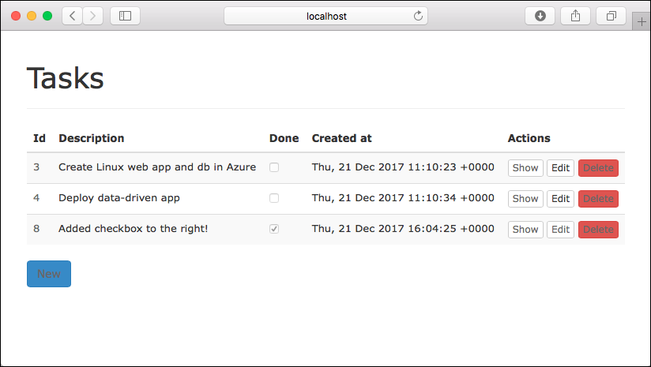

# Build a Ruby and MySQL web app in Azure App Service on Linux

[App Service on Linux](app-service-linux-intro.md) provides a highly scalable, self-patching web hosting service using the Linux operating system. This tutorial shows how to create a Ruby web app and connect it to a MySQL database. When you're finished, you'll have a [Ruby on Rails](http://rubyonrails.org/) app running on App Service on Linux.


In this tutorial, you learn how to:

> [!div class="checklist"]
> * Create a MySQL database in Azure
> * Connect a Ruby on Rails app to MySQL
> * Deploy the app to Azure
> * Update the data model and redeploy the app
> * Stream diagnostic logs from Azure
> * Manage the app in the Azure portal

[!INCLUDE [quickstarts-free-trial-note](../../../includes/quickstarts-free-trial-note.md)]

## Prerequisites

To complete this tutorial:

* [Install Git](https://git-scm.com/)
* [Install Ruby 2.3](https://www.ruby-lang.org/documentation/installation/)
* [Install Ruby on Rails 5.1](http://guides.rubyonrails.org/v5.1/getting_started.html)
* [Install and start MySQL](https://dev.mysql.com/doc/refman/5.7/en/installing.html) 

## Prepare local MySQL

In this step, you create a database in your local MySQL server for your use in this tutorial.

### Connect to local MySQL server

In a terminal window, connect to your local MySQL server. You can use this terminal window to run all the commands in this tutorial.

```bash
mysql -u root -p
```

If you're prompted for a password, enter the password for the `root` account. If you don't remember your root account password, see [MySQL: How to Reset the Root Password](https://dev.mysql.com/doc/refman/5.7/en/resetting-permissions.html).

If your command runs successfully, then your MySQL server is running. If not, make sure that your local MySQL server is started by following the [MySQL post-installation steps](https://dev.mysql.com/doc/refman/5.7/en/postinstallation.html).

Exit your server connection by typing `quit`.

```sql
quit
```

<a name="step2"></a>

## Create a Ruby on Rails app locally
In this step, you get a Ruby on Rails sample application, configure its database connection, and run it locally. 

### Clone the sample

In the terminal window, `cd` to a working directory.

Run the following command to clone the sample repository.

```bash
git clone https://github.com/Azure-Samples/rubyrails-tasks.git
```

`cd` to your cloned directory. Install the required packages.

```bash
cd rubyrails-tasks
bundle install --path vendor/bundle
```

### Configure MySQL connection

In the repository, open _config/database.yml_ and supply the local MySQL root user name and password (line 13). If you installed MySQL using a tool like [Homebrew](https://brew.sh/), then the credentials in the file are already set to the default values (which is `root` and an empty password).

```txt
default: &default
  adapter: mysql2
  encoding: utf8
  pool: <%= ENV.fetch("RAILS_MAX_THREADS") { 5 } %>
  username: root
  password:
  socket: /tmp/mysql.sock
```

### Run the sample locally

Run [the Rails migrations](http://guides.rubyonrails.org/active_record_migrations.html#running-migrations) to create the tables the application needs. To see which tables are created in the migrations, look in the _db/migrate_ directory in the Git repository.

```bash
rake db:create
rake db:migrate
```

Run the application.

```bash
rails server
```

Navigate to `http://localhost:3000` in a browser. Add a few tasks in the page.


To stop the Rails server, type `Ctrl + C` in the terminal.

[!INCLUDE [cloud-shell-try-it.md](../../../includes/cloud-shell-try-it.md)]

## Create MySQL in Azure

In this step, you create a MySQL database in [Azure Database for MySQL (Preview)](/azure/mysql). Later, you configure the Ruby on Rails application to connect to this database.

### Create a resource group

[!INCLUDE [Create resource group](../../../includes/app-service-web-create-resource-group-linux-no-h.md)] 

### Create a MySQL server

Create a server in Azure Database for MySQL (Preview) with the [`az mysql server create`](/cli/azure/mysql/server?view=azure-cli-latest#az_mysql_server_create) command.

In the following command, substitute your MySQL server name where you see the _&lt;mysql_server_name>_ placeholder (valid characters are `a-z`, `0-9`, and `-`). This name is part of the MySQL server's hostname  (`<mysql_server_name>.mysql.database.azure.com`), it needs to be globally unique.

```azurecli-interactive
az mysql server create --name <mysql_server_name> --resource-group myResourceGroup --location "North Europe" --admin-user adminuser --admin-password My5up3r$tr0ngPa$w0rd!
```

When the MySQL server is created, the Azure CLI shows information similar to the following example:

```json
{
  "administratorLogin": "adminuser",
  "administratorLoginPassword": null,
  "fullyQualifiedDomainName": "<mysql_server_name>.database.mysql.database.azure.com",
  "id": "/subscriptions/00000000-0000-0000-0000-000000000000/resourceGroups/myResourceGroup/providers/Microsoft.DBforMySQL/servers/<mysql_server_name>",
  "location": "northeurope",
  "name": "<mysql_server_name>",
  "resourceGroup": "myResourceGroup",
  ...
}
```

### Configure server firewall

Create a firewall rule for your MySQL server to allow client connections by using the [`az mysql server firewall-rule create`](/cli/azure/mysql/server/firewall-rule?view=azure-cli-latest#az_mysql_server_firewall_rule_create) command.

```azurecli-interactive
az mysql server firewall-rule create --name allIPs --server <mysql_server_name> --resource-group myResourceGroup --start-ip-address 0.0.0.0 --end-ip-address 255.255.255.255
```

> [!NOTE]
> Azure Database for MySQL (Preview) doesn't currently limit connections only to Azure services. As IP addresses in Azure are dynamically assigned, it is better to enable all IP addresses. The service is in preview. Better methods for securing your database are planned.
>

### Connect to production MySQL server locally

In the terminal window, connect to the MySQL server in Azure. Use the value you specified previously for _&lt;mysql_server_name>_.

```bash
mysql -u adminuser@<mysql_server_name> -h <mysql_server_name>.mysql.database.azure.com -P 3306 -p
```

When prompted for a password, use _My5up3r$tr0ngPa$w0rd!_, which you specified when you created the database server.

### Create a production database

At the `mysql` prompt, create a database.

```sql
CREATE DATABASE sampledb;
```

### Create a user with permissions

Create a database user called _railsappuser_ and give it all privileges in the `sampledb` database.

```sql
CREATE USER 'railsappuser' IDENTIFIED BY 'MySQLAzure2017'; 
GRANT ALL PRIVILEGES ON sampledb.* TO 'railsappuser';
```

Exit the server connection by typing `quit`.

```sql
quit
```

## Connect app to Azure MySQL

In this step, you connect the Ruby on Rails application to the MySQL database you created in Azure Database for MySQL (Preview).

<a name="devconfig"></a>

### Configure the database connection

In the repository, open _config/database.yml_. At the bottom of the file, replace the production variables with the following code. For the _&lt;mysql_server_name>_ placeholder, use the name of the MySQL server you created.

```txt
production:
  <<: *default
  host: <%= ENV['DB_HOST'] %>
  port: 3306
  database: <%= ENV['DB_DATABASE'] %>
  username: <%= ENV['DB_USERNAME'] %>
  password: <%= ENV['DB_PASSWORD'] %>
  sslca: ssl/BaltimoreCyberTrustRoot.crt.pem
```

Save the changes.

> [!NOTE]
> The `sslca` is added and points to  an existing _.pem_ file in the sample repository. By default, Azure Database for MySQL enforces SSL connections from clients. This `.pem` certificate is how you make SSL connections to Azure Database for MySQL. For more information, see [Configure SSL connectivity in your application to securely connect to Azure Database for MySQL](../../mysql/howto-configure-ssl.md).
>

### Test the application locally

In the local terminal, set the following environment variables:

```bash
export DB_HOST=<mysql_server_name>.mysql.database.azure.com
export DB_DATABASE=sampledb 
export DB_USERNAME=railsappuser@<mysql_server_name>
export DB_PASSWORD=MySQLAzure2017
```

Run Rails database migrations with the production values you just configured to create the tables in your MySQL database in Azure Database for MySQL (Preview). 

```bash
rake db:migrate RAILS_ENV=production
```

When running in the production environment, the Rails application needs precompiled assets. Generate the required assets with the following command:

```bash
rake assets:precompile
```

The Rails production environment also uses secrets to manage security. Generate a secret key.

```bash
rails secret
```

Save the secret key to the respective variables used by the Rails production environment. For convenience, you use the same key for both variables.

```bash
export RAILS_MASTER_KEY=<output_of_rails_secret>
export SECRET_KEY_BASE=<output_of_rails_secret>
```

Enable the Rails production environment to serve JavaScript and CSS files.

```bash
export RAILS_SERVE_STATIC_FILES=true
```

Run the sample application in the production environment.

```bash
rails server -e production
```

Navigate to `http://localhost:3000`. If the page loads without errors, the Ruby on Rails application is connecting to the MySQL database in Azure.

Add a few tasks in the page.



To stop the Rails server, type `Ctrl + C` in the terminal.

### Commit your changes

Run the following Git commands to commit your changes:

```bash
git add .
git commit -m "database.yml updates"
```

Your app is ready to be deployed.

## Deploy to Azure

In this step, you deploy the MySQL-connected Rails application to Azure App Service.

### Configure a deployment user

[!INCLUDE [Configure deployment user](../../../includes/configure-deployment-user-no-h.md)]

### Create an App Service plan

[!INCLUDE [Create app service plan no h](../../../includes/app-service-web-create-app-service-plan-linux-no-h.md)]

## Create a web app

[!INCLUDE [Create web app](../../../includes/app-service-web-create-web-app-ruby-linux-no-h.md)] 

### Configure database settings

In App Service, you set environment variables as _app settings_ by using the [`az webapp config appsettings set`](/cli/azure/webapp/config/appsettings?view=azure-cli-latest#az_webapp_config_appsettings_set) command in the Cloud Shell.

The following Cloud Shell command configures the app settings `DB_HOST`, `DB_DATABASE`, `DB_USERNAME`, and `DB_PASSWORD`. Replace the placeholders _&lt;appname>_ and _&lt;mysql_server_name>_.

```azurecli-interactive
az webapp config appsettings set --name <app_name> --resource-group myResourceGroup --settings DB_HOST="<mysql_server_name>.mysql.database.azure.com" DB_DATABASE="sampledb" DB_USERNAME="railsappuser@<mysql_server_name>" DB_PASSWORD="MySQLAzure2017"
```

### Configure Rails environment variables

In the local terminal, generate a new secret key for the Rails production environment in Azure.

```bash
rails secret
```

Configure the variables required by Rails production environment.

In the following Cloud Shell command, replace the two _&lt;output_of_rails_secret>_ placeholders with the new secret key you generated in the local terminal.

```azurecli-interactive
az webapp config appsettings set --name <app_name> --resource-group myResourceGroup --settings RAILS_MASTER_KEY="<output_of_rails_secret>" SECRET_KEY_BASE="<output_of_rails_secret>" RAILS_SERVE_STATIC_FILES="true" ASSETS_PRECOMPILE="true"
```

`ASSETS_PRECOMPILE="true"` tells the default Ruby container to precompile assets at each Git deployment.

### Push to Azure from Git

In the local terminal, add an Azure remote to your local Git repository.

```bash
git remote add azure <paste_copied_url_here>
```

Push to the Azure remote to deploy the Ruby on Rails application. You are prompted for the password you supplied earlier as part of the creation of the deployment user.

```bash
git push azure master
```

During deployment, Azure App Service communicates its progress with Git.

```bash
Counting objects: 3, done.
Delta compression using up to 8 threads.
Compressing objects: 100% (3/3), done.
Writing objects: 100% (3/3), 291 bytes | 0 bytes/s, done.
Total 3 (delta 2), reused 0 (delta 0)
remote: Updating branch 'master'.
remote: Updating submodules.
remote: Preparing deployment for commit id 'a5e076db9c'.
remote: Running custom deployment command...
remote: Running deployment command...
...
< Output has been truncated for readability >
```

### Browse to the Azure web app

Browse to `http://<app_name>.azurewebsites.net` and add a few tasks to the list.



Congratulations, you're running a data-driven Ruby on Rails app in Azure App Service.

## Update model locally and redeploy

In this step, you make a simple change to the `task` data model and the webapp, and then publish the update to Azure.

For the tasks scenario, you modify the application so that you can mark a task as complete.

### Add a column

In the terminal, navigate to the root of the Git repository.

Generate a new migration that adds a boolean column called `Done` to the `Tasks` table:

```bash
rails generate migration add_Done_to_Tasks Done:boolean
```

This command generates a new migration file in the _db/migrate_ directory.


In the terminal, run Rails database migrations to make the change in the local database.

```bash
rake db:migrate
```

### Update application logic

Open the *app/controllers/tasks_controller.rb* file. At the end of the file, find the following line:

```rb
params.require(:task).permit(:Description)
```

Modify this line to include the new `Done` parameter.

```rb
params.require(:task).permit(:Description, :Done)
```

### Update the views

Open the *app/views/tasks/_form.html.erb* file, which is the Edit form.

Find the line `<%=f.error_span(:Description) %>` and insert the following code directly below it:

```erb
<%= f.label :Done, :class => 'control-label col-lg-2' %>
<div class="col-lg-10">
  <%= f.check_box :Done, :class => 'form-control' %>
</div>
```

Open the *app/views/tasks/show.html.erb* file, which is the single-record View page. 

Find the line `<dd><%= @task.Description %></dd>` and insert the following code directly below it:

```erb
  <dt><strong><%= model_class.human_attribute_name(:Done) %>:</strong></dt>
  <dd><%= check_box "task", "Done", {:checked => @task.Done, :disabled => true}%></dd>
```

Open the *app/views/tasks/index.html.erb* file, which is the Index page for all records.

Find the line `<th><%= model_class.human_attribute_name(:Description) %></th>` and insert the following code directly below it:

```erb
<th><%= model_class.human_attribute_name(:Done) %></th>
```

In the same file, find the line `<td><%= task.Description %></td>` and insert the following code directly below it:

```erb
<td><%= check_box "task", "Done", {:checked => task.Done, :disabled => true} %></td>
```

### Test the changes locally

In the local terminal, run the Rails server.

```bash
rails server
```

To see the task status change, navigate to `http://localhost:3000` and add or edit items.



To stop the Rails server, type `Ctrl + C` in the terminal.

### Publish changes to Azure

In the terminal, run Rails database migrations for the production environment to make the change in the Azure database.

```bash
rake db:migrate RAILS_ENV=production
```

Commit all the changes in Git, and then push the code changes to Azure.

```bash
git add .
git commit -m "added complete checkbox"
git push azure master
```

Once the `git push` is complete, navigate to the Azure web app and test the new functionality.


If you added any tasks, they are retained in the database. Updates to the data schema leave existing data intact.

## Manage the Azure web app

Go to the [Azure portal](https://portal.azure.com) to manage the web app you created.

From the left menu, click **App Services**, and then click the name of your Azure web app.


You see your web app's Overview page. Here, you can perform basic management tasks like  stop, start, restart, browse, and delete.

The left menu provides pages for configuring your app.


[!INCLUDE [cli-samples-clean-up](../../../includes/cli-samples-clean-up.md)]

<a name="next"></a>

## Next steps

In this tutorial, you learned how to:

> [!div class="checklist"]
> * Create a MySQL database in Azure
> * Connect a Ruby on Rails app to MySQL
> * Deploy the app to Azure
> * Update the data model and redeploy the app
> * Stream diagnostic logs from Azure
> * Manage the app in the Azure portal

Advance to the next tutorial to learn how to map a custom DNS name to a web app.

> [!div class="nextstepaction"]
> [Map an existing custom DNS name to Azure Web Apps](../app-service-web-tutorial-custom-domain.md)
