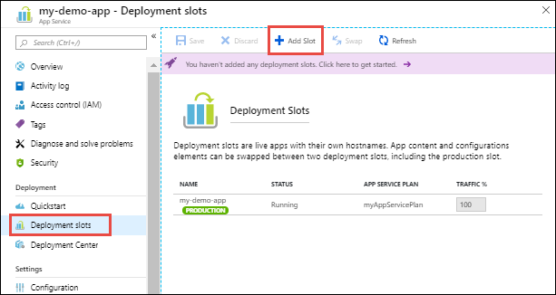
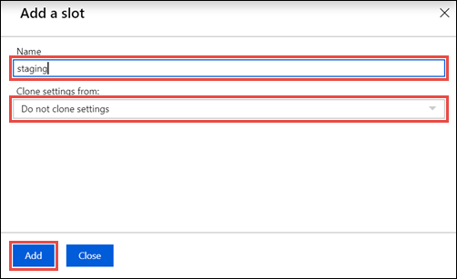
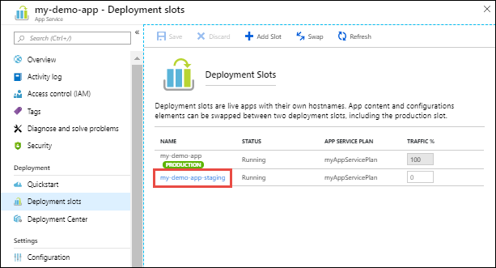
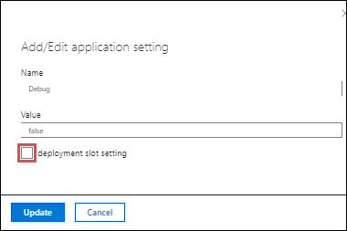
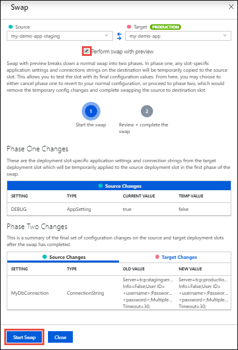
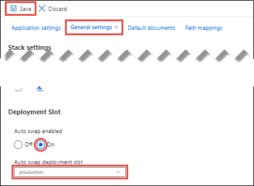
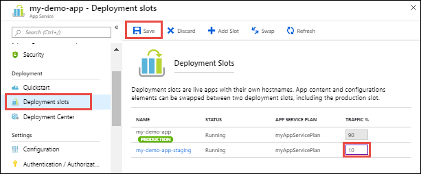

# Set up staging environments in Azure App Service
<a name="Overview"></a>

When you deploy your web app, web app on Linux, mobile back end, and API app to [App Service](https://go.microsoft.com/fwlink/?LinkId=529714), you can deploy to a separate deployment slot instead of the default production slot when running in the **Standard**, **Premium**, or **Isolated** App Service plan tier. Deployment slots are actually live apps with their own hostnames. App content and configurations elements can be swapped between two deployment slots, including the production slot. Deploying your application to a non-production slot has the following benefits:

* You can validate app changes in a staging deployment slot before swapping it with the production slot.
* Deploying an app to a slot first and swapping it into production makes sure that all instances of the slot are warmed up before being swapped into production. This eliminates downtime when you deploy your app. The traffic redirection is seamless, and no requests are dropped because of swap operations. This entire workflow can be automated by configuring [Auto Swap](#Auto-Swap) when pre-swap validation isn't needed.
* After a swap, the slot with previously staged app now has the previous production app. If the changes swapped into the production slot aren't as you expect, you can perform the same swap immediately to get your "last known good site" back.

Each App Service plan tier supports a different number of deployment slots, and there's no additional charge for using deployment slots. To find out the number of slots your app's tier supports, see [App Service Limits](https://docs.microsoft.com/azure/azure-subscription-service-limits#app-service-limits). To scale your app to a different tier, the target tier must support the number of slots your app already uses. For example, if your app has more than five slots, you can't scale it down to **Standard** tier, because **Standard** tier only supports five deployment slots. 

<a name="Add"></a>

## Add slot
The app must be running in the **Standard**, **Premium**, or **Isolated** tier in order for you to enable multiple deployment slots.

1. In the [Azure portal](https://portal.azure.com/), open your app's [resource page](../azure-resource-manager/manage-resources-portal.md#manage-resources).

2. In the left navigation, choose the **Deployment slots** option, then click **Add Slot**.
   
    
   
   > [!NOTE]
   > If the app isn't already in the **Standard**, **Premium**, or **Isolated** tier, you receive a message indicating the supported tiers for enabling staged publishing. At this point, you have the option to select **Upgrade** and navigate to the **Scale** tab of your app before continuing.
   > 

3. In the **Add a slot** dialog, give the slot a name, and select whether to clone app configuration from another existing deployment slot. Click **Add** to continue.
   
    
   
    You can clone configuration from any existing slot. Settings that can be cloned include app settings, connection strings, language framework versions, web sockets, HTTP version, and platform bitness.

4. After the slot is added, click **Close** to close the dialog. The new slot is now shown in the **Deployment slots** page. By default, the **Traffic %** is set to 0 for the new slot, with all customer traffic routed to the production slot.

5. Click the new deployment slot to open that slot's resource page.
   
    

    The staging slot has a management page just like any other App Service app. You can change the slot's configuration. The name of the slot is shown at the top of the page to remind you that you're viewing the deployment slot.

6. Click the app URL in the slot's resource page. The deployment slot has its own hostname and is also a live app. To limit public access to the deployment slot, see [Azure App Service IP Restrictions](app-service-ip-restrictions.md).

The new deployment slot has no content, even if you clone the settings from a different slot. For example, you can [publish to this slot with git](app-service-deploy-local-git.md). You can deploy to the slot from a different repository branch or a different repository. 

<a name="AboutConfiguration"></a>

## What happens during swap

[Swap operation steps](#swap-operation-steps)
[Which settings are swapped?](#which-settings-are-swapped)

### Swap operation steps

When you swap two slots (usually from a staging slot into the production slot), App Service does the following to ensure that the production slot doesn't experience downtime:

1. Apply the following settings from the target slot (e.g. production slot) to all instances of the source slot: 
    - Slot-specific app settings and connection strings, if applicable.
    - Continuous deployment settings, if enabled.
    - App Service authentication settings, if enabled.
    Any of the above cases triggers all instances in the source slot to restart. During [Swap with preview](#Multi-Phase), this the end of the first phase, where the swap operation is paused and you can validate that the source slot works correctly with target slot's settings.

1. Wait for every instance in the source slot to complete its restart. If any instance fails to restart, the swap operation reverts all changes to the source slot and stops the swap.

1. If [local cache](overview-local-cache.md) is enabled, trigger local cache initialization by making an HTTP request to the application root ("/") on each instance of the source slot and wait until each instance returns any HTTP response. Local cache initialization causes another restart on each instance.

1. If [auto swap](#Auto-Swap)) is enabled with [custom warm-up](#custom-warm-up), trigger [Application Initiation](https://docs.microsoft.com/iis/get-started/whats-new-in-iis-8/iis-80-application-initialization) by making an HTTP request to the application root ("/") on each instance of the source slot. If an instance returns any HTTP response, it's considered to be warmed up.
    If no `applicationInitialization` is specified, trigger an HTTP request to the application root of the source slot on each instance. If an instance returns any HTTP response, it's considered to be warmed up.

1. If all instances on the source slot are warmed up successfully, swap the two slots by switching the routing rules for the two slots. After this step, the target slot (e.g. production slot) has the fully warmed-up app from the source slot.

1. Now that the source slot has the pre-swap app from the target slot, apply the same operation by applying all settings and restarting the instances.

At any point of the swap operation, all work of initializing the swapped apps are always done on the source slot, which means that the target slot doesn't experience any downtime in the operation, whether the swap succeeds or fails. To swap a staging slot with the production slot, make sure that the production slot is always the target slot. This way, your production isn't affected by the swap operation.

### Which settings are swapped?
When you clone configuration from another deployment slot, the cloned configuration is editable. Furthermore, some configuration elements follow the content across a swap (not slot specific) while other configuration elements stay in the same slot after a swap (slot specific). The following lists show the settings that change when you swap slots.

**Settings that are swapped**:

* General settings - such as framework version, 32/64-bit, Web sockets
* App settings (can be configured to stick to a slot)
* Connection strings (can be configured to stick to a slot)
* Handler mappings
* Monitoring and diagnostic settings
* Public certificates
* WebJobs content
* Hybrid connections *
* VNet integration *
* Service Endpoints *
* Azure CDN *

Features marked with a * are planned to be made sticky to the slot. 

**Settings that aren't swapped**:

* Publishing endpoints
* Custom Domain Names
* Private certificates and SSL bindings
* Scale settings
* WebJobs schedulers
* IP restrictions
* Always On
* Protocol Settings (HTTP**S**, TLS version, client certificates)
* Diagnostic log settings
* CORS

<!-- VNET and hybrid connections not yet sticky to slot -->

To configure an app setting or connection string to stick to a specific slot (not swapped), navigate to the **Configuration** page for that slot, add or edit a setting, then select the **deployment slot setting** box. Selecting this checkbox tells App Service that the setting is not swappable. 



<a name="Swap"></a>

## Swap two slots 
You can swap deployment slots in your app's **Deployment slots** page and the **Overview** page. For technical details on the slot swap, see [What happens during swap](#what-happens-during-swap)

> [!IMPORTANT]
> Before you swap an app from a deployment slot into production, make sure that production is your target slot and that all settings in the source slot are configured exactly as you want to have it in production.
> 
> 

To swap deployment slots, follow these steps:

1. Navigate to your app's **Deployment slots** page and click **Swap**.
   
    

    The **Swap** dialog shows settings in the selected source and target slots that will be changed.

2. Select the desired **Source** and **Target** slots. Usually, the target is the production slot. Also, click the **Source Changes** and **Target Changes** tabs and verify that the configuration changes are expected. When finished, you can swap the slots immediately by clicking **Swap**.

    

    To see how your target slot would run with the new settings before the swap actually happens, don't click **Swap**, but follow the instructions in [Swap with preview](#Multi-Phase).

3. When you're finished, close the dialog by clicking **Close**.

<a name="Multi-Phase"></a>

### Swap with preview (multi-phase swap)

> [!NOTE]
> Swap with preview isn't supported in web apps on Linux.

Before swapping into production as the target slot, validate the app runs with the swapped settings before the swap happens. The source slot is also warmed up before the swap completion, which is also desirable for mission-critical applications.

When you perform a swap with preview, App Service performs the same [swap operation](#what-happens-during-swap) but pauses after the first step. You can then verify the result on the staging slot before completing the swap. 

If you cancel the swap, App Service reapplies the configuration elements of the source slot to the source slot.

To swap with preview, follow these steps.

1. follow the steps in [Swap deployment slots](#Swap) but select **Perform swap with preview**.

    

    The dialog shows you how the configuration in the source slot changes in phase 1, and how the source and target slot change in phase 2.

2. When ready to start the swap, click **Start Swap**.

    When phase 1 completes, you're notified in the dialog. Preview the swap in the source slot by navigating to `https://<app_name>-<source-slot-name>.azurewebsites.net`. 

3. When ready to complete the pending swap, select **Complete Swap** in **Swap action** and click **Complete Swap**.

    To cancel a pending swap, select **Cancel Swap** instead and click **Cancel Swap**.

4. When you're finished, close the dialog by clicking **Close**.

To automate a multi-phase swap, see Automate with PowerShell.

<a name="Rollback"></a>

## Roll back swap
If any errors occur in the target slot (for example, the production slot) after a slot swap, restore the slots to their pre-swap states by swapping the same two slots immediately.

<a name="Auto-Swap"></a>

## Configure auto swap

> [!NOTE]
> Auto swap isn't supported in web apps on Linux.

Auto swap streamlines DevOps scenarios where you want to deploy your app continuously with zero cold start and zero downtime for end customers of the app. When auto swaps is enabled from a slot into production, every time you push your code changes to that slot, App Service automatically [swaps the app into production](#swap-operation-steps) after it's warmed up in the source slot.

   > [!NOTE]
   > Before configuring auto swap for the production slot, consider testing auto swap on a non-production target slot first.
   > 

To configure auto swap, follow these steps:

1. Navigate to your app's resource page. Select **Deployment slots** > *\<desired source slot>* > **Configuration** > **General settings**.
   
2. In **Auto swap enabled**, select **On**, then select the desired target slot in **Auto swap deployment slot**, and click **Save** in the command bar. 
   
    

3. Execute a code push to the source slot. Auto swap happens after a short time and the update is reflected at your target slot's URL.

<a name="Warm-up"></a>

## Custom warm-up
When using [Auto-Swap](#Auto-Swap), some apps may require custom warm-up actions before the swap. The `applicationInitialization` configuration element in web.config lets you specify custom initialization actions to be performed. The [swap operation](#what-happens-during-swap) waits for this custom warm-up to complete before swapping with the target slot. Here is a sample web.config fragment.

    <system.webServer>
        <applicationInitialization>
            <add initializationPage="/" hostName="[app hostname]" />
            <add initializationPage="/Home/About" hostName="[app hostname]" />
        </applicationInitialization>
    </system.webServer>

For more information on customizing the `applicationInitialization` element, see [Most common deployment slot swap failures and how to fix them](https://ruslany.net/2017/11/most-common-deployment-slot-swap-failures-and-how-to-fix-them/).

You can also customize the warm-up behavior with one or more of the following [app settings](configure-common.md):

- `WEBSITE_SWAP_WARMUP_PING_PATH`: The path to ping to warmup your site. Add this app setting by specifying a custom path that begins with a slash as the value. For example, `/statuscheck`. The default value is `/`. 
- `WEBSITE_SWAP_WARMUP_PING_STATUSES`: Valid HTTP response codes for the warm-up operation. Add this app setting with a comma-separated list of HTTP codes. For example: `200,202` . If the returned status code is not in the list, the warmup and swap operations are stopped. By default, all response codes are valid.

## Monitor swap

If the [swap operation](#what-happens-during-swap) takes a long time to complete, you can get information on the swap operation in the [activity log](../monitoring-and-diagnostics/monitoring-overview-activity-logs.md).

In your app's resource page in the portal, in the left-hand navigation, select **Activity log**.

A swap operation appears in the log query as `Swap Web App Slots`. You can expand it and select one of the suboperations or errors to see the details.

## Route traffic

By default, all client requests to the app's production URL (`http://<app_name>.azurewebsites.net`) are routed to the production slot. You can route a portion of the traffic to another slot. This feature is useful if you need user feedback for a new update, but you're not ready to release it to production.

### Route production traffic automatically

To route production traffic automatically, follow these steps:

1. Navigate to your app's resource page and select **Deployment slots**.

2. In the **Traffic %** column of the slot you want to route to, specify a percentage (between 0 and 100) to represent the amount of total traffic you want to route. Click **Save**.

    

Once the setting is saved, the specified percentage of clients is randomly routed to the non-production slot. 

Once a client is automatically routed to a specific slot, it's "pinned" to that slot for the life of that client session. On the client browser, you can see which slot your session is pinned to by looking at the `x-ms-routing-name` cookie in your HTTP headers. A request that's routed to the "staging" slot has the cookie `x-ms-routing-name=staging`. A request that's routed to the production slot has the cookie `x-ms-routing-name=self`.

### Route production traffic manually

In addition to automatic traffic routing, App Service can route requests to a specific slot. This is useful when you want your users to be able to opt-into or opt-out of your beta app. To route production traffic manually, you use the `x-ms-routing-name` query parameter.

To let users opt out of your beta app, for example, you can put this link in your web page:

```HTML
<a href="<webappname>.azurewebsites.net/?x-ms-routing-name=self">Go back to production app</a>
```

The string `x-ms-routing-name=self` specifies the production slot. Once the client browser accesses the link, not only is it redirected to the production slot, but every subsequent request has the `x-ms-routing-name=self` cookie that pins the session to the production slot.

To let users opt in to your beta app, set the same query parameter to the name of the non-production slot, for example:

```
<webappname>.azurewebsites.net/?x-ms-routing-name=staging
```

By default, new slots are given a routing rule of `0%`, shown in grey. By explicitly setting this value to `0%` (shown in black text), your users can access the staging slot manually by using the `x-ms-routing-name` query parameter, but they will not be routed to the slot automatically since the routing percentage is set to 0. This is an advanced scenario where you can "hide" your staging slot from the public while allowing internal teams to test changes on the slot.

<a name="Delete"></a>

## Delete slot

Navigate to your app's resource page. Select **Deployment slots** > *\<slot to delete>* > **Overview**. Click **Delete** in the command bar.  


<!-- ======== AZURE POWERSHELL CMDLETS =========== -->

<a name="PowerShell"></a>

## Automate with PowerShell

[!INCLUDE [updated-for-az](../../includes/updated-for-az.md)]

Azure PowerShell is a module that provides cmdlets to manage Azure through Windows PowerShell, including support for managing deployment slots in Azure App Service.

For information on installing and configuring Azure PowerShell, and on authenticating Azure PowerShell with your Azure subscription, see [How to install and configure Microsoft Azure PowerShell](/powershell/azure/overview).  

- - -
### Create web app
```powershell
New-AzWebApp -ResourceGroupName [resource group name] -Name [app name] -Location [location] -AppServicePlan [app service plan name]
```

- - -
### Create slot
```powershell
New-AzWebAppSlot -ResourceGroupName [resource group name] -Name [app name] -Slot [deployment slot name] -AppServicePlan [app service plan name]
```

- - -
### Initiate swap with preview (multi-phase swap) and apply destination slot configuration to source slot
```powershell
$ParametersObject = @{targetSlot  = "[slot name – e.g. “production”]"}
Invoke-AzResourceAction -ResourceGroupName [resource group name] -ResourceType Microsoft.Web/sites/slots -ResourceName [app name]/[slot name] -Action applySlotConfig -Parameters $ParametersObject -ApiVersion 2015-07-01
```

- - -
### Cancel pending swap (swap with review) and restore source slot configuration
```powershell
Invoke-AzResourceAction -ResourceGroupName [resource group name] -ResourceType Microsoft.Web/sites/slots -ResourceName [app name]/[slot name] -Action resetSlotConfig -ApiVersion 2015-07-01
```

- - -
### Swap deployment slots
```powershell
$ParametersObject = @{targetSlot  = "[slot name – e.g. “production”]"}
Invoke-AzResourceAction -ResourceGroupName [resource group name] -ResourceType Microsoft.Web/sites/slots -ResourceName [app name]/[slot name] -Action slotsswap -Parameters $ParametersObject -ApiVersion 2015-07-01
```

### Monitor swap events in the activity Log
```powershell
Get-AzLog -ResourceGroup [resource group name] -StartTime 2018-03-07 -Caller SlotSwapJobProcessor  
```

- - -
### Delete slot
```powershell
Remove-AzResource -ResourceGroupName [resource group name] -ResourceType Microsoft.Web/sites/slots –Name [app name]/[slot name] -ApiVersion 2015-07-01
```

- - -
<!-- ======== Azure CLI =========== -->

<a name="CLI"></a>

## Automate with CLI

For [Azure CLI](https://github.com/Azure/azure-cli) commands for deployment slots, see [az webapp deployment slot](/cli/azure/webapp/deployment/slot).

## Troubleshoot slot swaps

If any error occurs during a [slot swap](#what-happens-during-swap), it's logged in *D:\home\LogFiles\eventlog.xml*, as well as the application specific error log.

Here are some common swap errors:

- An HTTP request to the application root is timed. The swap operation waits for 90 seconds for each HTTP request, and retries up to 5 times. If all retries are timed out, the swap operation is aborted.

- Local cache initialization may fail when the app content exceeds the local disk quota specified for the local cache. For more information, see [Local cache overview](overview-local-cache.md).

- During [custom warm-up](#custom-warm-up), the HTTP requests are made internally (without going through the external URL), and can fail with certain URL rewrite rules in *Web.config*. For example, rules for redirecting domain names or enforcing HTTPS can prevent warmup requests from reaching the app code at all. To work around this issue, modify your rewrite rules by adding the following two conditions:

    ```xml
    <conditions>
      <add input="{WARMUP_REQUEST}" pattern="1" negate="true" />
      <add input="{REMOTE_ADDR}" pattern="^100?\." negate="true" />
      ...
    </conditions>
    ```
- Without custom warm-up, the HTTP requests can still be held up by URL rewrite rules. To work around this issue, modify your rewrite rules by adding the following condition:

    ```xml
    <conditions>
      <add input="{REMOTE_ADDR}" pattern="^100?\." negate="true" />
      ...
    </conditions>
    ```
- Some [IP restriction rules](app-service-ip-restrictions.md) may prevent the swap operation from connecting to your app. The IP address ranges starting with `10.` and `100.` are internal to your deployment, and should be allowed to connect to your app.

## Next steps
[Block access to non-production slots](app-service-ip-restrictions.md)
