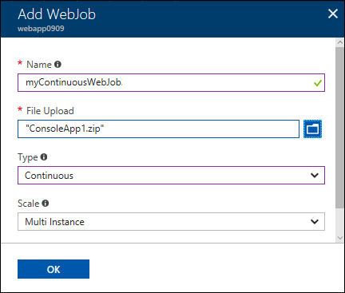
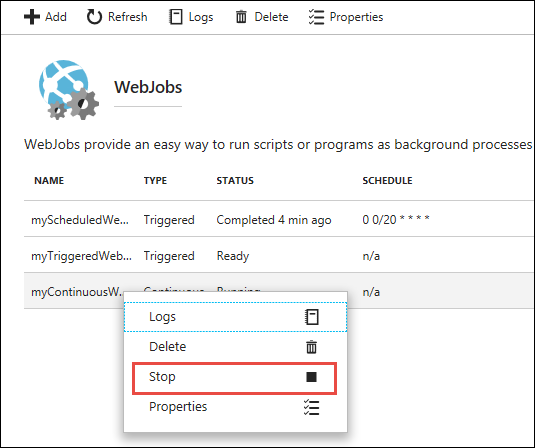
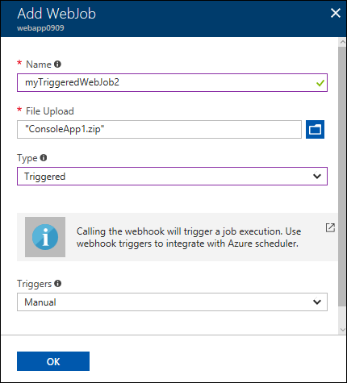
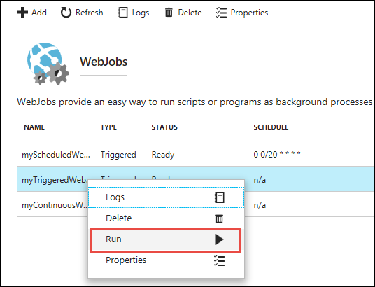
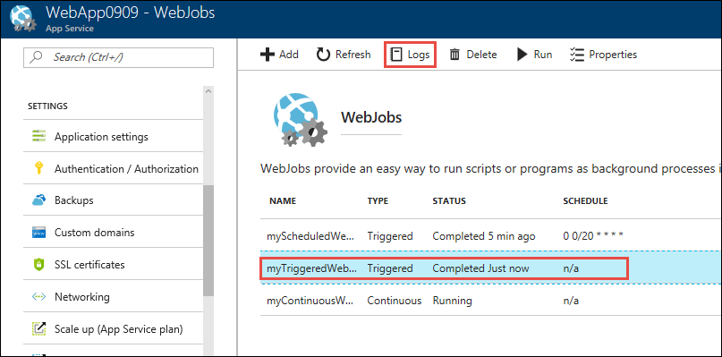
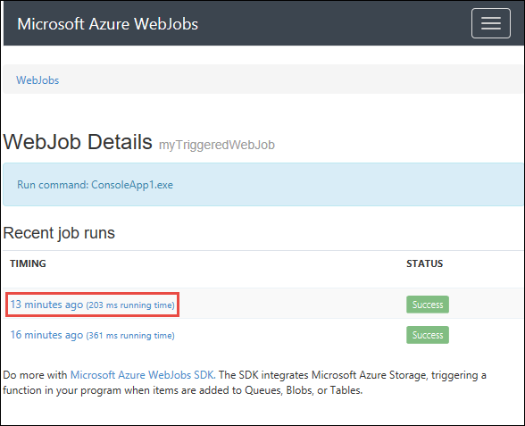
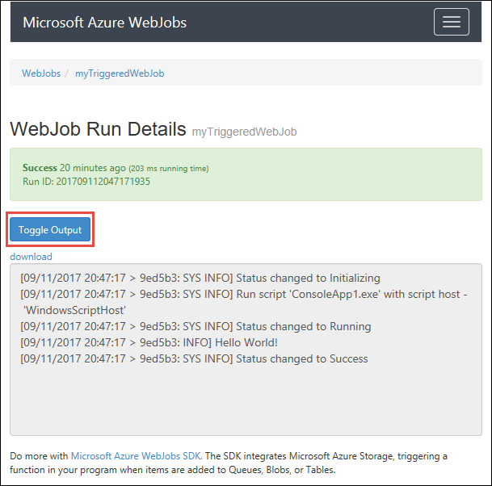
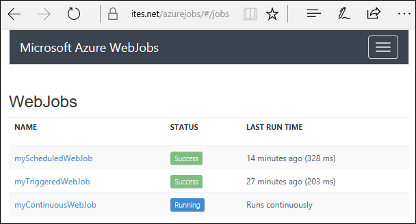

# Run Background tasks with WebJobs in Azure App Service

## Overview
WebJobs is a feature of [Azure App Service](https://docs.microsoft.com/azure/app-service/) that enables you to run a program or script in the same context as a web app, API app, or mobile app. There is no additional cost to use WebJobs.

This article shows how to deploy WebJobs by using the [Azure portal](https://portal.azure.com) to upload an executable or script. For information about how to develop and deploy WebJobs by using Visual Studio, see [Deploy WebJobs using Visual Studio](websites-dotnet-deploy-webjobs.md).

The Azure WebJobs SDK can be used with WebJobs to simplify many programming tasks. For more information, see [What is the WebJobs SDK](https://github.com/Azure/azure-webjobs-sdk/wiki).

Azure Functions provides another way to run programs and scripts. For a comparison between WebJobs and Functions, see [Choose between Flow, Logic Apps, Functions, and WebJobs](../azure-functions/functions-compare-logic-apps-ms-flow-webjobs.md).

## WebJob types

The following table describes the differences between *continuous* and *triggered* WebJobs.


|Continuous  |Triggered  |
|---------|---------|
| Starts immediately when the WebJob is created. To keep the job from ending, the program or script typically does its work inside an endless loop. If the job does end, you can restart it. | Starts only when triggered manually or on a schedule. |
| Runs on all instances that the web app runs on. You can optionally restrict the WebJob to a single instance. |Runs on a single instance that Azure selects for load balancing.|
| Supports remote debugging. | Doesn't support remote debugging.|

> [!NOTE]
> A web app can time out after 20 minutes of inactivity. Only requests to the actual web app reset the timer. Viewing the app's configuration in the Azure portal or making requests to the advanced tools site (https://<app_name>.scm.azurewebsites.net) don't reset the timer. If your app runs continuous or scheduled WebJobs, enable **Always On** to ensure that the WebJobs run reliably. This feature is available only in the Basic, Standard, and Premium [pricing tiers](https://azure.microsoft.com/pricing/details/app-service/?ref=microsoft.com&utm_source=microsoft.com&utm_medium=docs&utm_campaign=visualstudio).

## <a name="acceptablefiles"></a>Supported file types for scripts or programs

The following file types are supported:

* .cmd, .bat, .exe (using Windows cmd)
* .ps1 (using PowerShell)
* .sh (using Bash)
* .php (using PHP)
* .py (using Python)
* .js (using Node.js)
* .jar (using Java)

## <a name="CreateContinuous"></a> Create a continuous WebJob

<!-- 
Several steps in the three "Create..." sections are identical; 
when making changes in one don't forget the other two.
-->

1. In the [Azure portal](https://portal.azure.com), go to the **App Service** page of your App Service web app, API app, or mobile app.

2. Select **WebJobs**.

   

2. In the **WebJobs** page, select **Add**.

    

3. Use the **Add WebJob** settings as specified in the table.

   

   | Setting      | Sample value   | Description  |
   | ------------ | ----------------- | ------------ |
   | **Name** | myContinuousWebJob | A name that is unique within an App Service app. Must start with a letter or a number and cannot contain special characters other than "-" and "_". |
   | **File Upload** | ConsoleApp.zip | A *.zip* file that contains your executable or script file as well as any supporting files needed to run the program or script. The supported executable or script file types are listed in the [Supported file types](#acceptablefiles) section. |
   | **Type** | Continuous | The [WebJob types](#webjob-types) are described earlier in this article. |
   | **Scale** | Multi instance | Available only for Continuous WebJobs. Determines whether the program or script runs on all instances or just one instance. The option to run on multiple instances doesn't apply to the Free or Shared [pricing tiers](https://azure.microsoft.com/pricing/details/app-service/?ref=microsoft.com&utm_source=microsoft.com&utm_medium=docs&utm_campaign=visualstudio). | 

4. Click **OK**.

   The new WebJob appears on the **WebJobs** page.

   

2. To stop or restart a continuous WebJob, right-click the WebJob in the list and click **Stop** or **Start**.

    

## <a name="CreateOnDemand"></a> Create a manually triggered WebJob

<!-- 
Several steps in the three "Create..." sections are identical; 
when making changes in one don't forget the other two.
-->

1. In the [Azure portal](https://portal.azure.com), go to the **App Service** page of your App Service web app, API app, or mobile app.

2. Select **WebJobs**.

   

2. In the **WebJobs** page, select **Add**.

    

3. Use the **Add WebJob** settings as specified in the table.

   

   | Setting      | Sample value   | Description  |
   | ------------ | ----------------- | ------------ |
   | **Name** | myTriggeredWebJob | A name that is unique within an App Service app. Must start with a letter or a number and cannot contain special characters other than "-" and "_".|
   | **File Upload** | ConsoleApp.zip | A *.zip* file that contains your executable or script file as well as any supporting files needed to run the program or script. The supported executable or script file types are listed in the [Supported file types](#acceptablefiles) section. |
   | **Type** | Triggered | The [WebJob types](#webjob-types) are described earlier in this article. |
   | **Triggers** | Manual | |

4. Click **OK**.

   The new WebJob appears on the **WebJobs** page.

   

7. To run the WebJob, right-click its name in the list and click **Run**.
   
    

## <a name="CreateScheduledCRON"></a> Create a scheduled WebJob

<!-- 
Several steps in the three "Create..." sections are identical; 
when making changes in one don't forget the other two.
-->

1. In the [Azure portal](https://portal.azure.com), go to the **App Service** page of your App Service web app, API app, or mobile app.

2. Select **WebJobs**.

   

2. In the **WebJobs** page, select **Add**.

   

3. Use the **Add WebJob** settings as specified in the table.

   

   | Setting      | Sample value   | Description  |
   | ------------ | ----------------- | ------------ |
   | **Name** | myScheduledWebJob | A name that is unique within an App Service app. Must start with a letter or a number and cannot contain special characters other than "-" and "_". |
   | **File Upload** | ConsoleApp.zip | A *.zip* file that contains your executable or script file as well as any supporting files needed to run the program or script. The supported executable or script file types are listed in the [Supported file types](#acceptablefiles) section. |
   | **Type** | Triggered | The [WebJob types](#webjob-types) are described earlier in this article. |
   | **Triggers** | Scheduled | For the scheduling to work reliably, enable the Always On feature. Always On is available only in the Basic, Standard, and Premium pricing tiers.|
   | **CRON Expression** | 0 0/20 * * * * | [CRON expressions](#cron-expressions) are described in the following section. |

4. Click **OK**.

   The new WebJob appears on the **WebJobs** page.

   

## CRON expressions

You can enter a [CRON expression](../azure-functions/functions-bindings-timer.md#cron-expressions) in the portal or include a `settings.job` file at the root of your WebJob *.zip* file, as in the following example:

```json
{
    "schedule": "0 */15 * * * *"
}
``` 

> [!NOTE]
> When you deploy a WebJob from Visual Studio, mark your `settings.job` file properties as **Copy if newer**.

## <a name="ViewJobHistory"></a> View the job history

1. Select the WebJob you want to see history for, and then select the **Logs** button.
   
   

2. In the **WebJob Details** page, select a time to see details for one run.
   
   

3. In the **WebJob Run Details** page, select **Toggle Output** to see the text of the log contents.
   
    

   To see the output text in a separate browser window, select **download**. To download the text itself, right-click **download** and use your browser options to save the file contents.
   
5. Select the **WebJobs** breadcrumb link at the top of the page to go to a list of WebJobs.

    
   
    
   
## <a name="NextSteps"></a> Next steps

The Azure WebJobs SDK can be used with WebJobs to simplify many programming tasks. For more information, see [What is the WebJobs SDK](https://github.com/Azure/azure-webjobs-sdk/wiki).
